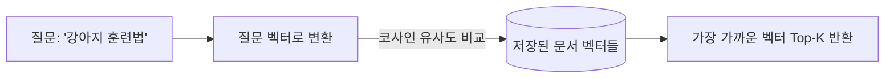
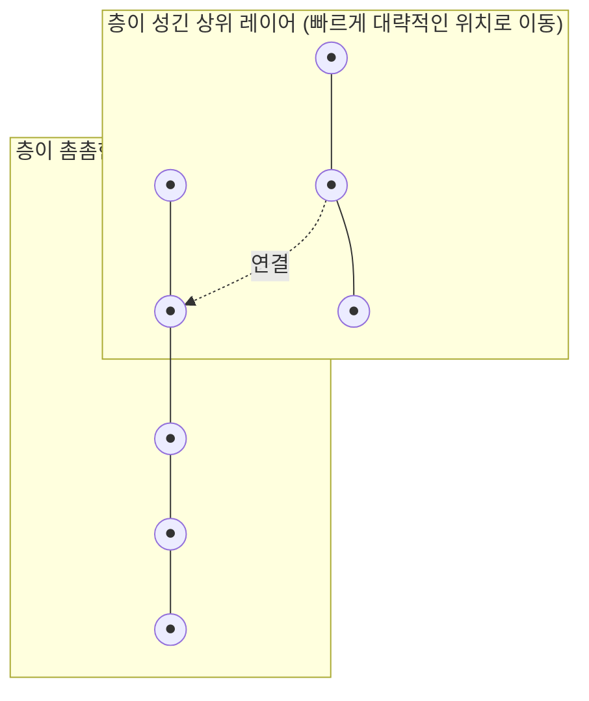
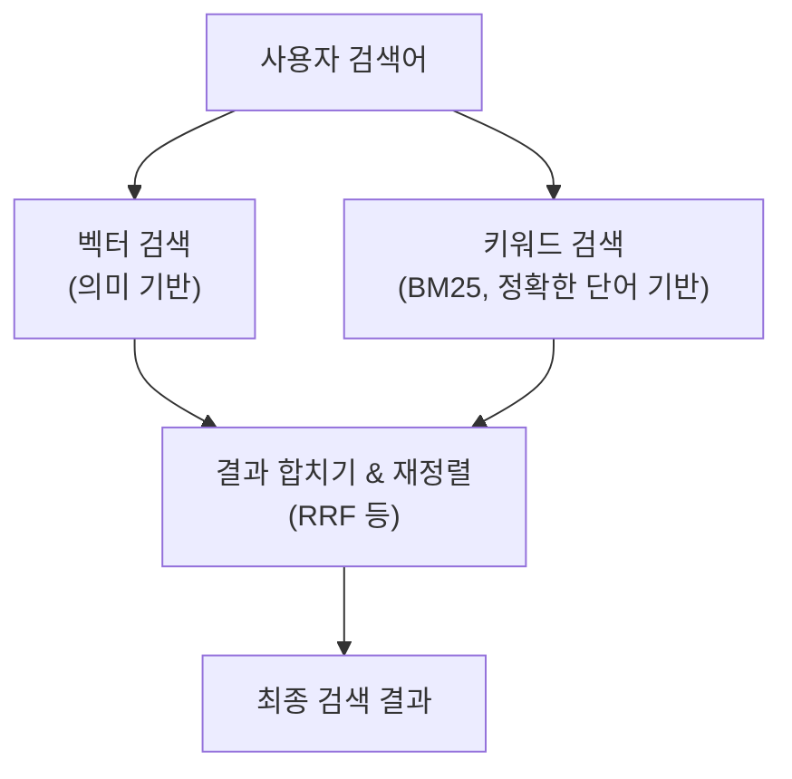
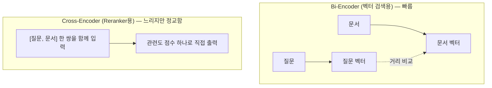
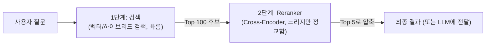

#CS #AI #LLM #면접

관련: [[임베딩과 벡터]] · [[../Database/인덱스|인덱스]]

## 목차
- [[#벡터 검색(Vector Search)이란?]]
- [[#벡터가 많아지면 어떻게 빠르게 찾을까? — ANN과 HNSW]]
- [[#근데 벡터 검색만으로는 부족할 때가 있다]]
- [[#키워드 검색(Sparse Search) — 정확한 단어를 잘 잡아내는 방식]]
- [[#하이브리드 검색(Hybrid Search) — 둘을 합치자]]
- [[#점수를 어떻게 합칠까? — RRF(Reciprocal Rank Fusion)]]
- [[#Reranker — 후보를 다시 한번 정교하게 줄 세우기]]
- [[#실무에서는 어떻게 쓰일까?]]
- [[#한 장 요약]]
- [[#Q&A로 복습하기]]

---

## 벡터 검색(Vector Search)이란?

[[임베딩과 벡터]] 문서에서 다뤘듯, 텍스트를 벡터로 바꿔두면 **코사인 유사도**로 "의미가 얼마나 비슷한지" 계산할 수 있어요. **벡터 검색**은 이 원리를 그대로 검색에 적용한 거예요.

> **"사용자의 질문을 벡터로 바꾸고, 미리 저장해둔 문서 벡터들 중에서 가장 가까운(유사도가 높은) 것들을 찾아서 돌려주자."**



이걸 수학 용어로는 **kNN (k-Nearest Neighbor, k개의 최근접 이웃 찾기)** 검색이라고 불러요. "질문 벡터와 가장 가까운 k개의 문서 벡터를 찾아라"는 문제죠.

---

## 벡터가 많아지면 어떻게 빠르게 찾을까? — ANN과 HNSW

문서가 100개면 질문 벡터와 100번 비교해도 순식간이지만, **문서가 수천만 개**라면 매번 전부 다 비교하는 건 너무 느려요. [[../Database/인덱스|인덱스]] 문서에서 "책의 색인 없이 처음부터 다 뒤지는 것"을 풀 스캔이라고 불렀던 것 기억하시나요? 벡터도 다 비교하면 똑같은 문제가 생겨요.

그래서 실제로는 **정확도를 아주 조금 포기하는 대신 훨씬 빠른** 방법을 써요. 이걸 **ANN(Approximate Nearest Neighbor, 근사 최근접 이웃 탐색)** 이라고 해요. 대표적인 알고리즘이 **HNSW(Hierarchical Navigable Small World)** 예요.

> 비유: 친구 찾기 게임을 생각해보세요. "이 동네에서 나랑 가장 친한 사람을 찾아라"라고 하면, **모든 사람과 일일이 비교하는 대신** "일단 아무나 붙잡고, 그 사람의 친구 중에 나랑 더 비슷한 사람이 있으면 그쪽으로 이동, 없으면 거기서 멈춰"를 반복하는 게 훨씬 빨라요. HNSW가 딱 이런 방식이에요 — 벡터들을 미리 "친구 관계(가까운 벡터끼리 연결된 그래프)"로 층층이 엮어두고, 대략적인 위치에서 시작해서 점점 더 가까운 이웃으로 이동하며 탐색해요.



완전 정확한 결과가 아니라 **"거의 확실히 정답에 가까운" 결과를 훨씬 빠르게** 찾아주는 거예요. Pinecone, Milvus, Weaviate, pgvector 같은 벡터 DB들이 내부적으로 이런 알고리즘을 써요.

---

## 근데 벡터 검색만으로는 부족할 때가 있다

벡터 검색은 "의미"를 잘 잡아내지만, 의외로 **정확한 단어/숫자/코드를 콕 집어 찾는 데는 약해요.**

```
사용자 검색: "GPT-4"
벡터 검색 결과: "GPT-3", "GPT-4", "ChatGPT", "OpenAI 모델" 등이 다 비슷한 유사도로 섞여서 나올 수 있음
```

왜 이럴까요? 임베딩은 **전체적인 의미의 뭉뚱그림**이라, "GPT-3"와 "GPT-4"처럼 **글자 하나 차이지만 완전히 다른 걸 가리키는 경우**나, 제품 코드·시리얼 번호·특정 고유명사처럼 **정확히 그 단어 자체가 중요한 경우**엔 오히려 정확도가 떨어질 수 있어요.

> 비유: "이 소설이랑 분위기가 비슷한 책 추천해줘"는 벡터 검색이 잘하는 일이에요. 그런데 "ISBN 979-11-xxx 이 책 찾아줘"처럼 **정확히 그 코드**를 찾아야 하면, "분위기가 비슷한" 접근은 오히려 방해가 돼요. 이럴 땐 옛날부터 잘 하던 방식, 즉 **정확한 단어 매칭**이 필요해요.

---

## 키워드 검색(Sparse Search) — 정확한 단어를 잘 잡아내는 방식

전통적인 검색 엔진(Elasticsearch 등)이 쓰는 방식이 **키워드 기반 검색**이에요. 대표 알고리즘이 **BM25**인데, 원리를 아주 간단히 말하면 이래요.

- 문서에 검색어가 **많이 등장할수록** 점수가 높아짐
- 그 단어가 **모든 문서에 흔하게 등장하는 단어(예: "그리고", "the")** 라면 점수를 깎음 (희귀한 단어일수록 더 중요하게 취급)
- 문서가 너무 길면 단어 등장 횟수를 좀 깎아서 공정하게 비교

이런 키워드 기반 방식은 벡터처럼 "의미"를 촘촘한 숫자 배열(dense vector)로 뭉뚱그리지 않고, **"이 단어가 있냐 없냐"** 를 거의 그대로 반영해서 **Sparse(희소) 검색**이라고도 불러요. 그래서 정확한 단어·코드·고유명사 매칭에 강해요.

| 구분 | 벡터 검색 (Dense) | 키워드 검색 (Sparse, BM25) |
|---|---|---|
| 강점 | 의미가 비슷한 걸 찾음 (동의어, 문맥 이해) | 정확한 단어/코드/고유명사를 잘 찾음 |
| 약점 | 정확한 단어 매칭에 약함, "GPT-3 vs GPT-4"처럼 미세한 차이를 놓칠 수 있음 | 동의어를 이해 못함 ("강아지" 검색 시 "반려견" 문서는 못 찾음) |

---

## 하이브리드 검색(Hybrid Search) — 둘을 합치자

각자 잘하는 게 다르니, **"둘 다 검색해서 결과를 합치자"** 는 게 하이브리드 검색이에요.

> 비유: 서로 특기가 다른 사서 두 명을 동시에 고용한 도서관이라고 생각해보세요. 한 명(벡터 검색)은 "이 책이랑 분위기 비슷한 책"을 잘 찾고, 다른 한 명(키워드 검색)은 "정확히 이 단어가 들어간 책"을 잘 찾아요. 둘에게 동시에 물어보고, **두 사람의 추천 리스트를 적절히 합쳐서** 최종 답을 만들면, 어느 한쪽만 쓸 때보다 훨씬 안정적인 결과가 나와요.



---

## 점수를 어떻게 합칠까? — RRF(Reciprocal Rank Fusion)

문제는 벡터 검색의 "유사도 점수"와 키워드 검색의 "BM25 점수"가 **단위/스케일이 완전히 달라요.** 코사인 유사도는 -1~1 사이 값인데, BM25 점수는 그냥 커질 수 있는 임의의 실수거든요. 그래서 점수를 직접 더하기보다, **"순위(등수)"만 가지고 합치는 방법**을 많이 써요. 대표적인 게 **RRF(Reciprocal Rank Fusion)** 예요.

```
RRF 점수(문서) = 1 / (k + 벡터검색 등수) + 1 / (k + 키워드검색 등수)
(k는 보통 60 정도의 상수)
```

예를 들어 어떤 문서가 벡터 검색에서 **1등**, 키워드 검색에서 **50등**이었다면:

```
RRF 점수 = 1/(60+1) + 1/(60+50) = 0.0164 + 0.0091 = 0.0255
```

이런 식으로 **두 검색 방식 모두에서 상위권에 자주 등장하는 문서일수록 최종 점수가 높아져요.** 점수의 절대적인 크기가 아니라 "몇 등이었는지"만 보기 때문에, 서로 다른 스케일의 점수도 공정하게 합칠 수 있어요.

```java
// 개념을 단순화한 의사 코드
double rrfScore(int vectorRank, int keywordRank, int k) {
    double vectorScore = (vectorRank != null) ? 1.0 / (k + vectorRank) : 0;
    double keywordScore = (keywordRank != null) ? 1.0 / (k + keywordRank) : 0;
    return vectorScore + keywordScore;
}
```

---

## Reranker — 후보를 다시 한번 정교하게 줄 세우기

벡터 검색이든 하이브리드 검색이든, 지금까지 본 방식들은 **수백만 개 문서 중에서 후보 몇십~몇백 개를 빠르게 추려내는 것**엔 강하지만, 그 후보들 **서로 간의 순위를 아주 정교하게 매기는 데는 한계**가 있어요. 왜 그런지, 그리고 이걸 보완하는 **Reranker(재정렬기)** 가 뭔지 봐볼게요.

> **비유**: 채용 과정을 떠올려보세요. 지원자가 1만 명이면 이력서만 슥 훑어서 "그럴듯한 사람 100명"을 빠르게 추리는 **서류 심사(1차, 벡터/하이브리드 검색)** 를 먼저 해요. 그다음 이 100명만 따로 불러서 **면접관이 한 명 한 명 꼼꼼하게 대화하며 평가하는 면접(2차, Reranker)** 을 봐요. 1만 명을 전부 면접 보는 건 너무 오래 걸리지만, 100명만 추려서 보면 훨씬 정확하고 감당할 만하죠.

**왜 검색 단계에서 애초에 정교하게 순위를 못 매길까요?** 임베딩 기반 벡터 검색은 **바이 인코더(Bi-Encoder)** 방식이에요 — 질문과 문서를 **각자 따로** 벡터로 바꾼 뒤, 그 두 벡터 사이의 거리(코사인 유사도)만 재요. 이래야 문서 벡터를 미리 다 계산해서 저장해두고, 수백만 개를 빠르게 검색(ANN)할 수 있거든요. 대신 질문과 문서가 **서로 어떻게 상호작용하는지**는 못 보고, "각자의 뭉뚱그려진 의미"만 비교하는 셈이라 정밀도에 한계가 있어요.

**Reranker는 크로스 인코더(Cross-Encoder)** 방식을 써요 — 질문과 문서를 **한 쌍으로 묶어서 모델에 함께 넣고**, "이 둘이 얼마나 관련 있는지" 점수를 바로 뽑아내요. 질문의 각 단어가 문서의 각 단어와 어떻게 관련되는지를 훨씬 세밀하게 볼 수 있어서 정확도가 크게 올라가요.



**문제는 크로스 인코더가 느리다는 것**이에요. 질문-문서 쌍을 매번 새로 계산해야 해서 미리 저장해둘 수 없고, 문서 하나하나마다 모델을 다시 돌려야 해요. 그래서 **수백만 개 전체에 크로스 인코더를 쓰는 건 현실적으로 불가능**하고, 이런 2단계 파이프라인이 표준이 됐어요.



- **1단계(검색)**: 수백만 개 중에서 "대략 그럴듯한" 후보 수백 개를 빠르게 추려요 (Recall 중심 — 정답을 놓치지 않는 게 중요).
- **2단계(Reranker)**: 그 후보 수백 개만 대상으로 훨씬 정교하게 순위를 다시 매겨서, 최종적으로 몇 개만 골라요 (Precision 중심 — 진짜 관련 있는 걸 상위에 놓는 게 중요).

**RAG에서 특히 중요한 이유**: [[임베딩과 벡터]]에서 다룬 RAG 파이프라인은 결국 검색된 문서를 LLM에게 그대로 넘겨요. 검색 단계에서 관련 없는 문서가 섞여 들어가면 LLM이 엉뚱한 근거로 답변할 수 있는데, Reranker로 한 번 더 걸러주면 **LLM에게 넘기는 문서의 품질이 크게 올라가요.** (Cohere Rerank, BGE-reranker 같은 모델들이 실무에서 많이 쓰여요.)

---

## 실무에서는 어떻게 쓰일까?

- **RAG(검색 증강 생성)**: [[임베딩과 벡터]] 문서에서 다룬 RAG 파이프라인도, 벡터 검색만 쓰면 "정확한 제품 코드/버전 번호가 섞인 질문"에서 엉뚱한 문서를 가져올 수 있어요. 하이브리드 검색을 쓰면 답변 근거가 훨씬 정확해져요.
- **이커머스 검색**: "나이키 에어맥스 270" 같은 검색어는 "운동화 추천"이라는 의미도 잡아야 하지만, "270"이라는 정확한 모델명도 놓치면 안 돼요.
- **사내 문서 검색**: 팀 이름, 프로젝트 코드명, 사번처럼 고유명사가 많은 환경에서는 벡터 검색 단독보다 하이브리드가 훨씬 안정적이에요.

대부분의 최신 벡터 DB(예: Weaviate, Elasticsearch의 벡터 기능, Pinecone)는 이제 하이브리드 검색을 기본 기능으로 지원해요.

---

## 한 장 요약

| 질문 | 답 |
|---|---|
| 벡터 검색이란? | 질문을 벡터로 바꿔서, 저장된 문서 벡터 중 가장 유사한(가까운) 것을 찾는 것 (kNN) |
| 벡터가 많을 때 빠르게 찾는 방법은? | ANN(근사 최근접 이웃 탐색), 대표적으로 HNSW 알고리즘 |
| 벡터 검색의 약점 | 정확한 단어/코드/고유명사 매칭에 약함 (의미가 뭉뚱그려짐) |
| 키워드 검색(BM25)의 강점 | 정확한 단어 매칭에 강함, 단 동의어는 이해 못함 |
| 하이브리드 검색이란? | 벡터 검색 + 키워드 검색을 동시에 수행하고 결과를 합치는 방식 |
| 결과를 합치는 대표적인 방법 | RRF(Reciprocal Rank Fusion) — 점수가 아니라 순위(등수) 기반으로 합침 |
| Reranker란? | 검색으로 추린 후보를 Cross-Encoder로 다시 정교하게 순위 매기는 2단계 |

---

## Q&A로 복습하기

### Q. 벡터 검색은 어떤 원리로 동작하나?
A. 사용자 질문을 벡터로 변환한 뒤, 미리 저장해둔 문서 벡터들과 코사인 유사도를 비교해서 가장 가까운(유사한) 것들을 찾는다(kNN).

### Q. ANN(근사 최근접 이웃 탐색)이 필요한 이유는?
A. 저장된 벡터가 수백만 개 이상이면 매번 전부와 비교하는 게 너무 느리기 때문에, 정확도를 아주 조금 포기하는 대신 훨씬 빠르게 "거의 정답에 가까운" 결과를 찾기 위해서다.

### Q. 벡터 검색이 "GPT-3"와 "GPT-4"처럼 미세한 차이를 놓칠 수 있는 이유는?
A. 임베딩은 전체적인 의미를 뭉뚱그려 숫자로 표현하기 때문에, 글자 하나 차이지만 완전히 다른 대상을 가리키는 경우나 정확한 코드·고유명사를 구분하는 데는 약할 수 있다.

### Q. 키워드 검색(BM25)과 벡터 검색의 강점은 각각 무엇인가?
A. 키워드 검색은 정확한 단어·코드·고유명사 매칭에 강하지만 동의어는 이해하지 못하고, 벡터 검색은 의미가 비슷한 것(동의어, 문맥)을 잘 찾지만 정확한 단어 매칭에는 약하다.

### Q. RRF가 점수 대신 순위(등수)를 사용하는 이유는?
A. 벡터 검색의 유사도 점수와 키워드 검색의 BM25 점수는 스케일이 완전히 달라서 직접 더할 수 없기 때문에, 두 검색 모두에서 상위권일수록 유리하도록 등수 기반으로 공정하게 합친다.

### Q. Reranker는 왜 필요하고, 검색 단계와 무엇이 다른가?
A. 검색 단계(벡터/하이브리드 검색)는 질문과 문서를 각자 따로 벡터로 바꿔 비교하는 Bi-Encoder 방식이라 빠르지만 정밀도에 한계가 있다. Reranker는 질문과 문서를 한 쌍으로 묶어 함께 모델에 입력하는 Cross-Encoder 방식으로 훨씬 정교하게 관련도를 계산하는데, 느리기 때문에 검색으로 추린 소수의 후보에만 적용해 최종 순위를 다시 매긴다.
