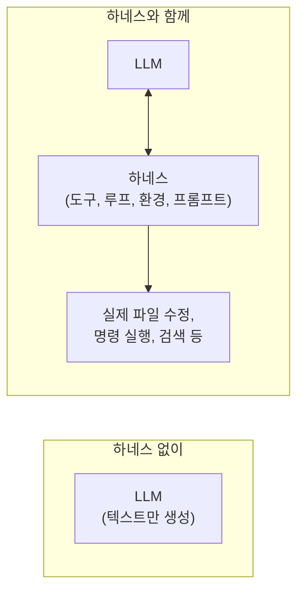
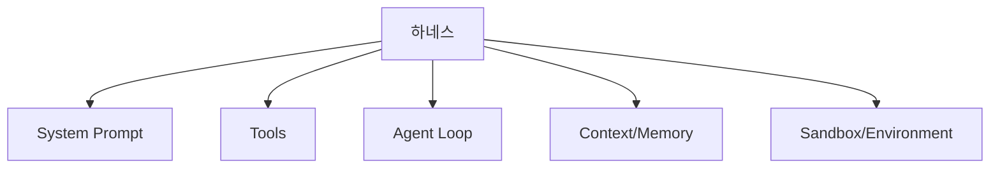
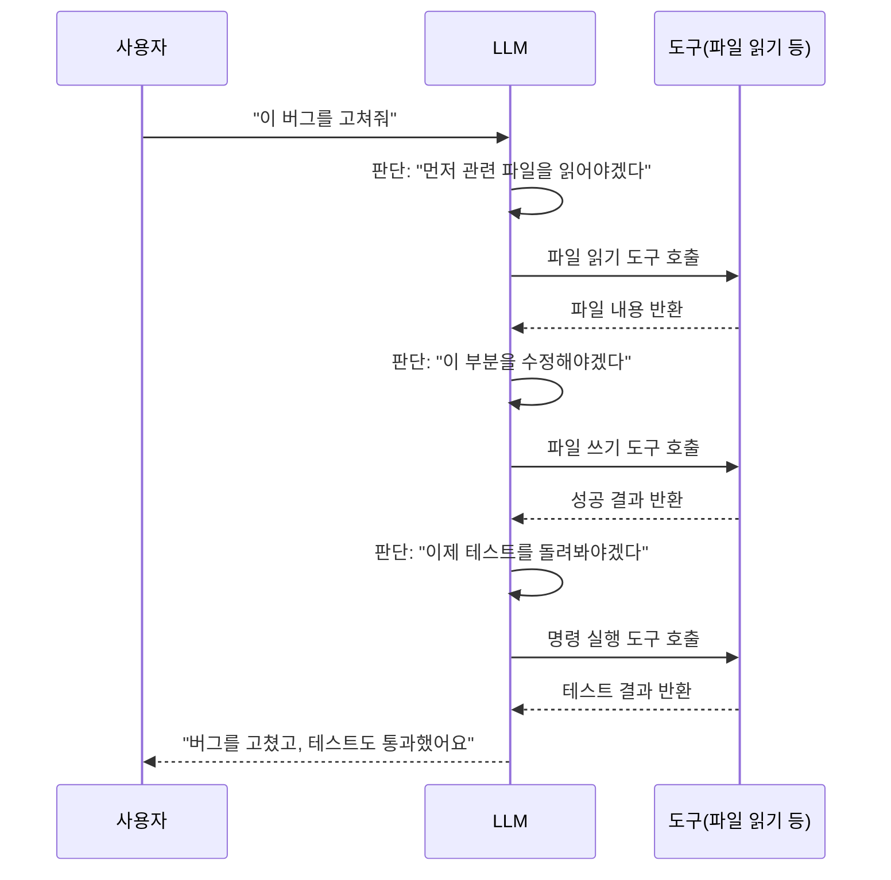

#CS #AI #LLM #면접

관련: [[임베딩과 벡터]] · [[벡터 검색과 하이브리드 검색]]

## 목차
- [[#하네스란? — 말의 힘을 마차로 옮겨주는 장치]]
- [[#LLM 혼자서는 할 수 없는 일들]]
- [[#하네스를 이루는 핵심 구성 요소]]
- [[#에이전트 루프 — 하네스의 심장]]
- [[#왜 "엔지니어링"이라고 부를까?]]
- [[#실제 사례 — Claude Code 같은 코딩 에이전트]]
- [[#한 장 요약]]
- [[#Q&A로 복습하기]]

---

## 하네스란? — 말의 힘을 마차로 옮겨주는 장치

**하네스(Harness)** 는 원래 마차를 끄는 말에 씌우는 **장구**를 뜻해요. 말 그 자체는 엄청난 힘을 가지고 있지만, 그 힘을 마차를 끄는 데 실제로 쓰려면 **말과 마차를 연결해주는 장치(하네스)** 가 필요해요. 하네스 없이는 아무리 힘센 말이라도 그냥 들판에 서 있는 말일 뿐이에요.

**AI 에이전트 하네스(Agent Harness)** 도 똑같은 역할을 해요. **LLM(대규모 언어 모델) 자체는 그저 "다음 토큰을 예측하는" 강력한 모델일 뿐**이에요. 이 모델이 실제로 파일을 읽고, 코드를 실행하고, 웹을 검색하는 **"에이전트"처럼 일하게 만들어주는 주변 장치 전체**가 바로 하네스예요.

---

## LLM 혼자서는 할 수 없는 일들

LLM은 근본적으로 **"입력된 텍스트를 보고, 다음에 올 그럴듯한 텍스트를 생성하는" 모델**이에요. 이것만으로는 할 수 없는 일이 많아요.

- **파일을 직접 읽거나 쓸 수 없어요** — 모델은 그저 텍스트를 주고받을 뿐, 디스크에 접근할 방법이 없어요.
- **명령을 실행할 수 없어요** — `git commit` 같은 걸 "생각"할 수는 있어도, 실제로 실행시킬 수단이 없어요.
- **최신 정보를 모를 수 있어요** — 학습 시점 이후의 정보는 모델 안에 없으니, 검색을 통해 가져와야 해요([[임베딩과 벡터]]에서 다룬 RAG가 이 문제의 한 해법이에요).
- **작업을 여러 단계로 나눠 "실행"할 수 없어요** — "파일을 읽고 → 수정하고 → 테스트를 돌리고 → 결과를 확인"하는 **연속된 실제 행동**은 모델 혼자 힘으로 불가능해요.

**하네스가 이 모든 "실행 능력"을 LLM에게 빌려주는 역할**을 해요.

---

## 하네스를 이루는 핵심 구성 요소

- **System Prompt(시스템 프롬프트)**: 에이전트가 어떤 역할을 하고, 어떤 규칙을 따라야 하는지 정의하는 지침. "너는 코딩을 돕는 에이전트야, 이런 도구들을 쓸 수 있어" 같은 내용이 담겨요.
- **Tools(도구)**: 모델이 "호출"할 수 있는 함수 목록. 파일 읽기/쓰기, 셸 명령 실행, 웹 검색 같은 것들이 여기에 해당해요. 모델은 이 도구들의 **이름, 설명, 파라미터 형식**만 보고 "지금 이 도구를 이렇게 호출해야겠다"고 판단해요.
- **Agent Loop(에이전트 루프)**: 모델의 판단과 도구 실행을 반복시키는 순환 구조. 바로 다음 섹션에서 자세히 볼게요.
- **Context/Memory(컨텍스트)**: 지금까지의 대화와 작업 기록. 모델은 "기억력"이 없어서, 매번 이전 내용을 다시 입력으로 넣어줘야 문맥을 유지할 수 있어요.
- **Sandbox/Environment(실행 환경)**: 도구가 실제로 실행되는 안전한 공간. 파일 시스템 접근 권한, 네트워크 접근 여부 같은 걸 통제해요.

---

## 에이전트 루프 — 하네스의 심장

하네스의 핵심 동작 원리는 **"모델의 응답과 도구 실행을 계속 주고받는 순환"** 이에요.

한 번의 사용자 요청에 대해, 모델이 **"지금 뭘 해야 할지 판단 → 도구 호출 → 결과 확인 → 다시 판단"** 을 필요한 만큼 반복해요. 이 루프가 멈추는 시점은 모델이 "이제 더 이상 도구가 필요 없고, 사용자에게 답할 준비가 됐다"고 판단할 때예요.

---

## 왜 "엔지니어링"이라고 부를까?

단순히 "LLM한테 프롬프트 하나 잘 써주면 끝"이 아니기 때문이에요. 하네스를 잘 만들려면 여러 시스템 설계 문제를 함께 풀어야 해요.

- **도구 설계**: 도구의 설명이 곧 모델에게는 "API 문서"예요. 설명이 모호하면 모델이 도구를 잘못 쓰거나 안 써야 할 때 써버려요.
- **에러 처리**: 도구 실행이 실패했을 때, 그 에러 메시지를 모델이 **이해하고 스스로 복구를 시도할 수 있는 형태**로 돌려줘야 해요.
- **컨텍스트 관리**: 대화가 길어지면 컨텍스트가 넘칠 수 있어서, 오래된 내용을 요약하거나 압축하는 전략이 필요해요.
- **권한/안전장치**: 위험한 명령(파일 삭제, 외부 전송 등)을 실행하기 전에 사용자 확인을 받게 하는 등, **에이전트가 통제 범위를 벗어나지 않게** 설계해야 해요.

이런 요소들을 종합적으로 설계하는 게 **"하네스 엔지니어링"** 이라는 새로운 영역으로 불리는 이유예요 — 모델 자체(LLM)를 개선하는 게 아니라, **모델을 둘러싼 시스템을 얼마나 잘 설계하느냐가 에이전트의 실제 성능을 크게 좌우**하기 때문이에요.

---

## 실제 사례 — Claude Code 같은 코딩 에이전트

**Claude Code**, **Cursor**, **Devin** 같은 코딩 에이전트 도구들이 전부 이 하네스 구조 위에서 동작해요.

- 파일 읽기/쓰기, 셸 명령 실행, 검색 같은 **도구들**을 LLM에게 제공하고
- 사용자의 요청을 받아 **에이전트 루프**를 돌리며 필요한 도구를 스스로 골라 호출하고
- 작업 중간중간 **권한 확인**(예: 파일 삭제 전 확인)이나 **컨텍스트 관리**(긴 대화를 요약)를 시스템 차원에서 처리해요

즉 "AI가 코딩을 도와준다"는 경험은 **LLM 모델 하나만의 힘이 아니라, 그 모델을 감싼 하네스가 얼마나 잘 설계됐는지에 크게 좌우**돼요.

---

## 한 장 요약

| 질문 | 답 |
|---|---|
| 하네스란? | LLM을 실제로 파일 조작, 명령 실행 등을 하는 에이전트처럼 동작하게 만드는 주변 장치 전체 |
| LLM 혼자서 할 수 없는 일은? | 파일 접근, 명령 실행, 최신 정보 조회, 여러 단계에 걸친 실제 작업 수행 |
| 하네스의 핵심 구성 요소는? | System Prompt, Tools, Agent Loop, Context, Sandbox |
| 에이전트 루프란? | 모델의 판단과 도구 호출/결과 확인을 필요한 만큼 반복하는 순환 구조 |
| 왜 "엔지니어링"이라 부르나? | 도구 설계, 에러 처리, 컨텍스트 관리, 안전장치까지 종합적으로 설계해야 하는 시스템 문제이기 때문 |

---

## Q&A로 복습하기

### Q. LLM 자체와 AI 에이전트의 차이는?
A. LLM 자체는 입력된 텍스트를 보고 다음 텍스트를 생성하는 모델일 뿐 파일 접근이나 명령 실행 능력이 없다. 에이전트는 이 LLM에 하네스(도구, 루프, 환경)를 씌워서 실제로 작업을 수행할 수 있게 만든 것이다.

### Q. 하네스에서 Tools(도구)의 설명이 왜 중요한가?
A. 모델은 도구의 이름과 설명, 파라미터 형식만 보고 언제 어떻게 그 도구를 호출할지 판단하기 때문에, 설명이 모호하면 모델이 도구를 잘못 사용하거나 필요한 상황에 사용하지 않을 수 있다.

### Q. 에이전트 루프는 언제 멈추나?
A. 모델이 스스로 "더 이상 도구 호출이 필요 없고 사용자에게 답할 준비가 됐다"고 판단하는 시점에 루프가 종료되고 최종 응답을 반환한다.

### Q. 하네스 설계가 "엔지니어링"이라고 불리는 이유는?
A. 단순히 프롬프트 하나를 잘 쓰는 것을 넘어, 도구의 명확한 설계, 모델이 이해하고 복구할 수 있는 에러 처리, 컨텍스트 길이 관리, 위험한 행동에 대한 안전장치까지 종합적인 시스템을 설계해야 하는 문제이기 때문이다.

### Q. Claude Code 같은 코딩 에이전트의 성능은 LLM 모델만으로 결정되나?
A. 아니다. 동일한 LLM이라도 하네스가 얼마나 잘 설계됐는지(도구 구성, 에러 처리, 컨텍스트 관리, 안전장치 등)에 따라 실제 작업 수행 능력이 크게 달라진다.
