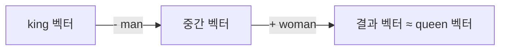
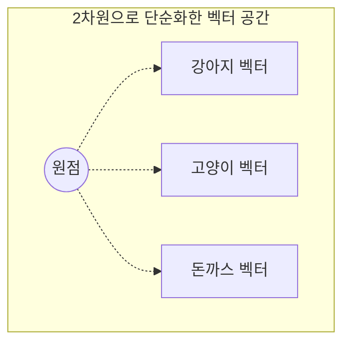
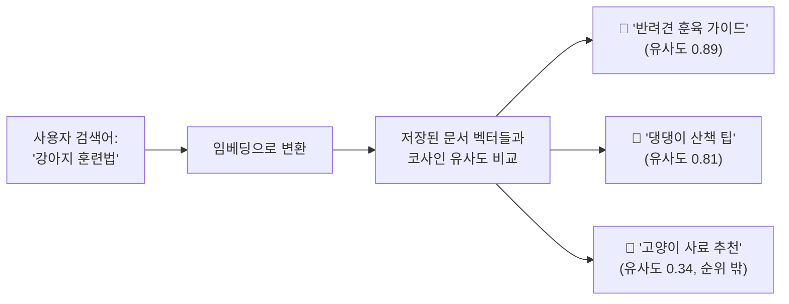
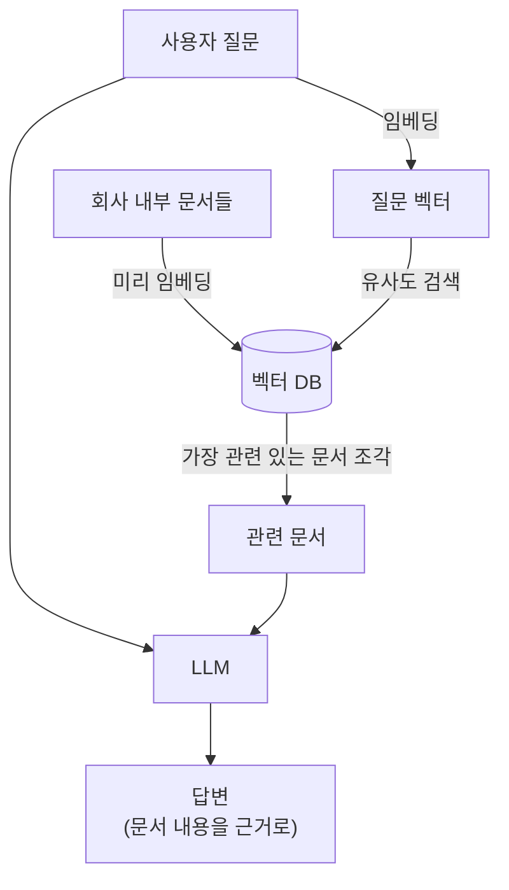

#CS #AI #LLM #면접

관련: [[벡터 검색과 하이브리드 검색]] · [[에이전트 하네스]]

## 목차
- [[#컴퓨터는 왜 "의미"를 숫자로 바꿔야 할까?]]
- [[#임베딩은 어떻게 "의미"를 배울까?]]
- [[#두 벡터가 "얼마나 비슷한지" 재는 법 — 코사인 유사도]]
- [[#이게 왜 중요할까? — 키워드 검색 vs 의미 검색]]
- [[#벡터가 많아지면? — 벡터 데이터베이스(Vector DB)가 필요한 이유]]
- [[#임베딩의 대표적인 활용: RAG (Retrieval-Augmented Generation)]]
- [[#한 장 요약]]
- [[#Q&A로 복습하기]]

---

## 컴퓨터는 왜 "의미"를 숫자로 바꿔야 할까?

컴퓨터는 텍스트를 있는 그대로 이해하지 못해요. "고양이"와 "강아지"가 "돈까스"보다 서로 더 비슷한 개념이라는 걸, 컴퓨터는 문자만 봐서는 전혀 알 수 없어요. `"고양이"`와 `"강아지"`는 그냥 다른 문자열일 뿐이니까요.

그래서 나온 아이디어가 **"단어(또는 문장, 이미지 등)를 숫자로 이루어진 벡터로 바꿔서, 의미가 비슷한 것끼리 가까운 위치에 놓자"** 는 것이에요. 이렇게 변환된 숫자 벡터를 **임베딩(Embedding)** 이라고 불러요.

> 비유: 세상 모든 단어를 하나의 거대한 지도 위에 점으로 찍는다고 생각해보세요. "고양이"와 "강아지"는 "동물" 동네에 가까이 붙어있고, "돈까스"는 "음식" 동네에 있는 식이에요. **임베딩은 이 "의미 지도" 위에서 각 단어의 좌표**예요. 다만 우리가 아는 위도·경도(2차원)가 아니라, 보통 수백~수천 개의 좌표축(차원)을 가진 지도라는 게 다를 뿐이에요.

```python
# 실제로는 이런 식으로, 단어/문장이 숫자 배열(벡터)로 바뀌어요
embed("고양이")  # → [0.12, -0.45, 0.88, ..., 0.03]  (예: 1536개의 숫자)
embed("강아지")  # → [0.15, -0.42, 0.91, ..., 0.05]  (고양이와 비슷한 값들)
embed("돈까스")  # → [-0.80, 0.31, -0.10, ..., 0.77] (완전히 다른 값들)
```

---

## 임베딩은 어떻게 "의미"를 배울까?

핵심 아이디어는 이거예요: **"비슷한 문맥(주변 단어)에서 등장하는 단어는 비슷한 의미를 가질 것이다."** (분포 가설, Distributional Hypothesis)

```
"나는 __ 를 산책시켰다"  → 강아지, 고양이가 들어갈 확률이 높음
"나는 __ 를 먹었다"      → 돈까스, 라면이 들어갈 확률이 높음
```

"강아지"와 "고양이"는 비슷한 문장 자리에 자주 등장하니까, 모델은 이 둘을 "의미 지도" 위에서 가까운 좌표에 배치하도록 학습돼요. 이런 원리로 대량의 텍스트를 학습시키면, 사람이 직접 "이 단어는 이런 뜻이야"라고 알려주지 않아도 모델이 스스로 단어 간의 관계를 벡터 공간에 녹여내요.

### 유명한 예시: king - man + woman ≈ queen

초기 임베딩 모델(Word2Vec)이 유명해진 이유 중 하나가 이거예요. 임베딩 벡터끼리 **덧셈/뺄셈 연산**을 하면 의미적으로도 말이 되는 결과가 나와요.



"왕(king)"에서 "남자(man)"라는 의미를 빼고 "여자(woman)"라는 의미를 더했더니, 벡터 공간에서 "여왕(queen)"과 가장 가까운 위치가 나온 거예요. 이게 임베딩이 단순 암기가 아니라 **진짜 "의미의 구조"를 벡터 공간의 방향/거리로 학습했다**는 걸 보여주는 유명한 사례예요.

> 요즘 실무에서 쓰는 임베딩(OpenAI `text-embedding-3` 등)은 단어 단위가 아니라 **문장/문단 단위**까지 통째로 벡터 하나로 압축할 수 있어요. 트랜스포머 기반이라 문맥까지 반영하기 때문에, 같은 단어라도 문장에 따라 다른 벡터가 나올 수 있어요. (예: "은행에 갔다"의 "은행" vs "강 은행에 앉았다"의 "은행")

---

## 두 벡터가 "얼마나 비슷한지" 재는 법 — 코사인 유사도

임베딩을 구했다면, 이제 "이 두 문장이 얼마나 의미적으로 비슷한가?"를 **벡터 사이의 거리/각도**로 계산할 수 있어요. 가장 널리 쓰이는 방법이 **코사인 유사도(Cosine Similarity)** 예요.



- 벡터 사이의 **각도가 작을수록(방향이 비슷할수록)** 두 대상은 의미적으로 비슷하다고 봐요.
- 코사인 유사도는 이 각도의 코사인 값을 계산해서, **-1(정반대) ~ 1(완전히 같은 방향)** 사이의 숫자로 "얼마나 비슷한지"를 표현해요.
- 벡터의 길이(크기)는 무시하고 오직 **방향**만 보기 때문에, 문장 길이가 다른 텍스트끼리 비교할 때도 공정해요.

```python
import numpy as np

def cosine_similarity(a, b):
    return np.dot(a, b) / (np.linalg.norm(a) * np.linalg.norm(b))

dog = embed("강아지")
cat = embed("고양이")
food = embed("돈까스")

cosine_similarity(dog, cat)   # 0.87 → 매우 비슷함
cosine_similarity(dog, food)  # 0.12 → 별로 안 비슷함
```

| 유사도 값 | 의미 |
|---|---|
| 1에 가까움 | 방향이 거의 같음 → 의미가 매우 비슷 |
| 0에 가까움 | 방향이 수직(관련 없음) |
| -1에 가까움 | 방향이 정반대 (의미상 반대 개념) |

---

## 이게 왜 중요할까? — 키워드 검색 vs 의미 검색

전통적인 검색(예: `Ctrl+F`, SQL의 `LIKE`)은 **정확히 같은 단어**가 있어야만 찾을 수 있어요.

```sql
SELECT * FROM articles WHERE content LIKE '%강아지%'; -- "반려견"이라는 단어만 있으면 못 찾음!
```

반면 임베딩 기반 검색(의미 검색, Semantic Search)은 **문자가 달라도 의미가 비슷하면** 찾아낼 수 있어요. "강아지"로 검색해도 "반려견", "댕댕이"라는 단어가 쓰인 글도 찾아줄 수 있죠. 왜냐하면 이 단어들의 임베딩 벡터가 서로 가까운 위치에 있을 테니까요.



---

## 벡터가 많아지면? — 벡터 데이터베이스(Vector DB)가 필요한 이유

문서 몇 개면 모든 벡터를 하나씩 비교(코사인 유사도 계산)해도 되지만, **문서가 수백만 개**라면 매 검색마다 전부 다 비교하는 건 너무 느려요.

> 비유: [[../Database/인덱스|인덱스]] 문서에서 "책의 색인 없이 처음부터 끝까지 다 훑어보는 것"을 풀 스캔이라고 했었죠. 벡터도 마찬가지예요 — 수백만 개의 벡터를 매번 하나하나 다 비교하는 건 "풀 스캔"과 같은 비효율이에요.

그래서 등장한 게 **벡터 데이터베이스(Vector DB)** — Pinecone, Milvus, Weaviate, pgvector 같은 도구들이에요. 이들은 **ANN(Approximate Nearest Neighbor, 근사 최근접 이웃 탐색)** 이라는 알고리즘(대표적으로 HNSW)을 써서, 정확도를 아주 조금만 포기하는 대신 검색 속도를 극적으로 빠르게 만들어줘요. 인덱스가 "완전 정확한 정렬"이 아니라 "충분히 빠르고 거의 정확한" 트리 구조로 SQL 조회를 가속하는 것과 비슷한 발상이에요. (ANN/HNSW의 자세한 원리와, 벡터 검색만으로 부족할 때 키워드 검색을 함께 쓰는 방법은 [[벡터 검색과 하이브리드 검색]] 참고)

---

## 임베딩의 대표적인 활용: RAG (Retrieval-Augmented Generation)

임베딩이 요즘 가장 많이 쓰이는 곳이 바로 **RAG**예요. LLM은 학습 당시의 지식만 알고 있어서, 회사 내부 문서나 최신 정보는 모르는 게 당연해요. RAG는 이 문제를 "검색해서 알려주기"로 해결해요.



1. 회사 문서들을 미리 잘게 쪼개서 임베딩으로 변환해 벡터 DB에 저장해둬요.
2. 사용자가 질문하면, 그 질문도 임베딩으로 변환해요.
3. 벡터 DB에서 질문 벡터와 **가장 유사한(코사인 유사도가 높은)** 문서 조각들을 찾아요.
4. 찾은 문서 조각을 LLM에게 "이 내용을 참고해서 답해줘"라며 같이 넘겨줘요.

이렇게 하면 LLM이 원래 몰랐던 내용(회사 내부 정보 등)도 검색된 문서를 근거로 정확하게 답할 수 있어요. RAG는 워낙 다룰 내용이 많은 주제라 나중에 별도 문서로 더 깊게 정리할게요.

---

## 한 장 요약

| 질문 | 답 |
|---|---|
| 임베딩이란? | 텍스트(단어/문장 등)를 의미가 비슷할수록 가까운 위치에 놓이는 숫자 벡터로 변환한 것 |
| 왜 필요한가? | 컴퓨터는 문자 자체로는 의미를 모르므로, 숫자 연산이 가능한 형태로 바꿔야 함 |
| 유사도를 재는 대표적인 방법 | 코사인 유사도 (두 벡터 사이의 각도 기반, -1~1) |
| 키워드 검색과 다른 점 | 정확히 같은 단어가 아니어도 의미가 비슷하면 찾아낼 수 있음 (의미 검색) |
| 벡터가 많을 때 빠르게 검색하려면? | 벡터 데이터베이스(ANN 알고리즘, 예: HNSW) 사용 |
| 임베딩의 대표적인 활용 | RAG — LLM이 모르는 최신/내부 정보를 검색해서 답변에 활용 |

---

## Q&A로 복습하기

### Q. 임베딩이란 한마디로 무엇인가?
A. 텍스트(단어, 문장 등)를 의미가 비슷할수록 벡터 공간에서 가까운 위치에 놓이도록 숫자로 변환한 것이다.

### Q. 임베딩 모델이 단어의 의미를 학습하는 기본 원리는?
A. 비슷한 문맥(주변 단어)에서 자주 등장하는 단어는 비슷한 의미를 가질 것이라는 가정(분포 가설)에 따라, 대량의 텍스트를 학습하며 스스로 단어 간 관계를 벡터 공간에 녹여낸다.

### Q. 코사인 유사도가 재는 것은 정확히 무엇인가?
A. 두 벡터 사이의 각도(방향의 유사성)다. 벡터의 길이(크기)는 무시하고, -1(정반대)~1(완전히 같은 방향) 사이 값으로 유사도를 나타낸다.

### Q. 키워드 검색과 임베딩 기반 의미 검색의 가장 큰 차이는?
A. 키워드 검색은 정확히 같은 단어가 있어야 찾을 수 있지만, 의미 검색은 단어가 달라도 의미가 비슷하면(임베딩 벡터가 가까우면) 찾아낼 수 있다.

### Q. 벡터가 수백만 개일 때 벡터 DB가 필요한 이유는?
A. 매번 모든 벡터와 일일이 유사도를 계산하면 너무 느리기 때문에, ANN(근사 최근접 이웃 탐색) 알고리즘으로 정확도를 아주 조금 포기하는 대신 검색 속도를 크게 높이기 위해서다.

### Q. RAG에서 임베딩은 어떤 역할을 하나?
A. 문서와 사용자 질문을 각각 임베딩으로 변환한 뒤, 벡터 유사도가 높은 문서를 찾아 LLM에게 근거 자료로 함께 넘겨줘서, LLM이 원래 모르던 최신/내부 정보도 근거를 갖고 답할 수 있게 해준다.
