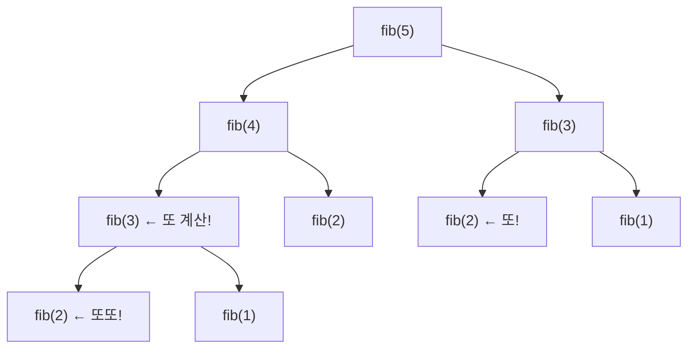

#CS #Algorithms #면접

관련: [[탐욕법]] · [[시간복잡도]]

## 목차
- [[#동적 계획법이란? — "이미 푼 문제는 다시 풀지 말자"]]
- [[#핵심 아이디어 두 가지]]
- [[#코드로 보는 DP — 피보나치 수열]]
- [[#Top-down(메모이제이션) vs Bottom-up(타뷸레이션)]]
- [[#대표적인 DP 문제 — 0/1 배낭 문제]]
- [[#DP vs 탐욕법 — 배낭 문제로 다시 보기]]
- [[#한 장 요약]]
- [[#Q&A로 복습하기]]

---

## 동적 계획법이란? — "이미 푼 문제는 다시 풀지 말자"

시험 문제를 풀다가 똑같은 계산을 여러 번 반복하게 됐다고 해봐요. 예를 들어 "3×4를 구하는 문제"가 시험지 여기저기 5번이나 나온다면, 처음 한 번 계산한 결과를 **어딘가에 적어두고, 다음부턴 그걸 그대로 베껴 쓰는** 게 훨씬 빠르겠죠.

**동적 계획법(Dynamic Programming, DP)** 이 정확히 이 아이디어예요. **큰 문제를 작은 부분 문제로 쪼개고, 한 번 계산한 부분 문제의 답은 저장해뒀다가 재사용**해서, 같은 계산을 반복하지 않는 거예요.

> **비유**: [[탐욕법]]이 "매 순간 앞만 보고 최선을 고르는 등산가"였다면, DP는 **"작은 언덕들을 하나씩 정복하고, 어디까지 올랐는지 지도에 표시해가며 정상까지 가는 등반가"** 예요. 이미 정복한 언덕(부분 문제)은 다시 오르지 않고, 그 결과만 딱 기억해두는 거죠.

---

## 핵심 아이디어 두 가지

DP를 적용할 수 있는 문제는 보통 이 두 가지 성질을 가져요. (첫 번째는 [[탐욕법]]에서도 언급했던 개념이에요.)

- **최적 부분 구조(Optimal Substructure)**: 문제의 최적해가, 그 문제를 이루는 작은 부분 문제들의 최적해로 구성된다.
- **중복되는 부분 문제(Overlapping Subproblems)**: 큰 문제를 풀다 보면, **똑같은 작은 문제를 여러 번 반복해서 풀게 된다.**

이 중 **"중복되는 부분 문제"** 가 DP만의 특징이에요. (탐욕법이 적용되는 문제들은 보통 부분 문제가 겹치지 않아요.) 이 중복을 이용해서, 한 번 푼 부분 문제의 답을 저장해두고 재사용하는 게 DP의 핵심이에요.

---

## 코드로 보는 DP — 피보나치 수열

피보나치 수열(`f(n) = f(n-1) + f(n-2)`)을 그냥 재귀로 짜보면 이래요.

```java
int fibNaive(int n) {
    if (n <= 1) return n;
    return fibNaive(n - 1) + fibNaive(n - 2); // 똑같은 값을 계속 다시 계산
}
```

`fib(5)`를 구하는 과정을 트리로 그려보면, **`fib(3)`이 두 번, `fib(2)`가 세 번** 이나 반복해서 계산되는 걸 볼 수 있어요. `n`이 커질수록 이 중복은 기하급수적으로 늘어나서, `fibNaive(40)`만 돼도 눈에 띄게 느려져요.



이 **중복 계산을 없애는 게 DP예요.** `fib(3)`, `fib(2)`처럼 이미 구한 값을 어딘가에 저장해두고, 다음에 같은 값이 필요할 때 다시 계산하지 않고 **꺼내 쓰기만** 하면 돼요.

---

## Top-down(메모이제이션) vs Bottom-up(타뷸레이션)

DP를 구현하는 방식은 크게 두 가지예요.

**① Top-down (메모이제이션, Memoization)** — 기존 재귀 코드에 "저장소(캐시)"만 추가하는 방식.

```java
Map<Integer, Integer> memo = new HashMap<>();

int fibMemo(int n) {
    if (n <= 1) return n;
    if (memo.containsKey(n)) return memo.get(n); // 이미 계산했으면 바로 반환
    int result = fibMemo(n - 1) + fibMemo(n - 2);
    memo.put(n, result); // 계산한 값을 저장
    return result;
}
```

**② Bottom-up (타뷸레이션, Tabulation)** — 재귀 없이, 작은 값부터 차례로 테이블을 채워나가는 방식.

```java
int fibTab(int n) {
    if (n <= 1) return n;
    int[] dp = new int[n + 1];
    dp[0] = 0;
    dp[1] = 1;
    for (int i = 2; i <= n; i++) {
        dp[i] = dp[i - 1] + dp[i - 2]; // 작은 값부터 차곡차곡 쌓아 올림
    }
    return dp[n];
}
```

| 구분 | Top-down (메모이제이션) | Bottom-up (타뷸레이션) |
|---|---|---|
| 방식 | 재귀 호출 + 캐시 | 반복문으로 작은 값부터 순서대로 계산 |
| 코드 형태 | 기존 재귀 코드와 비슷해서 직관적 | 계산 순서를 직접 설계해야 함 |
| 함수 호출 비용 | 재귀 호출 스택 비용 있음 | 없음 (반복문이라 더 빠른 경우가 많음) |
| 불필요한 계산 | 실제로 필요한 부분 문제만 계산 | 테이블 전체를 채우는 경우가 많음 |

---

## 대표적인 DP 문제 — 0/1 배낭 문제

무게 제한이 있는 배낭에 물건을 넣어 **가치의 합을 최대화**하는 문제예요. 각 물건은 "넣거나(1) 안 넣거나(0)" 둘 중 하나만 고를 수 있어서 "0/1 배낭 문제"라고 불러요.

```java
int knapsack(int[] weights, int[] values, int capacity) {
    int n = weights.length;
    int[][] dp = new int[n + 1][capacity + 1]; // dp[i][w] = i번째 물건까지 고려, 무게 w일 때 최대 가치

    for (int i = 1; i <= n; i++) {
        for (int w = 0; w <= capacity; w++) {
            if (weights[i - 1] <= w) {
                // 이 물건을 넣을지 말지, 둘 중 더 나은 걸 선택
                dp[i][w] = Math.max(
                    dp[i - 1][w],                                   // 안 넣는 경우
                    dp[i - 1][w - weights[i - 1]] + values[i - 1]   // 넣는 경우
                );
            } else {
                dp[i][w] = dp[i - 1][w]; // 무게 초과라 못 넣음
            }
        }
    }
    return dp[n][capacity];
}
```

`dp[i][w]`는 "물건을 `i`번째까지만 고려했을 때, 무게 한도 `w` 안에서 얻을 수 있는 최대 가치"예요. 매번 "이 물건을 넣을까 말까"라는 작은 선택을 하고, 그 결과를 테이블에 쌓아서 **전체 최적해를 완성**해요.

---

## DP vs 탐욕법 — 배낭 문제로 다시 보기

[[탐욕법]] 문서에서 "탐욕법은 항상 최적해를 보장하지 않는다"고 했는데, 0/1 배낭 문제가 딱 그 사례예요.

```
물건: (무게 10, 가치 60), (무게 20, 가치 100), (무게 30, 가치 120)
배낭 용량: 50
```

**탐욕법으로 "무게당 가치가 높은 순"** 으로 고르면: 물건1(6.0/kg) → 물건2(5.0/kg) → 남은 용량 20에 물건3(무게 30)은 못 들어감 → **총 가치 160**

**DP로 모든 조합을 다 고려하면**: 물건2 + 물건3(무게 50, 정확히 꽉 채움) → **총 가치 220** ← 이게 진짜 최적해예요!

탐욕법은 "지금 가장 효율 좋은 물건"만 고르다가, 뒤에 더 좋은 조합이 있다는 걸 놓쳐버렸어요. **부분 문제들이 서로 얽혀 있어서(중복/상호작용) 한 번의 선택이 되돌릴 수 없는 손해로 이어지는 문제라면, DP처럼 모든 경우를 체계적으로 따져봐야 안전해요.**

| 구분 | 탐욕법 | DP |
|---|---|---|
| 배낭 문제 결과 | 160 (최적 아님) | 220 (최적 보장) |
| 이유 | 무게당 가치만 보고 뒤를 고려 안 함 | 모든 조합의 경우를 체계적으로 비교 |

---

## 한 장 요약

| 질문 | 답 |
|---|---|
| DP의 핵심 아이디어는? | 부분 문제의 답을 저장해두고 재사용해서 중복 계산을 없앰 |
| DP가 적용 가능한 문제의 조건은? | 최적 부분 구조 + 중복되는 부분 문제 |
| Top-down과 Bottom-up의 차이는? | Top-down은 재귀+캐시, Bottom-up은 반복문으로 작은 값부터 채움 |
| 피보나치를 재귀로만 풀면 왜 느린가? | 같은 부분 문제(예: fib(3))를 여러 번 중복 계산하기 때문 |
| DP가 탐욕법보다 나은 경우는? | 부분 문제 선택들이 서로 얽혀서, 탐욕적 선택이 최적을 보장 못 할 때 (예: 0/1 배낭 문제) |

---

## Q&A로 복습하기

### Q. DP를 적용할 수 있는 문제가 가지는 두 가지 성질은?
A. 최적 부분 구조(문제의 최적해가 부분 문제의 최적해로 구성됨)와, 중복되는 부분 문제(같은 부분 문제를 여러 번 풀게 됨)다.

### Q. 피보나치 수열을 순수 재귀로 풀면 왜 느린가?
A. `fib(3)`, `fib(2)`처럼 같은 값을 계산하는 부분 문제가 트리 곳곳에서 중복으로 반복 호출되기 때문에, n이 커질수록 계산량이 기하급수적으로 늘어난다.

### Q. Top-down(메모이제이션)과 Bottom-up(타뷸레이션)의 차이는?
A. Top-down은 기존 재귀 코드에 캐시를 추가해 이미 계산한 값은 저장해뒀다가 재사용하는 방식이고, Bottom-up은 재귀 없이 작은 값부터 순서대로 테이블을 채워나가는 방식이다.

### Q. 0/1 배낭 문제에서 탐욕법(무게당 가치 순 선택)이 최적해를 보장하지 못하는 이유는?
A. 무게당 가치가 높은 물건부터 채우다 보면 남은 용량이 애매하게 남아 더 나은 조합을 놓칠 수 있다. DP처럼 모든 조합의 경우를 체계적으로 비교해야 진짜 최적해(최대 가치)를 찾을 수 있다.
