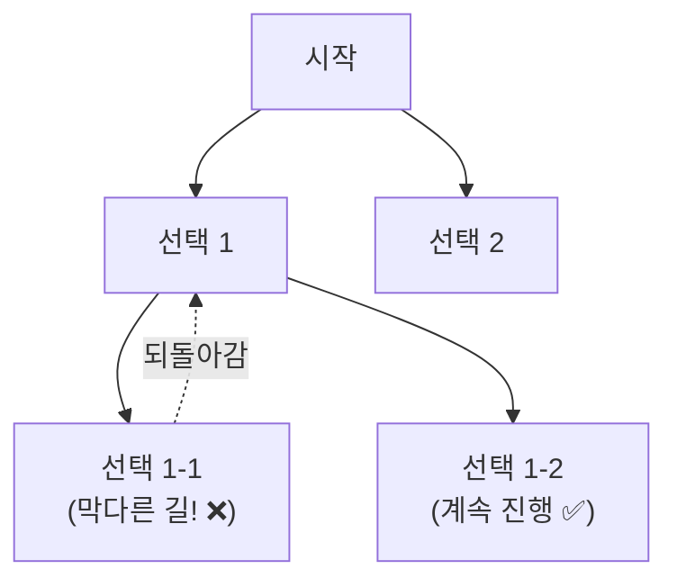
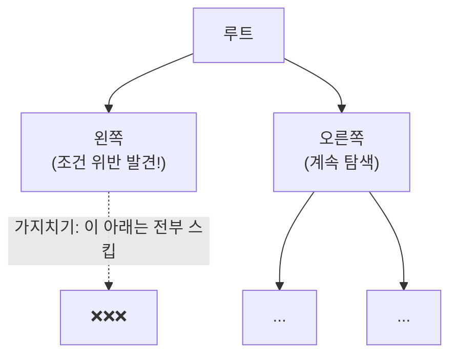
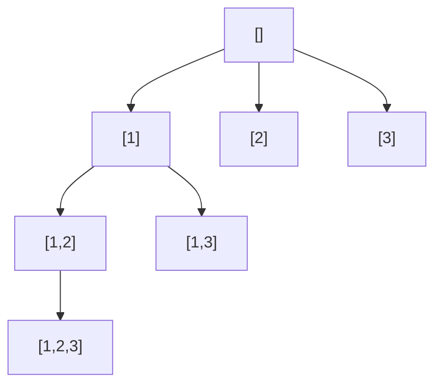

#CS #Algorithms #면접

관련: [[탐욕법]] · [[동적 계획법]] · [[../Data Structures/그래프|그래프]]

## 목차
- [[#백트래킹이란? — 막다른 길이면 되돌아가기]]
- [[#백트래킹 vs 완전탐색 — 가지치기의 힘]]
- [[#코드로 보는 백트래킹 — 부분집합 만들기]]
- [[#코드로 보는 백트래킹 — N-Queens 문제]]
- [[#백트래킹 vs DP — 언제 무엇을 쓸까?]]
- [[#한 장 요약]]
- [[#Q&A로 복습하기]]

---

## 백트래킹이란? — 막다른 길이면 되돌아가기

미로를 탐험한다고 생각해보세요. 한 방향으로 계속 가다가 **막다른 길(더 이상 못 가는 상황)** 을 만나면 어떻게 하나요? 그 자리에 멈추는 대신, **바로 직전 갈림길로 돌아가서 다른 방향을 시도**하죠.

**백트래킹(Backtracking)** 이 정확히 이 방식이에요 — **가능한 모든 경우를 하나씩 시도하되, "이 방향은 더 이상 답이 될 수 없다"는 게 확인되면 즉시 되돌아가서(Backtrack) 다른 선택지를 시도**하는 탐색 기법이에요. [[../Data Structures/그래프|그래프]]에서 다룬 **DFS(깊이 우선 탐색)** 를 기반으로 하되, "막힌 길이면 되돌아간다"는 판단 로직이 추가된 거예요.



---

## 백트래킹 vs 완전탐색 — 가지치기의 힘

"모든 경우를 다 시도해본다"는 점에서는 완전탐색(브루트포스)과 비슷해 보이지만, 결정적인 차이가 있어요. **백트래킹은 "이 경로로는 절대 답이 안 나온다"는 게 확실해지는 순간, 그 이후를 아예 탐색하지 않고 잘라내요.** 이걸 **가지치기(Pruning)** 라고 해요.



> **비유**: 완전탐색이 "미로의 모든 칸을 일일이 다 밟아보는 것"이라면, 백트래킹은 "막다른 방에 들어가는 순간 그 방과 연결된 모든 안쪽 길은 아예 안 가보고 바로 포기하는 것"이에요. 안 가봐도 되는 곳을 최대한 건너뛰니, **실제로 완전탐색보다 훨씬 빨라요.**

---

## 코드로 보는 백트래킹 — 부분집합 만들기

`[1, 2, 3]`의 모든 부분집합(공집합 포함)을 구해볼게요.

```java
void findSubsets(int[] nums, int start, List<Integer> current, List<List<Integer>> result) {
    result.add(new ArrayList<>(current)); // 지금까지 고른 조합도 하나의 답

    for (int i = start; i < nums.length; i++) {
        current.add(nums[i]);                          // ① 선택
        findSubsets(nums, i + 1, current, result);      // ② 다음 단계로 진출
        current.remove(current.size() - 1);             // ③ 되돌아가기 (백트랙!)
    }
}
```



핵심은 **③번, `current.remove(...)`** 예요. 한 선택지를 다 탐색하고 나면, **그 선택을 취소하고 원래 상태로 되돌린 뒤 다음 선택지를 시도**해요. 이 "선택 → 탐색 → 되돌리기"의 반복이 백트래킹의 기본 골격이에요.

---

## 코드로 보는 백트래킹 — N-Queens 문제

**N-Queens 문제**는 N×N 체스판에 퀸(Queen) N개를 **서로 공격하지 않도록** 배치하는 문제예요 (같은 행/열/대각선에 있으면 공격 가능). 대표적인 백트래킹 예시로 자주 나와요.

```java
void solveNQueens(int[] board, int row, int n) {
    if (row == n) { // 모든 행에 퀸을 다 놓았으면 성공
        printSolution(board);
        return;
    }
    for (int col = 0; col < n; col++) {
        if (isSafe(board, row, col)) { // 가지치기: 공격 가능하면 아예 시도 안 함
            board[row] = col;                          // ① 선택: row행에 col열로 퀸을 놓음
            solveNQueens(board, row + 1, n);            // ② 다음 행 진출
            // ③ 되돌아가기는 딱히 필요 없음 — 다음 반복에서 board[row]가 덮어써짐
        }
    }
}

boolean isSafe(int[] board, int row, int col) {
    for (int r = 0; r < row; r++) {
        int c = board[r];
        if (c == col || Math.abs(c - col) == Math.abs(r - row)) { // 같은 열 또는 대각선
            return false; // 이 조합은 가망 없음 — 가지치기!
        }
    }
    return true;
}
```

`isSafe()`가 바로 **가지치기**를 담당해요. "이 위치에 퀸을 놓으면 이미 놓인 퀸과 공격 관계가 된다"는 게 확인되면, **그 아래로는 아예 내려가 보지도 않고 다음 열을 시도**해요. 이 가지치기 덕분에, 모든 배치(N^N가지)를 다 확인하는 것보다 훨씬 적은 경우만 살펴보고도 답을 찾을 수 있어요.

---

## 백트래킹 vs DP — 언제 무엇을 쓸까?

[[동적 계획법]]에서 다룬 DP와 백트래킹 모두 "여러 선택지를 탐색한다"는 공통점이 있어서 헷갈릴 수 있어요.

| 구분 | 백트래킹 | 동적 계획법(DP) |
|---|---|---|
| 핵심 아이디어 | 조건 위반 시 즉시 포기(가지치기) | 중복되는 부분 문제의 결과를 저장해 재사용 |
| 부분 문제가 겹치는가? | 보통 안 겹침 (매번 다른 조합) | 겹침 — 그래서 저장해두는 게 이득 |
| 목적 | 조건을 만족하는 모든 경우(또는 하나)를 찾기 | 최적값(최댓값/최솟값/개수 등)을 구하기 |
| 대표 문제 | N-Queens, 부분집합, 스도쿠, 순열 | 피보나치, 0/1 배낭 문제, 최장 공통 부분 수열 |

> N-Queens처럼 "매번 체스판 상태가 다 달라서 저장해둘 만한 중복 부분 문제가 없는" 경우엔 DP를 적용할 수 없고, 백트래킹처럼 **가능한 조합을 직접 탐색하며 가지치기로 줄이는 방식**이 필요해요.

---

## 한 장 요약

| 질문 | 답 |
|---|---|
| 백트래킹이란? | 조건을 만족 못 하면 즉시 되돌아가는 탐색 기법, DFS 기반 |
| 완전탐색과의 차이는? | 가지치기로 가망 없는 경로를 아예 탐색하지 않아 더 빠름 |
| 백트래킹의 기본 골격은? | 선택 → 재귀로 다음 단계 탐색 → 선택 취소(되돌리기)의 반복 |
| N-Queens에서 가지치기는? | isSafe()로 이미 공격 관계가 되는 배치는 아예 더 탐색 안 함 |
| 백트래킹과 DP의 차이는? | 백트래킹은 부분 문제가 안 겹치는 조합 탐색, DP는 겹치는 부분 문제를 저장해 재사용 |

---

## Q&A로 복습하기

### Q. 백트래킹과 완전탐색(브루트포스)의 차이는?
A. 둘 다 모든 경우를 시도한다는 점은 같지만, 백트래킹은 "이 경로로는 답이 나올 수 없다"는 게 확인되는 즉시 그 이후 탐색을 잘라내는 가지치기를 하기 때문에, 불필요한 경우를 건너뛰어 완전탐색보다 훨씬 빠르다.

### Q. 백트래킹 코드에서 "되돌리기(선택 취소)" 단계가 필요한 이유는?
A. 한 선택지를 끝까지 탐색한 뒤, 그 선택을 취소하고 원래 상태로 복원해야 다음 형제 선택지를 같은 조건에서 다시 시도할 수 있기 때문이다. 이 복원 없이는 이전 선택이 남아 다음 탐색에 영향을 준다.

### Q. N-Queens 문제에서 isSafe() 함수는 어떤 역할을 하나?
A. 새로 놓으려는 퀸이 이미 배치된 다른 퀸과 같은 열이나 대각선에 있어 서로 공격 가능한지 확인한다. 공격 가능하면 그 즉시 해당 배치를 포기해, 가망 없는 하위 경로를 아예 탐색하지 않는 가지치기 역할을 한다.

### Q. 백트래킹으로 풀 문제와 DP로 풀 문제는 어떻게 구분하나?
A. 부분 문제들이 서로 겹치지 않고 매번 다른 조합을 만들어내는 문제(N-Queens, 부분집합 등)는 백트래킹으로, 동일한 부분 문제가 반복해서 나타나 결과를 저장해 재사용하면 이득인 문제(피보나치, 배낭 문제 등)는 DP로 접근하는 것이 적합하다.
