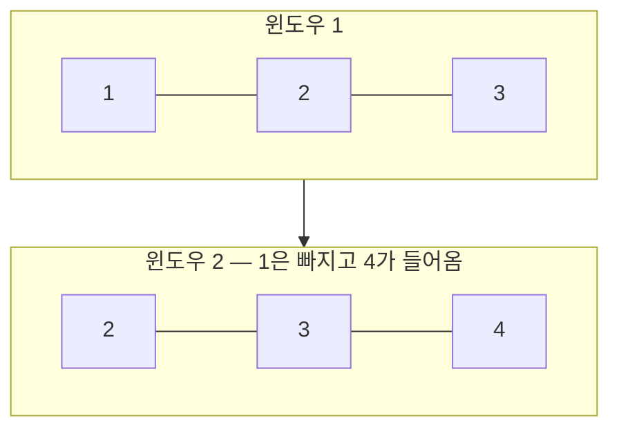
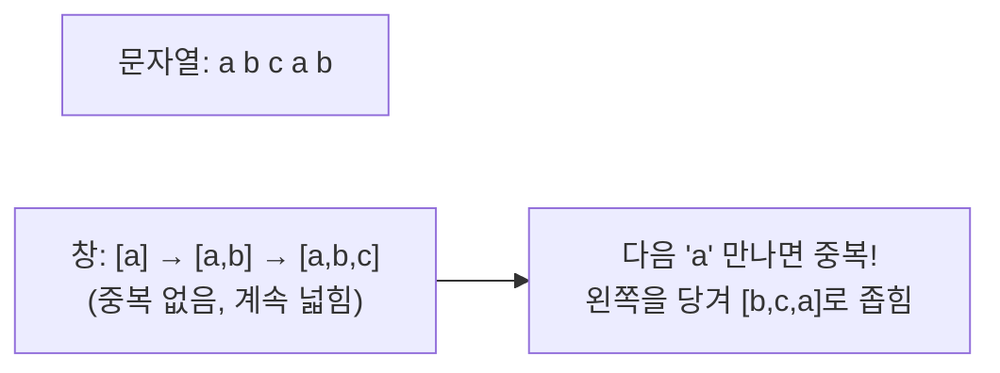
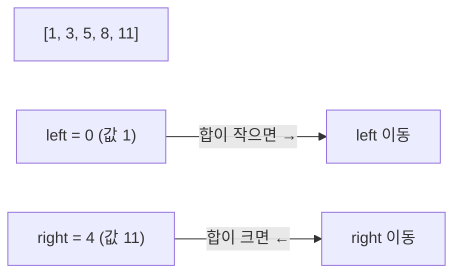

#CS #Algorithms #면접

관련: [[탐욕법]] · [[동적 계획법]] · [[시간복잡도]]

## 목차
- [[#왜 필요할까? — 매번 처음부터 다시 계산하는 낭비]]
- [[#슬라이딩 윈도우 (고정 크기) — 빼고 더하기만 하기]]
- [[#슬라이딩 윈도우 (가변 크기) — 조건에 따라 창 크기가 늘었다 줄었다]]
- [[#투 포인터 — 두 개의 손가락으로 배열을 훑기]]
- [[#슬라이딩 윈도우와 투 포인터는 어떤 관계일까?]]
- [[#한 장 요약]]
- [[#Q&A로 복습하기]]

---

## 왜 필요할까? — 매번 처음부터 다시 계산하는 낭비

"배열에서 연속된 3개 숫자의 합 중 최댓값을 구하라"는 문제를 가장 단순하게 풀면, 시작 위치를 하나씩 옮기며 **매번 3개를 처음부터 다시 더해요.**

```java
int maxSum = Integer.MIN_VALUE;
for (int i = 0; i <= arr.length - 3; i++) {
    int sum = arr[i] + arr[i+1] + arr[i+2]; // 매번 처음부터 3개를 다시 더함
    maxSum = Math.max(maxSum, sum);
}
```

이 방식은 배열 크기가 `n`, 구간 크기가 `k`일 때 `O(n×k)`가 걸려요. 그런데 사실 **한 칸 옮길 때마다 바뀌는 건 "맨 앞 값이 빠지고, 새 값 하나가 들어오는 것"뿐**이에요. 이미 계산해둔 합을 버리고 매번 새로 더할 필요가 없어요.

> **비유**: 기차 3칸짜리 창문으로 풍경을 보고 있다고 생각해보세요. 기차가 한 칸 앞으로 가면, 뒤쪽 풍경 하나가 사라지고 앞쪽 풍경 하나가 새로 들어와요. **창문 안 풍경 3개를 통째로 다시 보는 게 아니라, "빠지는 것 하나, 들어오는 것 하나"만 신경 쓰면 되는** 거죠. 이게 바로 슬라이딩 윈도우예요.

---

## 슬라이딩 윈도우 (고정 크기) — 빼고 더하기만 하기

```java
int windowSum = 0;
for (int i = 0; i < 3; i++) windowSum += arr[i]; // 첫 윈도우 합 미리 계산
int maxSum = windowSum;

for (int i = 3; i < arr.length; i++) {
    windowSum += arr[i] - arr[i - 3]; // 새로 들어온 값 더하고, 빠지는 값 뺌
    maxSum = Math.max(maxSum, windowSum);
}
```



매번 `O(k)`씩 걸리던 계산이 **`O(1)`(더하기·빼기 한 번)** 로 줄어서, 전체 시간복잡도가 `O(n×k)`에서 **`O(n)`** 으로 확 줄어요. **"창(윈도우)을 한 칸씩 오른쪽으로 밀면서, 빠지는 값과 들어오는 값만 갱신"** 하는 게 핵심이에요.

---

## 슬라이딩 윈도우 (가변 크기) — 조건에 따라 창 크기가 늘었다 줄었다

윈도우 크기가 항상 고정은 아니에요. **"중복된 문자가 없는 가장 긴 부분 문자열 찾기"** 같은 문제는 조건을 만족하는 동안은 창을 넓히고, 조건이 깨지면 창을 좁혀요.

```java
int lengthOfLongestSubstring(String s) {
    Set<Character> window = new HashSet<>();
    int left = 0, maxLen = 0;

    for (int right = 0; right < s.length(); right++) {
        while (window.contains(s.charAt(right))) { // 중복 발견 → 왼쪽을 당겨서 창을 좁힘
            window.remove(s.charAt(left));
            left++;
        }
        window.add(s.charAt(right)); // 오른쪽으로 창을 넓힘
        maxLen = Math.max(maxLen, right - left + 1);
    }
    return maxLen;
}
```



두 포인터 `left`, `right`가 **각자 오른쪽으로만 이동**하면서(뒤로 가지 않음), 전체적으로 `O(n)`에 문제를 풀어요. `right`가 조건을 깨면 `left`를 당겨서 창을 다시 유효하게 만드는 패턴이 핵심이에요.

---

## 투 포인터 — 두 개의 손가락으로 배열을 훑기

**투 포인터(Two Pointer)** 는 배열(보통 정렬된 배열)에서 **두 개의 인덱스(포인터)를 각자 다른 방향, 혹은 다른 속도로 움직이며** 탐색하는 기법이에요. 슬라이딩 윈도우보다 좀 더 넓은 개념이에요.

대표적인 예: **정렬된 배열에서 합이 target인 두 수 찾기**

```java
boolean twoSum(int[] arr, int target) { // arr는 오름차순 정렬되어 있다고 가정
    int left = 0, right = arr.length - 1;
    while (left < right) {
        int sum = arr[left] + arr[right];
        if (sum == target) return true;
        else if (sum < target) left++;  // 합이 작으면 왼쪽 포인터를 오른쪽으로 (값을 키움)
        else right--;                    // 합이 크면 오른쪽 포인터를 왼쪽으로 (값을 줄임)
    }
    return false;
}
```



배열이 정렬돼 있다는 걸 이용해서, **왼쪽 포인터는 항상 오른쪽으로만, 오른쪽 포인터는 항상 왼쪽으로만** 움직여요. 모든 쌍을 다 확인하는 `O(n²)` 브루트포스 대신, 각 포인터가 최대 `n`번만 움직이니 **`O(n)`** 에 끝나요.

---

## 슬라이딩 윈도우와 투 포인터는 어떤 관계일까?

사실 **슬라이딩 윈도우는 투 포인터의 한 종류**예요. 두 기법 모두 "포인터(인덱스) 두 개로 구간을 관리한다"는 공통점이 있는데, **포인터가 움직이는 방향**에 차이가 있어요.

| 구분 | 슬라이딩 윈도우 | 투 포인터 (일반) |
|---|---|---|
| 포인터 방향 | 두 포인터(`left`, `right`)가 **같은 방향**으로 이동 | 두 포인터가 **서로 다른 방향**(마주보고 좁혀짐)으로도 이동 가능 |
| 주로 쓰이는 곳 | 연속된 구간(부분 배열/부분 문자열) 문제 | 정렬된 배열에서 쌍/조합을 찾는 문제 |
| 전제 조건 | 딱히 정렬 필요 없음 | 보통 정렬된 배열을 전제로 함 |
| 대표 예시 | 최대 연속 합, 중복 없는 최장 부분 문자열 | 정렬된 배열에서 합이 target인 두 수 찾기 |

**공통적으로 얻는 이득**은 같아요 — 브루트포스로 `O(n²)`(또는 그 이상) 걸리던 문제를, **불필요하게 반복 계산하던 부분을 포인터 이동으로 재사용**해서 대부분 **`O(n)`** 으로 줄여준다는 것.

---

## 한 장 요약

| 질문 | 답 |
|---|---|
| 슬라이딩 윈도우란? | 구간(창)을 옮기며, 빠지는 값과 들어오는 값만 갱신해 중복 계산을 없애는 기법 |
| 고정 크기 vs 가변 크기 윈도우 차이는? | 고정은 항상 같은 크기로 이동, 가변은 조건에 따라 창을 넓히거나 좁힘 |
| 투 포인터란? | 두 개의 인덱스를 (주로 정렬된 배열에서) 움직여가며 탐색하는 기법 |
| 슬라이딩 윈도우와 투 포인터의 관계는? | 슬라이딩 윈도우는 두 포인터가 같은 방향으로 움직이는 투 포인터의 한 종류 |
| 이 기법들이 주는 이득은? | 브루트포스 O(n²)를 대부분 O(n)으로 줄여줌 |
| 탐욕법/DP와는 어떤 관계인가? | 문제 해결 전략(탐욕법/DP)이 아니라, 반복/탐색을 최적화하는 기법. 다른 전략 안에서 같이 쓰이기도 함 |

---

## Q&A로 복습하기

### Q. 슬라이딩 윈도우가 브루트포스보다 빠른 이유는?
A. 구간을 한 칸 옮길 때 전체를 다시 계산하지 않고, 빠지는 값을 빼고 들어오는 값만 더하는 식으로 이전 계산 결과를 재사용하기 때문이다. 이 덕분에 O(n×k)가 O(n)으로 줄어든다.

### Q. 가변 크기 슬라이딩 윈도우는 언제 창을 좁히나?
A. 오른쪽 포인터를 넓히다가 문제의 조건(예: 중복 문자 없음)이 깨지는 순간, 왼쪽 포인터를 당겨서 조건을 다시 만족할 때까지 창을 좁힌다.

### Q. 투 포인터 기법이 정렬된 배열을 전제로 하는 경우가 많은 이유는?
A. 정렬돼 있어야 "합이 작으면 왼쪽 포인터를 옮기고, 크면 오른쪽 포인터를 옮긴다"처럼 포인터를 어느 방향으로 움직일지 값의 크기 비교만으로 판단할 수 있기 때문이다.

### Q. 슬라이딩 윈도우와 일반적인 투 포인터의 차이는?
A. 슬라이딩 윈도우는 두 포인터가 항상 같은 방향으로만 이동하며 연속 구간을 관리하는 반면, 투 포인터는 서로 다른 방향(마주보고 좁혀지는 방식 등)으로도 움직일 수 있는 더 넓은 개념이다. 슬라이딩 윈도우는 투 포인터의 한 종류로 볼 수 있다.
