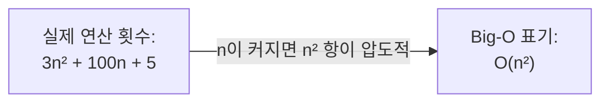
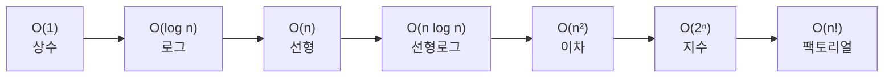

#CS #Algorithms #면접

관련: [[탐욕법]] · [[동적 계획법]] · [[슬라이딩 윈도우와 투 포인터]] · [[../Data Structures/힙과 우선순위 큐|힙과 우선순위 큐]]

## 목차
- [[#시간 복잡도란? — "몇 초 걸리나"가 아니라 "얼마나 늘어나나"]]
- [[#Big-O 표기법 — 최악의 경우를 기준으로 증가율만 본다]]
- [[#대표적인 시간복잡도 종류]]
- [[#코드로 보는 시간복잡도]]
- [[#공간 복잡도도 있다]]
- [[#지금까지 다룬 알고리즘들의 시간복잡도 정리]]
- [[#한 장 요약]]
- [[#Q&A로 복습하기]]

---

## 시간 복잡도란? — "몇 초 걸리나"가 아니라 "얼마나 늘어나나"

이삿짐을 옮긴다고 해봐요. 짐이 10박스일 때 1시간이 걸렸다면, 짐이 100박스면 얼마나 걸릴까요? **"몇 분 몇 초"** 로 답하긴 어려워요. 트럭 크기, 이삿짐센터 인원, 엘리베이터 유무에 따라 실제 걸리는 시간은 매번 달라지니까요. 대신 이렇게는 답할 수 있어요 — **"짐이 10배 늘면, 시간도 대략 10배 늘어난다"** 는 **증가하는 추세**요.

**시간 복잡도(Time Complexity)** 도 똑같은 발상이에요. "이 알고리즘이 정확히 몇 초 걸리나"가 아니라, **"입력 크기(n)가 커질 때, 걸리는 시간이 대략 어떤 비율로 늘어나는가"** 를 나타내요. 컴퓨터 성능이나 프로그래밍 언어에 따라 실제 걸리는 시간은 다 다르지만, **"늘어나는 패턴"** 은 알고리즘 자체의 성질이라 변하지 않아요.

---

## Big-O 표기법 — 최악의 경우를 기준으로 증가율만 본다

이 "늘어나는 패턴"을 표현하는 표기법이 **Big-O(빅오)** 예요. 두 가지 원칙이 있어요.

- **최악의 경우(Worst Case)를 기준으로 본다.** "운이 좋으면 빨리 끝날 수도 있다"가 아니라, "최악의 상황에서도 이 정도는 걸린다"를 보장하는 게 실무적으로 더 안전하기 때문이에요.
- **가장 영향이 큰 항만 남기고, 나머지는 무시한다.** 예를 들어 연산 횟수가 `3n² + 100n + 5`라면, `n`이 아주 커지면 `n²` 항이 다른 항들을 압도해버려요. 그래서 상수(3)나 작은 항(100n, 5)은 다 버리고 **`O(n²)`** 로만 표현해요.



---

## 대표적인 시간복잡도 종류

`n`이 커질수록 걸리는 시간이 얼마나 빨리 늘어나는지, **빠른 것부터 느린 것 순**으로 정리하면 이래요.



| 표기           | 이름      | n=10일 때 대략적인 연산 수 | 대표 예시                  |
| ------------ | ------- | ----------------- | ---------------------- |
| `O(1)`       | 상수 시간   | 1                 | 배열 인덱스 접근, 해시맵 조회      |
| `O(log n)`   | 로그 시간   | 약 3               | 이진 탐색, 힙 삽입/삭제         |
| `O(n)`       | 선형 시간   | 10                | 배열 전체 순회, 선형 탐색        |
| `O(n log n)` | 선형로그 시간 | 약 33              | 병합 정렬, 퀵 정렬(평균), 힙 정렬  |
| `O(n²)`      | 이차 시간   | 100               | 이중 for문, 버블/선택/삽입 정렬   |
| `O(2ⁿ)`      | 지수 시간   | 1024              | 피보나치 순수 재귀, 부분집합 전체 탐색 |
| `O(n!)`      | 팩토리얼 시간 | 3,628,800         | 모든 순열 탐색(외판원 문제 완전탐색)  |

n이 겨우 10일 때도 `O(n²)`과 `O(2ⁿ)`, `O(n!)`의 차이는 어마어마해요. n이 커질수록 이 차이는 감당할 수 없을 만큼 벌어져서, **좋은 알고리즘을 고르는 게 하드웨어를 업그레이드하는 것보다 훨씬 중요해지는 순간**이 와요.

---

## 코드로 보는 시간복잡도

**O(1) — 상수 시간**: 입력 크기와 무관하게 항상 일정한 시간.
```java
int getFirst(int[] arr) {
    return arr[0]; // 배열이 100개든 100만 개든 한 번의 접근으로 끝
}
```

**O(log n) — 로그 시간**: 매번 절반씩 버려가며 탐색.
```java
int binarySearch(int[] arr, int target) {
    int left = 0, right = arr.length - 1;
    while (left <= right) {
        int mid = (left + right) / 2;
        if (arr[mid] == target) return mid;
        else if (arr[mid] < target) left = mid + 1;
        else right = mid - 1; // 매번 탐색 범위가 절반으로 줄어듦
    }
    return -1;
}
```

**O(n) — 선형 시간**: 모든 원소를 딱 한 번씩만 확인.
```java
boolean contains(int[] arr, int target) {
    for (int num : arr) { // n개를 한 번씩 확인
        if (num == target) return true;
    }
    return false;
}
```

**O(n²) — 이차 시간**: 중첩 반복문으로 모든 쌍을 확인.
```java
void printAllPairs(int[] arr) {
    for (int i = 0; i < arr.length; i++) {
        for (int j = 0; j < arr.length; j++) { // n개마다 n번씩 반복 → n×n
            System.out.println(arr[i] + ", " + arr[j]);
        }
    }
}
```

**O(2ⁿ) — 지수 시간**: [[동적 계획법]]에서 다룬 피보나치 순수 재귀가 대표적이에요. 매 단계마다 선택지가 두 갈래로 갈라지며 계속 불어나요.

---

## 공간 복잡도도 있다

시간뿐 아니라 **얼마나 많은 메모리를 쓰는지**도 똑같은 방식(Big-O)으로 표현해요, 이걸 **공간 복잡도(Space Complexity)** 라고 해요. 흔히 **"시간을 아끼려고 메모리를 더 쓰는" 트레이드오프**가 생겨요.

> [[동적 계획법]]의 메모이제이션이 정확히 이 사례예요 — 계산 결과를 저장할 배열/맵을 위해 공간(O(n))을 더 쓰는 대신, 시간을 O(2ⁿ)에서 O(n)으로 확 줄였어요.

---

## 지금까지 다룬 알고리즘들의 시간복잡도 정리

지금까지 이 vault에서 다룬 알고리즘/자료구조들의 시간복잡도를 모아보면 이래요.

| 알고리즘/연산               | 시간복잡도          | 문서                               |
| --------------------- | -------------- | -------------------------------- |
| 피보나치 순수 재귀            | O(2ⁿ)          | [[동적 계획법]]                       |
| 피보나치 메모이제이션/타뷸레이션     | O(n)           | [[동적 계획법]]                       |
| 0/1 배낭 문제 (DP)        | O(n × 배낭 용량)   | [[동적 계획법]]                       |
| 활동 선택 문제 (탐욕법, 정렬 포함) | O(n log n)     | [[탐욕법]]                          |
| 브루트포스 연속 구간 합         | O(n × k)       | [[슬라이딩 윈도우와 투 포인터]]              |
| 슬라이딩 윈도우로 최적화         | O(n)           | [[슬라이딩 윈도우와 투 포인터]]              |
| 정렬된 배열의 투 포인터 탐색      | O(n)           | [[슬라이딩 윈도우와 투 포인터]]              |
| 힙 삽입/삭제               | O(log n)       | [[../Data Structures/힙과 우선순위 큐\|힙과 우선순위 큐]] |
| 힙 정렬(Heap Sort)       | O(n log n)     | [[../Data Structures/힙과 우선순위 큐\|힙과 우선순위 큐]] |
| 그래프 DFS/BFS           | O(정점 수 + 간선 수) | [[../Data Structures/그래프\|그래프]]             |

**패턴이 보이시나요?** 브루트포스로 짜면 O(n²)나 O(2ⁿ)이 나오던 문제들이, [[슬라이딩 윈도우와 투 포인터|슬라이딩 윈도우]]나 [[동적 계획법|DP]] 같은 기법을 적용하면 대부분 O(n)이나 O(n log n)으로 줄어들어요. **결국 "좋은 알고리즘"이란, 같은 문제를 더 낮은 시간복잡도로 푸는 방법을 찾아내는 것**이라고 할 수 있어요.

---

## 한 장 요약

| 질문 | 답 |
|---|---|
| 시간 복잡도란? | 입력 크기가 커질 때 걸리는 시간이 어떤 비율로 늘어나는지를 나타낸 것 |
| Big-O가 최악의 경우를 기준으로 하는 이유는? | 어떤 상황에서도 보장되는 성능을 알아야 실무적으로 안전하기 때문 |
| Big-O에서 작은 항을 무시하는 이유는? | n이 커지면 가장 큰 항이 전체 증가율을 압도하기 때문 |
| 대표적인 시간복잡도 순서는? | O(1) < O(log n) < O(n) < O(n log n) < O(n²) < O(2ⁿ) < O(n!) |
| 공간 복잡도란? | 알고리즘이 사용하는 메모리 양의 증가율. 시간과 트레이드오프 관계인 경우가 많음 |

---

## Q&A로 복습하기

### Q. Big-O 표기법이 "최악의 경우"를 기준으로 하는 이유는?
A. 운이 좋을 때 빠르게 끝날 수도 있다는 것보다, 어떤 입력이 와도 최소한 이 정도 성능은 보장된다는 정보가 실무적으로 더 안전하고 유용하기 때문이다.

### Q. 연산 횟수가 `3n² + 100n + 5`일 때 Big-O로 어떻게 표현하고, 그 이유는?
A. `O(n²)`로 표현한다. n이 충분히 커지면 n² 항이 다른 항들을 압도하기 때문에, 가장 영향이 큰 항만 남기고 상수와 작은 항은 무시한다.

### Q. O(2ⁿ)과 O(n log n)의 차이가 왜 실무적으로 중요한가?
A. n이 작을 때는 차이가 크지 않아 보여도, n이 커질수록 O(2ⁿ)은 감당할 수 없는 속도로 늘어나 실행 자체가 불가능해지는 반면 O(n log n)은 여전히 현실적인 시간 안에 처리된다. 그래서 알고리즘 선택이 하드웨어 성능보다 중요해지는 지점이 생긴다.

### Q. 메모이제이션이 시간과 공간의 트레이드오프를 보여주는 예시인 이유는?
A. 계산 결과를 저장하기 위한 메모리(공간 복잡도)를 추가로 사용하는 대신, 중복 계산을 없애 시간복잡도를 O(2ⁿ)에서 O(n)으로 크게 줄이기 때문이다.
