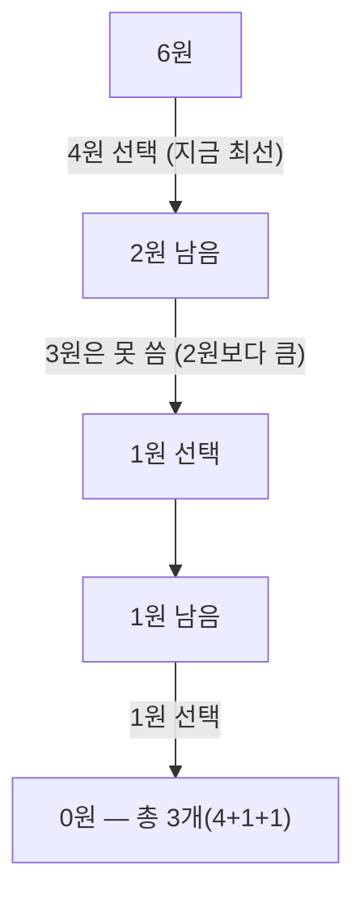

#CS #Algorithms #면접

관련: [[동적 계획법]] · [[백트래킹]] · [[시간복잡도]]

## 목차
- [[#탐욕법이란? — "일단 지금 제일 좋은 걸 고르자"]]
- [[#코드로 보는 탐욕법 — 거스름돈 문제]]
- [[#탐욕법이 항상 정답은 아니다 — 반례]]
- [[#탐욕법이 통하려면? — 두 가지 조건]]
- [[#대표적인 탐욕법 문제 — 활동 선택 문제]]
- [[#탐욕법 vs 동적 계획법]]
- [[#한 장 요약]]
- [[#Q&A로 복습하기]]

---

## 탐욕법이란? — "일단 지금 제일 좋은 걸 고르자"

편의점에서 물건을 사고 거스름돈 1,260원을 받아야 한다고 해봐요. 동전을 최대한 적게 주려면 어떻게 계산할까요? 아마 자연스럽게 이렇게 할 거예요.

> "일단 500원짜리를 최대한 많이 준다 → 남은 금액에서 100원짜리를 최대한 많이 준다 → ... "

**탐욕법(Greedy Algorithm)** 이 바로 이런 방식이에요. **매 순간, 전체를 다 고려하지 않고 "지금 당장 가장 좋아 보이는 선택"을 하는 것**이에요. 나중에 이 선택을 후회하고 되돌아가지도 않아요 — 한 번 고르면 끝이에요.

> **비유**: 미로에서 길을 찾을 때, 전체 지도를 보고 최적의 경로를 계산하는 대신 **매 갈림길마다 "일단 출구에 가장 가까워 보이는 방향"으로만 계속 전진**하는 거예요. 빠르고 간단하지만, 가끔 이 방법으로는 막다른 길에 다다를 수도 있어요.

---

## 코드로 보는 탐욕법 — 거스름돈 문제

```java
int[] coins = {500, 100, 50, 10}; // 큰 단위부터 정렬
int change = 1260;
int count = 0;

for (int coin : coins) {
    count += change / coin;  // 이 동전으로 최대한 많이 채움 (지금 당장 최선의 선택)
    change %= coin;          // 남은 금액
}
System.out.println(count); // 2(500원) + 2(100원) + 1(50원) + 1(10원) = 6개
```

각 단계에서 "지금 쓸 수 있는 가장 큰 동전을 최대한 많이 쓴다"는 선택만 반복했을 뿐인데, 결과적으로 **동전 개수를 최소화하는 정답**이 나왔어요. 매번 전체 조합을 다 따져보지 않고도 답을 구할 수 있으니 코드도 짧고 빨라요.

---

## 탐욕법이 항상 정답은 아니다 — 반례

문제는 **탐욕법이 항상 최적의 답을 보장하지는 않는다**는 거예요. 동전 단위를 조금만 바꿔볼게요.

```java
int[] coins = {4, 3, 1}; // 단위가 500/100/50/10처럼 "깔끔하지" 않음
int change = 6;
```

탐욕법으로 풀면: 4원짜리 1개(남은 2원) → 1원짜리 2개 → **총 3개**



하지만 진짜 최적의 답은 **3원짜리 2개, 총 2개**예요! 탐욕법은 처음에 "4원을 쓰는 게 당장은 이득"이라고 판단했지만, 그 선택 때문에 뒤에서 손해를 봤어요. **한 번 선택하면 되돌아가지 않는다는 탐욕법의 특성이 발목을 잡은 거예요.**

> ⚠️ 그래서 탐욕법을 쓸 땐 "이 문제가 정말 탐욕법으로 풀어도 항상 최적해가 나오는가?"를 먼저 증명하거나 확인해야 해요. 그냥 "빠르니까" 쓰면 틀린 답을 낼 수 있어요.

---

## 탐욕법이 통하려면? — 두 가지 조건

탐욕법으로 풀어도 **항상 최적의 답이 보장되는 문제**는 보통 이 두 성질을 만족해요.

- **탐욕 선택 속성(Greedy Choice Property)**: 매 순간의 최선의 선택을 계속 모아나가면, 전체적으로도 최적의 답이 된다. (앞의 동전 예시에서 `{4, 3, 1}`은 이 속성을 만족하지 않았어요.)
- **최적 부분 구조(Optimal Substructure)**: 문제의 최적해가, 그 문제를 이루는 작은 부분 문제들의 최적해로 이루어져 있다. (이 성질은 나중에 다룰 동적 계획법에서도 핵심이에요.)

`{500, 100, 50, 10}`처럼 **큰 단위가 작은 단위의 배수에 가까운 "깔끔한" 화폐 체계**에서는 탐욕 선택 속성이 성립해서 탐욕법이 항상 정답이지만, `{4, 3, 1}`처럼 애매한 단위에서는 성립하지 않아요.

---

## 대표적인 탐욕법 문제 — 활동 선택 문제

회의실 하나로 최대한 많은 회의를 진행하고 싶어요. 각 회의는 시작/종료 시간이 정해져 있고, 겹치면 둘 다 못 해요. **어떤 회의들을 골라야 가장 많은 회의를 열 수 있을까요?**

정답은 의외로 간단해요 — **"종료 시간이 가장 빠른 회의부터" 고르면 돼요.**

```java
// 회의를 [시작, 종료] 쌍으로 표현, 종료 시간 기준 오름차순 정렬되어 있다고 가정
int[][] meetings = {{1, 4}, {3, 5}, {0, 6}, {5, 7}, {8, 9}, {5, 9}};
Arrays.sort(meetings, (a, b) -> a[1] - b[1]); // 종료 시간이 빠른 순으로 정렬

List<int[]> selected = new ArrayList<>();
int lastEndTime = 0;
for (int[] meeting : meetings) {
    if (meeting[0] >= lastEndTime) { // 이전 회의가 끝난 뒤에 시작하는 회의만 선택
        selected.add(meeting);
        lastEndTime = meeting[1];
    }
}
```

**왜 "종료 시간이 빠른 것부터"가 정답일까요?** 회의를 하나 고를 때, 종료 시간이 가장 빠른 걸 고르면 **남은 시간을 가장 많이 남겨서 다음 회의를 고를 여지가 커지기 때문**이에요. 이게 바로 탐욕 선택 속성이 성립하는 대표 사례예요.

---

## 탐욕법 vs 동적 계획법

탐욕법과 자주 비교되는 게 **동적 계획법(Dynamic Programming, DP)** 이에요. (DP는 별도 문서에서 더 자세히 다룰 예정이에요.)

| 구분 | 탐욕법 (Greedy) | 동적 계획법 (DP) |
|---|---|---|
| 선택 방식 | 매 순간 최선의 선택, **한 번 선택하면 되돌아보지 않음** | 여러 경우를 다 고려하고, 부분 문제의 결과를 저장해서 재사용 |
| 속도 | 빠름 | 상대적으로 느림 (더 많은 경우를 계산) |
| 항상 최적해 보장? | ❌ (문제에 따라 다름, 증명 필요) | ✅ (문제를 제대로 정의했다면 보장) |
| 적합한 문제 | 탐욕 선택 속성이 성립하는 문제 (거스름돈 깔끔한 단위, 활동 선택 등) | 탐욕법으로는 반례가 생기는 문제 (배낭 문제 등) |

**정리하면**: 탐욕법은 "이 문제, 매번 최선만 골라도 결국 최적해가 될까?"를 스스로 판단(또는 증명)할 수 있을 때만 안전하게 쓸 수 있는 전략이에요. 탐욕법이 통하지 않는 대표적인 문제(0/1 배낭 문제)와, 그럴 때 대신 쓰는 방법은 [[동적 계획법]]에서 자세히 다뤄요.

---

## 한 장 요약

| 질문 | 답 |
|---|---|
| 탐욕법이란? | 매 순간 가장 좋아 보이는 선택을 하고, 그 선택을 되돌아보지 않는 알고리즘 전략 |
| 탐욕법의 장점은? | 빠르고 구현이 단순함 |
| 탐욕법의 한계는? | 항상 최적해를 보장하지 않음 (반례가 있을 수 있음) |
| 탐욕법이 통하는 조건은? | 탐욕 선택 속성 + 최적 부분 구조 |
| 대표 예시는? | 거스름돈(단위가 깔끔할 때), 활동 선택 문제(종료 시간 빠른 순 선택) |
| DP와의 차이는? | 탐욕법은 되돌아보지 않고 빠르지만 보장이 없고, DP는 부분 문제를 다 고려해 항상 최적해를 보장 |

---

## Q&A로 복습하기

### Q. 탐욕법의 핵심 특징은?
A. 매 순간 지금 가장 좋아 보이는 선택을 하고, 한 번 선택하면 되돌아가지 않는다는 것이다.

### Q. 탐욕법이 항상 최적해를 보장하지 않는 이유를 예로 설명하면?
A. 동전 단위가 {4, 3, 1}일 때 6원을 거슬러주는 경우, 탐욕법은 4원을 먼저 선택해 4+1+1(3개)이 나오지만 실제 최적해는 3+3(2개)이다. 당장 최선으로 보인 선택이 이후 선택의 여지를 좁혀 전체적으로는 손해가 될 수 있다.

### Q. 탐욕법으로 풀어도 최적해가 보장되는 문제의 조건은?
A. 매 순간의 최선의 선택을 모으면 전체 최적해가 되는 탐욕 선택 속성과, 문제의 최적해가 부분 문제의 최적해로 이루어지는 최적 부분 구조를 만족해야 한다.

### Q. 활동 선택 문제에서 "종료 시간이 빠른 회의부터" 고르는 게 왜 최적인가?
A. 종료 시간이 가장 빠른 회의를 고르면 남은 시간을 최대한 많이 남겨서, 이후에 선택할 수 있는 회의의 여지가 커지기 때문이다.

### Q. 탐욕법과 동적 계획법의 차이는?
A. 탐욕법은 매 순간 최선의 선택만 하고 되돌아보지 않아 빠르지만 항상 최적해를 보장하지는 않는다. 동적 계획법은 부분 문제들의 결과를 저장해 재사용하며 더 많은 경우를 고려하기 때문에 상대적으로 느리지만 최적해를 보장한다.
