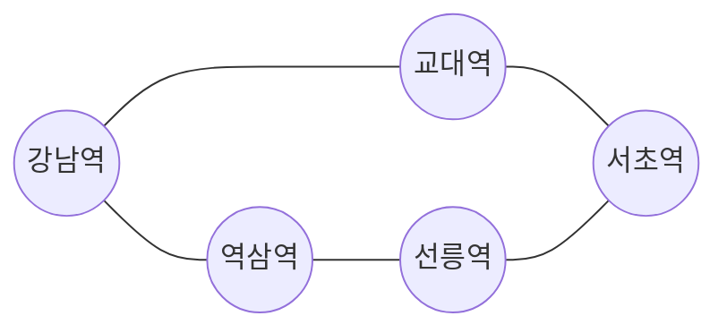
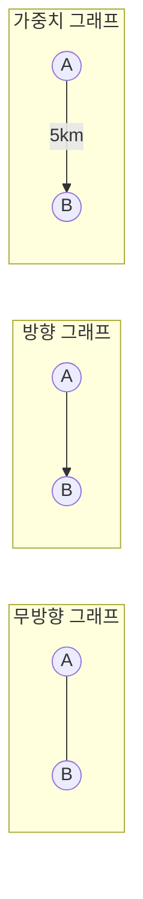
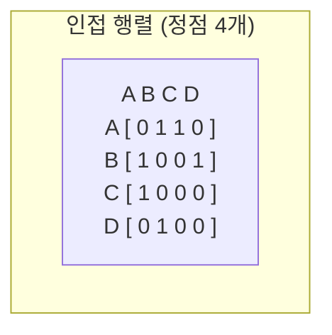
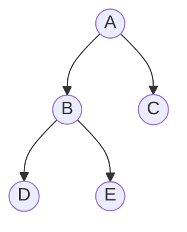

#CS #DataStructures #면접

관련: [[자료구조]] · [[스택과 큐]] · [[힙과 우선순위 큐]]

## 목차
- [[#그래프란? — 지하철 노선도]]
- [[#그래프의 기본 용어]]
- [[#그래프를 코드로 표현하는 방법 — 인접 행렬 vs 인접 리스트]]
- [[#그래프 탐색 — DFS와 BFS]]
- [[#DFS — 일단 갈 수 있는 데까지 깊이 들어가기]]
- [[#BFS — 가까운 곳부터 넓게 훑기]]
- [[#그래프는 어디에 쓰일까?]]
- [[#한 장 요약]]
- [[#Q&A로 복습하기]]

---

## 그래프란? — 지하철 노선도

지하철 노선도를 떠올려보세요. **역(정거장)** 들이 있고, 그 역들을 잇는 **선로(연결선)** 가 있어요. 어떤 역에서 어떤 역으로 갈아탈 수 있는지는 이 연결 관계로 결정돼요.

**그래프(Graph)** 는 정확히 이런 구조예요 — **여러 개의 대상(정점)과, 그 대상들 사이의 연결 관계(간선)를 표현하는 자료구조**예요. [[자료구조]] 문서에서 다룬 분류 중 **트리보다도 더 자유로운 비선형 자료구조**예요 — 트리는 부모가 하나뿐이고 순환이 없는 특수한 그래프인 반면, 그래프는 **누구와 누구든 자유롭게 연결**될 수 있고 순환도 허용돼요.



> **비유**: SNS의 친구 관계도 그래프예요. 사람(정점)마다 여러 명과 친구를 맺을 수 있고(간선), 그 연결이 얼마나 복잡하게 얽혀 있는지도 제각각이에요. 트리처럼 "누가 내 부모인지"가 딱 정해져 있지 않고, 완전히 자유로운 네트워크죠.

---

## 그래프의 기본 용어

- **정점(Vertex, Node)**: 데이터 하나하나. (지하철 노선도의 "역")
- **간선(Edge)**: 정점과 정점을 잇는 연결선. (지하철 노선도의 "선로")
- **방향 그래프(Directed Graph)**: 간선에 방향이 있어서, A→B로만 갈 수 있고 B→A는 안 될 수도 있어요. (예: 팔로우 관계 — 내가 상대를 팔로우해도 상대는 나를 안 할 수 있음)
- **무방향 그래프(Undirected Graph)**: 간선에 방향이 없어서, 연결되면 양쪽 다 오갈 수 있어요. (예: 페이스북 친구 관계 — 맺으면 서로 친구)
- **가중치 그래프(Weighted Graph)**: 간선마다 "비용"(거리, 시간, 요금 등)이 붙어 있어요. (예: 지도에서 두 지점 사이의 실제 거리)



---

## 그래프를 코드로 표현하는 방법 — 인접 행렬 vs 인접 리스트

**① 인접 행렬(Adjacency Matrix)**: 정점 × 정점 크기의 2차원 배열을 만들고, 연결돼 있으면 1(또는 가중치), 아니면 0을 채워요.

```java
int[][] graph = new int[n][n]; // n = 정점 개수
graph[0][1] = 1; // 0번 정점과 1번 정점이 연결됨
```

**② 인접 리스트(Adjacency List)**: 각 정점마다 "나와 연결된 정점들의 목록"만 저장해요.

```java
List<List<Integer>> graph = new ArrayList<>();
for (int i = 0; i < n; i++) graph.add(new ArrayList<>());
graph.get(0).add(1); // 0번 정점 → 1번 정점 연결
graph.get(1).add(0); // 무방향이면 반대 방향도 추가
```



| 구분 | 인접 행렬 | 인접 리스트 |
|---|---|---|
| 두 정점 연결 여부 확인 | O(1) — 배열 바로 확인 | O(간선 수) — 목록을 훑어야 함 |
| 메모리 사용량 | O(정점²) — 연결이 적어도 다 저장 | O(정점 + 간선) — 실제 연결만 저장 |
| 유리한 경우 | 정점이 적고 촘촘하게 연결된 그래프 | 정점이 많고 성기게 연결된 그래프 (실무 대부분) |

> 실무에서 다루는 그래프(소셜 네트워크, 도로망 등)는 보통 **정점 수는 많은데 각 정점의 연결은 적은 "성긴(sparse) 그래프"** 라서, 메모리를 아낄 수 있는 **인접 리스트가 훨씬 흔히 쓰여요.**

---

## 그래프 탐색 — DFS와 BFS

그래프가 있으면 "이 정점에서 저 정점까지 갈 수 있나?", "모든 정점을 다 방문하려면?" 같은 질문에 답해야 할 때가 많아요. 이럴 때 쓰는 두 가지 기본 탐색법이 **DFS(깊이 우선 탐색)** 와 **BFS(너비 우선 탐색)** 예요. 둘 다 [[스택과 큐]]에서 다룬 자료구조를 그대로 활용해요.

---

## DFS — 일단 갈 수 있는 데까지 깊이 들어가기

**DFS(Depth-First Search)** 는 한 방향으로 **갈 수 있는 데까지 끝까지 파고들다가, 막다른 길이면 되돌아와서 다른 길을 시도**하는 방식이에요. **스택**(또는 재귀 함수 호출 스택)을 이용해요.

```java
void dfs(int start, List<List<Integer>> graph, boolean[] visited) {
    visited[start] = true;
    System.out.println(start);
    for (int next : graph.get(start)) {
        if (!visited[next]) {
            dfs(start = next, graph, visited); // 재귀 호출 = 스택에 쌓임
        }
    }
}
```



`A`에서 시작하면 방문 순서는 **A → B → D → (더 갈 곳 없음, 되돌아옴) → E → (되돌아옴) → C** 예요. 한쪽 방향으로 최대한 깊이 들어갔다가 막히면 되돌아오는 게 스택의 LIFO 특성과 정확히 맞아떨어져요.

---

## BFS — 가까운 곳부터 넓게 훑기

**BFS(Breadth-First Search)** 는 **시작점에서 가까운 정점부터 한 단계씩 넓게** 탐색해요. **큐**를 이용해요.

```java
void bfs(int start, List<List<Integer>> graph, boolean[] visited) {
    Queue<Integer> queue = new ArrayDeque<>();
    queue.offer(start);
    visited[start] = true;

    while (!queue.isEmpty()) {
        int current = queue.poll();
        System.out.println(current);
        for (int next : graph.get(current)) {
            if (!visited[next]) {
                visited[next] = true;
                queue.offer(next);
            }
        }
    }
}
```

같은 그래프에서 `A`부터 BFS로 방문하면 순서는 **A → B → C → D → E** 예요. **A와 가까운 정점(B, C)을 먼저 다 방문하고, 그다음 단계(D, E)로 넘어가는** 거죠. 먼저 발견한 정점을 먼저 처리하는 큐의 FIFO 특성 덕분에 이런 "단계별" 탐색이 자연스럽게 이뤄져요.

> 최단 경로(가중치 없는 그래프에서)를 찾을 때 BFS를 쓰는 이유가 바로 이거예요 — 가까운 데부터 순서대로 퍼져나가니, **목적지에 처음 도달하는 순간이 곧 최단 거리**예요.

---

## 그래프는 어디에 쓰일까?

- **최단 경로 찾기**: 지도 앱의 길찾기. 가중치가 있는 그래프에서는 다익스트라 알고리즘을 쓰는데, 이때 [[힙과 우선순위 큐]]에서 다룬 우선순위 큐로 "지금까지 가장 가까운 노드"를 빠르게 골라요.
- **소셜 네트워크**: 친구 추천("친구의 친구"를 찾는 게 그래프 탐색이에요), 팔로우 관계.
- **웹 크롤러**: 웹페이지(정점)와 링크(간선)로 이뤄진 거대한 그래프를 탐색하며 페이지를 수집해요.
- **의존성 관리**: 패키지/모듈 간의 의존 관계도 그래프예요 (A가 B에 의존하면 A→B 간선). 순환 의존성이 있는지 검사할 때도 그래프 탐색을 써요.

---

## 한 장 요약

| 질문 | 답 |
|---|---|
| 그래프란? | 정점과, 정점 사이의 연결(간선)로 이뤄진 자료구조 |
| 트리와 그래프의 차이는? | 트리는 부모가 하나뿐이고 순환 없는 특수한 그래프, 그래프는 자유롭게 연결·순환 가능 |
| 인접 행렬 vs 인접 리스트 | 행렬은 연결 확인이 빠르지만 메모리를 많이 씀, 리스트는 메모리 효율적이라 실무에서 더 흔함 |
| DFS의 동작 방식은? | 갈 수 있는 데까지 깊이 들어가고 막히면 되돌아옴, 스택(재귀) 활용 |
| BFS의 동작 방식은? | 가까운 정점부터 한 단계씩 넓게 탐색, 큐 활용 |
| BFS가 최단 경로 탐색에 쓰이는 이유는? | 가까운 곳부터 순서대로 퍼져나가서, 목적지에 처음 도달한 순간이 곧 최단 거리이기 때문 |

---

## Q&A로 복습하기

### Q. 트리와 그래프는 어떤 관계인가?
A. 트리는 부모가 하나뿐이고 순환이 없는 특수한 형태의 그래프다. 그래프는 정점들이 훨씬 자유롭게 연결될 수 있고 순환도 허용된다.

### Q. 인접 행렬과 인접 리스트 중 실무에서 더 흔히 쓰이는 것과 그 이유는?
A. 인접 리스트가 더 흔하다. 실무의 그래프(소셜 네트워크, 도로망 등)는 정점 수는 많지만 각 정점의 실제 연결은 적은 성긴 그래프인 경우가 많아, 실제 연결만 저장하는 인접 리스트가 메모리를 훨씬 절약할 수 있기 때문이다.

### Q. DFS와 BFS는 각각 어떤 자료구조를 활용하나?
A. DFS는 스택(또는 재귀 함수 호출 스택)을 이용해 한 방향으로 깊이 들어갔다가 막히면 되돌아오고, BFS는 큐를 이용해 가까운 정점부터 순서대로 넓게 탐색한다.

### Q. 가중치 없는 그래프에서 최단 경로를 찾을 때 BFS를 쓰는 이유는?
A. BFS는 시작점에서 가까운 정점부터 한 단계씩 순서대로 탐색하기 때문에, 목적지 정점을 처음 방문하는 순간이 곧 시작점으로부터의 최단 거리가 되기 때문이다.
