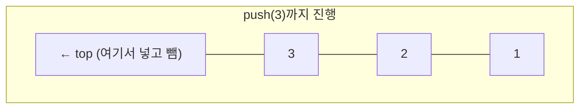
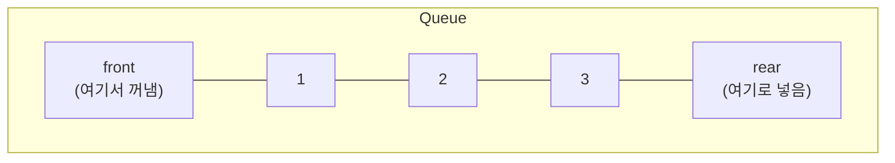

#CS #DataStructures #면접

관련: [[자료구조]] · [[힙과 우선순위 큐]]

## 목차
- [[#스택(Stack) — 접시 쌓기]]
- [[#스택은 어디에 쓰일까?]]
- [[#큐(Queue) — 줄서기]]
- [[#큐는 어디에 쓰일까?]]
- [[#스택 vs 큐]]
- [[#덱(Deque) — 양쪽 다 되는 자료구조]]
- [[#Java에서 스택과 큐 구현하기]]
- [[#한 장 요약]]
- [[#Q&A로 복습하기]]

---

## 스택(Stack) — 접시 쌓기

식당에서 씻은 접시를 쌓아둔다고 생각해보세요. 접시는 **위에서부터 넣고, 위에서부터 꺼내요.** 맨 아래에 깔린 접시를 쓰려면 위에 있는 접시를 다 치워야 해요.

**스택(Stack)** 은 바로 이 방식으로 동작하는 자료구조예요 — **마지막에 넣은 게 가장 먼저 나오는 LIFO(Last In First Out)** 구조예요.



```java
Deque<Integer> stack = new ArrayDeque<>(); // Java에서는 Deque로 스택을 구현하는 게 권장됨
stack.push(1);
stack.push(2);
stack.push(3);

System.out.println(stack.pop()); // 3 (마지막에 넣은 게 먼저 나옴)
System.out.println(stack.pop()); // 2
System.out.println(stack.pop()); // 1
```

핵심 연산은 딱 두 개예요.
- **push**: 맨 위에 데이터를 추가
- **pop**: 맨 위의 데이터를 꺼내서 제거

두 연산 모두 **딱 한쪽 끝(top)에서만** 일어나서, 항상 **O(1)** 이에요.

---

## 스택은 어디에 쓰일까?

- **함수 호출 스택**: 메서드를 호출하면 그 정보가 스택에 쌓이고, 메서드가 끝나면 위에서부터 하나씩 빠져나가요. 재귀 호출이 너무 깊어지면 이 스택이 넘쳐서 `StackOverflowError`가 나요. ([[../Java/JVM|JVM]]의 런타임 데이터 영역 참고)
- **실행 취소(Undo)**: 작업 내역을 스택에 쌓아두고, Ctrl+Z를 누르면 맨 위(가장 최근 작업)부터 하나씩 되돌려요.
- **괄호 짝 검사**: `(`를 만나면 push, `)`를 만나면 pop해서, 최종적으로 스택이 비면 짝이 맞는 거예요.
- **브라우저 뒤로 가기**: 방문한 페이지를 스택에 쌓고, "뒤로 가기"를 누르면 가장 최근 페이지부터 꺼내요.

---

## 큐(Queue) — 줄서기

은행 창구 앞에 줄을 선다고 생각해보세요. **먼저 줄을 선 사람이 먼저 처리**되고, 새로 온 사람은 줄의 맨 뒤에 서요.

**큐(Queue)** 는 이 방식으로 동작해요 — **먼저 넣은 게 먼저 나오는 FIFO(First In First Out)** 구조예요.



```java
Queue<Integer> queue = new ArrayDeque<>();
queue.offer(1); // 뒤(rear)에 추가
queue.offer(2);
queue.offer(3);

System.out.println(queue.poll()); // 1 (먼저 넣은 게 먼저 나옴, front에서 꺼냄)
System.out.println(queue.poll()); // 2
```

핵심 연산은 이거예요.
- **offer(enqueue)**: 뒤(rear)에 데이터를 추가
- **poll(dequeue)**: 앞(front)의 데이터를 꺼내서 제거

**넣는 곳(rear)과 꺼내는 곳(front)이 서로 다른 끝**이라는 게 스택과의 결정적인 차이예요.

---

## 큐는 어디에 쓰일까?

- **프로세스/작업 스케줄링**: OS가 실행할 프로세스들을 큐에 넣고 순서대로 처리해요. ([[../Operating System/프로세스와 스레드|프로세스와 스레드]] 참고)
- **BFS(너비 우선 탐색)**: 그래프/트리를 "가까운 노드부터" 탐색할 때, 다음에 방문할 노드를 큐에 담아 순서대로 꺼내요.
- **메시지 큐**: 여러 서버 간에 작업을 순서대로 안전하게 전달할 때(Kafka, RabbitMQ 등).
- **프린터 대기열**: 인쇄 요청이 들어온 순서대로 처리해요.

---

## 스택 vs 큐

| 구분 | 스택(Stack) | 큐(Queue) |
|---|---|---|
| 처리 순서 | LIFO (마지막에 넣은 게 먼저 나옴) | FIFO (먼저 넣은 게 먼저 나옴) |
| 넣는 곳 / 꺼내는 곳 | 같은 쪽(top) | 다른 쪽(rear에 넣고 front에서 꺼냄) |
| 비유 | 접시 쌓기 | 줄서기 |
| 대표 활용 | 함수 호출, Undo, 괄호 검사, DFS | 작업 스케줄링, BFS, 메시지 큐 |

---

## 덱(Deque) — 양쪽 다 되는 자료구조

**덱(Deque, Double-Ended Queue)** 은 **양쪽 끝에서 모두 삽입/삭제가 가능한** 자료구조예요. 스택과 큐를 둘 다 구현할 수 있는 "만능" 도구라서, 실무에서도 흔히 스택과 큐 대신 덱을 바로 써요.

```java
Deque<Integer> deque = new ArrayDeque<>();
deque.addFirst(1); // 앞에 추가
deque.addLast(2);  // 뒤에 추가
deque.pollFirst();  // 앞에서 꺼냄
deque.pollLast();   // 뒤에서 꺼냄
```

---

## Java에서 스택과 큐 구현하기

Java에는 오래된 `Stack` 클래스가 있지만, **지금은 `ArrayDeque`를 쓰는 게 권장돼요.**

| 클래스 | 용도 | 비고 |
|---|---|---|
| `java.util.Stack` | 스택 | 레거시 클래스, `Vector`를 상속해서 불필요하게 동기화(느림). 지금은 비권장 |
| `ArrayDeque` | 스택 **or** 큐 | 배열 기반, 동기화 없이 빠름. 스택/큐 둘 다 이걸로 구현하는 게 표준 |
| `LinkedList` | 큐 (`Queue` 인터페이스 구현) | 노드 기반, 양 끝 삽입/삭제가 O(1) |

> `Stack`이 레거시로 취급되는 이유는 [[../Java/Java|Java]] 문서에서 다룬 `Hashtable`이 비권장인 이유와 똑같아요 — 옛날에 설계된 클래스가 불필요한 동기화 비용을 갖고 있기 때문이에요.

---

## 한 장 요약

| 질문 | 답 |
|---|---|
| 스택이란? | 마지막에 넣은 게 먼저 나오는 LIFO 구조, 한쪽 끝(top)에서만 삽입/삭제 |
| 큐란? | 먼저 넣은 게 먼저 나오는 FIFO 구조, 한쪽(rear)에 넣고 반대쪽(front)에서 꺼냄 |
| 스택의 대표 활용은? | 함수 호출 스택, Undo, 괄호 검사, DFS |
| 큐의 대표 활용은? | 작업 스케줄링, BFS, 메시지 큐 |
| 덱이란? | 양쪽 끝에서 모두 삽입/삭제 가능한 구조, 스택/큐를 다 구현할 수 있음 |
| Java에서 권장되는 구현체는? | `Stack` 클래스 대신 `ArrayDeque` |

---

## Q&A로 복습하기

### Q. 스택과 큐의 가장 근본적인 차이는?
A. 스택은 넣는 곳과 꺼내는 곳이 같은 쪽(top)이라 마지막에 넣은 게 먼저 나오는 LIFO이고, 큐는 넣는 곳(rear)과 꺼내는 곳(front)이 달라 먼저 넣은 게 먼저 나오는 FIFO다.

### Q. 재귀 호출이 너무 깊어지면 왜 StackOverflowError가 나나?
A. 메서드를 호출할 때마다 그 정보가 함수 호출 스택에 쌓이는데, 재귀가 끝나지 않고 계속 쌓이면 스택에 할당된 메모리 공간을 초과해서 에러가 발생한다.

### Q. BFS는 왜 큐를 사용하나?
A. BFS는 가까운 노드부터 순서대로 탐색해야 하는데, 먼저 발견한(큐에 먼저 넣은) 노드를 먼저 처리하는 FIFO 특성이 이 탐색 순서와 정확히 맞기 때문이다.

### Q. Java에서 스택과 큐를 구현할 때 무엇을 쓰는 게 권장되나?
A. 레거시 `Stack` 클래스 대신, 배열 기반이라 빠르고 동기화 오버헤드가 없는 `ArrayDeque`를 스택과 큐 모두에 쓰는 것이 권장된다.
