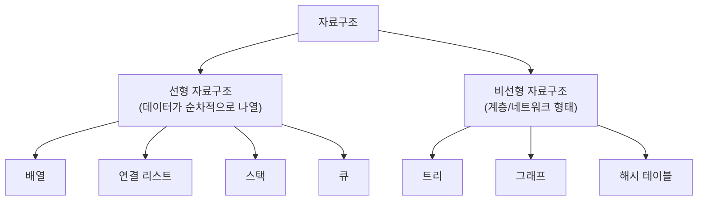
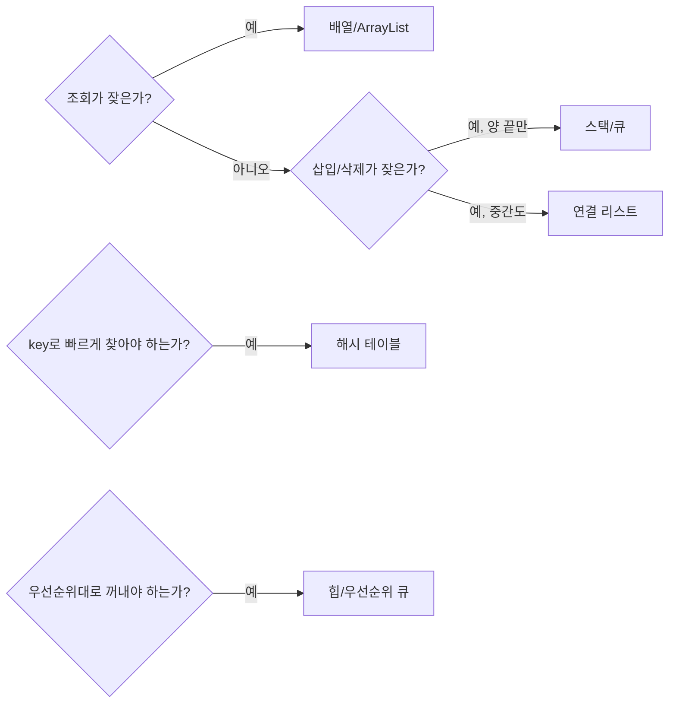

#CS #DataStructures #면접

관련: [[스택과 큐]] · [[힙과 우선순위 큐]] · [[그래프]]

자료구조 전반의 개념과 종류를 정리한 개관 문서예요. 각 자료구조의 자세한 내용은 별도 문서([[스택과 큐]], [[힙과 우선순위 큐]] 등)로 이어져요.

## 목차
- [[#자료구조란? — 데이터를 담는 "그릇"의 설계]]
- [[#왜 자료구조가 중요할까? — 같은 데이터, 다른 성능]]
- [[#선형 자료구조 vs 비선형 자료구조]]
- [[#자료구조 종류 한눈에 보기]]
- [[#어떤 자료구조를 골라야 할까?]]
- [[#한 장 요약]]
- [[#Q&A로 복습하기]]

---

## 자료구조란? — 데이터를 담는 "그릇"의 설계

같은 옷들이라도 **옷장에 걸어두느냐, 서랍에 개켜 넣느냐, 바닥에 쌓아두느냐**에 따라 "원하는 옷을 얼마나 빨리 찾을 수 있는지", "새 옷을 넣기 얼마나 쉬운지"가 완전히 달라져요. **자료구조(Data Structure)** 는 바로 이 "데이터를 어떤 방식으로 정리해서 담아둘까"에 대한 설계예요.

같은 데이터를 담더라도, **① 순서대로 데이터를 처리해야 하는지, ② 특정 값을 빨리 찾아야 하는지, ③ 데이터 사이의 관계(계층, 연결)를 표현해야 하는지**에 따라 알맞은 자료구조가 달라져요.

---

## 왜 자료구조가 중요할까? — 같은 데이터, 다른 성능

전화번호부에서 "김철수"를 찾는다고 해봐요.

- 이름이 **아무 순서 없이 뒤죽박죽 적힌 노트**라면, 처음부터 끝까지 다 훑어야 해요 (O(n)).
- 이름이 **가나다순으로 정렬**돼 있다면, 중간부터 시작해서 절반씩 좁혀가며 찾을 수 있어요 (O(log n)).
- 이름을 **해시로 변환해서 바로 위치를 계산**할 수 있다면, 거의 한 번에 찾아요 (O(1)).

**데이터 자체는 완전히 같은데, 어떻게 정리해뒀는지에 따라 "찾는 속도"가 하늘과 땅 차이**가 나요. [[../Java/Java|Java]] 문서에서 다룬 `ArrayList vs LinkedList`, `HashMap`의 성능 차이도 결국 이 "자료구조 설계"의 결과예요.

---

## 선형 자료구조 vs 비선형 자료구조

자료구조는 크게 **데이터가 한 줄로 이어지는지, 아니면 가지치기(계층/네트워크) 형태인지**로 나눌 수 있어요.

- **선형(Linear)**: 데이터가 앞에서 뒤로 **한 줄로** 이어져요. 배열, 연결 리스트, 스택, 큐가 여기 속해요.
- **비선형(Non-linear)**: 데이터가 **하나 이상의 다른 데이터와 연결**돼서 계층이나 네트워크 모양을 이뤄요. 트리(계층), 그래프(네트워크), 해시 테이블(키-값 매핑)이 여기 속해요.

---

## 자료구조 종류 한눈에 보기

| 자료구조 | 핵심 특징 | 자세한 내용 |
|---|---|---|
| **배열(Array)** | 인덱스로 즉시 접근(O(1)), 크기 고정, 중간 삽입/삭제 느림 | [[../Java/Java\|Java]]의 ArrayList vs LinkedList 참고 |
| **연결 리스트(Linked List)** | 노드가 다음 노드를 가리킴, 삽입/삭제 빠름, 순차 접근만 가능 | [[../Java/Java\|Java]]의 ArrayList vs LinkedList 참고 |
| **스택(Stack)** | 마지막에 넣은 게 먼저 나옴(LIFO) | [[스택과 큐]] |
| **큐(Queue)** | 먼저 넣은 게 먼저 나옴(FIFO) | [[스택과 큐]] |
| **트리(Tree)** | 계층 구조, 부모-자식 관계 | 힙도 트리의 일종 — [[힙과 우선순위 큐]] |
| **힙(Heap)** | 우선순위가 높은(낮은) 값을 빠르게 꺼내는 특수한 트리 | [[힙과 우선순위 큐]] |
| **그래프(Graph)** | 노드와 노드 사이를 자유롭게 연결(양방향/순환 가능) | [[그래프]] |
| **해시 테이블(Hash Table)** | key로 값의 위치를 계산해 평균 O(1) 조회 | [[../Java/Java\|Java]]의 HashMap 내부 구조 참고 |

> 트리는 "계층 구조"라는 큰 카테고리이고, 힙은 그 안에서도 "부모-자식 크기 순서" 규칙을 지키는 특수한 트리예요. ([[힙과 우선순위 큐]] 참고)

---

## 어떤 자료구조를 골라야 할까?

정답은 하나가 아니라, **"어떤 연산을 얼마나 자주 하느냐"** 에 달려 있어요.

이 선택 기준 자체가 실무·면접에서 자주 나오는 질문이에요 — "이 상황엔 어떤 자료구조가 적합한가?"라는 질문은 결국 **"이 상황에서 어떤 연산이 병목이 될까?"** 를 묻는 거예요.

---

## 한 장 요약

| 질문 | 답 |
|---|---|
| 자료구조란? | 데이터를 어떤 방식으로 정리해서 담을지에 대한 설계 |
| 자료구조가 중요한 이유는? | 같은 데이터라도 정리 방식에 따라 조회/삽입/삭제 속도가 크게 달라짐 |
| 선형 vs 비선형의 차이는? | 선형은 데이터가 한 줄로 나열(배열, 리스트, 스택, 큐), 비선형은 계층/네트워크 형태(트리, 그래프, 해시) |
| 자료구조 선택 기준은? | 조회/삽입삭제/우선순위 처리 중 어떤 연산이 잦은지에 따라 결정 |

---

## Q&A로 복습하기

### Q. 자료구조가 성능에 영향을 주는 이유를 예로 설명하면?
A. 같은 데이터라도 정렬 안 된 목록에서 찾으면 O(n), 정렬된 배열에서 이진 탐색하면 O(log n), 해시 테이블로 찾으면 평균 O(1)이 걸리는 것처럼, 데이터를 어떻게 정리해뒀는지가 연산 속도를 크게 좌우하기 때문이다.

### Q. 선형 자료구조와 비선형 자료구조의 차이는?
A. 선형 자료구조는 배열, 연결 리스트, 스택, 큐처럼 데이터가 한 줄로 순차적으로 나열되는 반면, 비선형 자료구조는 트리, 그래프, 해시 테이블처럼 데이터가 계층이나 네트워크 형태로 연결된다.

### Q. 자료구조를 선택할 때 무엇을 기준으로 판단해야 하나?
A. "어떤 연산이 가장 자주 일어나는가"를 기준으로 판단한다. 조회가 잦으면 배열, 삽입/삭제가 잦으면 연결 리스트나 스택/큐, key로 빠르게 찾아야 하면 해시 테이블, 우선순위대로 꺼내야 하면 힙을 고려한다.
