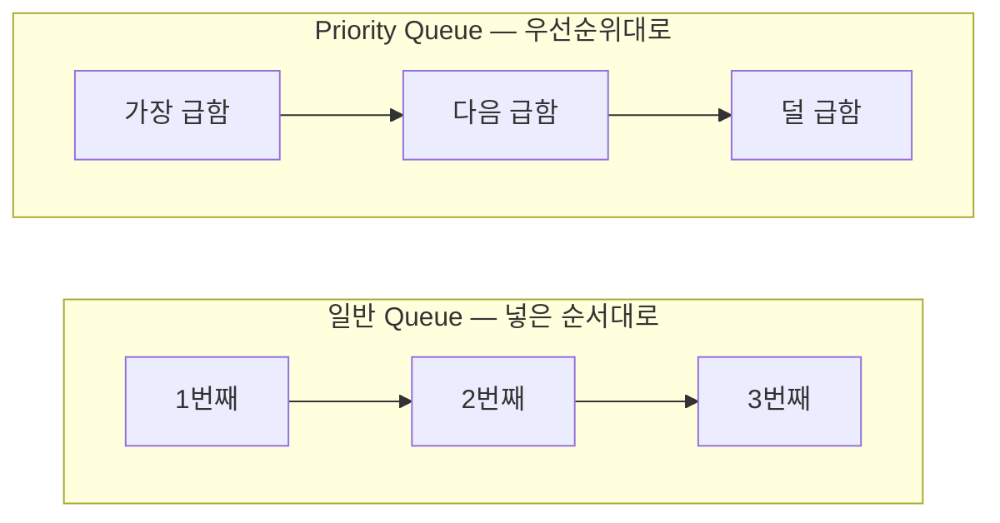
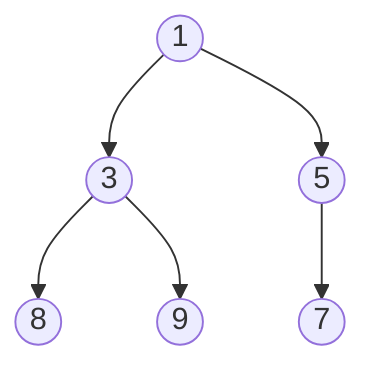
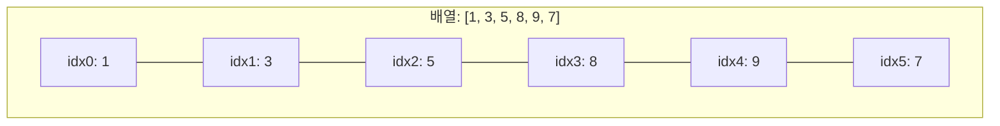
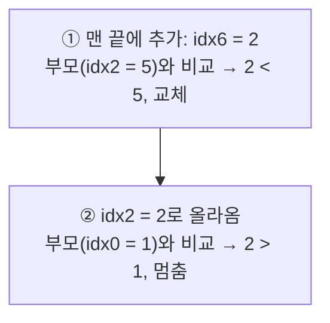

#CS #DataStructures #면접

관련: [[자료구조]] · [[스택과 큐]] · [[../Algorithms/탐욕법|탐욕법]]

## 목차
- [[#우선순위 큐란? — 응급실 대기열]]
- [[#힙(Heap) — 우선순위 큐를 빠르게 구현하는 방법]]
- [[#배열로 힙을 표현하기]]
- [[#삽입(Insert) — 끝에 넣고 위로 올려보내기]]
- [[#삭제(Extract) — 루트를 꺼내고 아래로 내려보내기]]
- [[#시간복잡도]]
- [[#Java의 PriorityQueue]]
- [[#실전에서는 어디에 쓰일까?]]
- [[#한 장 요약]]
- [[#Q&A로 복습하기]]

---

## 우선순위 큐란? — 응급실 대기열

일반 큐(Queue)는 "먼저 들어온 게 먼저 나가는" FIFO 구조예요. 하지만 응급실을 생각해보면, 먼저 왔어도 상태가 위급한 환자가 있으면 **그 사람부터** 처리해요.

**우선순위 큐(Priority Queue)** 는 바로 이런 자료구조예요 — **넣은 순서가 아니라, 정해진 "우선순위"가 가장 높은(혹은 낮은) 것부터 꺼내지는** 구조예요.



---

## 힙(Heap) — 우선순위 큐를 빠르게 구현하는 방법

우선순위 큐를 만드는 가장 단순한 방법은 "매번 정렬된 배열을 유지하는 것"이지만, 새 원소가 들어올 때마다 배열 전체를 다시 정렬하면 느려요. 그래서 실제로는 **힙(Heap)** 이라는 트리 구조를 써요.

힙은 **"부모가 항상 자식보다 작다(또는 크다)"** 는 규칙만 지키는 특수한 이진 트리예요. **완전히 정렬돼 있지는 않지만, "가장 작은(또는 큰) 값이 무엇인지"는 항상 루트에서 즉시 알 수 있어요.**

- **최소 힙(Min-Heap)**: 부모 ≤ 자식. 루트가 항상 가장 작은 값.
- **최대 힙(Max-Heap)**: 부모 ≥ 자식. 루트가 항상 가장 큰 값.



이 트리를 보면 부모-자식 관계(1<3, 1<5, 3<8, 3<9, 5<7)는 다 지켜지지만, **형제 노드끼리는 순서가 없어요**(8과 5 중 뭐가 더 큰지는 규칙에 없음). 이렇게 **"완벽한 정렬"을 포기하는 대신, 최솟값(또는 최댓값)만 빠르게 꺼낼 수 있게** 설계한 게 힙의 핵심 아이디어예요.

---

## 배열로 힙을 표현하기

힙은 흔히 "트리"로 그리지만, 실제로는 **배열 하나로 구현**돼요. 트리가 빈틈없이 위에서부터 차곡차곡 채워지는 **완전 이진 트리** 형태이기 때문에, 부모-자식 관계를 인덱스 계산만으로 알 수 있거든요.



- 인덱스 `i`의 **왼쪽 자식** = `2i + 1`, **오른쪽 자식** = `2i + 2`
- 인덱스 `i`의 **부모** = `(i - 1) / 2`

포인터로 노드를 연결할 필요 없이 **산수 계산만으로 부모/자식을 찾을 수 있어서**, 배열 기반 구현이 훨씬 간단하고 빨라요.

---

## 삽입(Insert) — 끝에 넣고 위로 올려보내기

새 값은 일단 **배열의 맨 끝(트리의 가장 아래 빈자리)** 에 넣어요. 그다음 **부모와 비교해가며, 규칙이 깨지면 계속 자리를 바꿔 위로 올려보내요.** 이 과정을 **Sift-up(위로 올리기)** 이라고 해요.

```java
void insert(int[] heap, int size, int value) {
    heap[size] = value; // 일단 맨 끝에 추가
    int i = size;
    while (i > 0) {
        int parent = (i - 1) / 2;
        if (heap[parent] <= heap[i]) break; // 규칙 지켜지면 멈춤
        swap(heap, i, parent); // 부모보다 작으면 자리를 바꿈
        i = parent;
    }
}
```

**예시**: `[1, 3, 5, 8, 9, 7]`에 `2`를 삽입한다고 해봐요.



최악의 경우 트리의 높이(`log n`)만큼만 비교하면 되니까, 삽입은 **O(log n)** 이에요.

---

## 삭제(Extract) — 루트를 꺼내고 아래로 내려보내기

우선순위 큐에서 값을 꺼낸다는 건 **항상 루트(최솟값 또는 최댓값)를 꺼낸다**는 뜻이에요. 루트를 빼고 나면 트리에 빈자리가 생기는데, 이걸 다시 완전 이진 트리 모양으로 메워야 해요.

**방법**: **배열의 맨 마지막 값을 루트 자리로 옮긴 뒤**, 자식들과 비교하며 규칙이 깨지면 계속 자리를 바꿔 아래로 내려보내요. 이 과정을 **Sift-down(아래로 내리기)** 이라고 해요.

```java
int extractMin(int[] heap, int size) {
    int min = heap[0];          // 루트(최솟값) 기억
    heap[0] = heap[size - 1];   // 맨 끝 값을 루트로 옮김
    size--;
    int i = 0;
    while (true) {
        int left = 2*i + 1, right = 2*i + 2, smallest = i;
        if (left < size && heap[left] < heap[smallest]) smallest = left;
        if (right < size && heap[right] < heap[smallest]) smallest = right;
        if (smallest == i) break; // 규칙 지켜지면 멈춤
        swap(heap, i, smallest); // 더 작은 자식과 자리를 바꿈
        i = smallest;
    }
    return min;
}
```

삭제도 마찬가지로 트리 높이만큼만 이동하니 **O(log n)** 이에요.

---

## 시간복잡도

| 연산 | 정렬된 배열 유지 | 힙(Heap) |
|---|---|---|
| 최솟값 확인 (`peek`) | O(1) | O(1) |
| 삽입 (`insert`) | O(n) (정렬 위치 찾아 삽입) | **O(log n)** |
| 최솟값 삭제 (`extractMin`) | O(n) (삭제 후 당김) | **O(log n)** |

"정렬은 포기하되, 최솟값 확인과 삽입/삭제만큼은 빠르게"라는 힙의 트레이드오프가 왜 우선순위 큐에 딱 맞는지 알 수 있어요.

---

## Java의 PriorityQueue

Java는 이 힙 구현을 `java.util.PriorityQueue`로 이미 제공해요. 기본은 **최소 힙**이에요.

```java
PriorityQueue<Integer> pq = new PriorityQueue<>();
pq.offer(5);
pq.offer(1);
pq.offer(3);

System.out.println(pq.poll()); // 1 (가장 작은 값부터, 넣은 순서 아님)
System.out.println(pq.poll()); // 3
System.out.println(pq.poll()); // 5
```

큰 값이 먼저 나오는 **최대 힙**으로 쓰고 싶으면 `Comparator`를 뒤집어주면 돼요.

```java
PriorityQueue<Integer> maxHeap = new PriorityQueue<>(Comparator.reverseOrder());
```

> ⚠️ `PriorityQueue`는 스레드 안전하지 않아요. 여러 스레드가 동시에 접근해야 한다면 `PriorityBlockingQueue`를 써야 해요. ([[../Java/동시성|동시성]] 참고)

---

## 실전에서는 어디에 쓰일까?

- **다익스트라 최단 경로 알고리즘**: "지금까지 발견한 노드 중 가장 가까운 노드"를 매번 꺼내야 하는데, 이걸 우선순위 큐로 처리해요.
- **상위 K개 찾기(Top-K)**: 크기 K짜리 힙만 유지하면서, 데이터를 하나씩 훑으며 필요 없는 값은 버려서 전체 정렬 없이도 상위 K개를 빠르게 구할 수 있어요.
- **힙 정렬(Heap Sort)**: 모든 값을 힙에 넣고 하나씩 꺼내면 정렬된 순서로 나와요 — O(n log n) 정렬 알고리즘의 하나예요.
- **작업 스케줄링**: 우선순위가 높은 작업부터 처리해야 하는 큐 시스템.

---

## 한 장 요약

| 질문 | 답 |
|---|---|
| 우선순위 큐란? | 넣은 순서가 아니라 우선순위가 높은(혹은 낮은) 것부터 꺼내는 자료구조 |
| 힙이란? | 부모-자식 간 크기 순서만 지키는 완전 이진 트리, 루트가 항상 최솟값(또는 최댓값) |
| 힙을 배열로 표현하는 방법은? | 인덱스 i의 자식은 2i+1, 2i+2, 부모는 (i-1)/2 |
| 삽입 방식은? | 맨 끝에 추가 후 부모와 비교하며 위로 올림(Sift-up), O(log n) |
| 삭제 방식은? | 맨 끝 값을 루트로 옮긴 뒤 자식과 비교하며 아래로 내림(Sift-down), O(log n) |
| Java의 기본 PriorityQueue는? | 최소 힙 (작은 값이 먼저 나옴), Comparator로 최대 힙으로 바꿀 수 있음 |

---

## Q&A로 복습하기

### Q. 힙이 "완전히 정렬되지 않았는데도" 최솟값을 바로 알 수 있는 이유는?
A. 힙은 부모가 항상 자식보다 작다(최소 힙 기준)는 규칙만 지키기 때문에, 형제 노드 간 순서는 정해지지 않아도 루트에는 항상 전체에서 가장 작은 값이 위치한다.

### Q. 힙에서 인덱스 i의 부모와 자식 인덱스는 어떻게 계산하나?
A. 왼쪽 자식은 2i+1, 오른쪽 자식은 2i+2, 부모는 (i-1)/2로 계산한다. 완전 이진 트리라서 포인터 없이 배열 인덱스 계산만으로 관계를 알 수 있다.

### Q. 힙에 값을 삽입할 때 왜 O(log n)인가?
A. 새 값을 배열 맨 끝에 추가한 뒤, 부모와 비교하며 규칙이 깨질 때만 자리를 바꿔 위로 올라간다. 최악의 경우에도 트리의 높이(log n)만큼만 비교하면 되기 때문이다.

### Q. 힙에서 값을 삭제(extractMin)할 때 왜 맨 끝 값을 루트로 옮기나?
A. 루트를 그냥 비워두면 완전 이진 트리 모양이 깨지기 때문에, 맨 끝(트리의 마지막 빈자리) 값을 루트로 옮겨 트리 모양을 유지한 뒤, 자식과 비교하며 아래로 내려보내 힙 규칙을 다시 맞춘다.

### Q. Java PriorityQueue의 기본 동작과, 최대 힙으로 바꾸는 방법은?
A. 기본은 작은 값이 먼저 나오는 최소 힙이다. `new PriorityQueue<>(Comparator.reverseOrder())`처럼 Comparator를 반대로 넘기면 큰 값이 먼저 나오는 최대 힙으로 동작시킬 수 있다.
