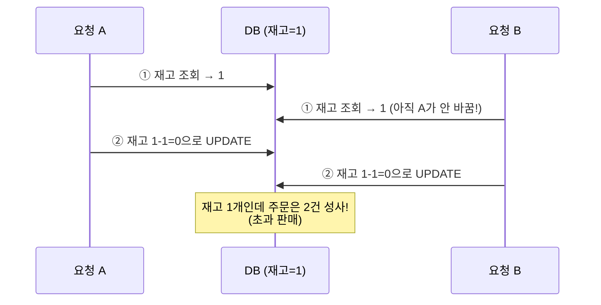
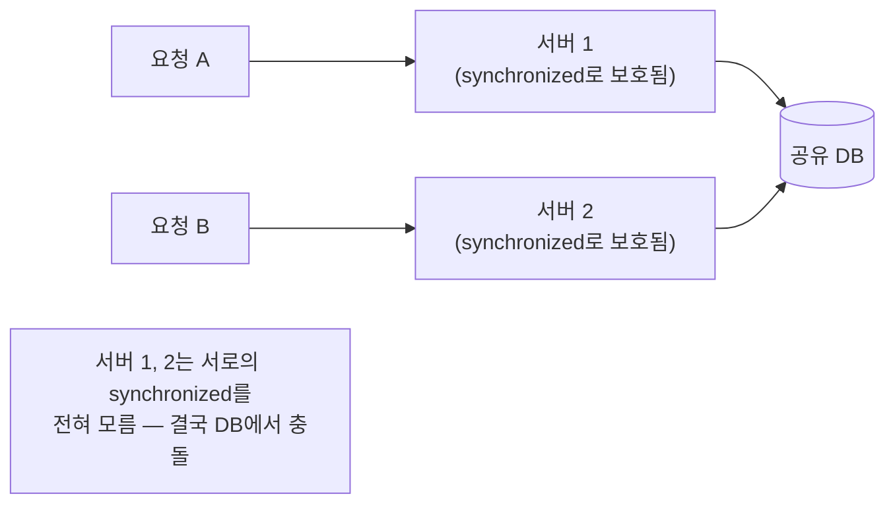
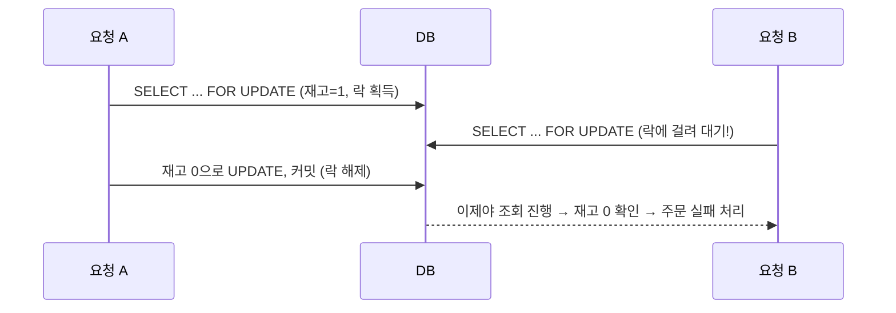
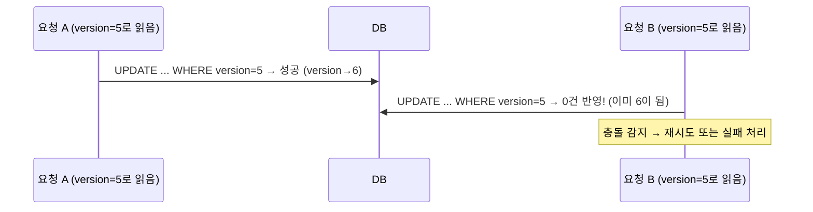

#CS #Database #면접

관련: [[트랜잭션]] · [[../Java/동시성|동시성]] · [[../Java/Redis 클라이언트|Redis 클라이언트]]

## 목차
- [[#동시성 이슈란? — 재고 1개, 주문 2건]]
- [[#왜 애플리케이션 레벨 동기화만으로는 부족할까?]]
- [[#해결책 1 — 비관적 락(Pessimistic Lock)]]
- [[#해결책 2 — 낙관적 락(Optimistic Lock)]]
- [[#해결책 3 — DB 원자적 연산으로 애초에 분리하지 않기]]
- [[#해결책 4 — 분산 락(Distributed Lock)]]
- [[#어떤 방법을 언제 써야 할까?]]
- [[#한 장 요약]]
- [[#Q&A로 복습하기]]

---

## 동시성 이슈란? — 재고 1개, 주문 2건

한정판 상품이 **재고 딱 1개** 남았어요. 그런데 사용자 A와 B가 **거의 동시에** 주문 버튼을 눌렀어요. 서버 코드가 이렇게 짜여 있다면 어떻게 될까요?

```java
void order(Long productId) {
    int stock = productRepository.findStock(productId); // ① 재고 조회
    if (stock > 0) {
        productRepository.updateStock(productId, stock - 1); // ② 재고 차감
    } else {
        throw new SoldOutException();
    }
}
```

문제는 **①과 ②가 하나의 원자적인 동작이 아니라는 것**이에요. A와 B의 요청이 아주 살짝의 시간 차이로 겹치면 이런 일이 벌어져요.



**둘 다 "재고가 1개 있다"고 확인한 시점이 겹쳐버려서, 둘 다 주문에 성공해요.** 결과적으로 재고 1개짜리 상품을 2개 팔아버리는 사고가 나요. [[../Java/동시성|동시성]] 문서에서 다룬 **Race Condition**이 여기서는 "재고 초과 판매"라는 구체적인 비즈니스 사고로 나타난 거예요.

---

## 왜 애플리케이션 레벨 동기화만으로는 부족할까?

"그럼 `synchronized`로 막으면 되지 않나?"라고 생각할 수 있어요.

```java
synchronized void order(Long productId) { // 한 JVM 안에서는 동시 진입을 막아줌
    // ...
}
```

**한 대의 서버(하나의 JVM)만 운영한다면 이 방법도 통해요.** 하지만 실무의 백엔드 서버는 보통 **여러 대(여러 인스턴스)** 로 띄워서 트래픽을 분산해요. `synchronized`는 **딱 그 JVM 안에서만** 유효한 잠금이라서, 서버가 2대라면 각 서버가 각자 자기 안에서만 순서를 지킬 뿐, **서로 다른 서버의 요청끼리는 여전히 동시에 DB를 건드릴 수 있어요.**



**결론: 여러 서버가 공유하는 자원(DB의 재고 데이터)을 지키려면, 잠금도 그 공유 지점(DB)에서 걸어야 해요.** 그래서 이런 문제는 보통 **DB 레벨의 락**으로 해결해요.

---

## 해결책 1 — 비관적 락(Pessimistic Lock)

**"높은 확률로 충돌이 날 것"이라고 비관적으로 가정**하고, 데이터를 읽는 순간부터 아예 잠가버리는 방식이에요. SQL의 `SELECT ... FOR UPDATE`가 대표적이에요.

```sql
-- 이 row를 다른 트랜잭션이 못 건드리게 잠그면서 조회
SELECT stock FROM product WHERE id = 1 FOR UPDATE;
```

```java
@Lock(LockModeType.PESSIMISTIC_WRITE) // JPA에서는 이렇게 표현
@Query("SELECT p FROM Product p WHERE p.id = :id")
Product findByIdForUpdate(@Param("id") Long id);
```



**요청 B는 A의 트랜잭션이 끝날 때까지 그냥 기다려요.** 확실하게 안전하지만, **대기 시간이 발생**하고, 여러 자원에 락을 거는 순서가 꼬이면 [[../Java/동시성|동시성]] 문서에서 다룬 **데드락**이 생길 수도 있어요.

---

## 해결책 2 — 낙관적 락(Optimistic Lock)

**"충돌은 어쩌다 한 번씩만 날 것"이라고 낙관적으로 가정**하고, 평소엔 락 없이 진행하다가 **저장하는 순간에만 충돌 여부를 확인**하는 방식이에요. 보통 `version`이라는 컬럼을 하나 둬요.

```java
@Entity
class Product {
    @Id Long id;
    int stock;
    @Version // 이 row가 수정될 때마다 자동으로 1씩 증가
    int version;
}
```

내부적으로는 이런 SQL이 실행돼요.

```sql
UPDATE product SET stock = 0, version = 6
WHERE id = 1 AND version = 5; -- 내가 읽었던 버전이 아직 그대로인지 확인
```

**만약 그 사이에 다른 요청이 먼저 업데이트해서 version이 이미 6이 되어버렸다면, 이 UPDATE는 0건 반영되고 실패해요.** 그럼 애플리케이션에서 이 실패를 감지해서 **재시도**하거나 사용자에게 에러를 보여줘요.



**평소엔 락으로 대기시키지 않아 성능이 좋지만**, 충돌이 잦은 상황(방금 본 "재고 1개, 주문 폭주" 같은 경우)에서는 **재시도가 계속 실패하며 반복될 수 있어** 오히려 비효율적일 수 있어요.

---

## 해결책 3 — DB 원자적 연산으로 애초에 분리하지 않기

사실 가장 간단하고 효율적인 해결책은 **"조회 → 확인 → 수정"을 나누지 않고, DB의 원자적인 한 번의 연산으로 합쳐버리는 것**이에요.

```sql
UPDATE product SET stock = stock - 1
WHERE id = 1 AND stock > 0; -- 조회와 조건 확인, 수정이 DB 안에서 원자적으로 처리됨
```

이 SQL 한 줄은 **"현재 재고가 얼마인지 확인하고, 0보다 크면 1을 깎는다"** 는 로직을 DB 엔진 내부에서 **한 번의 원자적 연산**으로 처리해요. 두 요청이 동시에 들어와도, DB가 내부적으로 순서를 매겨 처리하기 때문에 **재고가 음수로 내려가거나 초과 판매될 수 없어요.**

```java
int updatedRows = productRepository.decreaseStock(productId); // affected rows 반환
if (updatedRows == 0) {
    throw new SoldOutException(); // 조건(stock > 0)에 안 맞아서 아무것도 안 바뀜 = 품절
}
```

**별도의 락 개념을 도입하지 않고도 문제를 해결**할 수 있어서, 가능하다면 가장 먼저 고려해볼 만한 방법이에요.

---

## 해결책 4 — 분산 락(Distributed Lock)

문제가 단순한 숫자 하나 증감이 아니라, **여러 테이블에 걸친 복잡한 로직**(예: "재고 확인 + 쿠폰 사용 + 포인트 차감을 하나의 원자적 단위로 묶어야 함")이라면, DB의 단순 원자적 연산만으로는 해결이 안 될 수 있어요. 이럴 땐 **여러 서버가 공유하는 외부 저장소(Redis 등)를 이용한 분산 락**을 써요.

```java
// Redisson 같은 라이브러리로 분산 락을 거는 예시 (개념 코드)
RLock lock = redissonClient.getLock("product:lock:" + productId);
try {
    lock.lock(); // 다른 서버의 요청도 이 락이 풀릴 때까지 대기
    // 재고 확인 + 쿠폰 사용 + 포인트 차감을 하나의 단위로 처리
} finally {
    lock.unlock();
}
```

`synchronized`가 "한 JVM 안에서의 잠금"이었다면, 분산 락은 **"여러 서버가 공유하는 외부 저장소를 이용한, 서버를 넘나드는 잠금"** 이라고 볼 수 있어요. Redisson을 비롯한 Redis 클라이언트 라이브러리 간의 차이는 [[../Java/Redis 클라이언트|Redis 클라이언트]]에서 다뤄요.

---

## 어떤 방법을 언제 써야 할까?

| 방법 | 언제 쓰나 | 트레이드오프 |
|---|---|---|
| **DB 원자적 연산** | 단순 증감처럼 로직이 간단할 때 | 가장 간단하고 빠름, 복잡한 로직엔 못 씀 |
| **비관적 락** | 충돌이 자주 날 것으로 예상될 때 (인기 상품 재고 등) | 확실하지만 대기 발생, 데드락 위험 |
| **낙관적 락** | 충돌이 드물게 날 것으로 예상될 때 | 평소엔 빠르지만, 충돌 잦으면 재시도 비용 커짐 |
| **분산 락** | 여러 서버 + 여러 자원을 아우르는 복잡한 로직일 때 | 유연하지만 별도 인프라(Redis 등) 필요, 구현 복잡 |

> 참고로 [[트랜잭션]] 문서에서 다룬 **격리 수준(Isolation Level)** 을 `SERIALIZABLE`처럼 아주 엄격하게 올리면 이론적으로 이런 문제를 막을 수도 있지만, **모든 트랜잭션의 동시 실행을 크게 제한**해서 성능에 미치는 영향이 훨씬 커요. 그래서 실무에서는 격리 수준을 통째로 올리기보다, 위에서 본 것처럼 **문제가 되는 부분에만 정밀하게 락을 적용**하는 방식을 선호해요.

---

## 한 장 요약

| 질문 | 답 |
|---|---|
| 동시성 이슈란? | 여러 요청이 공유 데이터를 동시에 읽고 쓰면서 예상과 다른 결과(초과 판매 등)가 발생하는 문제 |
| synchronized로 부족한 이유는? | 서버가 여러 대면 각 JVM 안에서만 유효해, 서버 간 충돌은 못 막음 |
| 비관적 락이란? | 충돌을 가정하고 데이터를 읽는 순간부터 잠가서, 다른 요청을 대기시킴 |
| 낙관적 락이란? | 평소엔 락 없이 진행하다 저장 시점에 version으로 충돌을 감지해 재시도 |
| DB 원자적 연산이란? | 조회-확인-수정을 SQL 한 줄의 원자적 연산으로 합쳐 애초에 문제를 없앰 |
| 분산 락이란? | Redis 등 외부 저장소로 여러 서버에 걸친 잠금을 구현하는 방식 |

---

## Q&A로 복습하기

### Q. 재고 차감 로직에서 동시성 이슈가 생기는 근본 원인은?
A. "재고 조회"와 "재고 차감"이 하나의 원자적 동작이 아니라 분리되어 있어서, 두 요청이 모두 재고가 남아있다고 확인한 시점이 겹치면 실제로는 초과 판매가 발생할 수 있기 때문이다.

### Q. 서버가 여러 대일 때 synchronized만으로 재고 문제를 막을 수 없는 이유는?
A. synchronized는 하나의 JVM 안에서만 유효한 잠금이라서, 서버가 여러 대면 각 서버는 자기 안에서만 순서를 지킬 뿐 서로 다른 서버의 요청끼리는 동시에 DB를 건드릴 수 있기 때문이다.

### Q. 비관적 락과 낙관적 락의 핵심 차이는?
A. 비관적 락은 충돌이 자주 날 것을 가정해 데이터를 읽는 순간부터 잠그고 다른 요청을 대기시키는 반면, 낙관적 락은 평소엔 락 없이 진행하다가 저장하는 시점에 version 컬럼으로 충돌 여부만 확인하고, 충돌 시 재시도한다.

### Q. 왜 "SELECT로 조회 후 UPDATE"보다 "UPDATE ... WHERE stock > 0" 한 줄이 더 안전한가?
A. 조회와 조건 확인, 수정을 DB 내부의 원자적 연산 하나로 합치기 때문에, 두 요청이 동시에 들어와도 DB가 순서를 매겨 처리해 재고가 음수가 되거나 초과 판매되는 상황 자체가 발생할 수 없다.

### Q. 격리 수준을 SERIALIZABLE로 올려서 동시성 이슈를 막지 않는 이유는?
A. 이론적으로는 막을 수 있지만 모든 트랜잭션의 동시 실행을 크게 제한해 성능에 미치는 영향이 크기 때문에, 실무에서는 문제가 되는 부분에만 정밀하게 락을 적용하는 방식을 더 선호한다.
