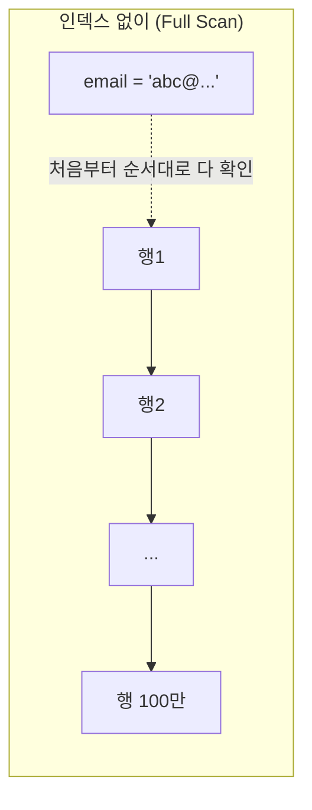
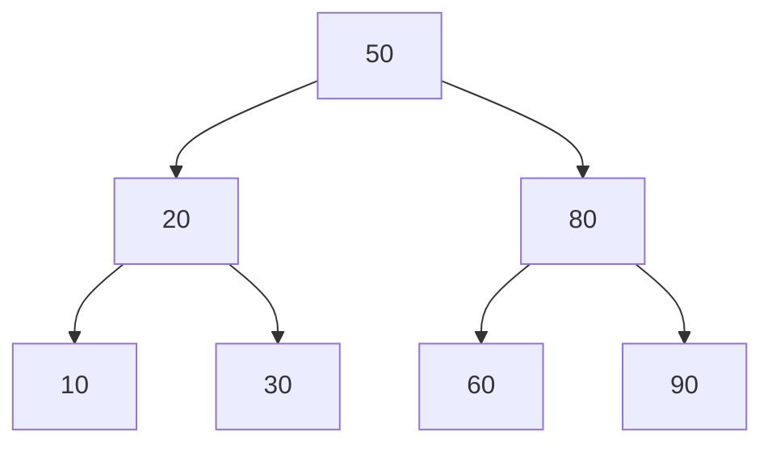
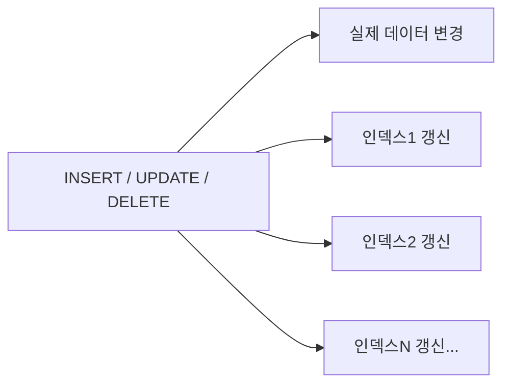
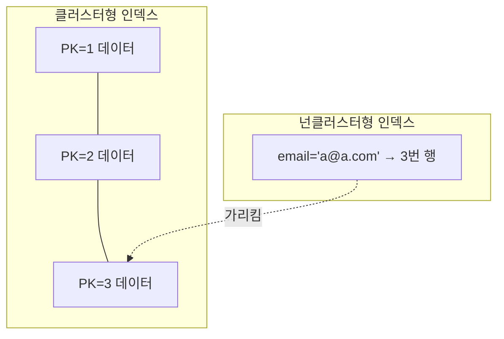

#CS #Database #면접

관련: [[트랜잭션]]

## 목차
- [[#인덱스가 없다면?]]
- [[#인덱스는 내부적으로 어떻게 생겼을까? (B-Tree)]]
- [[#그럼 인덱스는 무조건 다 걸면 좋은 거 아니야?]]
- [[#클러스터형 인덱스 vs 넌클러스터형 인덱스]]
- [[#인덱스를 만들어도 안 타는 경우 (주의!)]]
- [[#복합 인덱스와 커버링 인덱스 (살짝 심화)]]
- [[#한 장 요약]]
- [[#Q&A로 복습하기]]

---

## 인덱스가 없다면?

두꺼운 전공 서적에서 "포인터"라는 단어가 몇 페이지에 나오는지 찾는다고 해봐요. 색인(찾아보기)이 없다면 첫 페이지부터 끝까지 한 장 한 장 넘겨봐야 해요. 이게 바로 **인덱스가 없는 테이블에서 데이터를 찾는 것**과 똑같아요 — DB는 원하는 행을 찾으려고 테이블 전체를 처음부터 끝까지 훑어봐요. 이걸 **풀 스캔(Full Scan)** 이라고 해요.

```sql
SELECT * FROM users WHERE email = 'abc@example.com';
```

`users` 테이블에 100만 건이 있다면, 인덱스가 없는 경우 최악의 경우 100만 건을 다 뒤져야 원하는 한 줄을 찾을 수 있어요.

**인덱스(Index)** 는 책의 색인처럼, **"이 값은 어디에 있다"는 걸 미리 정렬해서 별도로 만들어둔 자료구조**예요. 이게 있으면 DB는 전체를 뒤지지 않고, 색인만 보고 바로 원하는 위치로 점프할 수 있어요.



---

## 인덱스는 내부적으로 어떻게 생겼을까? (B-Tree)

대부분의 DB(MySQL InnoDB 등)는 인덱스를 **B-Tree(균형 트리)** 구조로 저장해요. 정렬된 상태로 트리 형태를 이루고 있어서, 원하는 값을 찾을 때 트리를 타고 내려가기만 하면 돼요.



- 예를 들어 `35`를 찾는다면: `50`보다 작으니 왼쪽(`20`) → `20`보다 크니 오른쪽(`30`) → 여기서 탐색 종료. **전체 데이터를 다 안 봐도 몇 단계 만에 도달**할 수 있어요.
- 데이터가 100만 건이어도, 트리 구조 덕분에 대략 `log(100만) ≈ 20`번 정도의 비교만으로 원하는 값을 찾을 수 있어요. (풀 스캔은 최악의 경우 100만 번)

| 방식 | 시간 복잡도 (대략) |
|---|---|
| 인덱스 없이 (Full Scan) | O(n) |
| 인덱스 사용 (B-Tree) | O(log n) |

---

## 그럼 인덱스는 무조건 다 걸면 좋은 거 아니야?

아니에요! 인덱스는 **공짜가 아니에요.** 트레이드오프가 있어요.

> 비유: 책에 색인을 만들어두면 "포인터"를 찾긴 편해지지만, 책 내용에 새 문단 하나를 추가할 때마다 색인 페이지도 같이 고쳐야 해요. 색인이 10개면 10개 다 손봐야 하죠.



- **읽기(SELECT)는 빨라지지만, 쓰기(INSERT/UPDATE/DELETE)는 느려져요.** 데이터가 바뀔 때마다 그 데이터를 가리키는 인덱스 구조도 같이 갱신해야 하니까요.
- 인덱스 자체도 별도의 저장 공간을 차지해요.

그래서 **"조회는 자주 하지만 변경은 잘 안 하는 컬럼"** 위주로 인덱스를 걸어야 해요. 반대로 로그성 테이블처럼 INSERT가 끊임없이 몰리는 테이블에 인덱스를 무분별하게 많이 걸면 오히려 성능이 나빠질 수 있어요.

---

## 클러스터형 인덱스 vs 넌클러스터형 인덱스

- **클러스터형 인덱스 (Clustered Index)**: 실제 데이터 자체가 인덱스 순서대로 저장돼요. 책 자체가 이미 가나다순으로 정렬되어 있는 것과 비슷해요. 테이블당 **1개**만 가질 수 있어요 (보통 기본키(PK)가 자동으로 이 역할을 함).
- **넌클러스터형 인덱스 (Non-Clustered Index)**: 실제 데이터는 그대로 두고, **"이 값은 몇 번째 행에 있다"는 별도의 색인표**만 따로 만들어요. 책 맨 뒤에 있는 "찾아보기" 페이지처럼요. 테이블당 여러 개 만들 수 있어요.



---

## 인덱스를 만들어도 안 타는 경우 (주의!)

인덱스를 걸어놨는데 DB가 무시하고 풀 스캔을 해버리는 흔한 함정들이에요.

```sql
-- 1. 인덱스 컬럼에 함수/연산을 적용한 경우
SELECT * FROM users WHERE YEAR(created_at) = 2024; -- created_at에 인덱스가 있어도 못 씀

-- 2. LIKE 검색에서 %가 앞에 붙는 경우
SELECT * FROM users WHERE name LIKE '%길동'; -- 앞에 %가 있으면 인덱스 못 씀 (뒤에만 %인 '길동%'는 사용 가능)

-- 3. OR로 여러 조건을 연결했는데 일부 컬럼에 인덱스가 없는 경우
SELECT * FROM users WHERE email = 'a@a.com' OR phone = '010-1234'; -- phone에 인덱스가 없으면 email 인덱스도 못 씀

-- 4. 인덱스 컬럼의 타입과 다른 값으로 비교하는 경우 (암묵적 형변환)
SELECT * FROM users WHERE phone_number = 1234; -- phone_number가 문자열 컬럼이면 인덱스 못 탈 수 있음
```

**실제로 인덱스를 잘 타는지 확인하는 방법**: `EXPLAIN` 명령어로 쿼리 실행 계획을 확인해요.

```sql
EXPLAIN SELECT * FROM users WHERE email = 'abc@example.com';
```

---

## 복합 인덱스와 커버링 인덱스 (살짝 심화)

- **복합 인덱스(Composite Index)**: 컬럼 하나가 아니라 여러 컬럼을 묶어서 만든 인덱스. `(last_name, first_name)`처럼 순서가 중요해요 — 전화번호부가 "성"으로 먼저 정렬된 다음 "이름"으로 정렬된 것과 같아서, `first_name`만으로는 이 인덱스를 효율적으로 못 써요.
- **커버링 인덱스(Covering Index)**: 쿼리에 필요한 모든 컬럼이 인덱스 자체에 다 포함되어 있어서, **실제 데이터(테이블)까지 갈 필요 없이 인덱스만 보고 결과를 반환**할 수 있는 경우. 훨씬 빠릅니다.

---

## 한 장 요약

| 질문 | 답 |
|---|---|
| 인덱스가 하는 일? | 특정 컬럼 값으로 데이터를 빨리 찾을 수 있게 미리 정렬해둔 자료구조 |
| 내부 구조는? | 대부분 B-Tree (정렬된 균형 트리) |
| 장점 | 조회(SELECT) 속도 O(n) → O(log n)으로 개선 |
| 단점 | 데이터 변경(INSERT/UPDATE/DELETE) 시 인덱스도 같이 갱신해야 해서 느려짐, 저장 공간 추가 사용 |
| 클러스터형 인덱스 | 데이터 자체가 정렬됨, 테이블당 1개 (보통 PK) |
| 넌클러스터형 인덱스 | 별도 색인표만 존재, 테이블당 여러 개 가능 |
| 인덱스가 안 먹히는 흔한 경우 | 컬럼에 함수 적용, `LIKE '%값'`, OR 조건, 타입 불일치 |

---

## Q&A로 복습하기

### Q. 인덱스가 조회 속도를 빠르게 하는 원리는?
A. B-Tree처럼 정렬된 트리 구조로 값을 미리 저장해둬서, 전체 데이터를 다 뒤지지 않고(O(n)) 트리를 타고 내려가는 것만으로(O(log n)) 원하는 값을 찾을 수 있기 때문이다.

### Q. 인덱스를 걸면 왜 쓰기(INSERT/UPDATE/DELETE)가 느려지나?
A. 데이터가 바뀔 때마다 그 데이터를 가리키는 인덱스 구조도 함께 갱신해야 하기 때문이다.

### Q. 클러스터형 인덱스와 넌클러스터형 인덱스의 차이는?
A. 클러스터형은 실제 데이터 자체가 인덱스 순서대로 저장되고 테이블당 1개만 가능하지만(보통 PK), 넌클러스터형은 별도의 색인표만 만들고 테이블당 여러 개 가능하다.

### Q. 인덱스를 걸어도 안 타는 대표적인 경우는?
A. 인덱스 컬럼에 함수를 적용하거나(`YEAR(created_at)`), `LIKE '%값'`처럼 앞에 `%`가 붙거나, OR로 인덱스 없는 컬럼과 묶거나, 컬럼 타입과 다른 값으로 비교하는 경우다.

### Q. 쿼리가 인덱스를 잘 타는지 확인하려면?
A. `EXPLAIN` 명령어로 쿼리 실행 계획을 확인하면 된다.
