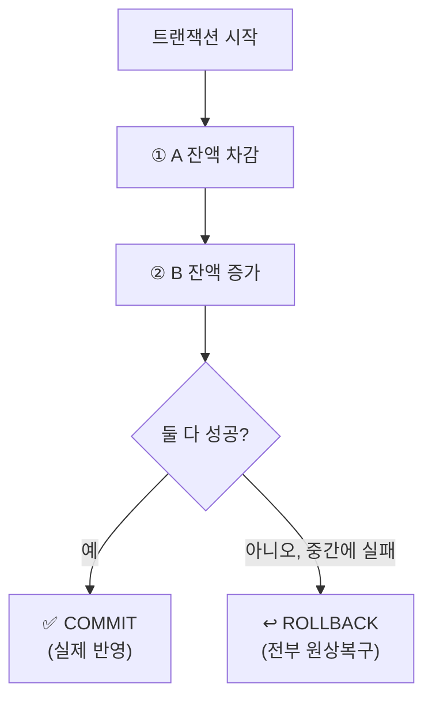
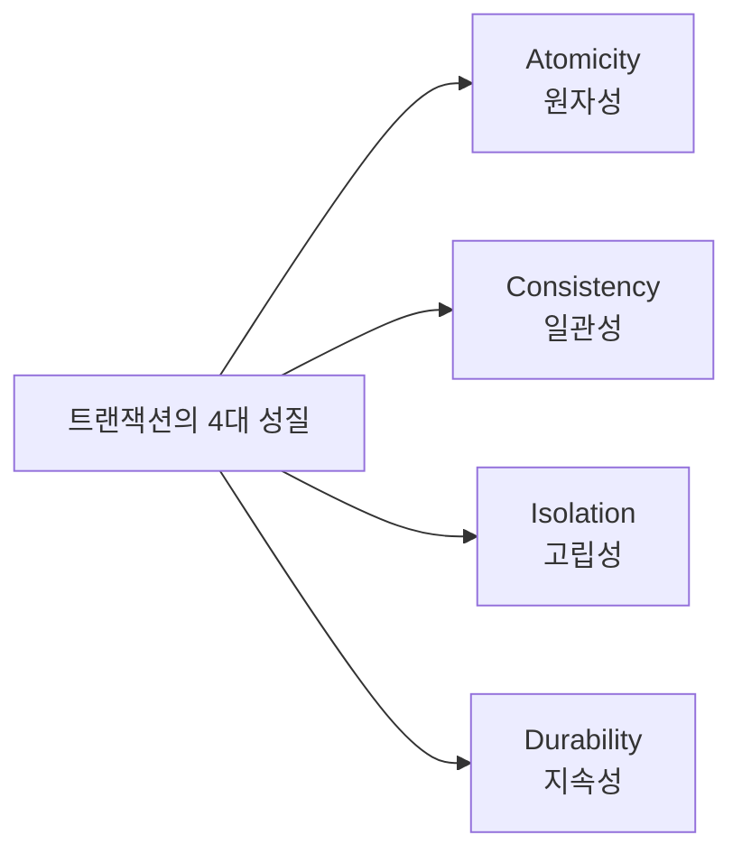
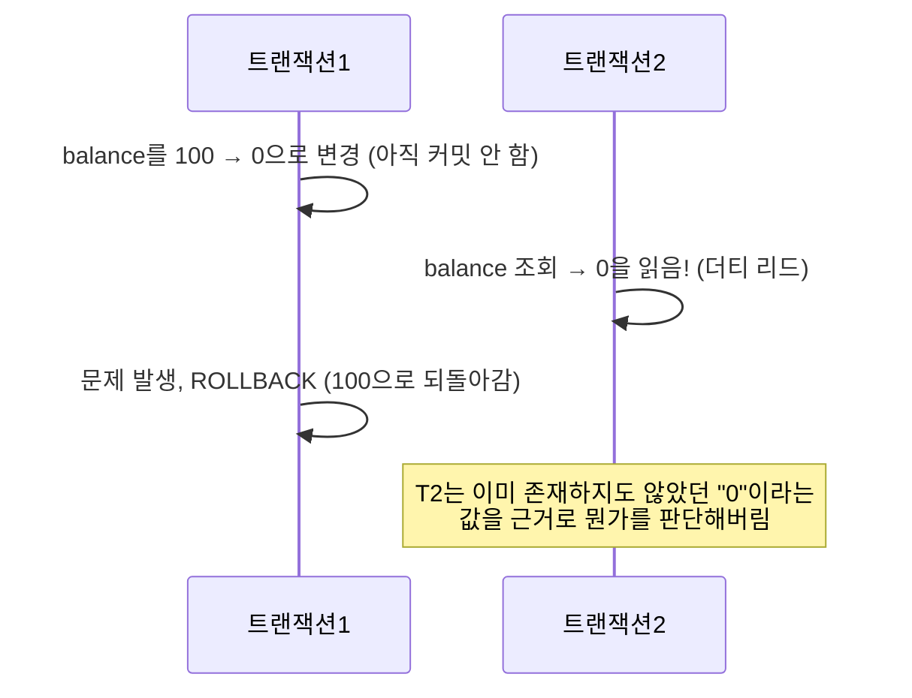
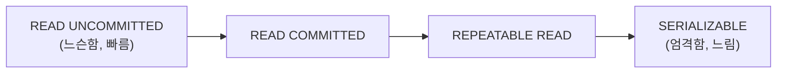

#CS #Database #면접

관련: [[인덱스]] · [[동시성 이슈와 락]] · [[../Spring/Spring|Spring]] · [[../Spring/JPA와 영속성 컨텍스트|JPA와 영속성 컨텍스트]]

## 목차
- [[#트랜잭션이 필요한 이유 — 계좌이체 예시]]
- [[#ACID — 트랜잭션이 지켜야 할 4가지 성질]]
- [[#고립성(Isolation)이 왜 문제일까? — 동시성 문제 3가지]]
- [[#격리 수준 (Isolation Level) — 얼마나 엄격하게 막을 것인가]]
- [[#트랜잭션 전파(Propagation) 살짝 맛보기]]
- [[#한 장 요약]]
- [[#Q&A로 복습하기]]

---

## 트랜잭션이 필요한 이유 — 계좌이체 예시

A가 B에게 만원을 이체하는 상황을 코드로 짜보면 이렇게 두 단계예요.

```sql
UPDATE account SET balance = balance - 10000 WHERE owner = 'A'; -- ① A 잔액 차감
UPDATE account SET balance = balance + 10000 WHERE owner = 'B'; -- ② B 잔액 증가
```

만약 **①은 성공했는데, 그 직후 서버가 다운돼서 ②가 실행되지 못하면** 어떻게 될까요? A의 돈은 사라졌는데 B는 돈을 못 받는, 만원이 세상에서 그냥 증발해버리는 참사가 벌어져요.

**트랜잭션(Transaction)** 은 이런 문제를 막기 위해, **여러 개의 작업을 "하나의 묶음"으로 처리하는 것**이에요. 묶음 안의 모든 작업이 전부 성공해야 최종 반영(커밋, Commit)되고, 하나라도 실패하면 묶음 전체를 원래 상태로 되돌려요(롤백, Rollback).



> **비유**: 트랜잭션은 "All or Nothing(전부 아니면 전무)" 원칙을 지키는 계약서예요. 계약서에 도장을 다 찍어야(COMMIT) 계약이 성립하고, 하나라도 서명이 빠지면(실패) 계약 자체가 무효(ROLLBACK)가 되는 것과 같아요.

```java
@Transactional // 이 메서드 전체가 하나의 트랜잭션으로 묶임
void transfer(Account from, Account to, int amount) {
    from.withdraw(amount);
    to.deposit(amount);
    // 둘 중 하나라도 예외가 터지면, 전체가 자동으로 롤백됨
}
```

(`@Transactional`이 실제로 어떻게 동작하는지는 [[../Spring/Spring|Spring]] 문서의 AOP 파트 참고 — 메서드 실행 앞뒤로 트랜잭션 시작/커밋을 자동으로 끼워 넣어주는 것도 AOP예요.)

---

## ACID — 트랜잭션이 지켜야 할 4가지 성질



### A — 원자성 (Atomicity)
트랜잭션 안의 작업들은 **"전부 성공" 아니면 "전부 실패"** 만 존재해요. 절반만 성공하는 경우는 없어요. (위 계좌이체 예시가 바로 이 원자성을 지키기 위한 것)

### C — 일관성 (Consistency)
트랜잭션이 끝나고 나면, 데이터는 항상 **DB가 정한 규칙(제약조건)을 만족하는 상태**여야 해요. 예를 들어 "잔액은 절대 마이너스가 될 수 없다"는 규칙이 있다면, 트랜잭션 전후로 이 규칙이 계속 지켜져야 해요.

### I — 고립성 (Isolation)
동시에 여러 트랜잭션이 실행돼도, **서로의 중간 과정에 영향을 주지 않고 마치 순서대로 하나씩 실행된 것처럼** 보여야 해요. (뒤에서 자세히 다룰게요 — 이 부분이 트랜잭션에서 가장 헷갈리고 면접에서도 자주 나와요.)

### D — 지속성 (Durability)
트랜잭션이 커밋되면, 그 결과는 **시스템에 장애(정전, 서버 다운 등)가 나도 절대 사라지지 않아야** 해요. 보통 DB가 디스크에 로그를 남겨서 보장해요.

---

## 고립성(Isolation)이 왜 문제일까? — 동시성 문제 3가지

**비유**: 놀이공원 매표소 창구가 하나뿐인데 동시에 여러 명이 표를 산다고 생각해보세요. 서로 순서를 안 지키고 뒤죽박죽으로 처리되면 이상한 일이 벌어지겠죠. 트랜잭션도 마찬가지예요 — 여러 트랜잭션이 동시에 같은 데이터를 건드리면 다음과 같은 문제가 생길 수 있어요.

### 1. Dirty Read (더티 리드)
다른 트랜잭션이 **아직 커밋도 안 한 중간 상태**의 데이터를 읽어버리는 것.



### 2. Non-Repeatable Read (반복 불가능한 읽기)
같은 트랜잭션 안에서 **같은 데이터를 두 번 읽었는데, 그 사이에 값이 달라지는 것** (다른 트랜잭션이 그 사이에 UPDATE하고 커밋해버림).

### 3. Phantom Read (팬텀 리드)
같은 트랜잭션 안에서 **같은 조건으로 두 번 조회했는데, 없던 행이 새로 나타나거나 사라지는 것** (다른 트랜잭션이 그 사이에 INSERT/DELETE하고 커밋해버림).

---

## 격리 수준 (Isolation Level) — 얼마나 엄격하게 막을 것인가

이 3가지 문제를 얼마나 허용할지 정하는 게 **격리 수준**이에요. 엄격할수록 안전하지만, 그만큼 트랜잭션끼리 서로 기다려야 해서 **성능(동시성)은 떨어져요.** 즉, "안정성 vs 성능"의 트레이드오프예요.

| 격리 수준                | Dirty Read | Non-Repeatable Read | Phantom Read | 특징                             |
| -------------------- | :--------: | :-----------------: | :----------: | ------------------------------ |
| **READ UNCOMMITTED** |     발생     |         발생          |      발생      | 가장 느슨함, 거의 안 씀                 |
| **READ COMMITTED**   |     방지     |         발생          |      발생      | 커밋된 데이터만 읽음 (Oracle 기본값)       |
| **REPEATABLE READ**  |     방지     |         방지          | 발생 (DB마다 다름) | 같은 트랜잭션 내 반복 읽기 보장 (MySQL 기본값) |
| **SERIALIZABLE**     |     방지     |         방지          |      방지      | 가장 엄격, 사실상 순서대로 실행 (성능 크게 저하)  |



> 외우는 팁: 아래로 갈수록(SERIALIZABLE에 가까울수록) "다른 트랜잭션의 개입을 더 안 믿는다"는 뜻이에요. 못 믿을수록 더 꼼꼼히 막다 보니 느려지는 거고요.

---

## 트랜잭션 전파(Propagation) 살짝 맛보기

Spring에서는 트랜잭션이 걸린 메서드가 **또 다른 트랜잭션 메서드를 호출**할 때, 어떻게 동작할지 정할 수 있어요.

```java
@Transactional
void order() {
    payService.pay(); // 이미 트랜잭션 안에서, 또 트랜잭션 메서드를 호출하면?
}

@Transactional(propagation = Propagation.REQUIRED) // 기본값
void pay() { ... }
```

- **REQUIRED (기본값)**: 이미 진행 중인 트랜잭션이 있으면 그걸 그대로 이어서 씀 (하나로 합쳐짐).
- **REQUIRES_NEW**: 기존 트랜잭션과 상관없이 **완전히 새로운 트랜잭션**을 만듦 (독립적으로 커밋/롤백).

이 주제는 깊게 들어가면 내용이 많아서, 필요해지면 별도 문서로 분리할게요. 우선은 "여러 트랜잭션이 겹칠 때 합칠지 분리할지 정할 수 있다" 정도만 기억해두면 충분해요.

---

## 한 장 요약

| 질문 | 답 |
|---|---|
| 트랜잭션이란? | 여러 작업을 하나의 단위로 묶어, 전부 성공하거나 전부 취소되게 하는 것 |
| ACID란? | 원자성, 일관성, 고립성, 지속성 — 트랜잭션이 지켜야 할 4가지 성질 |
| Dirty Read | 커밋 안 된 데이터를 읽어버림 |
| Non-Repeatable Read | 같은 데이터를 두 번 읽었는데 값이 바뀜 |
| Phantom Read | 같은 조건 조회인데 행 개수가 바뀜 |
| 격리 수준이 엄격할수록? | 데이터는 안전해지지만 동시성(성능)은 떨어짐 |
| MySQL 기본 격리 수준 | REPEATABLE READ |

---

## Q&A로 복습하기

### Q. 트랜잭션의 ACID 중 원자성(Atomicity)이 보장하는 것은?
A. 트랜잭션 안의 작업들은 전부 성공하거나 전부 실패(취소)만 존재하고, 절반만 반영되는 경우는 없다는 것.

### Q. Dirty Read란?
A. 다른 트랜잭션이 아직 커밋하지 않은 중간 상태의 데이터를 읽어버리는 것.

### Q. Non-Repeatable Read와 Phantom Read의 차이는?
A. Non-Repeatable Read는 같은 데이터를 두 번 읽었는데 값이 바뀌는 것이고, Phantom Read는 같은 조건으로 두 번 조회했는데 행의 개수(존재 여부)가 바뀌는 것이다.

### Q. 격리 수준이 엄격해질수록 어떤 트레이드오프가 생기나?
A. 동시성 문제(Dirty/Non-Repeatable/Phantom Read)는 더 잘 막아주지만, 트랜잭션끼리 서로 기다려야 해서 성능(동시성)은 떨어진다.

### Q. MySQL의 기본 격리 수준은?
A. REPEATABLE READ다.
