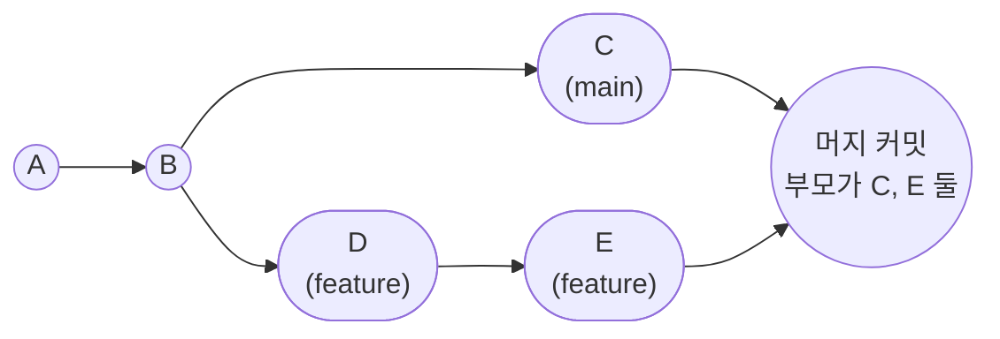
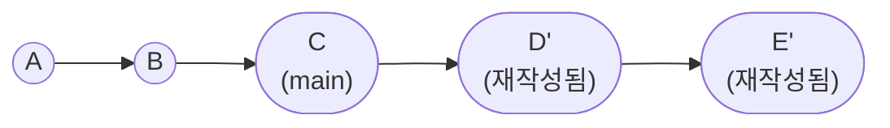
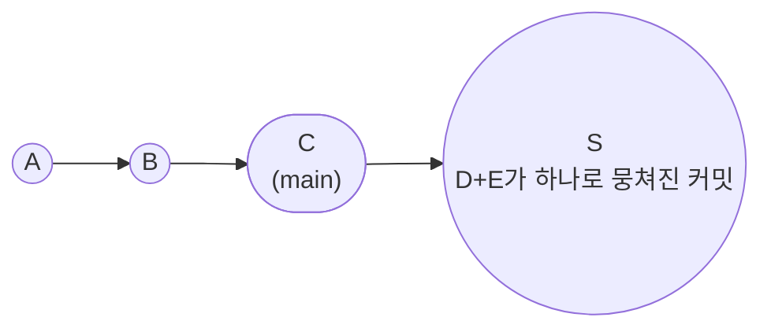
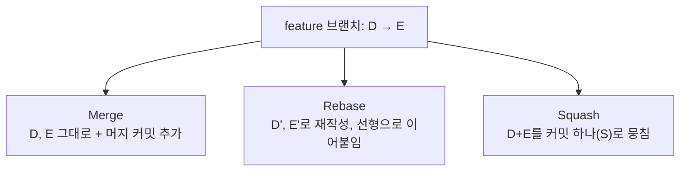

#CS #Git #면접

## 목차
- [[#브랜치를 합친다는 것 — 세 가지 다른 방법]]
- [[#Merge — 두 역사를 있는 그대로 이어붙이기]]
- [[#Rebase — 커밋을 다른 베이스 위로 재배치하기]]
- [[#Squash Merge — 여러 커밋을 하나로 뭉쳐서 합치기]]
- [[#세 가지 비교]]
- [[#실무에서는 어떻게 쓸까?]]
- [[#한 장 요약]]
- [[#Q&A로 복습하기]]

---

## 브랜치를 합친다는 것 — 세 가지 다른 방법

기능 하나를 개발할 때 보통 `main`에서 `feature` 브랜치를 따서 커밋을 여러 개 쌓아요. 작업이 끝나면 이걸 다시 `main`으로 합쳐야 하는데, **"합친다"는 결과는 같아도 그 방법(그리고 남는 커밋 히스토리 모양)은 완전히 달라요.**

> **비유**: 두 사람이 각자 다른 챕터를 써서 책 한 권을 완성한다고 해봐요. **Merge**는 "누가 언제 어떤 챕터를 썼는지"를 그대로 남기며 두 원고를 합치는 거예요. **Rebase**는 마치 처음부터 한 사람이 순서대로 쭉 이어서 쓴 것처럼 원고를 다시 정리하는 거예요. **Squash**는 그 사람이 쓴 여러 초안(커밋)들을 다 무시하고 "최종 완성된 챕터 한 장"만 남기는 거예요.

---

## Merge — 두 역사를 있는 그대로 이어붙이기

가장 기본적인 방식이에요. `feature` 브랜치의 커밋들을 **하나도 건드리지 않고 그대로 유지**한 채, 두 브랜치의 마지막 지점을 연결하는 **머지 커밋(Merge Commit)** 을 하나 새로 만들어요.

```bash
git checkout main
git merge feature
```



- 머지 커밋은 **부모가 두 개**(C와 E)인 특별한 커밋이에요.
- `feature`에서 쌓았던 커밋(D, E)이 **원래 모양 그대로** 히스토리에 남아요.
- **장점**: "언제, 어떤 브랜치에서, 어떤 순서로 작업했는지"가 그대로 보존돼요. 이력을 있는 그대로 남기고 싶을 때 좋아요.
- **단점**: 브랜치가 많아지고 머지가 잦아지면, 히스토리 그래프가 여러 갈래로 얽혀서 나중에 `git log`로 흐름을 읽기 어려워져요.

---

## Rebase — 커밋을 다른 베이스 위로 재배치하기

**Rebase(리베이스)** 는 `feature`의 커밋들을 **`main`의 최신 커밋 뒤로 옮겨서 다시 쓰는** 방식이에요. "베이스(기준점)를 바꾼다"는 이름 그대로예요.

```bash
git checkout feature
git rebase main
```



- `feature`의 커밋 D, E는 사라지고, **내용은 같지만 완전히 새로운 커밋 D', E'** 가 `main`의 최신 지점(C) 위에 다시 만들어져요. (커밋 해시가 바뀌어요!)
- **결과적으로 머지 커밋 없이, 한 줄로 쭉 이어지는 선형(linear) 히스토리**가 만들어져요.
- **장점**: 히스토리가 깔끔하고 읽기 쉬워요. "누가 언제 브랜치를 땄는지"보다 "어떤 순서로 변경됐는지"가 중요할 때 좋아요.
- **단점 (주의!)**: 커밋을 **재작성**하는 작업이라, **이미 원격 저장소에 push되어 다른 사람이 받아간 브랜치를 rebase하면 위험해요.** 그 사람의 로컬 히스토리와 완전히 어긋나버려서 충돌이 크게 나요. 그래서 흔히 **"공개된(다른 사람과 공유 중인) 브랜치는 rebase하지 마라"** 는 규칙을 지켜요.

---

## Squash Merge — 여러 커밋을 하나로 뭉쳐서 합치기

**Squash(스쿼시) Merge**는 `feature`에 쌓인 여러 커밋(D, E, ...)을 **하나의 커밋으로 뭉쳐서** `main`에 얹는 방식이에요.

```bash
git checkout main
git merge --squash feature
git commit -m "기능 A 구현"
```



- `feature`에서 있었던 "오타 수정", "테스트 추가", "리팩터링" 같은 자잘한 커밋들이 **전부 사라지고, 딱 하나의 커밋**만 `main`에 남아요.
- 머지 커밋도 만들지 않아요 — 그냥 평범한 커밋 하나가 `main` 위에 얹힐 뿐이에요.
- **장점**: `main`의 히스토리가 매우 깔끔해져요. **"기능 하나 = 커밋 하나"** 로 정리되어, 나중에 문제가 생겼을 때 `git log`나 `git bisect`로 원인을 추적하기 쉬워요.
- **단점**: `feature` 브랜치 안에서의 세세한 작업 과정(어떤 순서로 고쳤는지)은 사라져요. 커밋을 잘게 쪼개 의미 있게 남기고 싶은 팀에는 아쉬울 수 있어요.

---

## 세 가지 비교



| 구분              | Merge             | Rebase                 | Squash Merge                 |
| --------------- | ----------------- | ---------------------- | ---------------------------- |
| 원본 커밋(D, E) 보존  | ✅ 그대로 유지          | ❌ 새 커밋(D', E')으로 재작성   | ❌ 하나로 뭉쳐짐                    |
| 머지 커밋 생성        | ✅ (부모 2개)         | ❌                      | ❌                            |
| 결과 히스토리 모양      | 브랜치가 갈라졌다 합쳐지는 모양 | 한 줄로 쭉 이어지는 선형         | 한 줄 + 커밋 개수가 확 줄어듦           |
| 공유 브랜치에 써도 안전한가 | ✅ 안전              | ⚠️ 이미 push된 공유 브랜치엔 위험 | ✅ 안전 (feature 브랜치 자체는 안 건드림) |
| 작업 과정(세부 커밋) 보존 | ✅                 | ✅ (내용은 유지, 해시만 바뀜)     | ❌ (하나로 합쳐 사라짐)               |

---

## 실무에서는 어떻게 쓸까?

GitHub, GitLab 같은 도구는 Pull Request를 병합할 때 이 세 방식을 버튼으로 선택할 수 있게 해줘요.

- **"Merge commit"**: 팀 협업 히스토리(누가 언제 브랜치를 만들어 작업했는지)를 그대로 남기고 싶을 때.
- **"Squash and merge"**: PR 하나 = `main`의 커밋 하나로 깔끔하게 정리하고 싶을 때. **실무에서 가장 흔히 기본값으로 쓰이는 방식**이에요 — 리뷰 중에 오간 자잘한 수정 커밋들이 `main`에 그대로 남는 걸 원치 않기 때문이에요.
- **"Rebase and merge"**: 머지 커밋 없이 선형 히스토리를 유지하되, feature의 개별 커밋은 살리고 싶을 때.

> 개인 작업 브랜치를 정리할 때(`main`에 올리기 전, 혼자만 보는 로컬 브랜치)는 `git rebase -i`(interactive rebase)로 커밋을 다듬는 것도 흔한 패턴이에요. 다만 이건 "아직 아무와도 공유 안 한" 브랜치에서만 안전해요.

---

## 한 장 요약

| 질문 | 답 |
|---|---|
| Merge의 특징은? | 원본 커밋을 그대로 유지하고, 부모가 2개인 머지 커밋을 새로 만듦 |
| Rebase의 특징은? | 커밋을 새 베이스 위로 재작성해서 선형 히스토리를 만듦 (커밋 해시가 바뀜) |
| Squash Merge의 특징은? | 여러 커밋을 하나로 뭉쳐서 main에 커밋 하나만 남김 |
| Rebase가 위험할 수 있는 경우는? | 이미 push되어 다른 사람과 공유 중인 브랜치를 rebase할 때 |
| 실무에서 가장 흔한 PR 병합 방식은? | Squash and merge — PR 하나를 커밋 하나로 깔끔하게 정리 |

---

## Q&A로 복습하기

### Q. Merge와 Rebase의 가장 큰 차이는?
A. Merge는 원본 커밋을 그대로 유지하면서 부모가 두 개인 머지 커밋을 새로 만들어 두 히스토리를 잇는 반면, Rebase는 커밋들을 새 베이스 위에 재작성해서 머지 커밋 없이 한 줄로 이어지는 선형 히스토리를 만든다.

### Q. Rebase를 할 때 주의해야 할 점은?
A. Rebase는 커밋을 새로 재작성해 해시가 바뀌기 때문에, 이미 원격에 push되어 다른 사람이 받아간 브랜치를 rebase하면 그 사람의 로컬 히스토리와 어긋나 큰 충돌이 생길 수 있다. 그래서 공유 중인 브랜치는 rebase하지 않는 것이 원칙이다.

### Q. Squash Merge는 어떤 상황에 유용한가?
A. feature 브랜치 안의 자잘한 수정 커밋들을 main에 그대로 남기고 싶지 않고, PR 하나를 main의 커밋 하나로 깔끔하게 정리하고 싶을 때 유용하다. 문제 추적(git log, git bisect)도 더 쉬워진다.

### Q. Squash Merge의 단점은?
A. feature 브랜치 안에서 어떤 순서로, 어떤 이유로 코드가 바뀌었는지에 대한 세부 커밋 히스토리가 사라진다는 점이다.
