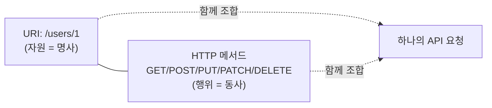
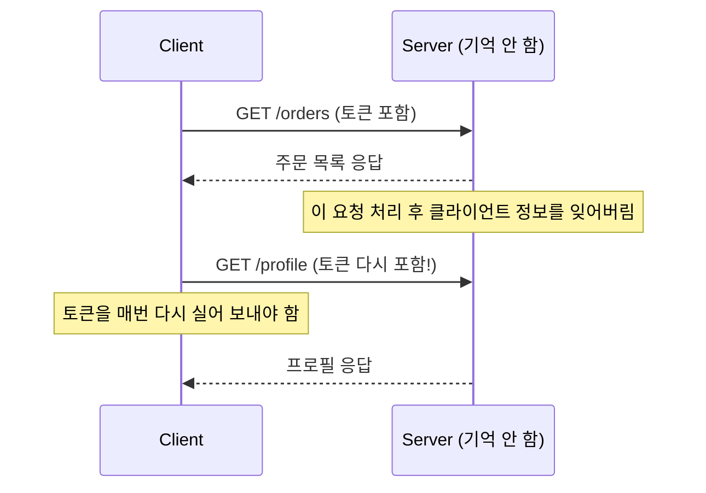
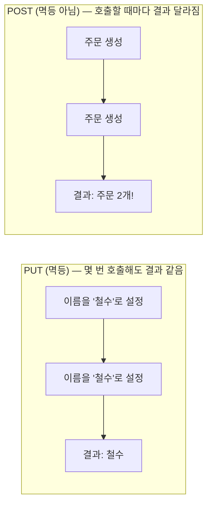
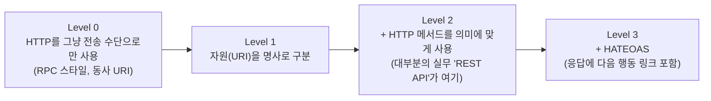

#CS #Infrastructure #면접

관련: [[../Spring/Spring|Spring]] · [[../Spring/서블릿|서블릿]] · [[../Fundamentals/인증과 인가|인증과 인가]]

## 목차
- [[#REST란 무엇인가?]]
- [[#핵심 아이디어: URI는 명사, HTTP 메서드는 동사]]
- [[#Stateless(무상태) — REST의 가장 중요한 제약]]
- [[#멱등성(Idempotent)과 안전(Safe) — 메서드마다 성격이 다르다]]
- [[#HTTP 상태 코드 — 결과를 숫자로 요약하기]]
- [[#좋은 URI 설계 원칙]]
- [[#진짜 RESTful이란? — Richardson 성숙도 모델]]
- [[#한 장 요약]]
- [[#Q&A로 복습하기]]

---

## REST란 무엇인가?

**REST(Representational State Transfer)** 는 2000년 로이 필딩(Roy Fielding)이 박사 논문에서 제안한 **웹 API를 설계하는 방식(아키텍처 스타일)**이에요. "이렇게 설계하면 서버와 클라이언트가 서로 덜 의존하면서, 확장하기 쉬운 API가 된다"는 일종의 설계 원칙 모음이에요.

> 비유: 레스토랑 메뉴판을 생각해보세요. 메뉴판에는 "김치찌개", "된장찌개"처럼 **음식(명사, = 자원/리소스)** 이 나열돼 있지, "끓이다", "볶다" 같은 **조리 방법(동사)** 이 메뉴 이름으로 적혀 있지 않죠. 손님은 "김치찌개 주세요(주문 = 행위)"라고 말할 뿐, 메뉴 자체는 항상 명사로 표현돼요. REST API도 마찬가지예요 — **URI(주소)는 "무엇(자원)"을 가리키고, "어떻게 할지(행위)"는 HTTP 메서드로 따로 표현**해요.

---

## 핵심 아이디어: URI는 명사, HTTP 메서드는 동사

REST 이전의 API들은 이렇게 동사를 URI에 그대로 박아 넣는 경우가 많았어요.

```
❌ RPC 스타일 (동사가 URI에 섞임)
GET  /getUser?id=1
POST /createUser
POST /deleteUser?id=1
POST /updateUserName?id=1&name=철수
```

REST는 URI를 **자원(명사)** 만으로 표현하고, "무엇을 할지"는 **HTTP 메서드**가 담당하게 분리해요.

```
✅ REST 스타일 (URI = 명사, 메서드 = 동사)
GET    /users/1      → 1번 유저 조회
POST   /users        → 유저 생성
PUT    /users/1      → 1번 유저 전체 수정
PATCH  /users/1      → 1번 유저 일부 수정
DELETE /users/1      → 1번 유저 삭제
```



| HTTP 메서드 | CRUD | 의미 |
|---|---|---|
| GET | Read | 자원 조회 |
| POST | Create | 자원 생성 |
| PUT | Update (전체) | 자원 전체를 통째로 교체 |
| PATCH | Update (일부) | 자원의 일부 필드만 수정 |
| DELETE | Delete | 자원 삭제 |

같은 `/users/1`이라는 URI라도, **어떤 메서드로 요청하느냐에 따라 완전히 다른 동작**을 해요. 이게 REST의 가장 기본적이면서 중요한 아이디어예요.

---

## Stateless(무상태) — REST의 가장 중요한 제약

REST의 여러 설계 원칙 중 실무에서 가장 자주 언급되는 게 **무상태성(Stateless)** 이에요.

> **"서버는 이전 요청의 상태를 기억하지 않는다. 매 요청은 그 요청 하나만으로 처리에 필요한 모든 정보를 담고 있어야 한다."**

> 비유: 손님을 기억 못 하는 식당을 생각해보세요. 어제 왔던 단골이어도, 오늘 다시 오면 "저 단골인데요"라고 매번 스스로 밝혀야 해요(신분증을 보여줘야 함). 식당(서버)이 "아, 어제 그분!"이라고 알아서 기억해주지 않아요.



로그인한 사용자 정보를 서버 메모리에 세션으로 저장해두는 대신, **클라이언트가 매 요청마다 토큰(JWT 등)을 실어 보내서 "나 누구인지"를 증명**하는 방식이 REST의 무상태 원칙과 잘 맞아요.

**왜 이렇게 귀찮게 설계했을까?**
- **확장성(Scalability)**: 서버가 클라이언트 상태를 기억하지 않으니, 서버를 여러 대로 늘려도(수평 확장) 아무 서버나 요청을 처리할 수 있어요. 만약 서버가 "이 클라이언트는 서버 A에 로그인했었지"를 기억해야 한다면, 그 클라이언트의 다음 요청은 무조건 서버 A로만 가야 하는 제약이 생겨요.
- **단순함**: 서버가 세션을 관리하지 않아도 되니 구현이 단순해져요.

---

## 멱등성(Idempotent)과 안전(Safe) — 메서드마다 성격이 다르다

HTTP 메서드마다 "같은 요청을 여러 번 보내면 어떻게 되는가"에 대한 성격이 정해져 있어요. 이게 실무에서 API를 설계할 때 (특히 재시도 로직을 짤 때) 매우 중요해요.

- **안전(Safe)**: 호출해도 서버의 상태(데이터)가 **바뀌지 않는** 메서드. (조회만 할 뿐 아무것도 변경 안 함)
- **멱등(Idempotent)**: 같은 요청을 **여러 번 반복해도 결과가 1번 한 것과 똑같은** 메서드. (상태가 바뀔 순 있지만, 몇 번을 하든 최종 상태는 동일)

| 메서드 | 안전(Safe)? | 멱등(Idempotent)? | 설명 |
|---|:---:|:---:|---|
| GET | ✅ | ✅ | 조회만 함, 여러 번 해도 서버 상태 그대로 |
| PUT | ❌ | ✅ | 값을 바꾸지만, 같은 요청 여러 번 = 결과 동일 (`이름을 "철수"로 설정`을 10번 해도 결과는 "철수") |
| DELETE | ❌ | ✅ | 여러 번 삭제 요청해도 결과는 "삭제된 상태"로 동일 |
| POST | ❌ | ❌ | 호출할 때마다 **새로운 자원이 계속 생성됨** (`주문 생성`을 10번 하면 주문 10개가 생김!) |
| PATCH | ❌ | 경우에 따라 다름 | "필드를 5 증가시켜라" 같은 요청이면 멱등하지 않음 |



> 실무 팁: 네트워크가 불안정해서 응답을 못 받았을 때, **멱등한 메서드(PUT, DELETE)는 안심하고 재시도**할 수 있지만, **POST는 재시도하면 중복 생성될 위험**이 있어요. (예: 결제 API를 POST로 만들었는데 응답 타임아웃으로 재시도했다가 결제가 두 번 되는 사고)

---

## HTTP 상태 코드 — 결과를 숫자로 요약하기

응답이 성공했는지, 실패했다면 누구 잘못인지를 **상태 코드 앞자리**로 대략 알 수 있어요.

| 앞자리 | 의미 | 대표 코드 |
|---|---|---|
| 2xx | 성공 | `200 OK`, `201 Created`, `204 No Content` |
| 3xx | 리다이렉션 | `301 Moved Permanently`, `304 Not Modified` |
| 4xx | **클라이언트 잘못** | `400 Bad Request`, `401 Unauthorized`, `403 Forbidden`, `404 Not Found`, `409 Conflict` |
| 5xx | **서버 잘못** | `500 Internal Server Error`, `503 Service Unavailable` |

- `200 OK` vs `201 Created`: 둘 다 성공이지만, **자원을 새로 만든(POST) 경우엔 201**을 쓰는 게 더 정확해요.
- `401 Unauthorized` vs `403 Forbidden`: **401은 "누군지 증명이 안 됨(로그인 안 함)"**, **403은 "누군지는 알겠는데 권한이 없음"**이에요. 이 둘을 헷갈리는 경우가 많아요.
- `404 Not Found` vs `400 Bad Request`: 404는 "그 자원 자체가 없음", 400은 "요청 형식/파라미터가 잘못됨".

---

## 좋은 URI 설계 원칙

```
✅ 좋은 예
GET /users/1/orders          → 1번 유저의 주문 목록
GET /users/1/orders/99       → 1번 유저의 99번 주문

❌ 나쁜 예
GET /getUserOrders?userId=1  → 동사가 들어감
GET /Users/1/Orders          → 대문자 사용 (관례상 소문자 권장)
GET /user/1/order            → 리소스명은 보통 복수형(users, orders) 권장
```

- **동사 대신 명사**를 쓴다 (행위는 HTTP 메서드로).
- **계층 관계는 슬래시(`/`)** 로 표현한다 (`/users/1/orders`처럼 "1번 유저에 속한 주문들").
- 소문자 + 하이픈(`-`)을 쓰고, 언더스코어(`_`)나 카멜케이스는 지양한다.
- API 버전은 보통 URI 앞에 붙인다: `/api/v1/users`

---

## 진짜 RESTful이란? — Richardson 성숙도 모델

재밌게도, 실무에서 "REST API"라고 부르는 것들 대부분은 **엄밀한 의미의 REST를 100% 지키지는 않아요.** 이걸 단계별로 정리한 게 **Richardson 성숙도 모델(Richardson Maturity Model)** 이에요.



- **Level 3(HATEOAS)** 까지 가야 필딩이 정의한 "완전한 REST"인데, 응답마다 "다음에 할 수 있는 행동들의 링크"까지 넣어야 해서(예: 주문 조회 응답에 `"취소하기": "/orders/1/cancel"` 링크 포함) 실무에서는 거의 안 쓰여요.
- 그래서 실무에서 "REST API 만들었다"고 하면, 보통 **Level 2** — URI는 명사로, 메서드는 의미에 맞게 쓰는 정도 — 를 의미하는 경우가 대부분이에요. 완벽한 REST가 아니어도 실용적으로 충분하기 때문이에요.

---

## 한 장 요약

| 질문 | 답 |
|---|---|
| REST의 핵심 아이디어는? | URI는 자원(명사), HTTP 메서드는 행위(동사)로 분리해서 표현 |
| Stateless가 필요한 이유는? | 서버가 클라이언트 상태를 기억하지 않아야 서버를 자유롭게 확장(수평 확장)할 수 있음 |
| 멱등한 메서드는? | GET, PUT, DELETE (POST는 멱등하지 않음) |
| POST를 함부로 재시도하면 안 되는 이유 | 호출할 때마다 새 자원이 생성되어 중복 생성 위험이 있음 |
| 401과 403의 차이는? | 401은 인증 안 됨(누군지 모름), 403은 인증은 됐지만 권한 없음 |
| 실무의 대부분 REST API는 성숙도 몇 단계? | Level 2 (URI + 메서드 활용, HATEOAS는 보통 생략) |

---

## Q&A로 복습하기

### Q. REST에서 URI와 HTTP 메서드는 각각 무엇을 표현하나?
A. URI는 자원(무엇을 다룰지, 명사)을 표현하고, HTTP 메서드는 그 자원에 대한 행위(무엇을 할지, 동사)를 표현한다.

### Q. Stateless(무상태) 원칙이 서버 확장성에 어떻게 도움이 되나?
A. 서버가 클라이언트의 이전 상태를 기억하지 않으므로, 어떤 서버가 요청을 처리하든 상관없어져서 서버를 여러 대로 자유롭게 늘릴 수 있다.

### Q. GET, PUT, DELETE는 멱등한데 POST는 왜 멱등하지 않은가?
A. GET/PUT/DELETE는 같은 요청을 여러 번 보내도 최종 상태가 동일하지만, POST는 호출할 때마다 새로운 자원이 계속 생성되기 때문이다.

### Q. 401 Unauthorized와 403 Forbidden의 차이는?
A. 401은 사용자가 누구인지 증명되지 않은 상태(인증 실패)이고, 403은 누구인지는 확인됐지만 그 요청을 수행할 권한이 없는 상태(인가 실패)다.

### Q. 실무의 REST API 대부분이 Richardson 성숙도 모델의 어느 단계에 머무는가?
A. Level 2다. URI를 명사로 표현하고 HTTP 메서드를 의미에 맞게 사용하지만, 응답에 다음 행동 링크를 포함하는 HATEOAS(Level 3)까지는 보통 구현하지 않는다.
