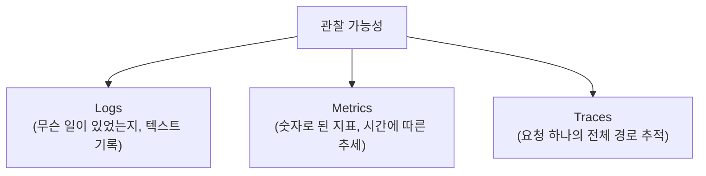
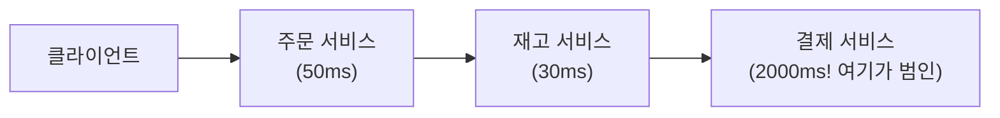
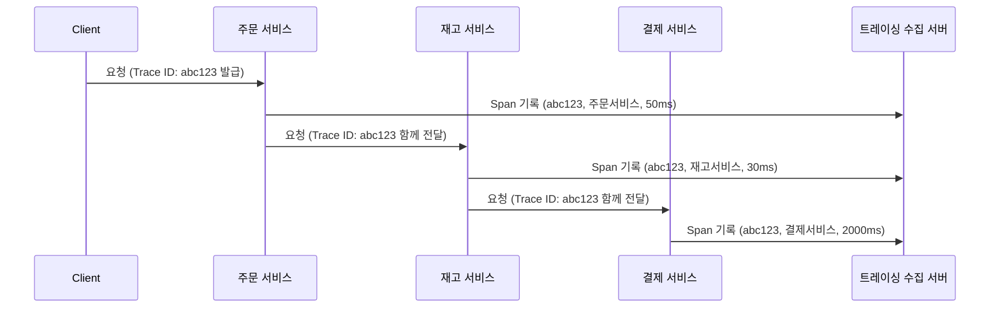

#CS #Infrastructure #면접

관련: [[시스템 설계 기초]] · [[분산 트랜잭션과 Saga 패턴]] · [[트래픽 제어와 장애 격리]]

## 목차
- [[#관찰 가능성이란? — 겉만 보고도 속을 알 수 있는 능력]]
- [[#세 개의 기둥 — Logs, Metrics, Traces]]
- [[#왜 MSA에서 특히 어려울까?]]
- [[#분산 트레이싱 — Trace ID로 요청의 여정을 따라가기]]
- [[#코드로 보는 분산 트레이싱]]
- [[#한 장 요약]]
- [[#Q&A로 복습하기]]

---

## 관찰 가능성이란? — 겉만 보고도 속을 알 수 있는 능력

**관찰 가능성(Observability)** 은 **"시스템 내부를 직접 뜯어보지 않고도, 밖에서 관찰되는 정보(로그, 지표, 추적 기록)만으로 내부에서 무슨 일이 일어나는지 알 수 있는 능력"** 을 뜻해요.

> **비유**: 자동차 계기판을 생각해보세요. 엔진을 직접 뜯어보지 않아도, **속도계, 온도 게이지, 경고등**만 보고도 "지금 엔진에 문제가 있구나"를 알 수 있죠. 관찰 가능성이 잘 갖춰진 시스템은, 장애가 나도 **코드를 직접 디버깅하지 않고 계기판(로그/지표/추적)만 보고도** 원인을 좁혀나갈 수 있어요.

---

## 세 개의 기둥 — Logs, Metrics, Traces

관찰 가능성은 보통 세 가지 데이터로 이뤄져요.



- **Logs(로그)**: "2026-09-03 10:00:01 주문 생성 실패: 재고 부족"처럼, **특정 시점에 어떤 일이 있었는지에 대한 텍스트 기록**이에요. ELK Stack(Elasticsearch+Logstash+Kibana) 같은 도구로 모아서 검색해요.
- **Metrics(지표)**: "지난 5분간 평균 응답 시간", "초당 요청 수(RPS)", "에러율" 같은 **숫자로 집계된 데이터**예요. Prometheus로 수집하고 Grafana로 시각화하는 조합이 흔해요.
- **Traces(추적)**: 요청 하나가 **여러 서비스를 거치는 전체 경로**를 추적한 기록이에요. 바로 다음에 자세히 볼게요.

| 구분 | 답해주는 질문 | 대표 도구 |
|---|---|---|
| Logs | "정확히 무슨 일이 있었나?" | ELK Stack |
| Metrics | "전반적으로 시스템 상태가 어떤가?" | Prometheus + Grafana |
| Traces | "이 특정 요청은 어디서 느려졌나?" | Zipkin, Jaeger |

---

## 왜 MSA에서 특히 어려울까?

서버 한 대짜리 애플리케이션이라면, 로그 파일 하나만 봐도 문제를 추적할 수 있어요. 하지만 [[분산 트랜잭션과 Saga 패턴]]에서 다룬 것처럼 **요청 하나가 주문 → 재고 → 결제 서비스를 순서대로 거치는 구조**라면, 문제가 생겼을 때 **"어느 서비스에서 느려졌는지"** 를 알기가 훨씬 어려워요.



각 서비스가 **자기 로그만 따로 가지고 있으면**, "전체 응답이 왜 2초나 걸렸지?"라는 질문에 답하려고 **서비스 세 곳의 로그를 일일이 다 뒤져서 시간을 맞춰봐야** 해요. 이 문제를 푸는 게 **분산 트레이싱**이에요.

---

## 분산 트레이싱 — Trace ID로 요청의 여정을 따라가기

핵심 아이디어는 단순해요 — **요청이 처음 들어올 때 고유한 `Trace ID`를 하나 발급하고, 그 요청이 어떤 서비스를 거치든 이 ID를 계속 함께 들고 다니게** 하는 거예요.



- **Trace**: 요청 하나의 **전체 여정**. `Trace ID`로 식별해요.
- **Span**: 그 여정 안에서 **각 서비스가 처리한 구간 하나하나**. "주문 서비스에서 50ms 걸렸다" 같은 기록이 Span 하나예요.

이렇게 모인 Span들을 **Trace ID로 묶어서 시간순으로 나열**하면, `Zipkin`이나 `Jaeger` 같은 도구가 **"어느 구간에서 가장 오래 걸렸는지"를 시각적으로** 보여줘요 — 위 예시라면 한눈에 **결제 서비스가 범인**이라는 게 드러나겠죠.

---

## 코드로 보는 분산 트레이싱

실무에서는 대부분 이 Trace ID 전파를 **직접 구현하지 않고**, 라이브러리가 자동으로 처리해줘요.

```java
@RestController
class OrderController {
    private final RestTemplate restTemplate; // 또는 WebClient

    @PostMapping("/orders")
    Order createOrder(@RequestBody OrderRequest request) {
        // Trace ID는 트레이싱 라이브러리(예: Spring Cloud Sleuth, OpenTelemetry)가
        // 요청 헤더에 자동으로 실어서 다음 서비스 호출에 전파해줌
        StockResponse stock = restTemplate.postForObject(
            "http://stock-service/reserve", request, StockResponse.class
        );
        // ...
    }
}
```

개발자는 그냥 평소처럼 다른 서비스를 호출하는 코드만 짜면, **트레이싱 라이브러리가 HTTP 헤더에 `Trace ID`/`Span ID`를 자동으로 실어 나르고**, 백그라운드에서 수집 서버(Zipkin 등)로 Span 정보를 전송해줘요.

---

## 한 장 요약

| 질문 | 답 |
|---|---|
| 관찰 가능성이란? | 시스템을 직접 뜯어보지 않고도 로그/지표/추적으로 내부 상태를 알 수 있는 능력 |
| 세 개의 기둥은? | Logs(무슨 일이 있었나), Metrics(전반적 상태), Traces(요청의 경로) |
| MSA에서 관찰 가능성이 더 중요한 이유는? | 요청이 여러 서비스를 거쳐서, 로그가 흩어지면 문제 원인 추적이 어려워짐 |
| Trace와 Span의 관계는? | Trace는 요청 하나의 전체 여정, Span은 그 안의 각 서비스별 처리 구간 |
| 분산 트레이싱을 어떻게 구현하나? | Trace ID를 요청 헤더에 담아 서비스 간 호출마다 전파, 보통 라이브러리가 자동 처리 |

---

## Q&A로 복습하기

### Q. Logs, Metrics, Traces는 각각 어떤 질문에 답해주나?
A. Logs는 특정 시점에 정확히 무슨 일이 있었는지, Metrics는 시스템의 전반적인 상태와 추세가 어떤지, Traces는 특정 요청 하나가 어느 구간에서 느려졌는지에 대한 답을 제공한다.

### Q. MSA 환경에서 각 서비스가 로그를 따로 가지고 있으면 왜 문제가 되나?
A. 요청 하나가 여러 서비스를 거치기 때문에, 문제의 원인을 찾으려면 여러 서비스의 로그를 일일이 뒤져서 시간을 맞춰봐야 하는 번거로움이 생긴다.

### Q. 분산 트레이싱에서 Trace ID의 역할은?
A. 요청이 처음 들어올 때 발급되어, 그 요청이 어떤 서비스를 거치든 함께 전파되는 고유 식별자로, 여러 서비스에 흩어진 기록(Span)들을 하나의 요청 여정으로 묶어주는 역할을 한다.

### Q. Trace와 Span의 차이는?
A. Trace는 하나의 요청이 시작부터 끝까지 거치는 전체 여정을 의미하고, Span은 그 여정 안에서 하나의 서비스(또는 구간)가 처리한 부분 기록을 의미한다.

### Q. 개발자가 분산 트레이싱을 위해 보통 직접 하지 않아도 되는 일은?
A. Trace ID를 요청 헤더에 담아 다음 서비스 호출로 전파하는 작업은 대부분 트레이싱 라이브러리가 자동으로 처리해주기 때문에, 개발자는 평소처럼 서비스 호출 코드만 작성하면 된다.
