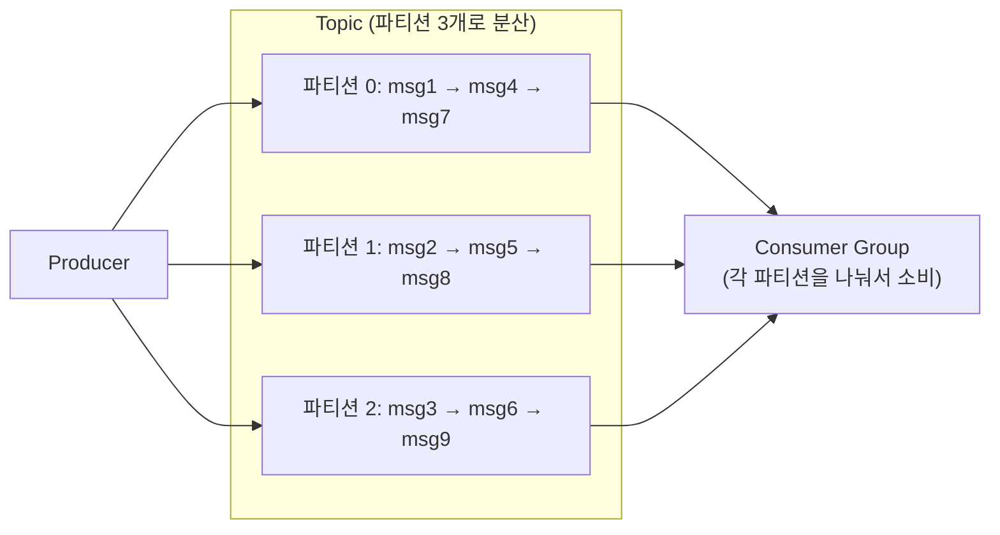
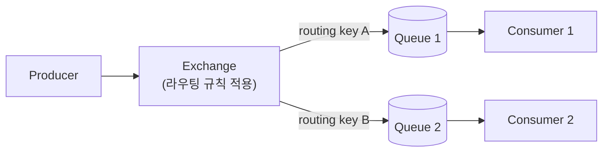
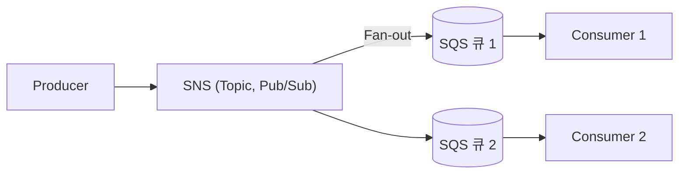

#CS #Infrastructure #면접

관련: [[메시지 큐]] · [[../Spring/Kafka 실전 적용|Kafka 실전 적용]]

## 목차
- [[#Kafka — 분산 로그 기반, 초고처리량]]
- [[#RabbitMQ — 전통적인 메시지 브로커, 유연한 라우팅]]
- [[#Amazon SQS/SNS — 직접 관리할 필요 없는 완전관리형]]
- [[#세 시스템 비교]]
- [[#언제 무엇을 써야 할까?]]
- [[#한 장 요약]]
- [[#Q&A로 복습하기]]

---

## Kafka — 분산 로그 기반, 초고처리량

**Kafka**는 메시지를 "**한 번 쓰면 없어지지 않는 로그(Log) 파일**"에 순서대로 계속 이어붙이는 방식으로 저장해요. Consumer가 메시지를 가져가도 [[메시지 큐]]의 큐처럼 바로 삭제되지 않고, **정해둔 보관 기간 동안 그대로 남아있어요.**

- **파티션(Partition)**: 하나의 Topic을 여러 파티션으로 나눠서, **여러 서버에 분산 저장**해요. 이 덕분에 병렬로 읽고 쓸 수 있어서 **처리량이 매우 높아요.**
- **컨슈머 그룹(Consumer Group)**: 여러 Consumer가 그룹을 이뤄서 파티션들을 나눠 갖고 처리해요. 그룹 안에서는 [[메시지 큐]]에서 다룬 **Point-to-Point**처럼 동작하고, 서로 다른 그룹끼리는 **Pub/Sub**처럼 같은 메시지를 각자 다 받아요.
- **메시지가 삭제되지 않고 보관됨**: 그래서 "지난 데이터를 다시 처음부터 재처리"하는 것도 가능해요 — 다른 MQ에서는 흔치 않은 특징이에요.
- **파티션 내에서는 순서 보장**: 같은 파티션에 들어간 메시지는 들어간 순서대로 처리돼요. (파티션 전체를 아우르는 순서는 보장 안 됨)

**대량의 이벤트/로그를 안정적으로, 빠르게** 흘려보내야 하는 상황에 강해요.

---

## RabbitMQ — 전통적인 메시지 브로커, 유연한 라우팅

**RabbitMQ**는 좀 더 전통적인 의미의 메시지 브로커예요. **AMQP**라는 표준 프로토콜을 따르고, **Exchange**라는 중간 라우터가 메시지를 어느 큐로 보낼지 정교하게 결정해줘요.

- **Exchange + Routing Key**: 메시지를 "어떤 조건일 때 어느 큐로 보낼지" 아주 세밀하게 라우팅할 수 있어요. (예: "결제 실패" 메시지만 별도 큐로, 나머지는 다른 큐로)
- **메시지는 처리되면 큐에서 삭제됨**: Kafka와 달리 **소비되면 사라지는, 전통적인 큐의 방식**이에요. (재처리하려면 별도 설계가 필요해요.)
- **낮은 지연시간(Latency)**: 처리량 극대화보다는, **메시지 하나하나를 빠르고 확실하게** 전달하는 데 강점이 있어요.
- **ACK 기반 신뢰성**: Consumer가 메시지 처리를 완료했다고 명시적으로 확인(ACK)해야 큐에서 지워져요. 처리 중 실패하면 다시 큐로 돌아가요.

**복잡한 라우팅 규칙이 필요하거나, 안정적인 작업 큐**가 필요한 상황에 강해요.

---

## Amazon SQS/SNS — 직접 관리할 필요 없는 완전관리형

**SQS(Simple Queue Service)** 와 **SNS(Simple Notification Service)** 는 AWS가 제공하는 **완전관리형(fully managed)** 메시징 서비스예요. Kafka나 RabbitMQ처럼 서버를 직접 설치·운영·스케일링할 필요가 없어요.

- **SQS**: [[메시지 큐]]의 **Point-to-Point** 큐 자체예요. 메시지를 큐에 쌓고, Consumer가 꺼내 처리해요.
- **SNS**: **Publish-Subscribe** 방식의 알림 서비스예요. 하나의 메시지를 **여러 구독자(SQS 큐, 이메일, HTTP 엔드포인트 등)에게 동시에 전달(Fan-out)** 해요.
- **SNS + SQS 조합**: SNS로 메시지를 발행하고, 그걸 구독하는 여러 SQS 큐에 각각 전달해서, **Pub/Sub의 유연함과 큐의 안정적인 처리를 동시에** 누리는 패턴이 흔해요.
- **완전관리형이라 운영 부담이 적음**: 서버 증설, 장애 대응, 패치를 AWS가 대신해줘요. 대신 AWS 생태계에 종속돼요.

**직접 인프라를 운영할 여력이 없거나, AWS 환경에 이미 있는 서비스**라면 매우 편리해요.

---

## 세 시스템 비교

| 구분 | Kafka | RabbitMQ | SQS/SNS |
|---|---|---|---|
| 처리량 | 매우 높음 (대량 로그/이벤트에 최적) | 중간 (라우팅 유연성에 집중) | 높음 (AWS가 자동 확장) |
| 메시지 보관 | 소비 후에도 보관 기간 동안 남음 (재처리 가능) | 소비되면 삭제 | SQS는 소비 후 삭제, SNS는 저장 안 함(즉시 전달) |
| 라우팅 유연성 | 파티션 단위 (상대적으로 단순) | Exchange로 매우 정교한 라우팅 가능 | 상대적으로 단순 |
| 순서 보장 | 파티션 내에서만 보장 | 큐 단위로 보장 가능 | 기본은 보장 안 함 (FIFO 큐 옵션으로 가능) |
| 운영 방식 | 직접 구축/운영 (또는 관리형 서비스 이용) | 직접 구축/운영 | 완전관리형 (AWS가 운영) |
| 대표 용도 | 로그 수집, 이벤트 스트리밍, 데이터 파이프라인 | 복잡한 라우팅이 필요한 작업 큐 | AWS 환경에서 간단하고 안정적인 비동기 처리 |

---

## 언제 무엇을 써야 할까?

- **대량의 이벤트/로그를 실시간 스트리밍하고, 나중에 재처리도 하고 싶다면**: **Kafka** (Spring Boot로 주문 접수~처리를 실제 구현하는 예시는 [[../Spring/Kafka 실전 적용|Kafka 실전 적용]] 참고)
- **복잡한 라우팅 규칙이 필요하고, 전통적인 작업 큐가 필요하다면**: **RabbitMQ**
- **이미 AWS 환경이고, 인프라 운영 부담 없이 빠르게 도입하고 싶다면**: **SQS/SNS**

셋 다 "메시지를 비동기로 전달한다"는 목표는 같지만, **Kafka는 대용량 데이터 스트림 처리에, RabbitMQ는 정교한 라우팅과 안정적인 작업 큐에, SQS/SNS는 운영 부담 없는 클라우드 네이티브 환경에** 각각 강점이 있어요.

---

## 한 장 요약

| 질문                  | 답                                                   |
| ------------------- | --------------------------------------------------- |
| Kafka의 핵심 특징은?      | 파티션 기반 분산 로그, 소비 후에도 메시지 보관(재처리 가능), 높은 처리량         |
| RabbitMQ의 핵심 특징은?   | Exchange로 정교한 라우팅, 소비되면 메시지 삭제, ACK 기반 신뢰성          |
| SQS/SNS의 핵심 특징은?    | AWS 완전관리형, SQS는 큐(Point-to-Point), SNS는 알림(Pub/Sub) |
| 대용량 이벤트 스트리밍엔?      | Kafka                                               |
| 복잡한 라우팅이 필요한 작업 큐엔? | RabbitMQ                                            |
| AWS 환경에서 간편하게 쓰려면?  | SQS/SNS                                             |

---

## Q&A로 복습하기

### Q. Kafka가 다른 메시지 큐와 다르게 재처리가 가능한 이유는?
A. Kafka는 메시지를 Consumer가 소비해도 즉시 삭제하지 않고, 정해둔 보관 기간 동안 로그 형태로 그대로 유지하기 때문에 필요하면 과거 메시지를 처음부터 다시 읽을 수 있다.

### Q. RabbitMQ의 Exchange는 어떤 역할을 하나?
A. Producer가 보낸 메시지를 routing key 등의 조건에 따라 어느 큐로 보낼지 정교하게 결정해주는 라우터 역할을 한다.

### Q. SNS와 SQS를 함께 쓰는 이유는?
A. SNS로 메시지를 발행해 여러 구독자(SQS 큐 등)에게 동시에 전달하는 Pub/Sub의 유연함과, 각 SQS 큐가 메시지를 안정적으로 쌓아두고 처리하는 큐의 안정성을 함께 누리기 위해서다.

### Q. 대량의 로그를 실시간으로 수집하고 나중에 재분석도 하고 싶다면 어떤 시스템이 적합한가?
A. Kafka가 적합하다. 높은 처리량으로 대량의 이벤트를 처리할 수 있고, 소비된 메시지도 보관 기간 동안 남아있어 나중에 재처리(재분석)가 가능하기 때문이다.
