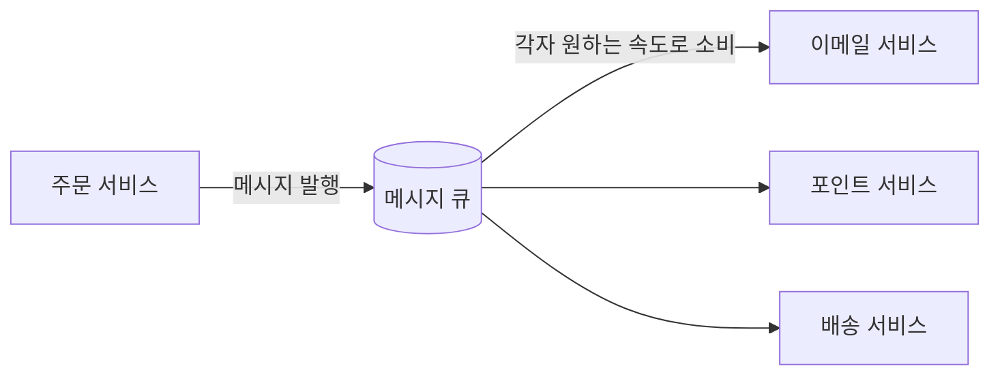
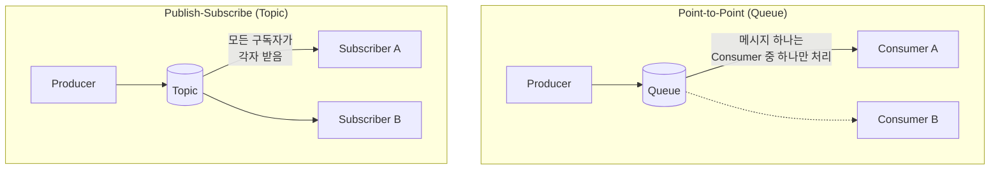

#CS #Infrastructure #면접

관련: [[메시지 큐 비교]] · [[../Data Structures/스택과 큐|스택과 큐]]

## 목차
- [[#메시지 큐란? — 우체국을 거쳐 편지 보내기]]
- [[#왜 필요할까? — 직접 호출(동기 통신)의 문제]]
- [[#메시지 큐를 쓰면 뭐가 좋아질까?]]
- [[#핵심 개념 — Producer, Consumer, Broker]]
- [[#두 가지 전달 방식 — Point-to-Point vs Publish-Subscribe]]
- [[#메시지 전달 보장 수준]]
- [[#실전에서는 어디에 쓰일까?]]
- [[#한 장 요약]]
- [[#Q&A로 복습하기]]

---

## 메시지 큐란? — 우체국을 거쳐 편지 보내기

친구에게 직접 찾아가서 물건을 전달하려면, **친구가 지금 집에 있어야만** 전달할 수 있어요. 친구가 없으면 물건을 든 채로 계속 기다리거나 다시 와야 해요. 하지만 **우체국(우편함)을 거쳐 보내면**, 친구가 지금 집에 있든 없든 **일단 우체국에 맡기기만 하면 내 할 일은 끝나요.** 친구는 나중에 여유가 될 때 우편함을 열어서 확인하면 돼요.

**메시지 큐(Message Queue, MQ)** 는 소프트웨어 시스템에서 이 "우체국" 역할을 해요. 한 서비스(발신자)가 다른 서비스(수신자)에게 **직접, 즉시** 연락하는 대신, **중간에 있는 큐에 메시지를 넣어두면**, 수신자는 자기 페이스대로 그 메시지를 꺼내서 처리해요.

---

## 왜 필요할까? — 직접 호출(동기 통신)의 문제

주문이 들어오면 "주문 저장 → 이메일 발송 → 포인트 적립 → 배송 시스템에 통보"를 모두 **직접 순서대로 호출**하는 코드를 생각해봐요.

```java
void order(Order order) {
    orderRepository.save(order);
    emailService.send(order); // 이메일 서버가 느리면? 여기서 전체가 지연됨
    pointService.addPoint(order);
    shippingService.notify(order); // 배송 시스템이 잠깐 다운되면? 주문 전체가 실패함!
}
```

이렇게 짜면 몇 가지 문제가 생겨요.

- **강한 결합(Tight Coupling)**: 주문 로직이 이메일, 포인트, 배송 시스템까지 전부 알아야 하고, 그중 하나라도 바뀌면 주문 코드도 영향을 받아요.
- **장애 전파**: 이메일 서버가 다운되면, 사실 주문 자체는 문제없이 처리될 수 있는데도 **전체 요청이 실패**해버려요.
- **응답 지연**: 배송 시스템 통보가 느리면, 사용자는 그만큼 오래 기다려야 해요. 정작 사용자에게 중요한 "주문 완료" 응답까지 늦어지는 거예요.
- **트래픽 폭주에 취약**: 갑자기 주문이 몰리면, 뒤에 걸린 이메일/배송 시스템도 동시에 그 폭주를 그대로 견뎌야 해요.

---

## 메시지 큐를 쓰면 뭐가 좋아질까?



- **느슨한 결합(Decoupling)**: 주문 서비스는 그냥 "주문이 생성됐다"는 메시지를 큐에 넣기만 하면 끝이에요. 이메일 서비스가 어떻게 동작하는지, 심지어 몇 개나 있는지도 몰라도 돼요.
- **장애 격리**: 이메일 서비스가 잠깐 다운돼도, 메시지는 큐에 그대로 쌓여있어요. 주문 처리 자체는 영향받지 않고, 이메일 서비스가 복구되면 밀린 메시지를 이어서 처리하면 돼요.
- **트래픽 버퍼링**: 갑자기 주문이 폭주해도, 큐가 메시지를 쌓아두는 **완충 역할**을 해줘서 뒤쪽 서비스들은 자기 처리 속도에 맞춰 여유 있게 소비할 수 있어요.
- **비동기 응답**: 사용자에게는 "주문 저장" 완료 즉시 응답을 주고, 이메일 발송 같은 부가 작업은 **뒤에서 비동기로** 처리할 수 있어요.

---

## 핵심 개념 — Producer, Consumer, Broker

- **Producer(생산자)**: 메시지를 만들어서 큐에 보내는 쪽. (예: 주문 서비스)
- **Consumer(소비자)**: 큐에서 메시지를 꺼내 처리하는 쪽. (예: 이메일 서비스)
- **Broker(브로커)**: 메시지를 받아서 저장해두고, Consumer에게 전달하는 중간 시스템 자체. (예: Kafka, RabbitMQ 서버)
- **Queue/Topic**: 메시지가 쌓이는 통로. ([[메시지 큐 비교]]에서 이 둘의 차이를 자세히 다뤄요.)

---

## 두 가지 전달 방식 — Point-to-Point vs Publish-Subscribe



- **Point-to-Point**: 메시지 하나는 **여러 Consumer 중 딱 하나에게만** 전달돼요. "이 작업, 아무나 한 명이 처리해줘"에 적합해요. (예: 여러 워커 중 하나가 이미지 리사이징 작업을 가져감)
- **Publish-Subscribe(Pub/Sub)**: 메시지 하나가 **구독 중인 모든 Consumer에게 각각** 전달돼요. "이 이벤트, 관심 있는 모두가 알아야 해"에 적합해요. (예: "주문 완료" 이벤트를 이메일 서비스와 포인트 서비스가 각자 받아서 처리)

---

## 메시지 전달 보장 수준

메시지가 네트워크를 오가는 과정에서 "정말 한 번만, 확실하게 전달됐는가"는 은근히 까다로운 문제예요. 보통 세 가지 수준으로 나눠요.

| 수준 | 의미 | 특징 |
|---|---|---|
| **At most once** (최대 한 번) | 전달이 안 될 수도 있지만, 중복은 없음 | 유실 가능성 있음, 가장 가벼움 |
| **At least once** (최소 한 번) | 반드시 전달은 되지만, 중복될 수 있음 | 가장 흔히 쓰임, Consumer가 중복 처리에 대비해야 함 |
| **Exactly once** (정확히 한 번) | 유실도 중복도 없음 | 가장 이상적이지만 구현이 복잡하고 비용이 큼 |

실무에서는 **At least once**가 가장 흔히 쓰여요. 대신 Consumer 쪽에서 **"같은 메시지를 두 번 받아도 결과가 같도록"** (예: 이미 처리한 주문 ID면 다시 처리하지 않기) 처리하는 **멱등성(Idempotency)** 설계를 함께 해줘요.

---

## 실전에서는 어디에 쓰일까?

- **비동기 작업 처리**: 이메일/알림 발송, 이미지 리사이징처럼 즉시 응답이 필요 없는 작업을 뒤로 미뤄서 처리.
- **마이크로서비스 간 통신**: 서비스끼리 직접 호출 대신 이벤트를 발행/구독하는 방식으로 느슨하게 연결.
- **로그/이벤트 수집**: 여러 서버에서 발생하는 로그를 한 곳에 모아 나중에 분석 시스템으로 전달.
- **트래픽 스파이크 완충**: 선착순 이벤트처럼 순간적으로 몰리는 요청을 큐에 쌓아두고 서버가 감당할 수 있는 속도로 처리.

구체적인 구현체(Kafka, RabbitMQ, Amazon SQS/SNS)들이 어떻게 다른지는 [[메시지 큐 비교]]에서 다뤄요.

---

## 한 장 요약

| 질문 | 답 |
|---|---|
| 메시지 큐란? | Producer가 보낸 메시지를 큐에 쌓아두고, Consumer가 자기 속도로 꺼내 처리하게 하는 중간 시스템 |
| 직접 호출의 문제는? | 강한 결합, 장애 전파, 응답 지연, 트래픽 폭주에 취약 |
| MQ가 주는 이점은? | 느슨한 결합, 장애 격리, 트래픽 버퍼링, 비동기 응답 |
| Point-to-Point vs Pub/Sub | 전자는 메시지가 Consumer 중 하나에게만, 후자는 모든 구독자에게 각각 전달 |
| 실무에서 흔히 쓰는 전달 보장 수준은? | At least once — 중복 가능성을 대비해 Consumer가 멱등하게 처리 |

---

## Q&A로 복습하기

### Q. 서비스 간 직접 호출 대신 메시지 큐를 쓰면 얻는 가장 큰 이점은?
A. Producer와 Consumer가 서로를 직접 몰라도 되는 느슨한 결합과, 한쪽 서비스에 장애가 나도 메시지가 큐에 쌓여있어 다른 부분에 영향을 주지 않는 장애 격리다.

### Q. Point-to-Point와 Publish-Subscribe의 차이는?
A. Point-to-Point는 메시지 하나가 여러 Consumer 중 하나에게만 전달되어 작업을 분산 처리할 때 적합하고, Publish-Subscribe는 메시지 하나가 구독 중인 모든 Consumer에게 각각 전달되어 이벤트를 여러 곳에 알려야 할 때 적합하다.

### Q. 실무에서 At least once 전달 보장을 쓸 때 Consumer가 신경 써야 하는 것은?
A. 같은 메시지가 중복으로 도착할 수 있으므로, 이미 처리한 메시지를 다시 받아도 결과가 달라지지 않도록 멱등하게 처리하는 설계가 필요하다.

### Q. 메시지 큐가 트래픽 폭주 상황에서 어떻게 도움이 되나?
A. 갑자기 몰리는 요청을 큐가 일단 쌓아두는 완충 역할을 해줘서, 뒤쪽 서비스들이 감당할 수 있는 속도로 나눠 처리할 수 있게 해준다.
