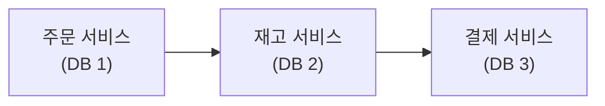
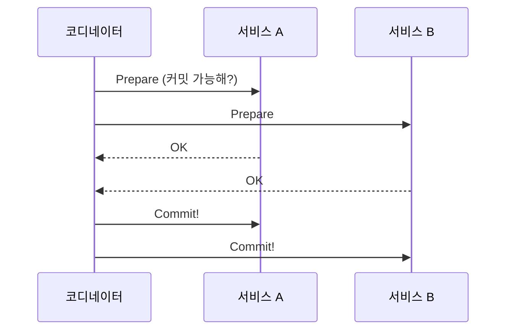
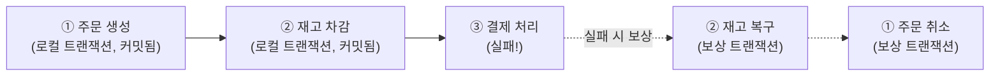
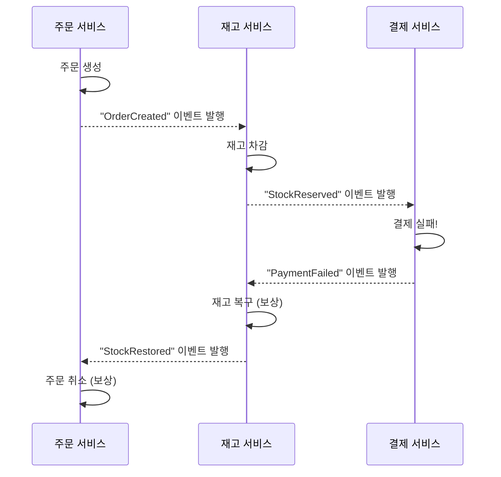
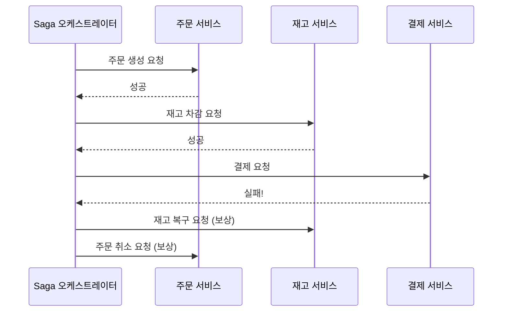

#CS #Infrastructure #면접

관련: [[시스템 설계 기초]] · [[../Database/트랜잭션|트랜잭션]] · [[../Spring/Kafka 실전 적용|Kafka 실전 적용]]

## 목차
- [[#왜 문제가 될까? — 여러 서비스에 걸친 트랜잭션]]
- [[#2PC(2단계 커밋)의 한계]]
- [[#Saga 패턴 — 트랜잭션을 여러 단계로 쪼개기]]
- [[#Choreography 방식 — 각자 알아서 반응하기]]
- [[#Orchestration 방식 — 지휘자가 순서를 관리하기]]
- [[#보상 트랜잭션 — 실패하면 거꾸로 되돌리기]]
- [[#한 장 요약]]
- [[#Q&A로 복습하기]]

---

## 왜 문제가 될까? — 여러 서비스에 걸친 트랜잭션

[[../Database/트랜잭션|트랜잭션]]에서 다룬 ACID는 **하나의 DB 안에서는** `@Transactional`로 깔끔하게 보장돼요. 그런데 MSA(마이크로서비스 아키텍처)에서는 "주문 생성 → 재고 차감 → 결제 처리"가 **각자 다른 서비스, 각자 다른 DB**에서 일어나요.



"재고 차감까지는 성공했는데 결제가 실패하면?" — **서로 다른 DB에 걸쳐 있는 작업들을 하나의 트랜잭션처럼 묶어서 다 같이 롤백**시키기가 어려워요. 각 DB는 서로의 존재를 모르고, 각자 자기 트랜잭션만 책임지니까요.

---

## 2PC(2단계 커밋)의 한계

전통적인 해법으로 **2PC(Two-Phase Commit, 2단계 커밋)** 가 있어요 — 모든 참여자에게 "커밋해도 되는지" 먼저 물어보고(Prepare), 전원이 동의하면 그때 실제로 커밋(Commit)하는 방식이에요.



이론적으로 안전하지만, 실무의 MSA 환경에서는 잘 안 써요.

- **모든 참여자가 응답할 때까지 잠금을 유지**해야 해서, 한 서비스라도 느려지면 **전체가 대기 상태로 묶여요.**
- 코디네이터 자체가 [[../Infrastructure/시스템 설계 기초|시스템 설계 기초]]에서 다룬 것처럼 **단일 장애점(Single Point of Failure)** 이 될 수 있어요.
- 서비스가 많아질수록 **동시성/성능이 급격히 나빠져요.**

그래서 MSA에서는 2PC 대신 **Saga 패턴**을 주로 써요.

---

## Saga 패턴 — 트랜잭션을 여러 단계로 쪼개기

**Saga**는 **"하나의 큰 트랜잭션을, 각자 독립적으로 커밋되는 여러 개의 작은 로컬 트랜잭션으로 쪼개고, 실패하면 이미 끝난 단계들을 거꾸로 되돌리는(보상)"** 방식이에요.



**핵심 아이디어**: "모두 성공 아니면 전부 롤백"이라는 [[../Database/트랜잭션|트랜잭션]]의 ACID를 그대로 지키는 대신, **"각 단계는 각자 커밋해버리고, 문제가 생기면 반대 방향으로 취소 작업(보상 트랜잭션)을 실행"** 해서 최종적으로 일관된 상태에 도달해요.

Saga를 구현하는 방식은 크게 두 가지예요.

---

## Choreography 방식 — 각자 알아서 반응하기

중앙에서 지휘하는 존재 없이, **각 서비스가 이벤트를 발행하고 구독하며 서로 반응**해요. [[../Spring/Kafka 실전 적용|Kafka 실전 적용]]에서 다룬 이벤트 발행/구독 구조를 그대로 활용해요.



- **장점**: 서비스 간 결합도가 낮아요. 새 서비스가 추가돼도 기존 서비스를 안 건드리고 이벤트만 구독하면 돼요.
- **단점**: 서비스가 많아지면 **"전체 흐름이 어떻게 되는지"를 한눈에 파악하기 어려워요** — 로직이 여러 서비스에 흩어져 있으니까요.

---

## Orchestration 방식 — 지휘자가 순서를 관리하기

**중앙에 "오케스트레이터"** 를 하나 두고, **이 오케스트레이터가 각 단계를 순서대로 호출하고, 실패하면 보상 절차도 직접 지휘**해요.



- **장점**: 전체 흐름이 오케스트레이터 코드 한 곳에 모여 있어서 **파악하고 디버깅하기 쉬워요.**
- **단점**: 오케스트레이터가 여러 서비스를 다 알아야 해서 **결합도가 높아지고**, 오케스트레이터 자체가 장애 지점이 될 수 있어요.

| 구분 | Choreography | Orchestration |
|---|---|---|
| 제어 방식 | 각 서비스가 이벤트로 알아서 반응 | 중앙 지휘자가 순서대로 명령 |
| 결합도 | 낮음 | 상대적으로 높음 |
| 흐름 파악 | 어려움(분산돼 있음) | 쉬움(한 곳에 모임) |
| 적합한 경우 | 단계가 적고 단순할 때 | 단계가 많고 복잡한 흐름일 때 |

---

## 보상 트랜잭션 — 실패하면 거꾸로 되돌리기

**보상 트랜잭션(Compensating Transaction)** 은 **"이미 커밋된 이전 단계를, 그 반대 의미의 새로운 트랜잭션으로 취소"** 하는 거예요. [[../Database/트랜잭션|트랜잭션]]의 롤백과 다른 점은, **롤백은 커밋 전에 아예 없던 일로 되돌리는 것**이지만, **보상 트랜잭션은 이미 커밋된 걸 취소하는 "새로운 작업"** 이라는 거예요.

```java
// 재고 차감의 보상 트랜잭션 예시
void compensateStockReservation(Long orderId) {
    stockRepository.increaseStock(orderId); // "차감"의 반대인 "복구"를 새로 실행
}
```

> **주의**: 보상 트랜잭션을 설계할 때는 **"이미 다른 곳에 영향을 준 작업(예: 이메일 발송)은 완벽하게 되돌릴 수 없다"** 는 현실적인 한계도 고려해야 해요. 그래서 Saga는 [[../Spring/Kafka 실전 적용|Kafka 실전 적용]]에서 다룬 **멱등성** 설계와도 밀접하게 연결돼요 — 보상 이벤트가 중복 처리돼도 안전해야 하니까요.

---

## 한 장 요약

| 질문 | 답 |
|---|---|
| MSA에서 분산 트랜잭션이 어려운 이유는? | 각 서비스가 서로 다른 DB를 쓰기 때문에 하나의 ACID 트랜잭션으로 묶기 어려움 |
| 2PC의 한계는? | 모든 참여자가 응답할 때까지 대기해야 해서 느리고, 코디네이터가 단일 장애점이 됨 |
| Saga 패턴의 핵심은? | 큰 트랜잭션을 로컬 트랜잭션들로 쪼개고, 실패 시 보상 트랜잭션으로 거꾸로 되돌림 |
| Choreography vs Orchestration | 전자는 이벤트로 각자 반응(낮은 결합도), 후자는 중앙 지휘자가 순서 관리(흐름 파악 쉬움) |
| 보상 트랜잭션이란? | 이미 커밋된 이전 단계를 취소하는 새로운 트랜잭션 (롤백과 다름) |

---

## Q&A로 복습하기

### Q. 2PC가 MSA 환경에서 실무적으로 잘 쓰이지 않는 이유는?
A. 모든 참여 서비스가 커밋 가능 여부를 응답할 때까지 전체가 대기 상태로 묶여 성능이 떨어지고, 코디네이터가 단일 장애점이 되어 시스템 전체의 안정성을 위협할 수 있기 때문이다.

### Q. Saga 패턴과 일반적인 DB 트랜잭션의 근본적인 차이는?
A. 일반 트랜잭션은 모두 성공하거나 전부 롤백되는 원자성을 보장하지만, Saga는 각 단계를 독립적인 로컬 트랜잭션으로 각자 커밋시키고, 실패하면 이미 커밋된 단계들을 보상 트랜잭션으로 하나씩 되돌리는 방식이다.

### Q. Choreography 방식의 단점은?
A. 각 서비스가 이벤트에 반응하는 방식으로 로직이 여러 서비스에 흩어져 있어서, 전체 트랜잭션의 흐름을 한눈에 파악하거나 디버깅하기 어렵다.

### Q. Orchestration 방식이 흐름 파악에 유리한 이유는?
A. 전체 단계의 순서와 보상 절차를 중앙의 오케스트레이터 코드 한 곳에서 관리하기 때문에, 여러 서비스에 흩어진 로직을 따라다니지 않고도 전체 흐름을 이해할 수 있다.

### Q. 보상 트랜잭션이 롤백과 다른 점은?
A. 롤백은 커밋되기 전 상태로 되돌리는 것이지만, 보상 트랜잭션은 이미 커밋되어 확정된 작업을 취소하기 위해 그 반대 의미의 새로운 트랜잭션을 실행하는 것이다.
