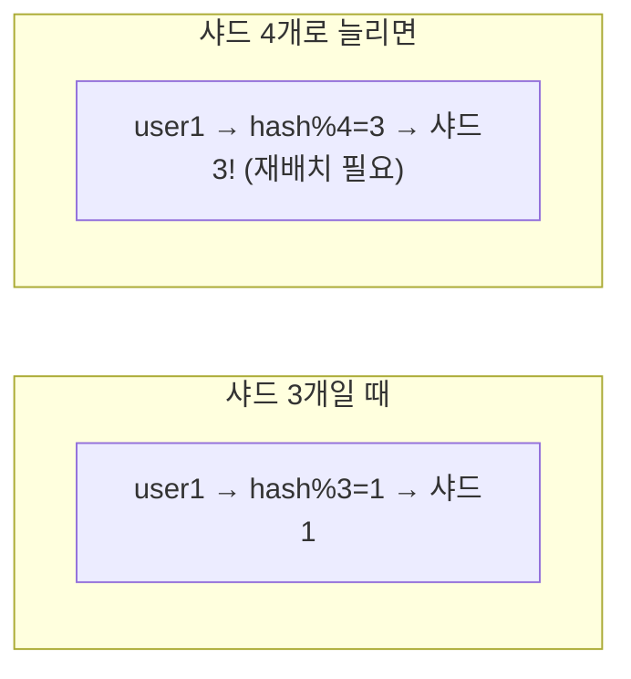
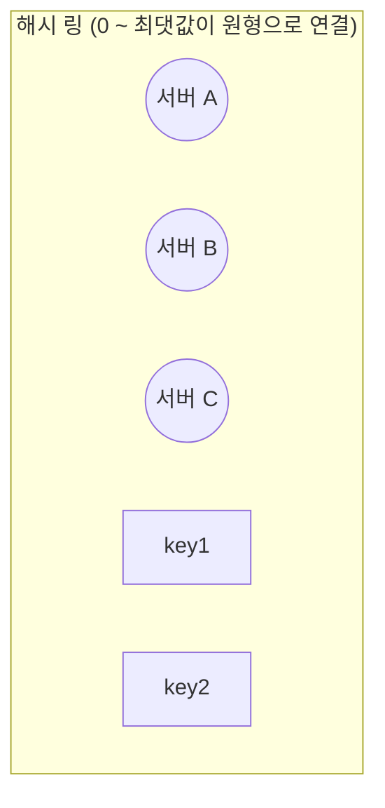
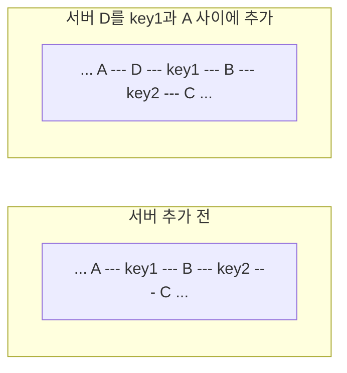
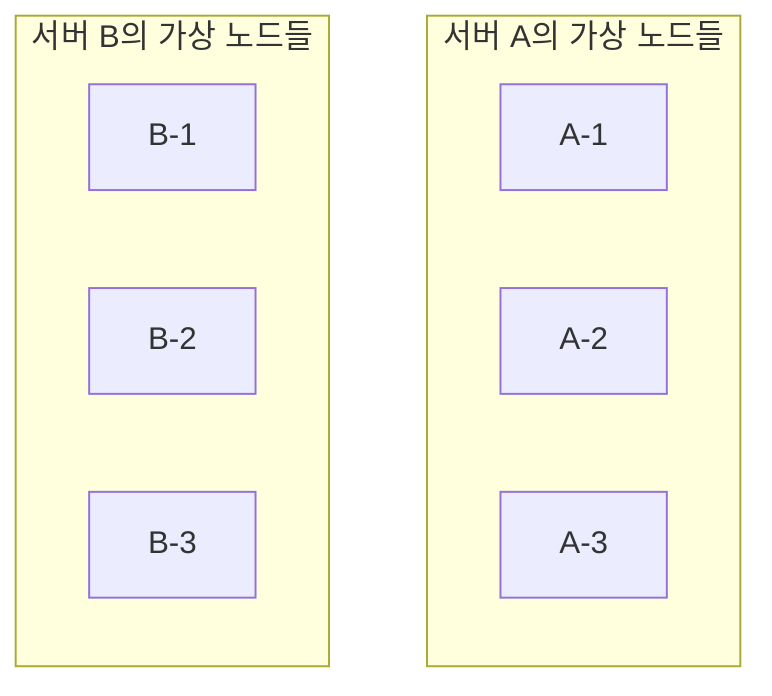
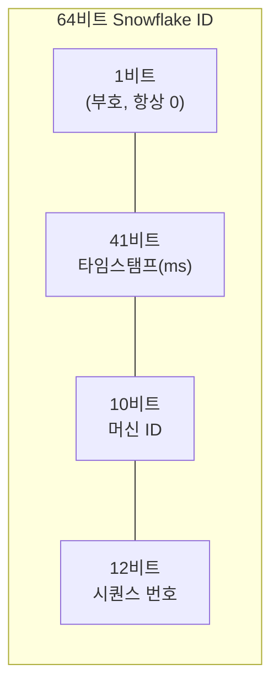

#CS #Infrastructure #면접

관련: [[시스템 설계 기초]] · [[../Database/인덱스|인덱스]]

[[시스템 설계 기초]]에서 다룬 샤딩(데이터를 여러 DB로 나눠 저장하는 것)을 실제로 구현할 때 마주치는 두 가지 핵심 문제 — **"어느 샤드에 저장할지"** 와 **"샤드들에 겹치지 않는 ID를 어떻게 부여할지"** — 를 다뤄요.

## 목차
- [[#기존 샤딩 방식의 문제 — 나머지 연산의 함정]]
- [[#Consistent Hashing — 해시 링에 노드를 배치하기]]
- [[#가상 노드 — 분산을 더 고르게 만들기]]
- [[#분산 ID 생성 문제 — 흩어진 DB에서 겹치지 않는 ID 만들기]]
- [[#Snowflake — 정렬 가능한 분산 ID]]
- [[#한 장 요약]]
- [[#Q&A로 복습하기]]

---

## 기존 샤딩 방식의 문제 — 나머지 연산의 함정

가장 단순한 샤딩 방법은 **"key를 해시한 값을 샤드 개수로 나눈 나머지"** 로 어느 샤드에 저장할지 정하는 거예요.

```java
int shardIndex = hash(userId) % numberOfShards; // 샤드 3개면 % 3
```

문제는 **샤드 개수가 바뀌는 순간**이에요. 샤드를 3개에서 4개로 늘리면, `% 3`이 `% 4`로 바뀌면서 **거의 모든 key의 나머지 값이 달라져요.**



**거의 모든 데이터를 다시 계산해서 새 샤드로 옮겨야 해요.** 서버 몇 대 늘리는 것뿐인데 전체 데이터의 대부분을 재배치해야 한다는 건, [[시스템 설계 기초]]에서 다룬 수평 확장의 장점(유연하게 서버를 늘릴 수 있음)을 크게 훼손해요.

---

## Consistent Hashing — 해시 링에 노드를 배치하기

**Consistent Hashing(일관된 해싱)** 은 이 문제를 해결해요. 핵심 아이디어는 **"샤드(서버)도, key도 모두 하나의 원형 해시 공간(해시 링) 위에 함께 배치하자"** 는 거예요.



1. 서버들도 해시값을 계산해서 **링 위의 한 지점**에 배치해요.
2. key도 마찬가지로 해시값을 계산해서 링 위의 한 지점에 놓고, **거기서 시계 방향으로 가장 가까운 서버**가 그 key를 담당해요.



**서버를 하나 추가하면, 그 서버 바로 앞뒤 구간에 있던 key들만 옮겨지고, 나머지 대부분의 key는 영향을 안 받아요.** 나머지 연산 방식과 달리, **전체 재배치가 아니라 국소적인 재배치**로 끝나는 게 핵심이에요.

---

## 가상 노드 — 분산을 더 고르게 만들기

서버를 링 위에 딱 하나의 점으로만 배치하면, **우연히 서버들이 한쪽에 몰리거나, 서버마다 담당하는 구간 크기가 들쭉날쭉**할 수 있어요.

**가상 노드(Virtual Node)** 는 서버 하나를 **링 위에 여러 개의 가상 지점으로 복제해서 배치**해요.



가상 노드가 많을수록 **링 전체에 서버들이 훨씬 고르게 흩어져서, 각 서버가 담당하는 데이터 양도 더 균등**해져요. 실제 카산드라(Cassandra), 다이나모(DynamoDB) 같은 분산 시스템들이 이 방식을 써요.

---

## 분산 ID 생성 문제 — 흩어진 DB에서 겹치지 않는 ID 만들기

샤딩으로 데이터를 여러 DB에 나눠 저장하면, 또 다른 문제가 생겨요 — **각 DB의 auto-increment(자동 증가) ID가 서로 겹쳐버려요.**

```
샤드 1: id=1, 2, 3, 4 ...
샤드 2: id=1, 2, 3, 4 ...  ← 샤드 1의 id=1과 충돌!
```

각 DB가 독립적으로 `1, 2, 3...`을 매기기 때문에, **여러 샤드에 걸쳐 유일해야 할 ID가 겹쳐버리는** 거예요.

**흔히 떠올리는 대안, UUID**는 겹칠 걱정은 없지만 다른 문제가 있어요. [[../Database/인덱스|인덱스]]에서 다룬 **B-Tree 인덱스는 정렬된 순서로 데이터를 저장**하는데, UUID는 **완전히 무작위**라서 새 데이터를 넣을 때마다 인덱스 트리 여기저기에 삽입돼요 — **인덱스 성능이 떨어지고 저장 공간도 더 차지**해요.

---

## Snowflake — 정렬 가능한 분산 ID

트위터가 공개한 **Snowflake** 방식은 이 문제들을 동시에 해결해요 — **여러 서버가 각자 알아서 ID를 만들어도 절대 겹치지 않으면서, 동시에 시간순으로 정렬까지 되는** ID예요.



- **타임스탬프(41비트)**: 이 ID가 생성된 시각(밀리초). **시간순 정렬이 자연스럽게 보장**돼요 — B-Tree 인덱스와도 궁합이 좋아요.
- **머신 ID(10비트)**: ID를 생성하는 서버(또는 샤드)를 구분하는 값. **서버마다 다른 머신 ID를 쓰기 때문에 서로 절대 안 겹쳐요.**
- **시퀀스 번호(12비트)**: 같은 서버가, 같은 밀리초 안에 여러 ID를 만들 때 구분하는 일련번호.

```java
long id = (timestamp << 22) | (machineId << 12) | sequence; // 비트 조합으로 하나의 long 값 생성
```

이 조합 덕분에 **각 서버가 다른 서버와 통신(조율)할 필요 없이 각자 독립적으로 ID를 만들어도 전역적으로 유일**하고, **시간순으로 대략 정렬까지** 돼요. Discord, 인스타그램 등 대규모 서비스들이 이 방식(또는 변형)을 실제로 사용해요.

---

## 한 장 요약

| 질문 | 답 |
|---|---|
| 나머지 연산 샤딩의 문제는? | 샤드 개수가 바뀌면 거의 모든 데이터를 재배치해야 함 |
| Consistent Hashing의 핵심 아이디어는? | 서버와 key를 같은 해시 링에 배치, 서버 추가/제거 시 국소적으로만 재배치 |
| 가상 노드가 필요한 이유는? | 서버를 링에 여러 지점으로 복제해 데이터 분산을 더 균등하게 만듦 |
| 분산 ID 생성이 어려운 이유는? | 각 샤드의 auto-increment가 독립적이라 ID가 겹칠 수 있음 |
| UUID의 단점은? | 무작위라 B-Tree 인덱스 성능이 떨어짐 |
| Snowflake ID의 구성은? | 타임스탬프 + 머신 ID + 시퀀스 번호 — 유일성과 시간순 정렬을 동시에 확보 |

---

## Q&A로 복습하기

### Q. 나머지 연산(hash % N) 기반 샤딩의 근본적인 문제는?
A. 샤드 개수(N)가 바뀌면 나머지 값이 대부분 달라지기 때문에, 서버를 한두 대 늘리는 것만으로도 거의 모든 데이터를 다른 샤드로 재배치해야 하는 비효율이 발생한다.

### Q. Consistent Hashing이 이 문제를 어떻게 완화하나?
A. 서버와 key를 같은 해시 링 위에 배치하고, key는 링에서 시계 방향으로 가장 가까운 서버가 담당하게 한다. 서버를 추가/제거해도 그 서버 인접 구간의 key만 영향을 받고 나머지는 그대로 유지되어, 재배치 범위가 국소적으로 줄어든다.

### Q. 가상 노드를 쓰지 않고 서버 하나를 링 위에 한 점으로만 배치하면 어떤 문제가 생기나?
A. 서버들이 링 위에 고르지 않게 분포되어 특정 서버가 담당하는 데이터 구간이 다른 서버보다 훨씬 커지는 등, 데이터 분산이 불균등해질 수 있다.

### Q. 샤딩된 환경에서 UUID를 기본 키로 쓸 때의 단점은?
A. UUID는 완전히 무작위 값이라 B-Tree 인덱스에 삽입될 때 정렬된 위치가 아니라 무작위 위치에 계속 끼어들게 되어, 인덱스 성능이 떨어지고 저장 공간도 더 차지하게 된다.

### Q. Snowflake ID가 유일성과 정렬 가능성을 동시에 확보할 수 있는 이유는?
A. ID 안에 생성 시각(타임스탬프)이 포함되어 있어 시간순 정렬이 자연스럽게 보장되고, 서버를 구분하는 머신 ID와 같은 밀리초 내 순번을 구분하는 시퀀스 번호가 함께 조합되어 여러 서버가 서로 조율하지 않아도 절대 겹치지 않는 ID를 만들 수 있기 때문이다.
