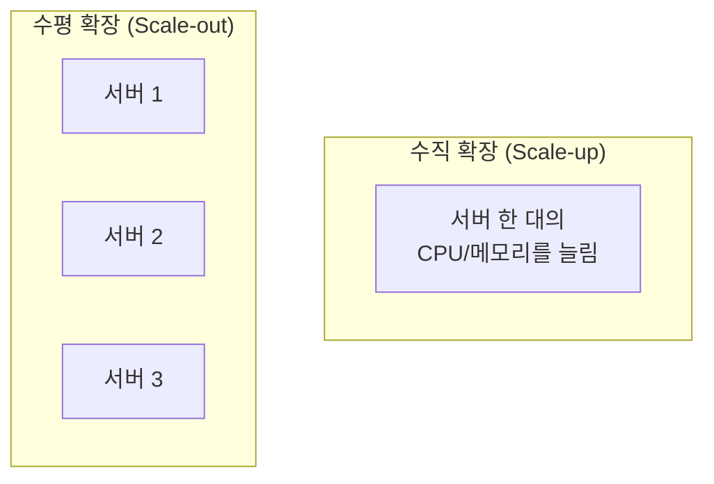
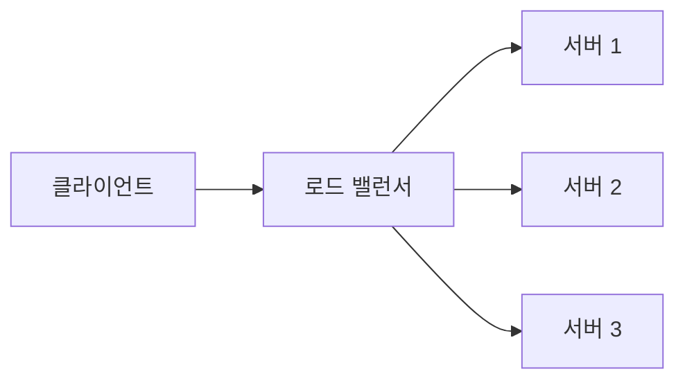
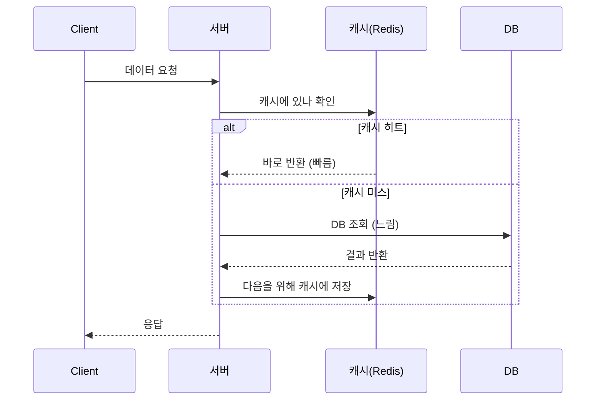
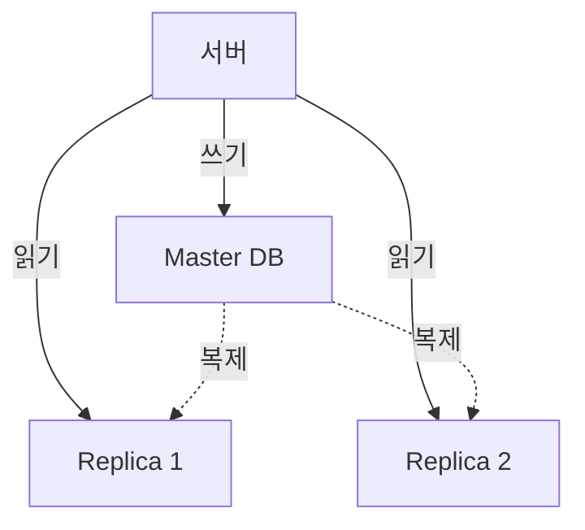
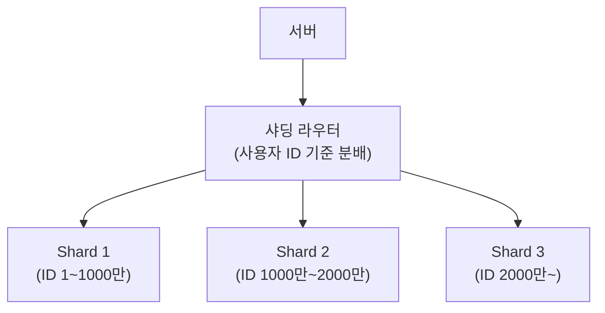
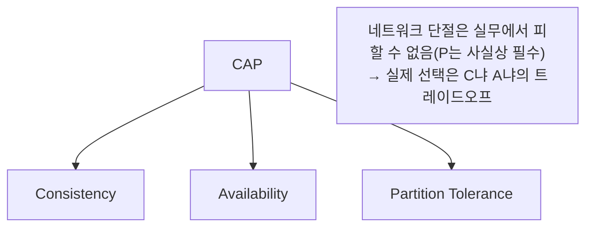
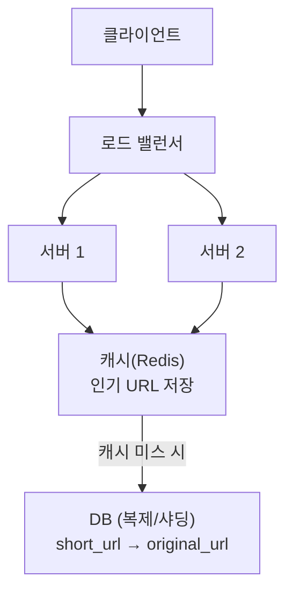

#CS #Infrastructure #면접

관련: [[웹 서버와 WAS]] · [[메시지 큐]] · [[../Java/Redis 클라이언트|Redis 클라이언트]] · [[../Database/동시성 이슈와 락|동시성 이슈와 락]] · [[트래픽 제어와 장애 격리]] · [[분산 트랜잭션과 Saga 패턴]] · [[관찰 가능성과 분산 트레이싱]] · [[샤딩 심화 — Consistent Hashing과 분산 ID]]

## 목차
- [[#시스템 설계란? — "어떻게 짤까"가 아니라 "어떻게 버틸까"]]
- [[#확장성 — 수직 확장 vs 수평 확장]]
- [[#로드 밸런싱 — 여러 서버에 트래픽 나누기]]
- [[#캐싱 — 매번 DB까지 안 가기]]
- [[#데이터베이스 확장 — 복제와 샤딩]]
- [[#CAP 이론 — 셋 다 가질 수는 없다]]
- [[#종합 예시 — URL 단축 서비스 설계해보기]]
- [[#한 장 요약]]
- [[#Q&A로 복습하기]]

---

## 시스템 설계란? — "어떻게 짤까"가 아니라 "어떻게 버틸까"

지금까지 이 vault에서 다룬 대부분의 내용은 **"코드 하나를 어떻게 올바르게, 효율적으로 짤까"** 에 가까워요([[../Algorithms/시간복잡도|시간복잡도]], [[../Data Structures/자료구조|자료구조]] 등). **시스템 설계(System Design)** 는 질문의 층위가 달라요 — **"사용자가 100만 명이 되어도, 서버 하나가 죽어도 서비스가 안 죽으려면, 전체 구조를 어떻게 짤까"** 를 다뤄요.

> **비유**: 코딩 인터뷰가 "튼튼한 벽돌 하나를 잘 만드는 법"을 묻는 거라면, 시스템 설계는 "그 벽돌로 무너지지 않는 건물을 어떻게 쌓을까"를 묻는 거예요.

이 문서는 시스템 설계의 **공통 재료(확장성, 로드 밸런싱, 캐싱, DB 확장, CAP)** 를 먼저 익히고, 마지막에 이걸 조합해 간단한 서비스 하나를 설계해봐요.

---

## 확장성 — 수직 확장 vs 수평 확장

트래픽이 늘어나면 서버가 더 많은 요청을 처리해야 해요. 방법은 두 가지예요.

| 구분 | 수직 확장 (Vertical Scaling) | 수평 확장 (Horizontal Scaling) |
|---|---|---|
| 방법 | 서버 한 대의 성능(CPU/RAM)을 업그레이드 | 서버 대수를 늘림 |
| 한계 | 아무리 좋은 장비도 물리적 상한이 있음 | 이론상 계속 늘릴 수 있음 |
| 장애 대응 | 그 한 대가 죽으면 전체가 죽음 | 한 대가 죽어도 나머지가 버팀 |
| 복잡도 | 낮음 (그냥 장비만 바꾸면 됨) | 높음 (여러 서버 간 트래픽 분산, 상태 동기화 필요) |

실무에서는 **수평 확장이 기본 전략**이에요. 그런데 서버가 여러 대라는 건, 결국 **"어떤 요청을 어느 서버로 보낼지"** 를 결정해줄 무언가가 필요하다는 뜻이에요 — 그게 로드 밸런서예요.

---

## 로드 밸런싱 — 여러 서버에 트래픽 나누기

**로드 밸런서(Load Balancer)** 는 [[웹 서버와 WAS]]에서 다룬 것처럼, 클라이언트 요청을 받아서 **뒤에 있는 여러 서버 중 하나에게 나눠주는** 역할을 해요.

대표적인 분배 방식이에요.

- **라운드 로빈(Round Robin)**: 순서대로 돌아가며 배정. 가장 단순함.
- **최소 연결(Least Connections)**: 현재 처리 중인 연결이 가장 적은 서버로 배정.
- **IP Hash**: 같은 클라이언트는 항상 같은 서버로 보냄 (세션 유지가 필요할 때 유용).

로드 밸런서는 또한 **헬스 체크(Health Check)** 로 서버들이 살아있는지 주기적으로 확인해서, **죽은 서버로는 트래픽을 안 보내는** 안전장치 역할도 해요.

---

## 캐싱 — 매번 DB까지 안 가기

서버를 늘려도, 다들 같은 DB를 바라본다면 결국 **DB가 병목**이 될 수 있어요. **캐시(Cache)** 는 자주 조회되는 데이터를 **DB보다 훨씬 빠른 곳(메모리)에 미리 저장**해두는 방법이에요.

실무에서는 [[../Java/Redis 클라이언트|Redis 클라이언트]]에서 다룬 **Redis**를 캐시 계층으로 흔히 써요. 다만 캐시는 원본(DB)과 **내용이 어긋날 수 있다(캐시 정합성 문제)** 는 트레이드오프가 있어서, "얼마나 오래된 데이터까지 허용할지"(TTL 설정)를 잘 정해야 해요.

---

## 데이터베이스 확장 — 복제와 샤딩

캐시로도 감당이 안 될 만큼 트래픽이 커지면, DB 자체를 확장해야 해요.

**복제(Replication)**: 읽기 요청이 압도적으로 많을 때, DB를 **원본(Master) + 복사본(Replica) 여러 개**로 구성해요. 쓰기는 Master에만, 읽기는 여러 Replica에 나눠서 보내요.

**샤딩(Sharding)**: 데이터 자체가 너무 커서 한 대에 다 담기 어려울 때, **데이터를 여러 DB로 쪼개서 나눠 저장**해요 (예: 사용자 ID 앞자리에 따라 DB1, DB2, DB3에 분산 저장).

> 위 예시처럼 "ID 범위로 나누는" 단순한 방식은 샤드를 늘리거나 줄일 때 재배치가 번거로워요. 이 문제를 완화하는 Consistent Hashing과, 여러 샤드에서 겹치지 않는 ID를 만드는 방법(Snowflake 등)은 [[샤딩 심화 — Consistent Hashing과 분산 ID]]에서 자세히 다뤄요.

| 구분 | 복제(Replication) | 샤딩(Sharding) |
|---|---|---|
| 목적 | 읽기 부하 분산 | 데이터 저장 용량 + 쓰기 부하 분산 |
| 데이터 | 모든 DB가 같은 데이터를 가짐 | DB마다 서로 다른 일부 데이터만 가짐 |
| 단점 | 복제 지연(Replication Lag) 가능 | 여러 샤드에 걸친 조회/조인이 복잡해짐 |

---

## CAP 이론 — 셋 다 가질 수는 없다

분산 시스템(서버/DB가 여러 대로 나뉜 시스템)은 다음 세 가지 속성을 **동시에 완벽히 만족시킬 수 없다**는 게 **CAP 이론**이에요.

- **일관성(Consistency)**: 어느 노드에 물어봐도 항상 최신의, 같은 데이터를 보게 됨.
- **가용성(Availability)**: 일부 노드가 장애가 나도, 항상 응답은 받을 수 있음.
- **파티션 허용성(Partition Tolerance)**: 노드 간 네트워크가 끊겨도 시스템 전체는 계속 동작함.

현실의 분산 시스템에서는 **네트워크 단절(P)이 언젠가 반드시 일어난다**고 가정해야 해서, 실질적인 선택은 **"단절 상황에서 일관성(C)을 지킬지, 가용성(A)을 지킬지"** 의 문제가 돼요.

- **CP 선택**: 데이터가 안 맞을 바엔 차라리 응답을 거부(은행 거래처럼 정확성이 생명인 경우).
- **AP 선택**: 데이터가 살짝 안 맞더라도 일단 응답은 해줌(SNS 좋아요 수처럼 약간의 오차를 허용할 수 있는 경우).

---

## 종합 예시 — URL 단축 서비스 설계해보기

지금까지의 재료를 조합해서, `bit.ly` 같은 **URL 단축 서비스**를 간단히 설계해봐요.

- **요청 흐름**: 사용자가 짧은 URL로 접속 → 로드 밸런서가 서버로 분배 → 서버가 먼저 캐시 확인 → 없으면 DB 조회 후 원래 URL로 리다이렉트.
- **짧은 URL 생성**: 원본 URL을 해시하거나, 자동 증가하는 숫자를 Base62(0-9, a-z, A-Z)로 인코딩해서 `abc123` 같은 짧은 문자열을 만들어요.
- **읽기 위주 서비스**: URL 단축은 "한 번 만들고 계속 조회"되는 패턴이 많아서, **캐시 히트율이 매우 중요**해요. DB도 읽기가 많으니 **복제**가 잘 맞아요.
- **가용성 우선**: 리다이렉트가 1초 느리게 최신 데이터를 반영하는 것보다, **서비스가 아예 안 되는 게 더 치명적**이라 CAP 중 **AP**에 가까운 선택이 자연스러워요.

---

## 한 장 요약

| 질문 | 답 |
|---|---|
| 수직 vs 수평 확장 | 수직은 장비 성능 업그레이드(한계 있음), 수평은 서버 대수 증가(장애 대응에 유리) |
| 로드 밸런서의 역할은? | 여러 서버로 트래픽을 분산하고, 헬스 체크로 죽은 서버를 제외 |
| 캐싱이 필요한 이유는? | DB 병목을 줄이기 위해 자주 조회되는 데이터를 빠른 메모리에 미리 저장 |
| 복제 vs 샤딩 | 복제는 읽기 부하 분산(같은 데이터 여러 벌), 샤딩은 저장 용량/쓰기 부하 분산(데이터를 나눠 저장) |
| CAP 이론의 핵심은? | 분산 시스템은 C/A/P를 동시에 완벽히 만족 못 함, 실질적으로는 C와 A 사이의 트레이드오프 |

---

## Q&A로 복습하기

### Q. 수평 확장이 수직 확장보다 실무에서 선호되는 이유는?
A. 수직 확장은 장비 한 대의 성능에 물리적 한계가 있고 그 한 대가 죽으면 전체 서비스가 멈추지만, 수평 확장은 서버를 계속 늘릴 수 있고 한 대가 죽어도 나머지 서버가 서비스를 유지할 수 있기 때문이다.

### Q. 캐시를 쓸 때 신경 써야 할 트레이드오프는?
A. 캐시는 원본 데이터(DB)보다 오래된 값을 보여줄 수 있는 정합성 문제가 있다. 그래서 얼마나 오래된 데이터까지 허용할지(TTL) 등을 서비스 특성에 맞게 정해야 한다.

### Q. 복제(Replication)와 샤딩(Sharding)의 차이는?
A. 복제는 같은 데이터를 여러 DB(Master+Replica)에 복사해 읽기 부하를 분산하는 방법이고, 샤딩은 서로 다른 데이터를 여러 DB에 나눠 저장해 저장 용량과 쓰기 부하를 분산하는 방법이다.

### Q. CAP 이론에서 왜 실질적인 선택이 C와 A 사이의 트레이드오프로 좁혀지나?
A. 분산 시스템에서 네트워크 단절(Partition)은 현실적으로 피할 수 없는 상황으로 가정해야 하기 때문에, 남은 선택은 그 단절 상황에서 일관성(C)을 지킬지 가용성(A)을 지킬지의 문제가 된다.

### Q. URL 단축 서비스 설계에서 캐시와 복제가 특히 중요한 이유는?
A. URL 단축 서비스는 한 번 생성된 URL이 이후 반복적으로 조회되는 읽기 위주의 패턴이 강하기 때문에, 캐시 히트율을 높이고 읽기 부하를 여러 DB 복제본으로 분산하는 것이 성능에 큰 영향을 준다.
