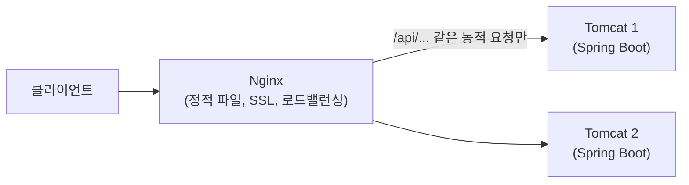

#CS #Infrastructure #면접

관련: [[../Spring/서블릿|서블릿]] · [[RESTful API]] · [[../Operating System/프로세스와 스레드|프로세스와 스레드]]

## 목차
- [[#웹 서버와 WAS — 뭐가 다를까?]]
- [[#웹 서버(Web Server) — 정적 파일과 리버스 프록시]]
- [[#WAS(Web Application Server) — 동적 요청을 실행하는 곳]]
- [[#왜 웹 서버와 WAS를 같이 쓸까?]]
- [[#Nginx vs Apache httpd — 웹 서버끼리도 다르다]]
- [[#이름이 헷갈리는 것 — Apache HTTP Server vs Apache Tomcat]]
- [[#한 장 요약]]
- [[#Q&A로 복습하기]]

---

## 웹 서버와 WAS — 뭐가 다를까?

"요청을 받아서 응답한다"는 점에서 **웹 서버(Web Server)** 와 **WAS(Web Application Server)** 는 비슷해 보이지만, **할 수 있는 일이 근본적으로 달라요.**

> **비유**: 식당의 **안내 데스크(웹 서버)** 는 손님을 맞이하고, 미리 만들어둔 메뉴판이나 물티슈처럼 "그냥 바로 내줄 수 있는 것"은 즉시 건네줘요. 하지만 "직접 조리해야 하는 요리"는 자기가 만들 수 없으니 **주방(WAS)** 으로 주문을 넘겨요. 주방은 실제로 재료를 손질하고 로직(레시피)에 따라 요리를 만들어서 다시 내보내요.

핵심 차이는 **코드를 실행할 수 있는가**예요.

- **웹 서버**: HTML, CSS, JS, 이미지 같은 **정적인 파일을 그대로 응답**해요. 요청을 다른 서버로 전달하는 **리버스 프록시(Reverse Proxy)** 역할도 잘해요. 하지만 자바 코드 같은 **애플리케이션 로직은 실행하지 못해요.**
- **WAS**: 웹 서버 기능도 어느 정도 갖췄지만, 핵심은 **서블릿(자바 코드)을 실제로 실행해서 동적인 응답을 만들어낼 수 있다**는 거예요. ([[../Spring/서블릿|서블릿]] 참고)

---

## 웹 서버(Web Server) — 정적 파일과 리버스 프록시

대표적인 웹 서버로 **Nginx**, **Apache HTTP Server(httpd)** 가 있어요.

- 이미 만들어진 파일(HTML, 이미지 등)을 디스크에서 읽어 그대로 응답하는 데 최적화돼 있어요.
- 앞단에서 요청을 받아 뒤쪽의 다른 서버로 **전달만** 해주는 리버스 프록시로도 자주 써요.
- 여러 대의 서버로 트래픽을 나눠주는 **로드 밸런싱**, HTTPS 인증서 처리(**SSL Termination**)도 웹 서버가 흔히 맡는 역할이에요.

---

## WAS(Web Application Server) — 동적 요청을 실행하는 곳

대표적인 WAS로 **Tomcat**이 있어요 ([[../Spring/서블릿|서블릿]]에서 다룬 서블릿 컨테이너가 바로 이거예요).

- "로그인한 사용자에 따라 다른 화면 보여주기", "DB에서 최신 재고 조회해서 응답하기"처럼 **매번 계산이 필요한(동적인) 응답**을 만들어요.
- 이걸 위해 자바 코드(서블릿, 그리고 그 위에 올라가는 Spring MVC의 Controller)를 **직접 실행**할 수 있어요.
- Spring Boot는 이 톰캣을 애플리케이션 `jar` 안에 내장시켜서, 별도 설치 없이 바로 실행할 수 있게 해줘요 ([[../Spring/Spring|Spring]] 참고).

> **오해 주의**: "톰캣이 자바에 내장돼 있다"는 표현은 틀려요. 톰캣은 자바(JDK)와 무관한 별개의 프로그램이고, **Spring Boot가 그걸 자기 jar 안에 포함(내장)** 시켰을 뿐이에요.

---

## 왜 웹 서버와 WAS를 같이 쓸까?

WAS(Tomcat) 하나만으로도 정적 파일 응답과 동적 요청 처리를 다 할 수는 있어요. 그런데도 실무에서 앞단에 웹 서버를 따로 두는 이유가 있어요.

- **부담 분산**: 이미지·CSS 같은 정적 파일은 웹 서버가 처리해서, WAS는 무거운 동적 로직 처리에만 집중할 수 있어요.
- **로드 밸런싱**: 뒤에 WAS 서버를 여러 대 둘 경우, 웹 서버가 트래픽을 나눠줄 수 있어요.
- **보안/SSL 처리**: HTTPS 암복호화 같은 부담스러운 작업을 앞단에서 한 번에 처리해줘요.
- **성능**: Nginx 같은 웹 서버는 대량의 동시 연결을 WAS보다 훨씬 가볍게 처리할 수 있어요.

---

## Nginx vs Apache httpd — 웹 서버끼리도 다르다

같은 "웹 서버" 카테고리 안에서도 Nginx와 Apache httpd는 **요청을 처리하는 방식**이 달라요.

| 구분       | Apache httpd                                                             | Nginx                                              |                           |
| -------- | ------------------------------------------------------------------------ | -------------------------------------------------- | ------------------------- |
| 처리 방식    | 요청(연결)마다 프로세스/스레드를 할당                                                    | 이벤트 기반(비동기, non-blocking) — 적은 수의 프로세스가 다수의 연결을 처리 |                           |
| 동시 연결 처리 | 연결이 많아지면 프로세스/스레드 수가 늘어 무거워질 수 있음 ([[../Operating System/프로세스와 스레드]] 참고) | 프로세스와 스레드]] 참고)                                    | 적은 자원으로 대량의 동시 연결을 가볍게 처리 |
| 성향       | 모듈이 풍부해서 세밀한 설정에 강함                                                      | 가볍고 빠름, 최근 대규모 트래픽 환경에서 더 선호됨                      |                           |

---

## 이름이 헷갈리는 것 — Apache HTTP Server vs Apache Tomcat

**둘 다 Apache 재단 프로젝트라서 이름이 겹치지만, 역할은 완전히 달라요.**

| | Apache HTTP Server (httpd) | Apache Tomcat |
|---|---|---|
| 카테고리 | 웹 서버 | WAS (서블릿 컨테이너) |
| 자바 코드 실행 | ❌ | ✅ |
| Nginx와의 관계 | 같은 카테고리(경쟁 관계) | 다른 카테고리 |

그냥 "아파치 서버"라고 하면 보통 httpd를 가리키는 경우가 많으니, 문맥으로 어떤 걸 말하는지 구분해야 해요.

---

## 한 장 요약

| 질문 | 답 |
|---|---|
| 웹 서버와 WAS의 핵심 차이는? | 애플리케이션 코드(서블릿)를 실행할 수 있는가 — WAS만 가능 |
| 웹 서버가 잘하는 일은? | 정적 파일 응답, 리버스 프록시, 로드 밸런싱, SSL 처리 |
| WAS가 잘하는 일은? | 서블릿/컨트롤러 코드를 실행해 동적 응답 생성 |
| 왜 둘을 같이 쓰나? | 정적/동적 처리를 분리해 WAS 부담을 줄이고, 로드 밸런싱·보안도 앞단에서 처리 |
| Nginx와 Apache httpd의 차이는? | 이벤트 기반(Nginx) vs 프로세스/스레드 기반(Apache httpd) 처리 방식 |
| Apache httpd와 Apache Tomcat은 같은 건가? | 아니다, 이름만 같은 Apache 재단 프로젝트일 뿐 웹 서버(httpd) vs WAS(Tomcat)로 역할이 다르다 |

---

## Q&A로 복습하기

### Q. 웹 서버와 WAS를 가르는 핵심 기준은?
A. 애플리케이션 코드(자바 서블릿)를 직접 실행할 수 있는지 여부다. 웹 서버는 정적 파일 응답과 요청 전달만 하고, WAS는 서블릿 코드를 실행해 동적인 응답을 만들어낼 수 있다.

### Q. 실무에서 웹 서버와 WAS를 함께 쓰는 이유는?
A. 정적 파일 응답이나 대량 동시 연결 처리는 웹 서버가 더 효율적으로 처리하고, WAS는 상대적으로 무거운 애플리케이션 로직 실행에만 집중하게 해서 부담을 나누기 위해서다. 로드 밸런싱과 SSL 처리도 보통 앞단 웹 서버가 맡는다.

### Q. "톰캣이 자바에 내장되어 있다"는 표현은 정확한가?
A. 아니다. 톰캣은 자바(JDK)와 무관한 별개의 프로그램이다. Spring Boot가 톰캣 라이브러리를 애플리케이션 jar 안에 포함(내장)시킨 것이지, 자바 자체에 톰캣이 내장된 게 아니다.

### Q. Nginx와 Apache httpd의 차이는?
A. Apache httpd는 요청(연결)마다 프로세스나 스레드를 할당하는 방식이라 연결이 많아지면 무거워질 수 있는 반면, Nginx는 이벤트 기반(비동기) 방식이라 적은 자원으로도 대량의 동시 연결을 가볍게 처리할 수 있다.

### Q. Apache HTTP Server와 Apache Tomcat은 같은 것인가?
A. 아니다. 둘 다 Apache 재단 프로젝트라 이름이 겹칠 뿐, Apache HTTP Server(httpd)는 웹 서버이고 Apache Tomcat은 자바 코드를 실행하는 WAS(서블릿 컨테이너)로 역할이 완전히 다르다.
