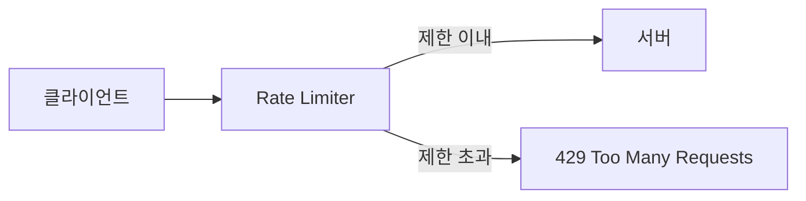
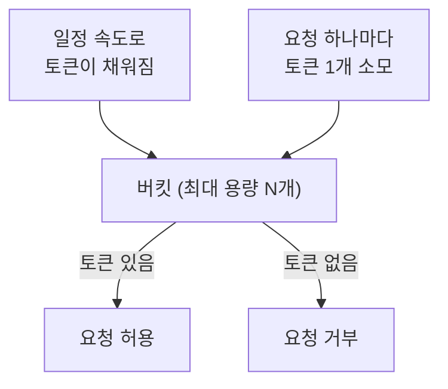
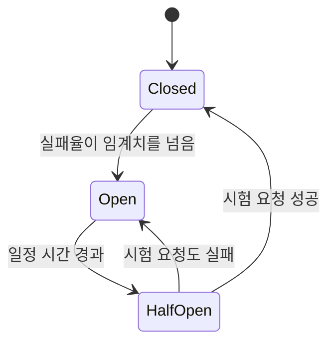
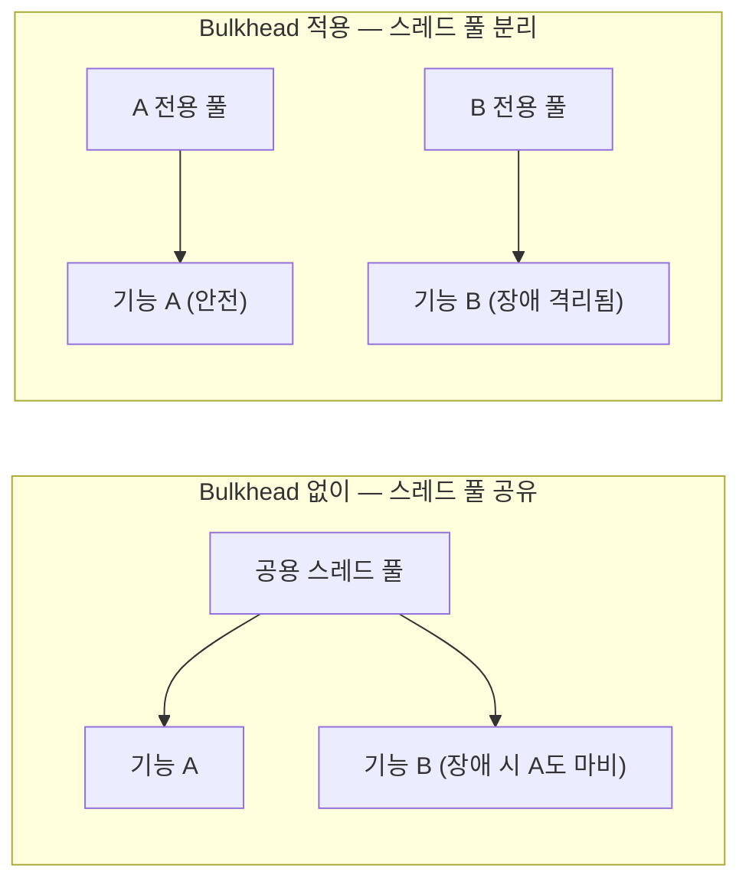

#CS #Infrastructure #면접

관련: [[시스템 설계 기초]] · [[메시지 큐]]

## 목차
- [[#왜 트래픽을 통제해야 할까?]]
- [[#Rate Limiting — 요청 속도에 제한 걸기]]
- [[#Rate Limiting 알고리즘 — Token Bucket]]
- [[#Circuit Breaker — 장애가 번지지 않게 차단하기]]
- [[#그 외 회복력 패턴 — Retry, Timeout, Bulkhead]]
- [[#한 장 요약]]
- [[#Q&A로 복습하기]]

---

## 왜 트래픽을 통제해야 할까?

[[시스템 설계 기초]]에서 다룬 로드 밸런싱·캐싱·확장은 **"트래픽을 어떻게 잘 처리할까"** 에 대한 답이었어요. 그런데 아무리 서버를 늘려도, **① 한쪽 클라이언트가 과도하게 요청을 퍼붓거나, ② 뒤에 있는 서비스 하나가 장애 나서 응답이 느려지면** 시스템 전체가 위험해질 수 있어요.

> **비유**: 고속도로 톨게이트를 생각해보세요. **Rate Limiting**은 "톨게이트마다 일정 속도 이상 차가 못 들어오게 막는 것"이고, **Circuit Breaker**는 "앞쪽 도로가 이미 꽉 막힌 걸 알면, 아예 그쪽으로 차를 안 보내고 우회시키는 것"이에요. 둘 다 "일단 다 받아들이고 보자"가 아니라, **미리 제한하거나 차단해서 전체 붕괴를 막는** 전략이에요.

---

## Rate Limiting — 요청 속도에 제한 걸기

**Rate Limiting**은 **"한 클라이언트(또는 API 키)가 일정 시간 안에 보낼 수 있는 요청 수를 제한"** 하는 거예요.



**왜 필요할까요?**
- 특정 클라이언트가 실수(무한 루프 등) 혹은 악의적으로 과도한 요청을 보내는 걸 막아요.
- 무료/유료 플랜별로 API 호출 횟수를 차등 제공하는 비즈니스 정책을 구현할 수 있어요.
- 뒤쪽 서버/DB가 감당 못 할 만큼의 트래픽이 몰리는 걸 앞단에서 막아줘요.

---

## Rate Limiting 알고리즘 — Token Bucket

가장 널리 쓰이는 알고리즘이 **토큰 버킷(Token Bucket)** 이에요.



- 버킷에 **일정 속도로 토큰이 계속 채워져요** (예: 초당 10개).
- 요청이 들어올 때마다 **토큰을 하나씩 소모**해요.
- 버킷에 토큰이 없으면 요청을 거부해요.
- 버킷이 꽉 찰 때까지는 토큰을 모아둘 수 있어서, **잠깐의 순간적인 트래픽 폭주(버스트)도 어느 정도 허용**해줘요.

```java
class TokenBucket {
    private final int capacity;      // 버킷 최대 용량
    private double tokens;           // 현재 토큰 수
    private final double refillRate; // 초당 채워지는 토큰 수
    private long lastRefillTime;

    boolean allowRequest() {
        refill(); // 경과 시간만큼 토큰을 채움
        if (tokens >= 1) {
            tokens -= 1;
            return true; // 허용
        }
        return false; // 거부
    }

    private void refill() {
        long now = System.currentTimeMillis();
        double elapsedSeconds = (now - lastRefillTime) / 1000.0;
        tokens = Math.min(capacity, tokens + elapsedSeconds * refillRate);
        lastRefillTime = now;
    }
}
```

> 실무에서는 이걸 직접 구현하기보다, **Redis의 `INCR` + TTL 조합**이나 **Bucket4j** 같은 라이브러리, 또는 API Gateway 자체의 Rate Limiting 기능을 활용하는 경우가 많아요. 여러 서버에 걸쳐 제한을 걸려면 [[../Java/Redis 클라이언트|Redis 클라이언트]]에서 다룬 것처럼 **공유 저장소(Redis)에 카운터를 둬야** 서버가 몇 대든 일관되게 제한할 수 있어요.

---

## Circuit Breaker — 장애가 번지지 않게 차단하기

여러 서비스가 서로를 호출하는 구조(MSA)에서, **한 서비스가 응답이 느려지거나 죽으면 그 서비스를 호출하는 다른 서비스들도 줄줄이 대기하다가 함께 무너질 수 있어요.** 이걸 막는 게 **Circuit Breaker(회로 차단기)** 예요 — 전기 회로의 차단기처럼, **문제가 생기면 아예 회로를 끊어버려요.**



- **Closed(닫힘, 평소 상태)**: 요청을 정상적으로 전달해요. 실패율을 계속 관찰해요.
- **Open(열림, 차단 상태)**: 실패율이 임계치(예: 50%)를 넘으면 회로를 "열어서" **더 이상 그 서비스를 호출하지 않고 즉시 실패 처리**해요. (장애 서비스에 요청을 계속 쏟아붓지 않도록 보호)
- **Half-Open(반열림, 시험 상태)**: 일정 시간이 지나면 "이제 복구됐나?" 하고 **시험 삼아 요청을 하나 보내봐요.** 성공하면 다시 Closed로, 실패하면 다시 Open으로 돌아가요.

```java
// Resilience4j 같은 라이브러리를 쓰면 이런 식으로 선언적으로 적용 가능
CircuitBreaker circuitBreaker = CircuitBreaker.ofDefaults("paymentService");

Supplier<String> decorated = CircuitBreaker.decorateSupplier(circuitBreaker, () ->
    paymentServiceClient.charge(orderId) // 이 호출이 실패율 임계치를 넘으면 자동으로 차단됨
);
```

**Circuit Breaker가 없으면?** 장애 서비스를 계속 호출하려는 스레드/커넥션이 계속 쌓이면서([[../Java/동시성|동시성]]에서 다룬 Thread Pool 고갈 문제와 연결), **정작 멀쩡한 다른 기능까지 도미노처럼 함께 마비**될 수 있어요. Circuit Breaker는 이 **연쇄 장애(Cascading Failure)** 를 미리 끊어주는 안전장치예요.

---

## 그 외 회복력 패턴 — Retry, Timeout, Bulkhead

Circuit Breaker와 함께 자주 묶이는 패턴들이에요.

| 패턴 | 역할 |
|---|---|
| **Timeout** | 응답을 무한정 기다리지 않고, 일정 시간 넘으면 포기 |
| **Retry** | 일시적인 실패(네트워크 순간 끊김 등)라면 짧게 재시도 (단, 무한 재시도는 오히려 장애를 키움 — 횟수 제한 필수) |
| **Bulkhead(격벽)** | 배의 격벽처럼, 자원(스레드 풀 등)을 기능별로 나눠둬서 한 기능의 장애가 다른 기능까지 못 번지게 격리 |



---

## 한 장 요약

| 질문 | 답 |
|---|---|
| Rate Limiting이란? | 클라이언트가 일정 시간 안에 보낼 수 있는 요청 수를 제한하는 것 |
| Token Bucket의 동작 원리는? | 일정 속도로 토큰이 채워지고, 요청마다 토큰을 소모, 토큰 없으면 거부 |
| Circuit Breaker의 3가지 상태는? | Closed(정상) → Open(차단) → Half-Open(시험) |
| Circuit Breaker가 막아주는 문제는? | 한 서비스 장애가 연쇄적으로 전체 시스템을 마비시키는 것(Cascading Failure) |
| Bulkhead 패턴이란? | 자원을 기능별로 격리해 한 기능의 장애가 다른 기능까지 번지지 않게 함 |

---

## Q&A로 복습하기

### Q. Rate Limiting에서 Token Bucket 방식이 순간적인 트래픽 버스트를 어느 정도 허용할 수 있는 이유는?
A. 요청이 뜸한 동안 버킷에 토큰이 최대 용량까지 쌓일 수 있기 때문에, 그 쌓인 토큰만큼은 순간적으로 몰리는 요청도 즉시 처리할 수 있다.

### Q. Circuit Breaker가 Open 상태에서 Half-Open 상태로 전환되는 이유는?
A. 장애가 난 서비스가 시간이 지나 복구되었을 가능성이 있으므로, 계속 차단만 하지 않고 시험 삼아 요청을 하나 보내 정상화 여부를 확인하기 위해서다.

### Q. Circuit Breaker가 없을 때 연쇄 장애가 발생하는 과정은?
A. 장애 난 서비스를 계속 호출하려는 요청들이 스레드나 커넥션을 계속 점유한 채 대기하게 되고, 이 자원 고갈이 그 서비스를 호출하는 다른 정상 기능들에까지 번져 시스템 전체가 마비될 수 있다.

### Q. Retry를 무한정 재시도하면 안 되는 이유는?
A. 이미 부하로 어려움을 겪고 있는 서비스에 재시도 요청까지 계속 쌓이면 오히려 장애를 더 악화시킬 수 있기 때문에, 재시도 횟수와 간격에 제한을 둬야 한다.

### Q. Bulkhead 패턴이 해결하는 문제는?
A. 여러 기능이 스레드 풀 같은 자원을 공유하면 한 기능의 장애(예: 느린 외부 API 호출)가 그 자원을 모두 점유해 다른 정상 기능까지 마비시킬 수 있는데, 자원을 기능별로 분리해 이런 전이를 막는다.
