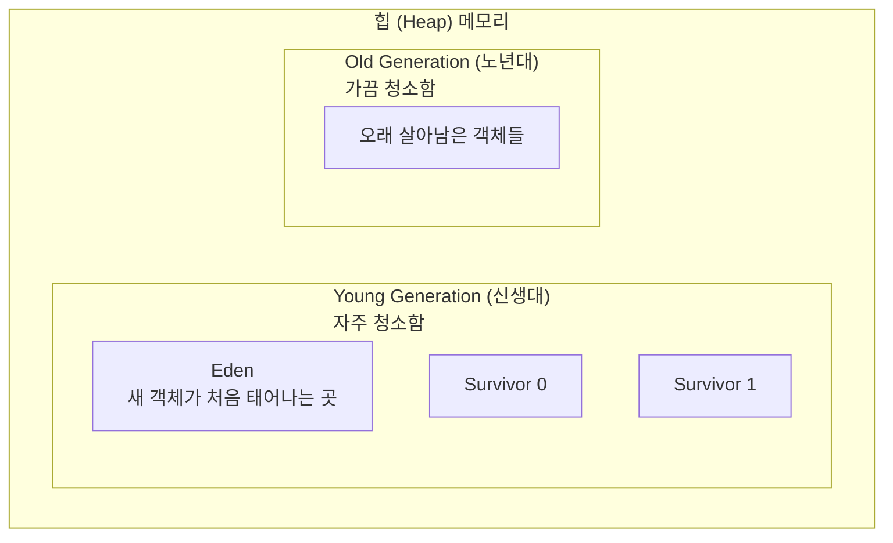
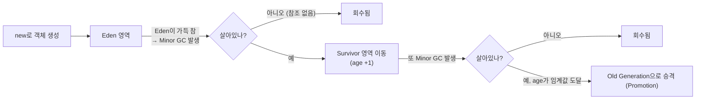
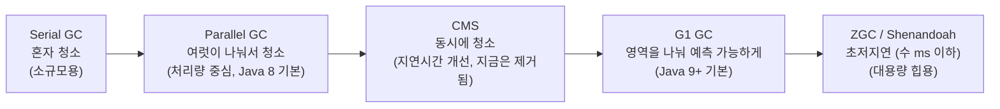

#CS #Java #JVM #GC #면접

관련: [[JVM]] · [[OOP]] · [[Java]]

> JVM의 전반적인 구조는 [[JVM]] 문서에서 다뤘고, 여기서는 그 안의 "가비지 컬렉터(GC)"만 깊게 파봅니다.

## 목차
- [[#GC가 왜 필요할까?]]
- [[#왜 힙을 통째로 뒤지지 않고 "세대"로 나눌까?]]
- [[#객체의 일생: Eden에서 태어나 Old로 승진하기까지]]
- [[#Minor GC vs Major(Full) GC — 뭐가 더 무서운가?]]
- [[#GC 종류 — 시대별로 발전해온 청소부들]]
- [[#메모리 누수는 GC가 있어도 발생한다?]]
- [[#한 장 요약]]
- [[#Q&A로 복습하기]]

---

## GC가 왜 필요할까?

C나 C++에서는 개발자가 직접 `malloc`으로 메모리를 할당하고 `free`로 해제해요. 이걸 깜빡하면 **메모리 누수**가 생기고, 반대로 이미 해제한 메모리를 또 건드리면 프로그램이 터져요.

자바는 이 골치 아픈 작업을 **가비지 컬렉터(Garbage Collector)** 라는 청소부에게 맡겨요. 개발자는 `new`로 객체만 만들면 되고, "이제 아무도 안 쓰네?" 싶은 객체는 GC가 알아서 힙(Heap)에서 치워줍니다.

> 비유: 집에 물건을 계속 사들이기만 하고(`new`), 안 쓰는 물건을 알아서 감지해서 내다 버려주는(GC) 로봇 청소부가 있는 셈이에요. 대신 이 청소부가 청소를 하는 동안엔 잠깐 집안일을 멈춰야 할 때도 있어요 (뒤에서 설명할 Stop-The-World).

**GC가 "안 쓰는 객체"를 판단하는 기준은 딱 하나예요: 그 객체를 가리키는(참조하는) 변수가 하나도 없는가?**

```java
Car car = new Car(); // Car 객체 생성, car 변수가 참조 중
car = null;           // 이제 아무도 이 Car 객체를 참조하지 않음 → GC 대상이 됨
```

---

## 왜 힙을 통째로 뒤지지 않고 "세대"로 나눌까?

GC를 설계한 사람들이 실제 프로그램들을 관찰해보니 이런 패턴을 발견했어요:

> **"대부분의 객체는 생성된 지 얼마 안 돼서 금방 버려진다. 반면 오래 살아남은 객체는 앞으로도 오래 살아남을 확률이 높다."**

이걸 **약한 세대 가설(Weak Generational Hypothesis)** 이라고 불러요. (예: 반복문 안에서 임시로 만든 문자열 → 대부분 바로 버려짐. 반면 애플리케이션 시작할 때 만든 설정 객체 → 프로그램 끝날 때까지 살아있음)

그래서 힙 전체를 매번 다 뒤지는 대신, **"갓 태어난 객체 구역"과 "오래 산 객체 구역"을 나눠서**, 갓 태어난 구역은 자주 청소하고 오래 산 구역은 어쩌다 한 번씩만 청소하는 전략을 씁니다. 이게 효율적인 이유예요.



---

## 객체의 일생: Eden에서 태어나 Old로 승진하기까지

객체 하나가 태어나서 어떻게 이동하는지 단계별로 따라가볼게요.



1. **탄생**: 객체는 무조건 `Eden` 영역에서 태어나요.
2. **Minor GC**: `Eden`이 꽉 차면 **Minor GC**가 발생해요. 이때 살아남은 객체(아직 참조되고 있는 것)는 `Survivor` 영역으로 옮겨지고, 각 객체에는 "나이(age)"가 하나씩 매겨져요. 살아남을 때마다 나이가 1씩 늘어나요.
3. **승격(Promotion)**: 이 나이가 일정 기준(예: 15)을 넘어서도록 계속 살아남으면, "이 객체는 오래 갈 놈이구나" 판단하고 `Old Generation`으로 옮겨줘요(승격).
4. **Major GC(Full GC)**: `Old Generation`도 결국 꽉 차면 **Major GC(또는 Full GC)** 가 발생해서 이 영역을 청소해요.

**왜 Survivor가 S0, S1 두 개나 있을까?** 살아남은 객체를 서로 다른 Survivor 영역으로 번갈아 옮겨 담으면서(핑퐁처럼), 항상 하나의 Survivor는 비워둔 채로 유지하는 전략이에요. 이렇게 하면 메모리 파편화(자잘한 빈 공간이 여기저기 흩어지는 것)를 줄일 수 있어요.

---

## Minor GC vs Major(Full) GC — 뭐가 더 무서운가?

| 구분 | Minor GC | Major(Full) GC |
|---|---|---|
| 대상 영역 | Young Generation | Old Generation (보통 전체 힙) |
| 발생 빈도 | 자주 (Eden이 금방 참) | 드묾 (Old가 크고 천천히 참) |
| 소요 시간 | 짧음 | 김 |
| 애플리케이션 정지 시간 | 짧은 STW | **긴 STW** ← 이게 문제! |

**Stop-The-World(STW)**: GC가 객체들을 정리하는 동안 "지금은 아무것도 건드리지 마세요"라며 애플리케이션의 모든 스레드를 잠깐 멈추는 것을 말해요. 청소하는 동안 물건을 계속 옮기면 청소가 제대로 안 되니까요.

문제는 Old Generation은 보통 크기가 커서, Major GC가 발생하면 STW 시간도 길어진다는 점이에요. 사용자 입장에선 "갑자기 서비스가 몇 초씩 멈추는" 현상으로 체감돼요. 그래서 **"GC 튜닝"이라고 하면 보통 이 Major/Full GC의 STW 시간을 어떻게 줄이느냐**가 핵심 과제입니다.

---

## GC 종류 — 시대별로 발전해온 청소부들

GC 알고리즘은 여러 종류가 있고, JVM 실행 옵션으로 어떤 걸 쓸지 고를 수 있어요. "얼마나 빨리 청소하느냐(처리량)"와 "얼마나 안 멈추느냐(지연시간)"는 트레이드오프 관계라, 상황에 맞게 골라야 해요.



- **Serial GC**: 청소부 한 명이서 전부 처리. 단순하지만 STW가 김. 메모리가 작은 애플리케이션(예: 임베디드)용.
- **Parallel GC**: 청소부 여러 명이 동시에 처리해서 속도를 높임. "단위 시간당 얼마나 많은 작업을 처리하느냐(처리량)"에 초점. Java 8의 기본 GC.
- **CMS (Concurrent Mark Sweep)**: 애플리케이션을 멈추지 않고 "동시에" 청소를 진행해서 STW를 최소화하려 한 시도. 하지만 메모리 파편화 등 단점이 있어 Java 9에서 사용 중단(deprecated) 예고, Java 14에서 완전히 제거됨.
- **G1 GC (Garbage First)**: 힙을 작은 영역(region)들로 잘게 나눠서, "쓰레기가 가장 많은 영역부터" 우선적으로 청소해요. "이번 GC는 최대 200ms 안에 끝내줘" 같은 목표 시간을 설정할 수 있어서 예측 가능성이 높음. Java 9부터 기본 GC.
- **ZGC / Shenandoah**: 수십 GB~TB급 초대형 힙에서도 STW를 수 밀리초 이하로 유지하는 것을 목표로 하는 최신 초저지연 GC.

> 실무 팁: 대부분의 일반적인 서비스는 요즘 기본값인 **G1 GC**로 충분해요. 힙이 아주 크고(수십 GB 이상) 지연시간에 극도로 민감한 서비스(예: 초고빈도 거래 시스템)라면 ZGC 같은 최신 GC를 검토합니다.

---

## 메모리 누수는 GC가 있어도 발생한다?

네, 맞아요. GC는 "아무도 참조하지 않는 객체"만 치워줘요. 바꿔 말하면, **누군가 계속 참조하고 있다면 GC는 절대 건드리지 않아요.** 실수로 이런 참조를 계속 남겨두면 자바에서도 메모리 누수가 생깁니다.

자주 나오는 누수 패턴들:

```java
// 1. static 컬렉션에 계속 add만 하고 remove를 안 하는 경우
static List<byte[]> cache = new ArrayList<>();
void addData(byte[] data) {
    cache.add(data); // 계속 쌓이기만 함 → 절대 GC 대상이 안 됨
}
```

```java
// 2. 리스너/콜백을 등록만 하고 해제(remove)하지 않는 경우
button.addClickListener(listener); // 등록
// button.removeClickListener(listener); ← 이걸 안 하면 listener가 계속 참조됨
```

```java
// 3. ThreadLocal을 쓰고 remove()하지 않는 경우 (특히 스레드 풀 환경에서 위험)
threadLocal.set(largeObject);
// threadLocal.remove(); ← 스레드가 재사용되는 풀 환경에서 이걸 안 하면 계속 살아남음
```

---

## 한 장 요약

| 질문                      | 답                                                 |
| ----------------------- | ------------------------------------------------- |
| GC가 회수 대상을 정하는 기준?      | 아무도 참조하지 않는 객체                                    |
| 힙을 세대로 나누는 이유?          | 대부분의 객체는 금방 죽는다는 경험적 관찰(약한 세대 가설) 때문에 효율적으로 청소하려고 |
| Minor GC 대상?            | Young Generation (Eden, Survivor)                 |
| Major(Full) GC 대상?      | Old Generation (보통 전체 힙), STW가 길어서 더 문제           |
| Stop-The-World란?        | GC 도중 애플리케이션 스레드를 잠깐 멈추는 것                        |
| 요즘 기본 GC는?              | G1 GC (Java 9+)                                   |
| GC가 있어도 메모리 누수가 생기는 이유? | 여전히 참조되고 있는 불필요한 객체는 회수 못 함                       |

---

## Q&A로 복습하기

### Q. GC가 회수 대상을 판단하는 기준은?
A. 그 객체를 가리키는(참조하는) 변수가 하나도 남아있지 않은지 여부다.

### Q. 힙을 Young/Old 세대로 나누는 이유는?
A. 대부분의 객체는 생성된 지 얼마 안 돼 금방 버려진다는 "약한 세대 가설"에 따라, 자주 죽는 영역(Young)과 오래 사는 영역(Old)을 나눠서 효율적으로 청소하기 위해서다.

### Q. Minor GC와 Major(Full) GC 중 애플리케이션에 더 큰 영향을 주는 건?
A. Major(Full) GC. Old Generation은 보통 커서 청소하는 데 오래 걸리고, 그만큼 Stop-The-World 시간도 길어져 서비스가 체감될 정도로 멈출 수 있다.

### Q. Stop-The-World란?
A. GC가 객체를 정리하는 동안 애플리케이션의 모든 스레드를 잠깐 멈추는 것. GC 튜닝의 핵심 목표가 바로 이 시간을 최소화하는 것이다.

### Q. 요즘 자바의 기본 GC는 무엇이고 특징은?
A. G1 GC(Java 9+ 기본값). 힙을 작은 region으로 나눠서 쓰레기가 많은 곳부터 우선 청소하고, 목표 STW 시간을 설정할 수 있어 예측 가능성이 높다.

### Q. GC가 있는데도 자바에서 메모리 누수가 생기는 이유는?
A. GC는 참조되지 않는 객체만 회수하는데, static 컬렉션에 계속 추가만 하거나 리스너를 해제하지 않는 등 불필요한데도 계속 참조되고 있는 객체는 회수하지 못하기 때문이다.
