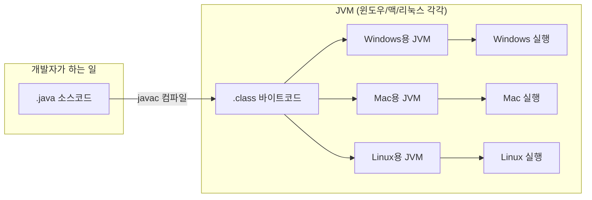
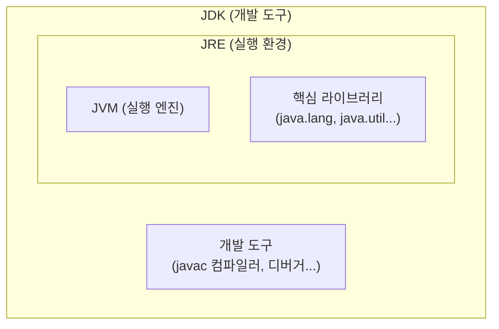
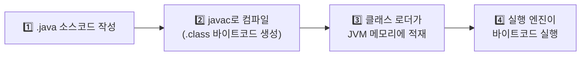
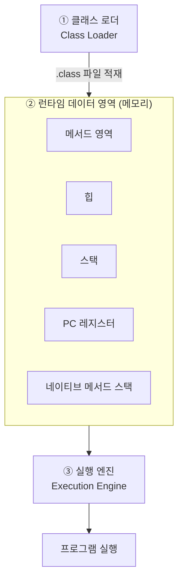
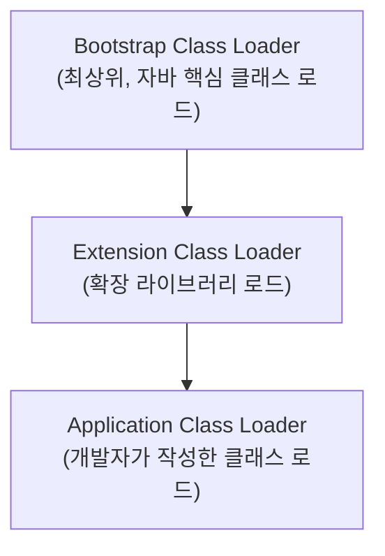

#CS #Java #JVM #면접

관련: [[OOP]] · [[Java]] · [[GC]]

## 목차
- [[#JVM이 없으면 자바는 못 돌아간다]]
- [[#JDK, JRE, JVM — 세 글자 약자 정리]]
- [[#자바 코드가 실행되기까지의 여정]]
- [[#JVM 내부 구조 3가지]]
- [[#Stack vs Heap 한눈에 비교]]
- [[#자주 만나는 메모리 에러들]]
- [[#바이트코드란?]]
- [[#한 장 요약]]
- [[#Q&A로 복습하기]]

---

## JVM이 없으면 자바는 못 돌아간다

자바로 짠 코드가 왜 윈도우에서도, 맥에서도, 리눅스 서버에서도 똑같이 돌아갈까요? 비밀은 **JVM(Java Virtual Machine)** 에 있어요.

> **비유**: JVM은 일종의 "통역사"예요. 자바 코드는 "바이트코드"라는 공통 언어로 번역돼 있고, JVM이 이걸 각 운영체제가 알아듣는 기계어로 실시간 통역해줍니다. 그래서 개발자는 OS마다 다시 코드를 짤 필요 없이, **"Write Once, Run Anywhere(한 번 작성하면 어디서나 실행)"** 가 가능해져요.



바이트코드 자체는 OS와 무관한 "중간 언어"이고, 그걸 실제로 그 자리에서 해석해서 실행하는 JVM만 OS별로 다르게 준비되어 있는 거예요.

---

## JDK, JRE, JVM — 세 글자 약자 정리

신입 면접에서 은근히 자주 물어보는 기본기예요. 포함 관계로 외우면 편해요.



- **JVM**: 바이트코드를 실제로 실행하는 엔진 그 자체.
- **JRE**: JVM + 프로그램이 돌아가는 데 필요한 라이브러리 묶음. "실행만 하고 싶다"면 이것만 있으면 됨.
- **JDK**: JRE + 컴파일러(`javac`) 같은 개발 도구. "코드를 짜고 컴파일까지 하고 싶다"면 이게 필요함.

요즘은 개발할 때 무조건 JDK를 설치하니 실무에서 셋을 나눠서 설치할 일은 거의 없지만, **포함 관계(JDK ⊃ JRE ⊃ JVM)** 는 꼭 기억해두세요.

---

## 자바 코드가 실행되기까지의 여정

`.java` 파일 하나가 화면에 결과를 뿌리기까지 어떤 단계를 거치는지 순서대로 따라가볼게요.



이제 3번(클래스 로더), 4번(실행 엔진)이 실제로 어떤 구조로 이루어져 있는지 JVM 내부를 열어볼게요.

---

## JVM 내부 구조 3가지

JVM은 크게 **① 클래스 로더 → ② 런타임 데이터 영역(메모리) → ③ 실행 엔진**, 이렇게 3개 파트로 이루어져 있어요.



### ① 클래스 로더 — "필요한 클래스를 메모리에 갖다 놓는 역할"

**비유**: 도서관 사서가 책을 서가에 꽂아두는 과정이라고 생각하면 쉬워요. 요청이 오면(클래스가 처음 사용되면) 해당 `.class` 파일을 찾아서 JVM 메모리에 올려놓습니다.

재밌는 건 이 사서가 혼자가 아니라 **계층 구조로 여러 명** 있다는 점이에요.



- 클래스 로딩 요청이 오면 **먼저 위(부모)에게 넘기고**, 부모가 못 찾을 때만 본인이 찾는 방식으로 동작해요. 이걸 **위임 모델(Delegation Model)** 이라고 부릅니다.
- 왜 이렇게 할까요? 만약 내가 직접 `java.lang.String`이라는 클래스를 만들어서 끼워 넣어도, 위임 모델 덕분에 항상 Bootstrap이 먼저 처리하는 "진짜" `String`이 로드돼요. 즉, **핵심 클래스가 악의적으로 바뀌는 걸 막아주는 보안 장치**인 셈이죠.

### ② 런타임 데이터 영역 — "메모리를 용도별로 나눠 쓰기"

| 영역 | 무엇을 저장하나 | 비유 | 공유 여부 |
|---|---|---|---|
| **메서드 영역** | 클래스 정보, static 변수, 상수 | 클래스의 "설계도 보관함" | 모든 스레드가 공유 |
| **힙 (Heap)** | `new`로 만든 객체, 배열 | 실제로 지어진 "건물들" | 모든 스레드가 공유 |
| **스택 (Stack)** | 메서드 호출 정보, 지역 변수 | 메서드 호출을 쌓아두는 "접시 더미" | 스레드마다 따로 |
| **PC 레지스터** | 현재 실행 중인 명령어 위치 | 지금 "몇 페이지 읽는 중"인지 표시 | 스레드마다 따로 |
| **네이티브 메서드 스택** | JNI로 호출한 네이티브 코드용 스택 | (C/C++ 코드 호출용, 잘 안 씀) | 스레드마다 따로 |

```java
void method() {
    int x = 10;           // x는 Stack에 저장
    Car car = new Car();  // car라는 "참조"는 Stack에, 실제 Car 객체는 Heap에 저장
}
```

여기서 자주 나오는 면접 질문: **"스택과 힙의 차이는?"** → 스택은 스레드마다 독립적이고 빠르지만 크기가 작아서 `StackOverflowError`가 날 수 있고, 힙은 모든 스레드가 공유하며 크지만 그만큼 관리(GC)가 필요해요.

> 참고: Java 8부터 "메서드 영역"의 구현체 이름이 **Metaspace**로 바뀌었고, JVM 내부 메모리가 아니라 OS 네이티브 메모리를 사용하도록 변경됐어요. (이전엔 "PermGen"이라는 고정 크기 영역이라 `OutOfMemoryError: PermGen space`가 흔한 문제였는데, Metaspace는 필요시 자동으로 늘어나서 이 문제가 크게 줄었어요.)

### ③ 실행 엔진 — "바이트코드를 실제로 실행"

바이트코드를 실행하는 방법은 두 가지가 섞여서 쓰여요.

- **인터프리터**: 바이트코드를 한 줄씩 읽어서 바로 실행. 시작은 빠르지만, 매번 다시 해석하니 반복되는 코드에선 느림.
- **JIT 컴파일러 (Just-In-Time)**: 같은 코드가 여러 번 반복 실행되는 걸 감지하면("Hot Spot"이라 부름), 그 부분을 네이티브 기계어로 미리 컴파일해서 캐싱해둠. 다음부턴 통역 없이 바로 실행 → 훨씬 빠름.

> 비유: 인터프리터는 그때그때 통역해주는 통역사, JIT는 자주 나오는 문장을 아예 외워서 바로바로 말해주는 숙련된 통역사예요. 실제 자바 JVM(HotSpot VM)의 이름도 이 "Hot Spot 감지" 방식에서 따온 거예요.

그리고 이 실행 엔진 안에는 한 가지가 더 있어요. 바로 **가비지 컬렉터(GC)** — 더 이상 안 쓰는 객체를 힙에서 자동으로 치워주는 청소부예요. 자바는 C/C++와 달리 개발자가 직접 메모리를 해제(`free`)하지 않아도 되는 이유가 바로 이 GC 덕분이죠.

GC는 다루는 내용이 꽤 많아서 별도 문서로 정리했어요 → **자세한 동작 원리, 세대별 수집, GC 종류는 [[GC]] 문서 참고**.

---

## Stack vs Heap 한눈에 비교

| 구분 | Stack | Heap |
|---|---|---|
| 저장 대상 | 지역 변수, 메서드 호출 정보 | `new`로 만든 객체, 배열 |
| 스레드 공유 | ❌ 스레드마다 독립 | ✅ 모든 스레드가 공유 |
| 생명주기 | 메서드 종료 시 자동 소멸 | GC가 회수할 때까지 유지 |
| 속도 | 빠름 | 상대적으로 느림 |
| 대표 에러 | `StackOverflowError` | `OutOfMemoryError` |

---

## 자주 만나는 메모리 에러들

- **`StackOverflowError`**: 스택 깊이 초과. 대표적으로 **끝나지 않는 재귀 호출**에서 발생해요.
  ```java
  void recurse() { recurse(); } // 탈출 조건이 없어서 스택이 계속 쌓임 → StackOverflowError
  ```
- **`OutOfMemoryError: Java heap space`**: 힙이 꽉 참. 객체를 계속 만드는데 아무도 안 쓰는 상태(메모리 누수)일 때 자주 발생.
- **`OutOfMemoryError: Metaspace`**: 클래스 메타데이터 저장 공간 부족. 동적으로 클래스를 계속 새로 생성하는 특수한 상황(예: 리플렉션 남용, 클래스 로더 누수)에서 발생.

**메모리 누수가 왜 자바에서도 생길까?** GC는 "아무도 참조하지 않는" 객체만 치워줘요. 그런데 만약 `static List`에 객체를 계속 담기만 하고 절대 빼지 않는다면, GC 입장에선 "누군가 참조하고 있으니 아직 쓰는 거구나" 하고 절대 회수하지 않아요. 이게 자바에서 메모리 누수가 발생하는 전형적인 패턴입니다.

---

## 바이트코드란?

`javac`로 컴파일하면 나오는 `.class` 파일 안에 들어있는 명령어들이에요. 특정 CPU의 기계어가 아니라, **JVM만 알아듣는 중간 형태의 명령어**라서 어떤 OS의 JVM 위에서든 실행될 수 있어요. 이게 바로 자바의 플랫폼 독립성의 핵심 비밀입니다.

---

## 한 장 요약

| 질문 | 답 |
|---|---|
| JVM이 하는 일? | 바이트코드를 각 OS에 맞는 기계어로 실행 |
| JDK ⊃ JRE ⊃ JVM 순서 기억법 | "개발(JDK) 안에 실행(JRE) 안에 엔진(JVM)" |
| 클래스 로더의 핵심 개념 | 위임 모델 (상위 로더에게 먼저 물어봄 → 보안) |
| 메모리 중 스레드 공유되는 곳 | 힙, 메서드 영역 |
| 메모리 중 스레드마다 독립인 곳 | 스택, PC 레지스터, 네이티브 스택 |
| 실행을 빠르게 하는 장치 | JIT 컴파일러 (Hot Spot을 네이티브 코드로 캐싱) |

---

## Q&A로 복습하기

### Q. JDK, JRE, JVM의 포함 관계는?
A. JDK ⊃ JRE ⊃ JVM이다. JVM은 실행 엔진, JRE는 JVM + 실행에 필요한 라이브러리, JDK는 JRE + 컴파일러 등 개발 도구다.

### Q. 클래스 로더의 위임 모델이 왜 필요한가?
A. 클래스 로딩 요청을 항상 상위(Bootstrap) 로더에게 먼저 넘기게 해서, 사용자가 임의로 만든 클래스가 `java.lang.String` 같은 핵심 클래스를 대신 로드하지 못하도록 막아 보안을 지킨다.

### Q. 런타임 데이터 영역 중 스레드끼리 공유되는 건 어디고, 독립적인 건 어디인가?
A. 힙과 메서드 영역은 모든 스레드가 공유하고, 스택·PC 레지스터·네이티브 메서드 스택은 스레드마다 독립적으로 존재한다.

### Q. JIT 컴파일러가 실행 속도를 높이는 원리는?
A. 반복적으로 실행되는 코드(Hot Spot)를 감지해서 미리 네이티브 기계어로 컴파일해두고 재사용한다. 매번 한 줄씩 해석하는 인터프리터보다 빠르다.

### Q. StackOverflowError와 OutOfMemoryError는 각각 언제 발생하나?
A. StackOverflowError는 스택 깊이를 초과할 때(대표적으로 끝나지 않는 재귀), OutOfMemoryError는 힙이나 Metaspace 같은 메모리 공간이 부족할 때 발생한다.
