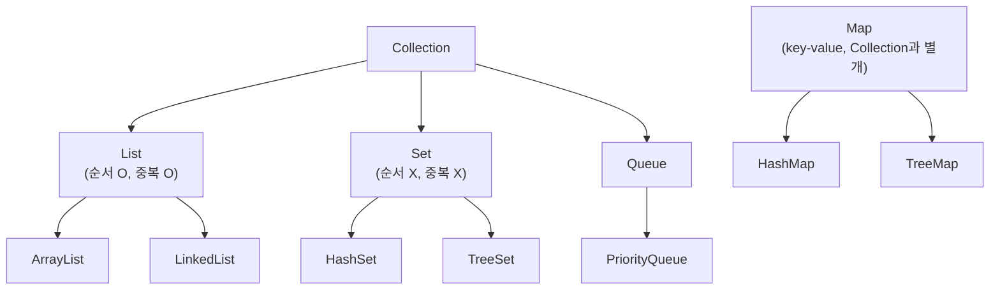
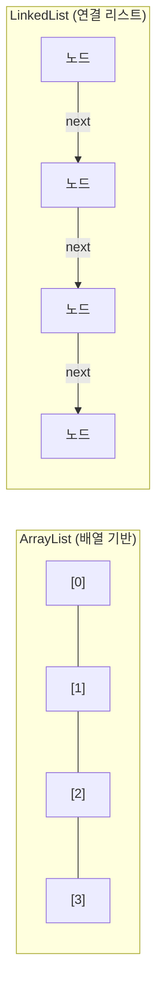
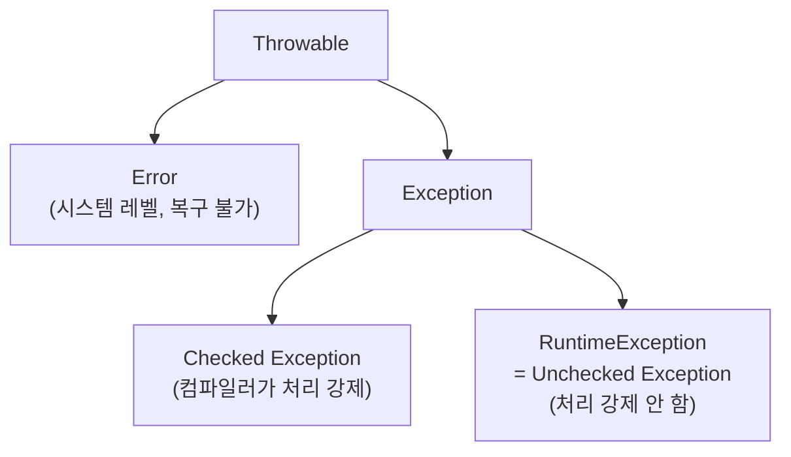

#CS #Java #면접

관련: [[OOP]] · [[JVM]] · [[GC]] · [[동시성]] · [[가상 스레드]]

Java 언어 자체의 문법/기능에 대한 정리예요. OOP 개념은 [[OOP]], 메모리/실행 구조는 [[JVM]]과 [[GC]]에서 다뤄요.

## 목차
- [[#String은 왜 불변(immutable)일까?]]
- [[#== vs equals() — 헷갈리지 않는 법]]
- [[#제네릭(Generics) — 타입을 미리 정해두기]]
- [[#컬렉션 프레임워크 — 자바의 "장바구니들"]]
- [[#예외 처리 (Exception)]]
- [[#static 키워드 — "인스턴스가 아니라 클래스에 속한다"]]
- [[#접근 제어자 — 누구에게 얼마나 공개할까]]
- [[#Java 8의 주요 변화]]
- [[#멀티스레딩 살짝 맛보기]]
- [[#한 장 요약]]
- [[#Q&A로 복습하기]]

---

## String은 왜 불변(immutable)일까?

```java
String s = "hello";
s.concat(" world");  // 어? s를 바꿨는데...
System.out.println(s); // "hello" 그대로 출력됨!
```

당황스럽죠? `concat()`을 호출했는데 `s`는 그대로예요. 이유는 `String`이 **한 번 만들어지면 절대 내용이 바뀌지 않는(불변) 객체**이기 때문이에요. `concat()`은 `s`를 바꾸는 게 아니라, **완전히 새로운 String 객체를 만들어서 반환**할 뿐이에요. 그 결과를 안 받았으니 그냥 버려진 거죠.

```java
String s2 = s.concat(" world"); // 새 객체를 만들어서 s2에 저장
```

**왜 이렇게 불편해 보이는 설계를 했을까?**

```mermaid
graph TD
    Pool["String Pool (문자열 상수 풀)"]
    A["String a = \"hi\";"] -->|가리킴| Pool_hi["\"hi\""]
    B["String b = \"hi\";"] -->|같은 객체를 가리킴| Pool_hi
    Pool -.포함.-> Pool_hi
```

- **메모리 절약**: `"hi"`처럼 따옴표로 직접 쓴 문자열은 **String Pool**이라는 특별한 저장소에 캐싱돼요. 같은 내용의 문자열을 또 만들면, 새로 만들지 않고 풀에 있는 걸 재사용해요. 만약 String이 가변이었다면, 누군가 `a`의 내용을 바꿨을 때 이걸 같이 참조하던 `b`까지 엉뚱하게 바뀌어버리는 대참사가 나겠죠. 불변이기 때문에 이런 공유(재사용)가 안전해요.
- **스레드 안전**: 여러 스레드가 같은 String을 동시에 봐도, 아무도 값을 바꿀 수 없으니 걱정할 게 없어요.
- **HashMap의 key로 안전**: [[Java]] 뒷부분에 나올 HashMap은 key의 `hashCode()`를 기준으로 저장 위치를 정하는데, key가 중간에 바뀌면 찾을 수 없게 돼요. String은 불변이라 이런 걱정이 없어요.

### 그럼 문자열을 자주 바꿔야 할 땐?

반복문 안에서 문자열을 계속 이어붙이면 어떻게 될까요?

```java
String result = "";
for (int i = 0; i < 10000; i++) {
    result += i; // 매번 새로운 String 객체가 생성됨!
}
```

이 코드는 `result += i`를 할 때마다 **새로운 String 객체를 매번 새로 만들어요.** 1만 번 반복하면 String 객체가 1만 개 가까이 생겼다가 버려지는 거예요. 이러면 느리기도 하고, [[GC]]가 치워야 할 쓰레기도 잔뜩 쌓입니다.

이럴 땐 **가변(mutable)** 클래스인 `StringBuilder`를 써요.

```java
StringBuilder sb = new StringBuilder();
for (int i = 0; i < 10000; i++) {
    sb.append(i); // 기존 객체 안에서 내용만 바뀜, 새 객체 안 만듦
}
String result = sb.toString();
```

| 구분 | 특징 | 언제 쓰나 |
|---|---|---|
| `String` | 불변, 안전 | 값이 잘 안 바뀌는 경우 |
| `StringBuilder` | 가변, 동기화 없음(빠름) | 대부분의 문자열 조작 (기본 선택) |
| `StringBuffer` | 가변, 동기화 있음(느림) | 여러 스레드가 같은 문자열을 동시에 수정할 때 |

---

## == vs equals() — 헷갈리지 않는 법

`==`는 "**같은 집**(메모리 주소)에 사는지" 비교하고, `equals()`는 (오버라이딩됐다면) "**내용물**이 같은지" 비교해요.

```java
String a = new String("hi");
String b = new String("hi");
System.out.println(a == b);       // false — 서로 다른 집(객체)에 삼
System.out.println(a.equals(b));  // true  — 내용물(글자)은 같음
```

자세한 원리와 `hashCode()`와의 관계는 [[OOP]] 문서의 "equals()와 hashCode()" 섹션에서 다뤘어요.

---

## 제네릭(Generics) — 타입을 미리 정해두기

제네릭이 없던 시절엔 이런 코드가 흔했어요.

```java
List list = new ArrayList();
list.add("문자열");
list.add(123); // 실수로 숫자도 넣어버림... 컴파일은 됨!

String s = (String) list.get(1); // 런타임에 ClassCastException 폭발! 💥
```

컴파일할 땐 아무 문제 없어 보이지만, 실행하는 순간 터져요. 제네릭은 이걸 **컴파일 시점에 미리 막아주는** 기능이에요.

```java
List<String> list = new ArrayList<>();
list.add("문자열");
list.add(123); // ❌ 컴파일 에러! "String만 넣을 수 있어" 라고 미리 알려줌
```

> **타입 소거(Type Erasure)**: 재밌게도 이 `<String>`이라는 타입 정보는 **컴파일할 때만 체크되고, 실제 바이트코드에는 남지 않아요.** 그래서 런타임에는 `List<String>`이든 `List<Integer>`든 그냥 `List`로 취급돼요. 옛날 코드(제네릭이 없던 시절 코드)와의 호환성을 지키기 위한 설계예요.

---

## 컬렉션 프레임워크 — 자바의 "장바구니들"



### ArrayList vs LinkedList

**비유**: `ArrayList`는 "번호가 매겨진 사물함 줄"이에요. 몇 번 사물함인지 알면 바로 찾아갈 수 있지만(빠른 조회), 중간에 사물함 하나를 새로 끼워 넣으려면 뒤에 있는 사물함 번호를 다 하나씩 밀어야 해요(느린 삽입).

`LinkedList`는 "기차 칸을 서로 연결한 것"이에요. 중간에 칸 하나를 끼워 넣거나 빼는 건 앞뒤 연결만 바꾸면 되니 빠르지만(빠른 삽입/삭제), 5번째 칸을 찾으려면 처음부터 하나씩 세면서 가야 해요(느린 조회).



| 구분 | ArrayList | LinkedList |
|---|---|---|
| 조회 (`get(i)`) | ⚡ O(1) | 🐢 O(n) |
| 중간 삽입/삭제 | 🐢 O(n) | ⚡ O(1) (탐색 제외) |
| 언제 쓰나 | 조회가 잦을 때 (대부분의 경우) | 삽입/삭제가 잦을 때 |

### HashMap은 어떻게 그렇게 빨리 찾을까?

`HashMap`은 내부적으로 **배열 + 연결리스트(또는 트리)** 구조로 되어 있어요.

```mermaid
graph LR
    subgraph "HashMap 내부 (버킷 배열)"
        B0["버킷 0"]
        B1["버킷 1 → \"apple\"(key)"]
        B2["버킷 2"]
        B3["버킷 3 → \"banana\" → \"cherry\" (충돌!)"]
    end
```

1. key를 넣으면 key의 `hashCode()`를 계산해서 "몇 번 버킷에 넣을지"를 정해요.
2. 조회할 때도 마찬가지로 key의 해시값을 계산해서 **그 버킷만 바로 찾아가면 되니까** 평균적으로 매우 빠릅니다 (O(1)).
3. 문제는 서로 다른 key인데 우연히 같은 버킷 번호가 나올 수 있다는 것 — 이걸 **해시 충돌(Collision)** 이라고 해요. 이럴 땐 같은 버킷 안에서 연결리스트로 줄줄이 이어 붙여요. (Java 8부터는 한 버킷에 8개 넘게 쌓이면 연결리스트 대신 **레드-블랙 트리**로 바꿔서, 최악의 경우에도 성능이 O(n)이 아닌 O(log n)을 보장하도록 개선됐어요.)

> ⚠️ 그래서 `HashMap`의 key로 쓰는 객체는 `equals()`와 `hashCode()`를 반드시 올바르게 오버라이딩해야 해요. 안 그러면 "분명 넣었는데 못 찾는" 버그가 생겨요. (자세한 이유는 [[OOP]] 참고)

### HashMap vs Hashtable vs ConcurrentHashMap

| 구분 | HashMap | Hashtable | ConcurrentHashMap |
|---|---|---|---|
| 스레드 안전 | ❌ | ✅ (전체를 통째로 락) | ✅ (부분적으로만 락) |
| null 허용 | key/value 모두 허용 | 둘 다 불허 | 둘 다 불허 |
| 성능 | 빠름 | 느림 (락이 너무 큼) | 빠름 (필요한 부분만 락) |
| 실무 선택 | 단일 스레드 환경 | 거의 안 씀 (레거시) | 멀티 스레드 환경 |

**비유**: `Hashtable`은 "화장실이 하나뿐인 건물"이에요. 한 사람이 쓰는 동안 전체 건물 문을 다 잠가버려요(메서드 전체 동기화). `ConcurrentHashMap`은 "층마다 화장실이 따로 있는 건물"이에요. 필요한 부분만 잠그니까 훨씬 효율적이죠.

---

## 예외 처리 (Exception)



- **Checked Exception** (예: `IOException`): 컴파일러가 "이거 처리 안 하면 컴파일 안 시켜줄게!"라고 강제해요. 파일이 없다거나 네트워크가 끊기는 등, **외부 요인으로 발생할 수 있고 호출자가 대비할 수 있는** 상황에 씁니다.
  ```java
  void readFile() throws IOException { ... } // 반드시 throws 선언하거나 try-catch로 처리해야 컴파일됨
  ```
- **Unchecked Exception** (예: `NullPointerException`, `ArrayIndexOutOfBoundsException`): 컴파일러가 처리를 강제하지 않아요. 대부분 **개발자의 실수(버그)** 로 발생하기 때문에, 애초에 예방하는 게 맞는 상황이에요.

`finally` 블록은 예외가 나든 안 나든 **무조건 실행**돼요. 그래서 파일이나 DB 연결처럼 반드시 닫아야 하는 자원을 정리할 때 써요.

```java
FileInputStream fis = null;
try {
    fis = new FileInputStream("data.txt");
    // 파일 사용
} catch (IOException e) {
    e.printStackTrace();
} finally {
    if (fis != null) fis.close(); // 예외가 나도 반드시 닫힘
}
```

Java 7부터는 이걸 더 간단하고 안전하게 쓸 수 있는 **`try-with-resources`** 문법이 생겼어요.

```java
try (FileInputStream fis = new FileInputStream("data.txt")) {
    // 파일 사용
} catch (IOException e) {
    e.printStackTrace();
} // 블록이 끝나면 fis.close()가 자동으로 호출됨! finally도 필요 없음
```

### final vs finally vs finalize — 이름 비슷 3형제

| 키워드 | 정체 | 용도 |
|---|---|---|
| `final` | 예약어 | 변수(재할당 금지), 메서드(오버라이딩 금지), 클래스(상속 금지) |
| `finally` | try-catch의 블록 | 예외 여부와 상관없이 항상 실행 |
| `finalize()` | 메서드 (지금은 비권장) | GC가 객체를 회수하기 직전 호출하던 메서드. 호출 시점을 보장 못 해서 Java 9부터 **deprecated**. 대신 `try-with-resources` 사용 |

---

## static 키워드 — "인스턴스가 아니라 클래스에 속한다"

```java
class Counter {
    static int count = 0; // 모든 인스턴스가 공유하는 값

    Counter() {
        count++; // 객체 만들 때마다 공유 카운터 증가
    }
}

new Counter(); new Counter(); new Counter();
System.out.println(Counter.count); // 3
```

**비유**: 일반 필드가 "각자 자기 방에 있는 개인 물건"이라면, `static` 필드는 "다같이 쓰는 거실의 공용 물건"이에요. 인스턴스를 몇 개를 만들든 `static` 변수는 딱 하나만 존재하고 다 같이 공유해요. (실제로 [[JVM]]의 메서드 영역/Metaspace라는 곳에 딱 하나 저장돼요.)

`static` 메서드는 객체를 만들지 않고도 `클래스명.메서드명()`으로 바로 호출할 수 있어요. 대신 인스턴스 변수(`this`)에는 접근할 수 없어요 — 애초에 어떤 인스턴스인지가 정해져 있지 않으니까요.

---

## 접근 제어자 — 누구에게 얼마나 공개할까

| 제어자 | 같은 클래스 | 같은 패키지 | 자식 클래스(다른 패키지) | 전체 공개 |
|---|---|---|---|---|
| `private` | ✅ | ❌ | ❌ | ❌ |
| (default) | ✅ | ✅ | ❌ | ❌ |
| `protected` | ✅ | ✅ | ✅ | ❌ |
| `public` | ✅ | ✅ | ✅ | ✅ |

공개 범위가 좁을수록(`private`에 가까울수록) 캡슐화가 잘 되어 안전해요. **"일단 다 `private`으로 막고, 정말 외부에 노출해야 할 것만 `public`으로 열어주자"**가 실무에서 흔히 통용되는 원칙이에요. ([[OOP]]의 캡슐화 참고)

---

## Java 8의 주요 변화

Java 8은 자바 역사에서 가장 큰 변화가 있었던 버전으로 꼽혀요.

- **람다식(Lambda)**: "메서드가 하나뿐인 익명 클래스"를 훨씬 짧게 쓸 수 있게 해줘요.
  ```java
  // 이전: 익명 클래스
  Runnable r1 = new Runnable() {
      public void run() { System.out.println("Hi"); }
  };
  // Java 8: 람다
  Runnable r2 = () -> System.out.println("Hi");
  ```
- **스트림(Stream) API**: 컬렉션을 for문 없이 "선언적으로" 처리할 수 있어요.
  ```java
  List<String> names = List.of("Tom", "Jane", "Bob");
  List<String> result = names.stream()
      .filter(name -> name.length() > 3) // 4글자 초과만
      .map(String::toUpperCase)          // 대문자로
      .toList();
  // 결과: ["JANE"]
  ```
- **Optional**: "값이 없을 수도 있다"는 걸 타입으로 명시해서 `NullPointerException`을 줄여줘요.
  ```java
  Optional<String> name = Optional.ofNullable(getName());
  String result = name.orElse("이름 없음"); // null이면 기본값 사용
  ```

---

## 멀티스레딩 살짝 맛보기

여러 스레드가 하나의 변수를 동시에 건드리면 예상 못 한 값이 나올 수 있어요 (**경쟁 상태, Race Condition**). 이걸 막는 대표적인 키워드 두 가지만 짚고 넘어갈게요.

- **`synchronized`**: "한 번에 한 명만 이 방(메서드/블록)에 들어올 수 있어요"라고 문에 자물쇠를 채우는 것.
  ```java
  synchronized void increment() { count++; } // 한 스레드가 끝날 때까지 다른 스레드는 대기
  ```
- **`volatile`**: 각 CPU 코어는 변수를 캐시에 복사해두고 쓰는데, 이러면 다른 스레드가 값을 바꿔도 내 캐시에는 옛날 값이 남아있을 수 있어요. `volatile`을 붙이면 "캐시 말고 항상 메인 메모리에서 직접 읽고 쓰라"고 강제해서 이 문제를 막아줘요. (단, "동시에 여러 스레드가 값을 바꿔도 안전한가"는 별개 문제예요 — 그건 `synchronized`나 `AtomicInteger` 같은 클래스가 필요해요.)

Race Condition, Deadlock, Thread Pool 같은 동시성 문제는 [[동시성]]에서, Java 21에 도입된 훨씬 가벼운 스레드는 [[가상 스레드]]에서 자세히 다뤄요.

---

## 한 장 요약

| 주제 | 핵심 한 줄 |
|---|---|
| String 불변성 | 공유(재사용)와 안전성을 위해 일부러 불변으로 설계 |
| StringBuilder | 문자열을 자주 바꿀 땐 이걸 써야 성능 손해가 없음 |
| 제네릭 | 컴파일 타임에 타입 실수를 미리 잡아줌 |
| ArrayList vs LinkedList | 조회는 ArrayList, 삽입/삭제는 LinkedList |
| HashMap | hashCode로 버킷을 찾아가서 평균 O(1) 조회 |
| Checked vs Unchecked | 외부 요인(Checked) vs 개발자 실수(Unchecked) |
| static | 인스턴스가 아니라 클래스 전체가 공유 |

---

## Q&A로 복습하기

### Q. String이 불변으로 설계된 이유는?
A. String Pool로 문자열을 안전하게 재사용할 수 있고, 여러 스레드가 동시에 봐도 값이 안 바뀌어 안전하며, HashMap의 key로도 안전하게 쓸 수 있기 때문이다.

### Q. 반복문에서 문자열을 계속 이어붙일 땐 왜 String 대신 StringBuilder를 쓰나?
A. String은 불변이라 `+=` 할 때마다 새 객체가 계속 생기지만, StringBuilder는 가변이라 기존 객체 안에서 내용만 바뀌어 훨씬 효율적이다.

### Q. 제네릭의 타입 소거란?
A. 제네릭 타입 정보는 컴파일할 때만 체크되고, 컴파일된 바이트코드에는 남지 않는다는 것. 제네릭 도입 이전 코드와의 호환성을 위한 설계다.

### Q. ArrayList와 LinkedList 중 조회가 잦을 땐 어떤 걸 써야 하나?
A. ArrayList. 배열 기반이라 인덱스로 바로 접근(O(1))할 수 있는 반면, LinkedList는 앞에서부터 순서대로 찾아가야 해서(O(n)) 조회가 느리다.

### Q. HashMap이 key를 빠르게 찾는 원리는?
A. key의 `hashCode()`로 저장할 버킷 번호를 계산해두기 때문에, 조회할 때도 같은 계산으로 바로 그 버킷을 찾아갈 수 있어 평균 O(1)이다.

### Q. Checked Exception과 Unchecked Exception의 차이는?
A. Checked는 컴파일러가 처리(try-catch나 throws)를 강제하는, 외부 요인으로 발생할 수 있는 예외이고, Unchecked는 처리를 강제하지 않는, 주로 개발자 실수로 발생하는 예외다.
