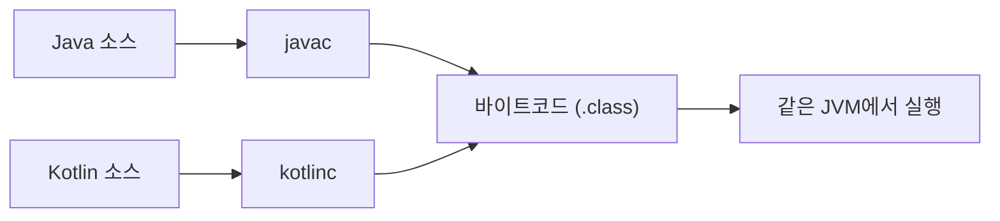

#CS #Java #면접

관련: [[Java]] · [[JVM]] · [[OOP]] · [[가상 스레드]]

## 목차
- [[#Kotlin이란? — 같은 JVM 위, 다른 문법]]
- [[#Null 안정성 — NPE를 컴파일 시점에 막기]]
- [[#데이터 클래스 — 보일러플레이트 코드 제거]]
- [[#불변성 기본값 — val vs var]]
- [[#확장 함수 — 기존 클래스에 메서드를 나중에 추가하기]]
- [[#코루틴 — 가상 스레드와는 다른 동시성 접근]]
- [[#Java와의 상호운용성]]
- [[#한 장 요약]]
- [[#Q&A로 복습하기]]

---

## Kotlin이란? — 같은 JVM 위, 다른 문법

**Kotlin**은 JetBrains가 만든 언어로, **자바와 똑같이 JVM 위에서 동작**해요. [[JVM]]에서 다룬 것처럼, 소스 코드가 바이트코드로 컴파일되어 JVM이 실행하는 구조 자체는 Java와 동일해요 — **컴파일러만 다를 뿐**이에요.



그래서 "Java보다 빠르다/느리다" 같은 질문은 성립하지 않아요 — **실행되는 곳은 결국 같은 JVM**이거든요. 차이는 **"어떤 문법으로 코드를 짜느냐"** 에 있어요. Java의 장황한 보일러플레이트 코드를 줄이고, 여러 안전장치를 언어 차원에서 기본으로 제공하는 게 Kotlin의 핵심 매력이에요.

---

## Null 안정성 — NPE를 컴파일 시점에 막기

Java에서 `NullPointerException(NPE)`은 실무에서 가장 흔한 런타임 에러 중 하나예요.

```java
// Java — 컴파일은 되지만 실행 중 터질 수 있음
String name = getUserName(); // null이 올 수도 있음
System.out.println(name.length()); // NPE 위험! 컴파일러는 아무 경고도 안 해줌
```

Kotlin은 **타입 시스템 자체에 "null이 가능한지"를 포함**시켜요.

```kotlin
var name: String = "철수"       // null 불가능한 타입 — null 대입 시도하면 컴파일 에러!
var nickname: String? = null    // ?를 붙여야만 null 허용 (Nullable 타입)

println(nickname.length)        // ❌ 컴파일 에러! null일 수 있으니 그냥은 못 씀
println(nickname?.length)       // ✅ 안전 호출(?.) — null이면 그냥 null 반환
println(nickname?.length ?: 0)  // ✅ null이면 기본값 0 사용 (엘비스 연산자 ?:)
```

**"이 값이 null일 수 있는지 없는지"를 타입에서부터 구분**해두기 때문에, **컴파일 시점에 NPE 가능성을 대부분 차단**할 수 있어요. Java의 `Optional`([[Java]] 참고)이 비슷한 목적이지만, Kotlin은 이걸 언어 문법 자체에 내장했다는 게 차이예요.

---

## 데이터 클래스 — 보일러플레이트 코드 제거

Java에서 값을 담는 간단한 클래스를 만들려면 이렇게 길어져요.

```java
// Java
class User {
    private final String name;
    private final int age;

    User(String name, int age) { this.name = name; this.age = age; }
    public String getName() { return name; }
    public int getAge() { return age; }

    @Override
    public boolean equals(Object o) { /* ... */ }
    @Override
    public int hashCode() { /* ... */ }
    @Override
    public String toString() { /* ... */ }
}
```

[[OOP]]에서 다룬 `equals()`/`hashCode()` 오버라이딩 규칙까지 매번 직접 챙겨야 해요. Kotlin은 `data class` 키워드 하나로 이걸 다 자동 생성해줘요.

```kotlin
// Kotlin — 이 한 줄이 위 Java 코드 전체와 동일한 기능을 함
data class User(val name: String, val age: Int)
```

`equals()`, `hashCode()`, `toString()`, 심지어 값을 일부만 바꾼 복사본을 만드는 `copy()`까지 **컴파일러가 자동으로 만들어줘요.**

> 참고로 Java도 최근엔 `record` 키워드(Java 14+)로 비슷한 문제를 해결했지만, Kotlin의 `data class`가 먼저 등장했고 좀 더 유연해요(예: `var` 가변 필드도 가능).

---

## 불변성 기본값 — val vs var

[[Java]]에서 다룬 `final` 키워드는 Java에서 **선택 사항**이에요 — 붙이지 않으면 기본적으로 값이 바뀔 수 있어요. Kotlin은 이걸 **강제로 선택하게** 만들어요.

```kotlin
val name = "철수"  // val = value, 재할당 불가능 (Java의 final과 같음)
var age = 20        // var = variable, 재할당 가능

name = "영희" // ❌ 컴파일 에러! val은 재할당 불가
age = 21       // ✅ var는 가능
```

`val`과 `var` 중 뭘 쓸지 **매번 명시적으로 선택**해야 하다 보니, 자연스럽게 **"굳이 안 바뀔 값이면 `val`을 쓰자"** 는 불변성 지향 습관이 생겨요. [[OOP]]에서 다룬 캡슐화·불변 객체의 이점(스레드 안전성, 예측 가능성)을 언어 차원에서 유도하는 셈이에요.

---

## 확장 함수 — 기존 클래스에 메서드를 나중에 추가하기

Java에서 이미 만들어진 클래스(예: `String`)에 새 메서드를 추가하고 싶으면, 상속하거나 유틸 클래스에 static 메서드로 만들어야 했어요.

```java
// Java — 유틸 클래스 방식
class StringUtils {
    static boolean isPalindrome(String s) { /* ... */ }
}
StringUtils.isPalindrome("level"); // 객체가 아니라 유틸 클래스를 거쳐야 함
```

Kotlin의 **확장 함수(Extension Function)** 는 기존 클래스를 건드리지 않고도, **마치 그 클래스에 원래 있던 메서드처럼** 새 함수를 추가할 수 있어요.

```kotlin
fun String.isPalindrome(): Boolean { /* ... */ } // String 클래스에 메서드를 "확장"

"level".isPalindrome() // 마치 String의 원래 메서드처럼 자연스럽게 호출
```

내부적으로는 결국 static 메서드로 컴파일되지만(Java의 방식과 원리는 비슷해요), **호출하는 코드가 훨씬 자연스럽고 읽기 좋아진다**는 게 차이예요.

---

## 코루틴 — 가상 스레드와는 다른 동시성 접근

Java가 [[가상 스레드]](Java 21)로 "가벼운 동시성 실행 단위"를 해결했다면, Kotlin은 그 이전부터 **코루틴(Coroutine)** 으로 비슷한 문제를 풀어왔어요.

```kotlin
suspend fun fetchUser(): User {
    delay(1000) // 스레드를 블로킹하지 않고 "일시 중단"
    return User("철수", 20)
}

fun main() = runBlocking {
    launch { // 코루틴 하나 시작 (매우 가벼움)
        val user = fetchUser()
        println(user)
    }
}
```

| 구분 | Java 가상 스레드 | Kotlin 코루틴 |
|---|---|---|
| 구현 방식 | JVM 레벨에서 스레드를 경량화 | 언어/라이브러리 레벨에서 실행을 "일시 중단(suspend)"하도록 컴파일 |
| 기존 코드 호환성 | 기존 `Thread` API와 거의 동일하게 사용 가능 | `suspend` 키워드가 붙은 새로운 함수 체계 필요 |
| 도입 시점 | Java 21 (비교적 최근) | Kotlin 초기부터 핵심 기능으로 존재 |

**공통점**은 둘 다 "OS 스레드보다 훨씬 가벼운 단위로 대량의 동시 작업을 처리하자"는 목표예요. [[가상 스레드]]가 "기존 스레드 API를 그대로 두고 JVM이 알아서 가볍게 만드는" 접근이라면, 코루틴은 "`suspend`라는 새로운 개념으로 코드 작성 방식 자체를 바꾸는" 접근이라는 차이가 있어요.

---

## Java와의 상호운용성

Kotlin의 큰 장점 중 하나는 **Java와 100% 상호운용**된다는 거예요.

- 같은 프로젝트 안에 `.java` 파일과 `.kt` 파일을 **섞어서** 둘 수 있어요.
- Kotlin 코드에서 Java 클래스를 그대로 가져다 쓸 수 있고, 반대도 가능해요.
- **Spring Boot**도 Kotlin을 공식 지원해요 — `@RestController`, `@Service` 같은 애노테이션을 Kotlin 클래스에도 그대로 쓸 수 있어요.

이 덕분에 실무에서는 **기존 Java 프로젝트에 Kotlin을 점진적으로 도입**하는 경우가 많아요 — 전체를 한 번에 다시 짤 필요 없이, 새로 만드는 파일부터 Kotlin으로 작성하는 식으로요.

---

## 한 장 요약

| 질문 | 답 |
|---|---|
| Kotlin과 Java의 실행 환경은? | 둘 다 JVM 위에서 실행 — 성능 차이는 실행 환경이 아니라 코드 작성 방식에서 옴 |
| Null 안정성의 차이는? | Java는 런타임에 NPE, Kotlin은 타입에 nullable 여부를 포함해 컴파일 시점에 방지 |
| data class란? | equals/hashCode/toString/copy를 자동 생성해주는 Kotlin의 값 객체 문법 |
| val vs var | val은 재할당 불가(Java의 final), var는 가능 — 매번 명시적으로 선택해야 함 |
| 확장 함수란? | 기존 클래스를 건드리지 않고 새 메서드를 추가한 것처럼 쓸 수 있게 하는 문법 |
| 코루틴과 가상 스레드의 차이는? | 코루틴은 suspend 기반의 언어 레벨 접근, 가상 스레드는 기존 Thread API를 그대로 쓰는 JVM 레벨 접근 |
| Java와 함께 쓸 수 있나? | 가능. 같은 프로젝트에서 .java와 .kt 파일 혼용, Spring Boot도 공식 지원 |

---

## Q&A로 복습하기

### Q. Kotlin이 Java보다 실행 속도가 빠르다고 할 수 있나?
A. 아니다. 둘 다 같은 JVM 위에서 바이트코드로 실행되기 때문에 실행 환경 자체는 동일하다. 차이는 성능이 아니라 코드를 얼마나 안전하고 간결하게 작성할 수 있는지에 있다.

### Q. Kotlin의 Null 안정성은 어떻게 컴파일 시점에 NPE를 막나?
A. 타입 자체에 null 허용 여부(`String`과 `String?`)를 구분해서, null이 아닌 타입에는 애초에 null을 대입할 수 없게 하고, nullable 타입은 안전 호출(`?.`)이나 엘비스 연산자(`?:`) 같은 문법을 강제해 null 처리를 빠뜨리면 컴파일 자체가 안 되게 한다.

### Q. Kotlin의 data class가 자동으로 만들어주는 것은?
A. equals(), hashCode(), toString(), 그리고 일부 값만 바꾼 복사본을 만드는 copy() 메서드를 자동으로 생성해준다.

### Q. val과 var 중 하나를 매번 선택하게 만든 것이 왜 좋은 습관을 유도하나?
A. 값이 바뀔 필요가 없다면 자연스럽게 val(불변)을 쓰게 되어, Java에서 final을 깜빡하고 안 붙이는 것과 달리 불변 객체를 기본값처럼 사용하는 습관이 언어 차원에서 유도되기 때문이다.

### Q. 코루틴과 Java 가상 스레드의 근본적인 접근 차이는?
A. 가상 스레드는 기존 Thread API를 그대로 두고 JVM이 내부적으로 가볍게 처리하는 방식이고, 코루틴은 suspend라는 새로운 언어 개념을 도입해 실행을 일시 중단할 수 있게 코드 작성 방식 자체를 바꾸는 방식이다.
