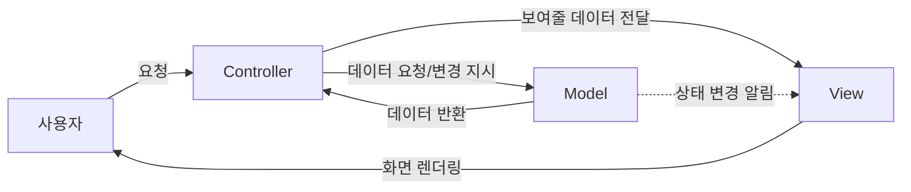
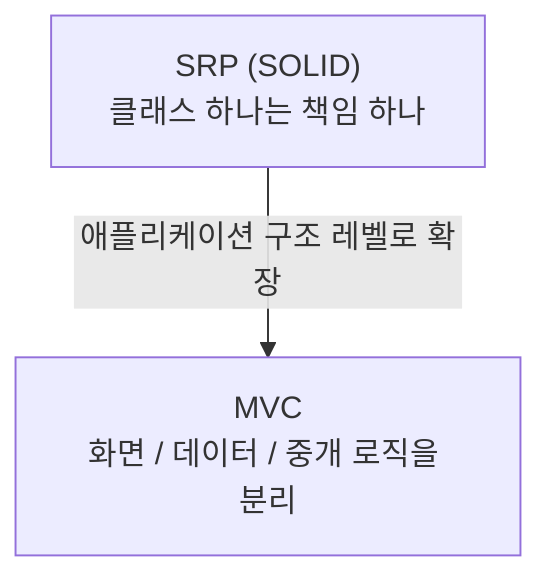
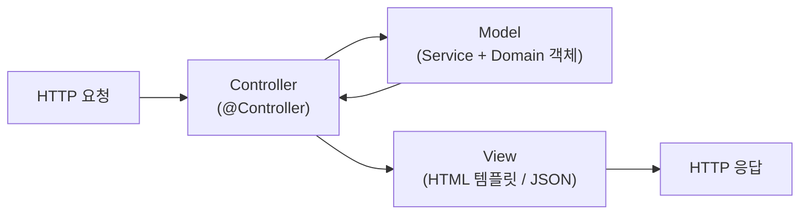

#CS #Java #면접

관련: [[OOP]] · [[SOLID]] · [[../Spring/Spring|Spring]]

## 목차
- [[#MVC는 왜 필요할까? — 뒤섞인 코드의 문제]]
- [[#Model, View, Controller — 각자의 역할]]
- [[#코드로 보는 MVC]]
- [[#MVC의 핵심 — 관심사의 분리]]
- [[#MVC의 변형들 — MVP, MVVM]]
- [[#웹에서의 MVC — Spring MVC]]
- [[#한 장 요약]]
- [[#Q&A로 복습하기]]

---

## MVC는 왜 필요할까? — 뒤섞인 코드의 문제

주문 화면을 만드는데, 이렇게 한 클래스 안에 모든 걸 다 때려 넣었다고 해봐요.

```java
class OrderPage {
    void onSubmitClick() {
        // ① DB에서 재고 확인 (데이터 로직)
        int stock = database.query("SELECT stock FROM item WHERE id=1");
        if (stock <= 0) {
            // ② 화면에 "품절" 문구 표시 (화면 로직)
            label.setText("품절되었습니다");
            return;
        }
        // ③ 주문 처리 (비즈니스 로직)
        database.update("UPDATE item SET stock = stock - 1 WHERE id=1");
        // ④ 화면에 "주문 완료" 문구 표시 (또 화면 로직)
        label.setText("주문이 완료되었습니다");
    }
}
```

이 클래스는 **데이터 처리, 비즈니스 로직, 화면 표시**가 한 메서드 안에 뒤죽박죽 섞여 있어요. 문제는 여기서 시작돼요.

- 화면 디자인만 바꾸고 싶어도 데이터 로직이 얽힌 이 코드를 건드려야 해요.
- 웹 화면 말고 모바일 앱 화면을 추가로 만들려면, 데이터/비즈니스 로직을 통째로 복사해야 해요.
- 비즈니스 로직만 테스트하고 싶어도, 화면(UI)까지 다 띄워야 테스트할 수 있어요.

**MVC(Model-View-Controller)** 는 이렇게 뒤섞이기 쉬운 역할을 **Model(데이터/로직), View(화면), Controller(중개자)** 세 가지로 나눠서 정리하는 **디자인 패턴**이에요.

> **비유**: 레스토랑을 떠올려보세요. **주방(Model)** 은 재료를 손질하고 요리를 만드는 곳, **홀(View)** 은 손님에게 요리를 보기 좋게 담아 내놓는 곳, 그리고 **매니저(Controller)** 는 손님의 주문을 받아 주방에 전달하고, 완성된 요리를 홀로 넘겨주는 역할을 해요. 주방장은 손님 응대를 몰라도 되고, 홀 직원은 요리법을 몰라도 돼요. 각자 자기 역할에만 집중하면 됩니다.

---

## Model, View, Controller — 각자의 역할



- **Model**: 데이터와 비즈니스 로직을 담당해요. "재고가 몇 개 남았는지", "주문이 유효한지" 같은 애플리케이션의 **핵심 상태와 규칙**을 가지고 있어요. View나 Controller가 어떻게 생겼는지는 전혀 몰라요.
- **View**: 사용자에게 보여지는 화면 그 자체예요. Model이 가진 데이터를 **어떻게 예쁘게 표시할지**만 신경 써요. 스스로 데이터를 계산하거나 바꾸지 않아요.
- **Controller**: 사용자의 입력(클릭, 요청 등)을 받아서, 그걸 Model에게 "이렇게 처리해줘"라고 지시하고, 처리된 결과를 다시 View에게 "이걸 보여줘"라고 전달하는 **중개자**예요.

핵심은 **View와 Model이 서로를 직접 알지 못한다**는 거예요. 둘 사이는 항상 Controller를 거쳐요 (또는 Model이 상태 변화를 View에 알림으로 통지하기도 해요). 이 덕분에 View를 통째로 갈아끼워도 Model은 전혀 영향받지 않아요.

---

## 코드로 보는 MVC

앞의 뒤섞인 코드를 MVC로 나눠보면 이렇게 정리돼요.

```java
// Model — 데이터와 비즈니스 로직만 담당
class Item {
    private int stock;

    boolean isAvailable() { return stock > 0; }
    void decreaseStock() {
        if (!isAvailable()) throw new IllegalStateException("재고 없음");
        stock--;
    }
}

// View — 화면 표시만 담당 (Model이 뭔지 몰라도 됨, 그냥 문자열만 받음)
class OrderView {
    void showMessage(String message) {
        label.setText(message);
    }
}

// Controller — 사용자 입력을 받아 Model에 지시하고, 결과를 View에 전달
class OrderController {
    private final Item item;   // Model
    private final OrderView view; // View

    void onSubmitClick() {
        if (!item.isAvailable()) {
            view.showMessage("품절되었습니다");
            return;
        }
        item.decreaseStock();
        view.showMessage("주문이 완료되었습니다");
    }
}
```

이제 `Item`(Model)은 재고 관리 로직만 신경 쓰고, `OrderView`는 화면 표시만 신경 써요. `Item`의 재고 감소 로직만 따로 떼어서 **화면 없이도 단위 테스트**를 돌릴 수 있게 됐다는 게 큰 차이예요.

---

## MVC의 핵심 — 관심사의 분리

MVC가 결국 실현하는 건 **관심사의 분리(Separation of Concerns)** 예요. 이건 [[SOLID]]의 **SRP(단일 책임 원칙)** 를 애플리케이션 전체 구조 레벨로 확장한 것이라고 볼 수 있어요 — "화면을 그리는 이유"와 "데이터를 다루는 이유"는 서로 다른 이유이니, 다른 곳에 둬야 한다는 거죠.



이렇게 나누면 좋은 점이 명확해져요.

- **독립적인 개발**: 디자이너는 View를, 백엔드 개발자는 Model을 서로 방해받지 않고 동시에 작업할 수 있어요.
- **재사용성**: 같은 Model을 웹 화면(View)과 모바일 앱 화면(View)이 함께 재사용할 수 있어요.
- **테스트 용이성**: 화면 없이도 Model(비즈니스 로직)만 따로 테스트할 수 있어요.

---

## MVC의 변형들 — MVP, MVVM

MVC는 널리 쓰이지만, "Controller가 너무 많은 일을 떠맡는다"는 지적도 있어서 몇 가지 변형이 등장했어요.

| 패턴 | 중개자 역할 | 특징 |
|---|---|---|
| **MVC** | Controller | View가 Controller와 Model 양쪽을 어느 정도 알 수도 있음 (구현에 따라 다름) |
| **MVP** (Model-View-Presenter) | Presenter | View는 Model을 아예 모름. Presenter가 View와 완전히 1:1로 소통, View는 수동적(Passive View) |
| **MVVM** (Model-View-ViewModel) | ViewModel | View와 ViewModel이 **데이터 바인딩**으로 자동 동기화 — Controller/Presenter처럼 매번 명시적으로 화면을 갱신하는 코드를 안 써도 됨 |

> 셋 다 "관심사 분리"라는 목표는 같고, **View와 로직을 누가/어떻게 연결해주느냐**가 다를 뿐이에요. 프론트엔드 프레임워크(React, Vue 등)는 MVVM에 가까운 방식(상태가 바뀌면 화면이 자동으로 다시 그려짐)을 많이 씁니다.

---

## 웹에서의 MVC — Spring MVC

지금까지는 화면 프로그램(데스크톱 앱) 관점에서 설명했는데, 웹 백엔드에서도 MVC는 그대로 적용돼요. 다만 "사용자의 클릭"이 "HTTP 요청"으로, "화면 갱신"이 "HTML/JSON 응답"으로 바뀔 뿐이에요.



Spring 진영에서는 이 패턴이 **Spring MVC** 프레임워크로 구체화돼 있어요. `DispatcherServlet`이 Controller 앞단에서 요청을 알맞은 Controller로 라우팅해주는 역할까지 추가로 맡고 있는데, 이 흐름의 자세한 내용(DispatcherServlet, HandlerMapping 등)은 [[../Spring/Spring|Spring]] 문서의 "Spring MVC 요청 처리 흐름" 섹션에서 다뤘어요.

---

## 한 장 요약

| 질문 | 답 |
|---|---|
| MVC가 해결하는 문제는? | 데이터/로직/화면이 뒤섞여 유지보수·재사용·테스트가 어려워지는 문제 |
| Model의 역할은? | 데이터와 비즈니스 로직, View/Controller의 존재를 모름 |
| View의 역할은? | 데이터를 화면에 표시만 함, 스스로 데이터를 계산/변경하지 않음 |
| Controller의 역할은? | 사용자 입력을 받아 Model에 지시하고, 결과를 View에 전달하는 중개자 |
| MVC와 SOLID의 관계는? | SRP(단일 책임 원칙)를 애플리케이션 구조 레벨로 확장한 것으로 볼 수 있음 |
| MVP, MVVM과의 차이는? | 중개자가 누구인지(Presenter/ViewModel)와 View 연결 방식이 다름 |

---

## Q&A로 복습하기

### Q. MVC에서 Model, View, Controller는 각각 무엇을 담당하나?
A. Model은 데이터와 비즈니스 로직, View는 화면 표시, Controller는 사용자 입력을 받아 Model에 처리를 지시하고 결과를 View에 전달하는 중개자 역할을 한다.

### Q. MVC에서 View와 Model은 서로를 직접 알아야 하나?
A. 아니다. View와 Model은 서로를 직접 알지 못하고 항상 Controller를 거쳐 소통한다. 그 덕분에 View를 통째로 바꿔도 Model에는 영향이 없다.

### Q. MVC가 SOLID의 SRP와 어떤 관계가 있나?
A. SRP가 클래스 하나에 책임 하나만 두라는 원칙이라면, MVC는 이 원칙을 애플리케이션 전체 구조 레벨로 확장해 데이터/로직(Model)과 화면(View)이라는 서로 다른 책임을 분리한 것으로 볼 수 있다.

### Q. MVC로 코드를 나누면 얻는 실질적인 이점은?
A. 디자이너와 개발자가 독립적으로 작업할 수 있고, 같은 Model을 여러 화면(웹/모바일)에서 재사용할 수 있으며, 화면 없이도 Model(비즈니스 로직)만 따로 테스트할 수 있다.

### Q. MVP, MVVM은 MVC와 무엇이 다른가?
A. 셋 다 관심사 분리가 목표지만, View와 로직을 연결해주는 중개자가 다르다. MVP는 Presenter가 View와 1:1로 소통하고 View가 완전히 수동적이며, MVVM은 ViewModel과 View가 데이터 바인딩으로 자동 동기화된다.
