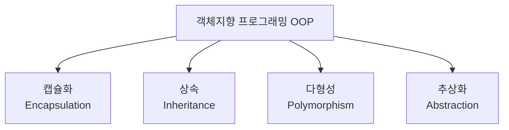
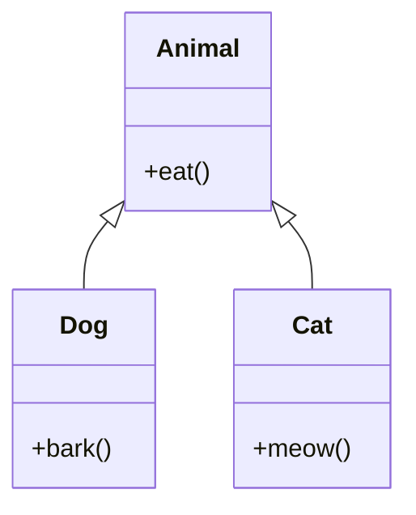
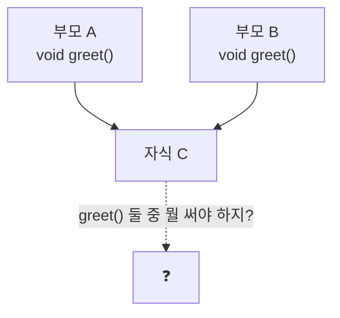

#CS #Java #OOP #면접

관련: [[JVM]] · [[Java]] · [[SOLID]]

## 목차
- [[#시작하기 전에: OOP가 뭔데?]]
- [[#OOP를 지탱하는 4개의 기둥]]
- [[#오버로딩 vs 오버라이딩 — 헷갈리는 단짝]]
- [[#인터페이스 vs 추상 클래스]]
- [[#SOLID 원칙 — 좋은 객체지향 설계의 5가지 규칙]]
- [[#상속보다 합성? (Composition over Inheritance)]]
- [[#equals()와 hashCode() — 자주 실수하는 짝꿍]]
- [[#왜 자바는 클래스 다중 상속을 막았을까?]]
- [[#한 장 요약]]
- [[#Q&A로 복습하기]]

---

## 시작하기 전에: OOP가 뭔데?

"객체지향 프로그래밍(OOP)"이라는 말을 들으면 뭔가 거창해 보이지만, 사실은 아주 단순한 아이디어에서 출발해요.

> **"현실 세계처럼, 데이터랑 그 데이터를 다루는 기능을 하나로 묶어서 '객체'라는 단위로 코드를 짜자."**

예를 들어 우리가 "자동차"를 코드로 표현한다고 생각해봅시다. 자동차는 **속도, 연료량 같은 데이터(속성)** 와 **가속하기, 멈추기 같은 기능(행위)** 을 같이 가지고 있죠. OOP는 이걸 그대로 `Car`라는 하나의 클래스(설계도)로 묶어서 표현해요.

```java
class Car {
    int speed = 0;       // 속성 (데이터)
    int fuel = 100;

    void accelerate() {  // 행위 (기능)
        speed += 10;
        fuel -= 5;
    }
}
```

절차지향 프로그래밍(옛날 방식)은 데이터와 기능이 따로 놀아서, `speed`를 바꾸는 함수가 코드 여기저기에 흩어져 있었어요. OOP는 이걸 `Car` 안에 다 모아둬서 **"자동차와 관련된 건 다 여기 있다"** 고 정리해주는 셈이죠. 그래서 코드가 커져도 관리하기 편하고, 재사용하기도 쉬워집니다.

---

## OOP를 지탱하는 4개의 기둥

OOP는 보통 4가지 핵심 특성으로 설명돼요. 하나씩 비유와 코드로 살펴볼게요.



### 1. 캡슐화 (Encapsulation) — "포장해서 숨기기"

**비유**: 자판기를 생각해보세요. 우리는 버튼만 누르면 되지, 자판기 안에서 동전을 어떻게 인식하고 음료를 어떻게 내리는지는 몰라도 됩니다. 오히려 내부를 마음대로 못 만지게 막아놓은 게 안전하죠.

캡슐화는 **데이터(필드)를 외부에서 함부로 못 건드리게 숨기고**, 정해진 방법(메서드)으로만 접근하게 만드는 것이에요.

```java
class BankAccount {
    private int balance = 0; // private → 외부에서 직접 접근 불가

    public void deposit(int amount) {
        if (amount > 0) balance += amount; // 검증 로직을 통과해야만 변경 가능
    }

    public int getBalance() {
        return balance;
    }
}
```

만약 `balance`를 `public`으로 열어뒀다면 누구나 `account.balance = -9999;` 처럼 마이너스로 만들어버릴 수 있어요. `private`으로 막고 `deposit()`을 통해서만 바꾸게 하면 이런 사고를 원천 차단할 수 있습니다.

### 2. 상속 (Inheritance) — "부모의 것을 물려받기"

**비유**: 부모님한테 눈매, 성격을 물려받듯이, 클래스도 다른 클래스의 속성과 기능을 물려받을 수 있어요.

```java
class Animal {
    void eat() { System.out.println("먹는다"); }
}

class Dog extends Animal {
    void bark() { System.out.println("멍멍!"); }
}
```

`Dog`는 `Animal`을 상속했기 때문에 `eat()`을 새로 안 만들어도 그대로 쓸 수 있고, 자기만의 기능인 `bark()`를 추가로 가질 수 있어요.



> ⚠️ 주의: 상속은 "A는 B의 한 종류다(is-a)"라는 관계일 때만 써야 해요. `Dog is-a Animal`은 자연스럽지만, 억지로 관계없는 클래스를 상속시키면 오히려 코드가 꼬입니다. (이럴 땐 뒤에 나올 "합성"을 쓰는 게 낫습니다.)

### 3. 다형성 (Polymorphism) — "같은 명령, 다른 결과"

**비유**: "소리 내봐!"라고 시켰을 때 강아지는 "멍멍", 고양이는 "야옹" 하고 답하죠. 시키는 말(메서드 이름)은 같아도 **실제로 누구냐에 따라 다르게 동작**하는 것, 이게 다형성이에요.

```java
class Animal {
    void sound() { System.out.println("..."); }
}
class Dog extends Animal {
    void sound() { System.out.println("멍멍!"); }
}
class Cat extends Animal {
    void sound() { System.out.println("야옹~"); }
}

Animal a1 = new Dog();
Animal a2 = new Cat();
a1.sound(); // 멍멍!
a2.sound(); // 야옹~
```

둘 다 타입은 `Animal`이지만, 실제로 담긴 객체(`Dog`, `Cat`)에 따라 다른 `sound()`가 실행돼요. 이걸 **동적 바인딩(런타임에 실제 객체를 보고 메서드를 결정)** 이라고 부릅니다. 덕분에 `Animal` 목록에 강아지든 고양이든 넣어놓고 `for` 문 하나로 `a.sound()`만 호출해도 각자 알아서 자기 소리를 내요 — 이게 다형성의 실전 위력입니다.

### 4. 추상화 (Abstraction) — "핵심만 남기고 걷어내기"

**비유**: 자동차 운전대를 배울 때 엔진 내부 구조까지 알 필요는 없죠. "핸들, 브레이크, 액셀"이라는 **공통적이고 필요한 인터페이스**만 알면 됩니다.

```java
abstract class Shape {
    abstract double area(); // "넓이를 구할 수 있어야 한다"는 규칙만 정의, 구현은 자식에게 맡김
}

class Circle extends Shape {
    double radius;
    double area() { return 3.14 * radius * radius; }
}
```

`Shape`은 "도형이라면 반드시 넓이를 구할 수 있어야 한다"는 규칙(추상 메서드)만 정해두고, 실제로 "어떻게" 계산하는지는 `Circle`, `Rectangle` 같은 자식 클래스가 알아서 채워 넣게 합니다. 복잡한 세부사항은 감추고, 꼭 필요한 것만 드러내는 거죠.

---

## 오버로딩 vs 오버라이딩 — 헷갈리는 단짝

이름이 비슷해서 자주 헷갈리는 두 개념이에요. 표로 정리하면 이렇습니다.

| 구분 | 오버로딩 (Overloading) | 오버라이딩 (Overriding) |
|---|---|---|
| 한 줄 요약 | 같은 이름, 다른 매개변수로 **여러 개** 만들기 | 부모 메서드를 자식이 **재정의**하기 |
| 발생 위치 | 같은 클래스 안 | 상속 관계(부모-자식) |
| 언제 결정되나 | 컴파일 타임(정적) | 런타임(동적) |

```java
// 오버로딩: 이름은 add로 같지만 매개변수가 다름
int add(int a, int b) { return a + b; }
double add(double a, double b) { return a + b; }

// 오버라이딩: 부모 메서드를 자식이 새로 정의
class Animal { void sound() { System.out.println("..."); } }
class Dog extends Animal {
    @Override
    void sound() { System.out.println("멍멍!"); } // 완전히 같은 시그니처로 재정의
}
```

외우기 팁: **오버로딩(Overloading)은 "짐을 더 싣는다(load)"** → 메서드를 더 추가하는 것. **오버라이딩(Overriding)은 "위에 덮어쓴다(ride over)"** → 기존 걸 새로 덮어쓰는 것.

---

## 인터페이스 vs 추상 클래스

둘 다 "구현을 강제하는 틀"이라는 점에서 비슷해 보이지만, 쓰임새가 달라요.

- **추상 클래스**: "이건 ~이다"라는 **정체성**을 공유하면서, 공통 구현(코드)도 같이 물려주고 싶을 때. (예: `Animal` — 모든 동물은 `eat()`이라는 실제 동작을 공유)
- **인터페이스**: "이건 ~을 할 수 있다"는 **능력/규약**만 강제하고 싶을 때, 그리고 서로 관련 없는 클래스들에 공통 기능을 부여하고 싶을 때. (예: `Flyable` — 새도 날 수 있고, 비행기도 날 수 있지만 둘은 아무 관계가 없음)

```java
interface Flyable {
    void fly();
}
class Bird implements Flyable {
    public void fly() { System.out.println("날개로 난다"); }
}
class Airplane implements Flyable {
    public void fly() { System.out.println("엔진으로 난다"); }
}
```

| 구분 | 인터페이스 | 추상 클래스 |
|---|---|---|
| 다중 상속 | 여러 개 `implements` 가능 | 하나만 `extends` 가능 |
| 필드 | 상수만 가능 | 일반 필드 가능(상태 보유) |
| 생성자 | 없음 | 있음 |

> 자바 8부터 인터페이스도 `default` 메서드(기본 구현체)를 가질 수 있게 되면서 둘의 경계가 예전보다는 흐려졌어요. 하지만 "상태(필드)를 가질 수 있느냐"는 여전히 뚜렷한 차이입니다.

---

## SOLID 원칙 — 좋은 객체지향 설계의 5가지 규칙

OOP 문법(캡슐화/상속/다형성/추상화)을 안다고 저절로 좋은 설계가 나오는 건 아니에요. 이 4가지 특성을 "잘" 써서 바꾸기 쉽고 안전한 코드를 만들기 위한 5가지 원칙이 SOLID예요. 각 원칙마다 나쁜 예/좋은 예 코드와 다이어그램으로 자세히 정리해뒀어요 → **[[SOLID]] 문서 참고**.

- **S — 단일 책임 원칙**: 클래스는 "바뀌어야 할 이유"가 하나뿐이어야 한다.
- **O — 개방-폐쇄 원칙**: 기능을 추가할 땐 기존 코드를 고치지 말고, 새 코드를 "확장"해서 붙일 수 있어야 한다.
- **L — 리스코프 치환 원칙**: 자식 클래스는 부모 클래스 자리에 넣어도 문제없이 동작해야 한다.
- **I — 인터페이스 분리 원칙**: 인터페이스는 필요한 기능만 작게 쪼개서 만든다.
- **D — 의존관계 역전 원칙**: 구체적인 클래스가 아니라 인터페이스(추상화)에 의존한다.

---

## 상속보다 합성? (Composition over Inheritance)

상속은 편리하지만 부모 클래스와 강하게 묶여버리는 단점이 있어요. 부모 코드가 바뀌면 자식도 예상치 못하게 영향을 받을 수 있죠.

**합성**은 상속 대신, 다른 객체를 "부품"처럼 필드로 가져와서 기능을 위임하는 방식이에요.

```java
// 상속 방식
class Car extends Engine { ... }  // Car가 Engine의 모든 걸 그대로 물려받음 (어색함: "자동차는 엔진이다"?)

// 합성 방식
class Car {
    private Engine engine = new Engine(); // Car가 Engine을 "부품"으로 가짐 (자연스러움: "자동차는 엔진을 가진다")
    void start() { engine.run(); }
}
```

"자동차는 엔진이다(is-a)"보다 "자동차는 엔진을 가진다(has-a)"가 훨씬 자연스럽죠? 이런 관계라면 상속보다 합성을 쓰는 게 맞습니다. 실무에서는 **"is-a 관계가 명확할 때만 상속을 쓰고, 그 외엔 합성을 우선 고려하라"**는 조언이 정석으로 통해요.

---

## equals()와 hashCode() — 자주 실수하는 짝꿍

- `==` : 두 변수가 **같은 객체(같은 메모리 주소)** 를 가리키는지 비교.
- `equals()` : (오버라이딩했다면) **내용이 같은지** 비교. `String`의 `equals()`는 이미 오버라이딩되어 있어서 값 비교를 해줍니다.

```java
String s1 = new String("hi");
String s2 = new String("hi");
s1 == s2;        // false (다른 객체)
s1.equals(s2);   // true (내용은 같음)
```

**중요한 규칙**: `equals()`를 오버라이딩했다면 `hashCode()`도 반드시 같이 오버라이딩해야 해요. 이 둘의 규칙이 안 맞으면 `HashMap`, `HashSet`에 넣었을 때 "분명 같은 값인데 못 찾는" 이상한 버그가 생깁니다. (`HashMap`이 왜 이런 걸 요구하는지는 [[Java]] 문서의 HashMap 파트에서 자세히 다뤄요.)

---

## 왜 자바는 클래스 다중 상속을 막았을까?

두 부모가 똑같은 이름의 메서드를 각자 다르게 갖고 있으면, 자식이 어떤 걸 물려받아야 할지 애매해지는 **다이아몬드 문제**가 생기기 때문이에요.



그래서 자바는 클래스는 하나만 상속하게 하고, 대신 **인터페이스는 여러 개 구현**할 수 있게 열어줬어요. 인터페이스끼리 `default` 메서드가 충돌하면 컴파일 에러를 내서, 개발자가 직접 명시적으로 어떤 걸 쓸지 정하도록 강제합니다.

---

## 한 장 요약

| 개념 | 핵심 한 줄 |
|---|---|
| 캡슐화 | 데이터를 숨기고 정해진 방법으로만 접근하게 한다 |
| 상속 | 부모의 속성/기능을 물려받는다 (is-a 관계일 때만) |
| 다형성 | 같은 호출이 실제 객체에 따라 다르게 동작한다 |
| 추상화 | 공통적이고 필요한 부분만 남기고 나머진 숨긴다 |

---

## Q&A로 복습하기

### Q. 캡슐화가 필요한 이유는?
A. 데이터를 외부에서 함부로 바꾸지 못하게 막고, 정해진 메서드(getter/setter 등)를 통해서만 접근하게 해서 잘못된 상태가 되는 걸 막기 위해서다.

### Q. 오버로딩과 오버라이딩은 각각 언제 결정되나?
A. 오버로딩은 컴파일 타임에 매개변수를 보고 결정되고, 오버라이딩은 런타임에 실제 객체 타입을 보고 결정된다(동적 바인딩).

### Q. 인터페이스와 추상 클래스를 가르는 가장 뚜렷한 차이는?
A. 상태(필드)를 가질 수 있느냐다. 인터페이스는 상수만 가질 수 있지만, 추상 클래스는 일반 필드를 가지고 생성자도 가질 수 있다.

### Q. equals()를 오버라이딩하면 왜 hashCode()도 같이 오버라이딩해야 하나?
A. equals()가 true인 두 객체는 hashCode()도 같아야 한다는 규칙이 있는데, 이걸 지키지 않으면 HashMap/HashSet에 넣었을 때 같은 값인데도 못 찾는 버그가 생긴다.

### Q. 상속 대신 합성을 써야 하는 경우는?
A. "A는 B의 한 종류다(is-a)"라는 관계가 명확하지 않을 때. 그런 경우엔 "A는 B를 가진다(has-a)"는 합성이 더 자연스럽고 결합도도 낮다.
