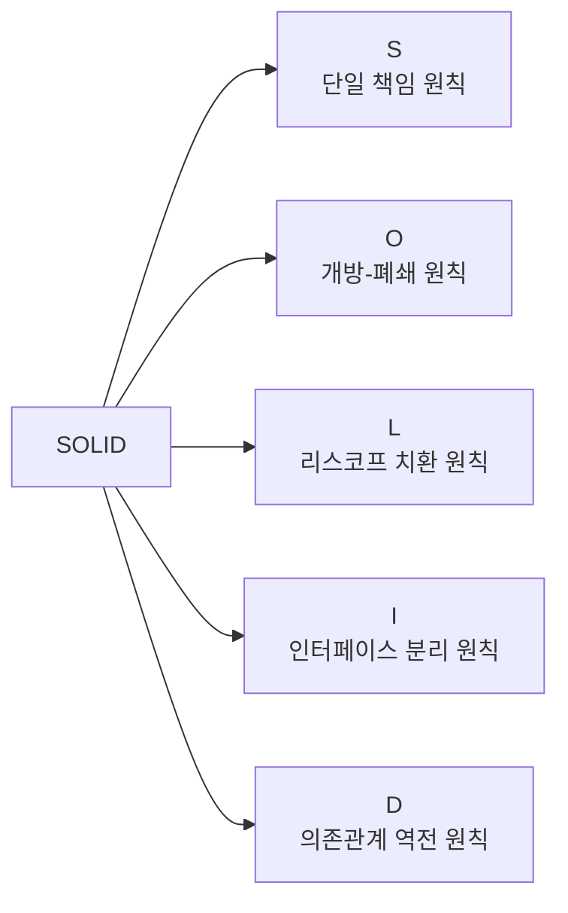
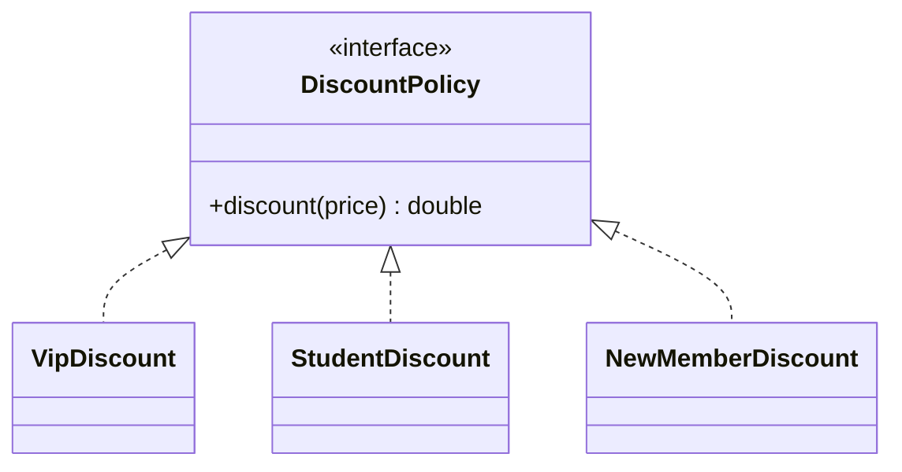
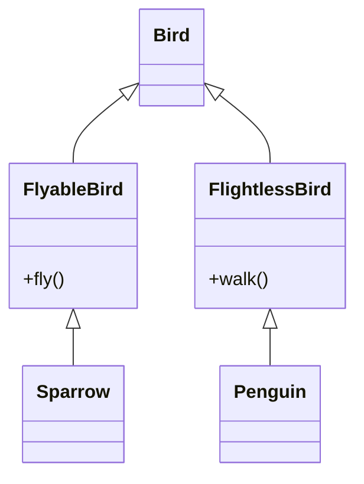
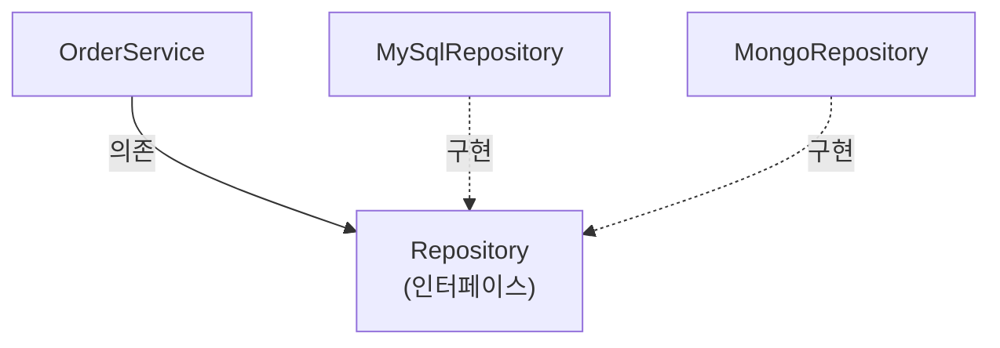

#CS #Java #OOP #면접

관련: [[OOP]] · [[디자인 패턴]] · [[Java]]

## 목차
- [[#SOLID가 왜 필요할까?]]
- [[#S — 단일 책임 원칙 (Single Responsibility Principle)]]
- [[#O — 개방-폐쇄 원칙 (Open-Closed Principle)]]
- [[#L — 리스코프 치환 원칙 (Liskov Substitution Principle)]]
- [[#I — 인터페이스 분리 원칙 (Interface Segregation Principle)]]
- [[#D — 의존관계 역전 원칙 (Dependency Inversion Principle)]]
- [[#한 장 요약]]
- [[#Q&A로 복습하기]]

> OOP의 4대 특성은 [[OOP]] 문서에서 다뤘고, 여기서는 그 특성들을 "잘" 활용해서 **좋은 설계**를 만드는 5가지 원칙, SOLID를 깊게 파봅니다.

---

## SOLID가 왜 필요할까?

캡슐화, 상속, 다형성을 안다고 해서 저절로 좋은 코드가 나오진 않아요. 문법은 맞지만 **바꾸기 힘들고, 건드릴 때마다 여기저기서 터지는 코드**는 얼마든지 만들 수 있거든요.

> 비유: 레고 블록을 생각해보세요. 블록 하나하나가 "특정 모양에 딱 맞게, 다른 블록과는 절대 안 섞이게" 만들어져 있다면 어떨까요? 새로운 걸 만들려고 할 때마다 기존 블록을 깎아내야 할 거예요. 반대로 규격이 잘 잡힌 레고는 어떤 조합으로도 쉽게 끼웠다 뺐다 할 수 있죠. **SOLID는 코드를 "레고 블록"처럼 만들기 위한 5가지 설계 규칙**이에요.

로버트 마틴(Robert C. Martin)이 정리한 5가지 원칙의 앞글자를 딴 이름이에요. 하나씩 "나쁜 예 → 좋은 예"로 살펴볼게요.



---

## S — 단일 책임 원칙 (Single Responsibility Principle)

> **"클래스는 변경되어야 할 이유가 오직 하나여야 한다."**

### 나쁜 예

```java
class Report {
    void generate() { /* 리포트 내용 계산 */ }
    void print() { /* 프린터로 출력 */ }
    void saveToDatabase() { /* DB에 저장 */ }
}
```

`Report` 클래스 하나가 "내용 계산", "출력 방식", "저장 방식"까지 다 떠맡고 있어요. 문제는 이 셋이 **서로 다른 이유로 바뀐다**는 거예요.
- 프린터 회사가 바뀌면 `print()`를 고쳐야 하고
- DB를 MySQL에서 MongoDB로 바꾸면 `saveToDatabase()`를 고쳐야 하는데
- 이 두 가지 이유로 **같은 클래스**를 계속 건드리게 되고, 그 과정에서 서로 상관없는 `generate()` 로직까지 실수로 망가뜨릴 위험이 생겨요.

### 좋은 예

```java
class Report {
    void generate() { /* 리포트 내용 계산만 담당 */ }
}
class ReportPrinter {
    void print(Report report) { /* 출력만 담당 */ }
}
class ReportRepository {
    void save(Report report) { /* 저장만 담당 */ }
}
```

**비유**: "책임 하나 = 사람 한 명"이라고 생각하면 쉬워요. 요리사한테 서빙까지 시키지 말고, 요리는 요리사, 서빙은 서버가 각자 맡게 하는 거예요. 그래야 메뉴가 바뀌어도 서버는 영향받지 않아요.

---

## O — 개방-폐쇄 원칙 (Open-Closed Principle)

> **"확장에는 열려 있고, 변경(수정)에는 닫혀 있어야 한다."**

새 기능을 추가할 때 **기존 코드는 안 건드리고**, 새 코드만 갖다 붙이는 방식으로 확장할 수 있어야 한다는 뜻이에요.

### 나쁜 예

```java
class DiscountService {
    double discount(String customerType, double price) {
        if (customerType.equals("VIP")) return price * 0.8;
        if (customerType.equals("STUDENT")) return price * 0.9;
        // 새 고객 등급이 추가될 때마다 여기 if를 계속 추가해야 함 😩
        return price;
    }
}
```

새로운 할인 정책이 하나 생길 때마다 **기존 `discount()` 메서드 자체를 계속 뜯어고쳐야** 해요. 코드가 커질수록 이 메서드는 점점 거대한 `if-else` 덩어리가 되고, 수정할 때마다 기존 로직을 망가뜨릴 위험도 커져요.

### 좋은 예



```java
interface DiscountPolicy {
    double discount(double price);
}
class VipDiscount implements DiscountPolicy {
    public double discount(double price) { return price * 0.8; }
}
class StudentDiscount implements DiscountPolicy {
    public double discount(double price) { return price * 0.9; }
}
// 새 정책이 필요하면? 기존 클래스는 그대로 두고 새 클래스만 추가하면 끝!
class NewMemberDiscount implements DiscountPolicy {
    public double discount(double price) { return price * 0.95; }
}
```

`DiscountPolicy`라는 **다형성**([[OOP]] 참고)을 활용한 인터페이스 뒤에 정책을 숨겨두면, 새 할인 정책이 생겨도 **기존 클래스는 단 한 줄도 건드리지 않고** 새 클래스만 추가(확장)하면 돼요.

---

## L — 리스코프 치환 원칙 (Liskov Substitution Principle)

> **"자식 클래스는 부모 클래스 자리에 넣어도 프로그램이 문제없이 동작해야 한다."**

상속 관계를 "문법적으로" 맞게 짰다고 해서 이 원칙을 지키는 게 아니에요. **부모가 한 "약속(동작)"을 자식이 깨면 안 된다**는 게 핵심이에요.

### 나쁜 예 — 유명한 "펭귄은 새다" 문제

```java
class Bird {
    void fly() { System.out.println("난다"); }
}
class Sparrow extends Bird { } // 참새: fly() 그대로 잘 동작

class Penguin extends Bird {
    void fly() {
        throw new UnsupportedOperationException("펭귄은 못 날아요!"); // 💥
    }
}
```

```java
void makeItFly(Bird bird) {
    bird.fly(); // Bird 타입이면 당연히 날 수 있다고 믿고 호출
}
makeItFly(new Sparrow());  // 정상 동작
makeItFly(new Penguin());  // 예외 발생! Bird 자리에 Penguin을 넣었더니 프로그램이 깨짐
```

`Penguin`은 문법적으로는 `Bird`를 상속했지만, "새는 난다"는 부모의 약속을 지키지 못해요. `Bird` 타입을 쓰는 모든 코드가 "혹시 펭귄이면 어쩌지?"를 걱정해야 한다면, 이건 **상속 관계가 잘못 설계된 것**이에요.

### 좋은 예 — 약속을 지킬 수 있는 만큼만 상속 관계로 묶기



```java
class Bird { }
class FlyableBird extends Bird {
    void fly() { System.out.println("난다"); }
}
class FlightlessBird extends Bird {
    void walk() { System.out.println("걷는다"); }
}
class Sparrow extends FlyableBird { }
class Penguin extends FlightlessBird { } // fly()가 아예 없으니 억지로 예외 던질 일도 없음
```

"날 수 있는 새"와 "못 나는 새"를 아예 다른 타입으로 나누면, 각 타입을 쓰는 코드는 "이 타입이면 반드시 이 동작을 지원한다"는 걸 믿고 안심하고 쓸 수 있어요.

---

## I — 인터페이스 분리 원칙 (Interface Segregation Principle)

> **"클라이언트는 자신이 사용하지 않는 메서드에 의존하면 안 된다."**

### 나쁜 예

```java
interface Machine {
    void print();
    void scan();
    void fax();
}

class SimplePrinter implements Machine {
    public void print() { /* 인쇄 */ }
    public void scan() { throw new UnsupportedOperationException(); } // 안 되는데 억지로 구현
    public void fax() { throw new UnsupportedOperationException(); }  // 안 되는데 억지로 구현
}
```

**비유**: 리모컨 하나에 TV, 에어컨, 세탁기 버튼이 전부 달려 있다고 생각해보세요. TV만 있는 사람도 어쩔 수 없이 안 쓰는 에어컨·세탁기 버튼까지 든 리모컨을 들고 다녀야 해요. 게다가 세탁기 버튼 로직이 바뀌면, TV만 쓰는 사람의 리모컨 설계도 덩달아 영향을 받을 수 있어요.

### 좋은 예

```java
interface Printer { void print(); }
interface Scanner { void scan(); }
interface Fax { void fax(); }

class SimplePrinter implements Printer {
    public void print() { /* 인쇄만 구현하면 끝 */ }
}
class AllInOnePrinter implements Printer, Scanner, Fax {
    public void print() { /* ... */ }
    public void scan() { /* ... */ }
    public void fax() { /* ... */ }
}
```

인터페이스를 필요한 기능 단위로 잘게 쪼개면, 각 클래스는 **자기가 실제로 할 수 있는 기능의 인터페이스만** 골라서 구현하면 돼요. 억지로 빈 구현체나 예외를 던지는 코드를 안 만들어도 되죠.

---

## D — 의존관계 역전 원칙 (Dependency Inversion Principle)

> **"구체적인 것에 의존하지 말고, 추상적인 것(인터페이스)에 의존해야 한다."**

### 나쁜 예

```java
class MySqlRepository {
    void save(String data) { /* MySQL에 저장 */ }
}
class OrderService {
    private MySqlRepository repository = new MySqlRepository(); // 구체 클래스를 직접 참조
    void order() {
        repository.save("주문 데이터");
    }
}
```

`OrderService`가 `MySqlRepository`라는 **구체적인 구현체**를 직접 알고 있어요. 나중에 MongoDB로 바꾸고 싶다면? `OrderService` 코드를 직접 뜯어고쳐야 해요. 높은 레벨의 정책(`OrderService`, "주문을 처리한다")이 낮은 레벨의 세부 구현(`MySqlRepository`, "MySQL에 저장하는 방법")에 질질 끌려다니는 상황이에요.

### 좋은 예



```java
interface Repository {
    void save(String data);
}
class MySqlRepository implements Repository {
    public void save(String data) { /* MySQL에 저장 */ }
}
class MongoRepository implements Repository {
    public void save(String data) { /* MongoDB에 저장 */ }
}
class OrderService {
    private final Repository repository; // 구체 클래스가 아닌 인터페이스에 의존

    OrderService(Repository repository) { // 외부에서 실제 구현체를 "주입"받음
        this.repository = repository;
    }
    void order() {
        repository.save("주문 데이터");
    }
}
```

이제 `OrderService`는 "저장을 어떻게 하는지"는 전혀 몰라도 돼요. 그냥 `Repository`라는 **약속(인터페이스)** 만 믿고 `save()`를 호출할 뿐이에요. MySQL이든 MongoDB든, 심지어 테스트용 가짜 구현체든 자유롭게 갈아 끼울 수 있어요.

> 💡 이렇게 외부에서 필요한 구현체를 "생성자 등을 통해 넣어주는" 방식을 **의존성 주입(DI, Dependency Injection)** 이라고 해요. 스프링(Spring) 프레임워크의 핵심 기능 중 하나가 바로 이 DIP를 프레임워크 차원에서 자동으로 처리해주는 거예요 — `@Autowired` 등을 통해 개발자가 직접 `new`로 구현체를 연결하지 않아도, 스프링 컨테이너가 알아서 적절한 구현체를 주입해줍니다.

---

## 한 장 요약

| 원칙 | 한 줄 요약 | 어길 때 나타나는 증상 |
|---|---|---|
| **S**RP | 클래스는 책임(변경 이유) 하나만 | 관련 없는 기능 하나 고치려다 다른 기능까지 건드림 |
| **O**CP | 확장엔 열고, 수정엔 닫기 | 새 기능 추가할 때마다 기존 코드의 if-else를 계속 늘림 |
| **L**SP | 자식은 부모의 약속을 지킬 것 | 특정 자식 타입만 예외적으로 처리하는 분기문이 생김 |
| **I**SP | 안 쓰는 기능까지 강제로 구현하지 않기 | 빈 메서드나 `UnsupportedOperationException`이 생김 |
| **D**IP | 구체 클래스가 아닌 인터페이스에 의존 | 구현체를 바꾸려면 사용하는 쪽 코드까지 같이 고쳐야 함 |

---

## Q&A로 복습하기

### Q. SRP를 어기면 실제로 어떤 문제가 생기나?
A. 서로 다른 이유로 바뀌는 기능들이 한 클래스에 몰려 있어서, 한 기능을 고치다가 관계없는 다른 기능까지 실수로 망가뜨릴 위험이 커진다.

### Q. OCP를 지키면 새 기능을 추가할 때 뭐가 달라지나?
A. 기존 클래스(코드)는 건드리지 않고 새 클래스(구현체)만 추가하면 돼서, 기존 로직이 깨질 위험이 줄어든다.

### Q. LSP를 어긴 대표적인 예시는?
A. `Bird`를 상속한 `Penguin`의 `fly()`가 예외를 던지는 것처럼, 자식 클래스가 부모 클래스의 동작 약속(모든 새는 난다)을 지키지 못하는 상황.

### Q. ISP가 해결하려는 문제는?
A. 하나의 큰 인터페이스에 기능을 다 몰아넣으면 필요 없는 메서드까지 억지로 구현해야 하는 문제. 인터페이스를 기능 단위로 잘게 쪼개서 해결한다.

### Q. DIP와 DI(의존성 주입)의 관계는?
A. DIP는 "구체 클래스가 아니라 추상화(인터페이스)에 의존하라"는 설계 원칙이고, DI는 그 원칙을 실제로 구현하는 기법(외부에서 구현체를 만들어 주입해주는 방식)이다.
