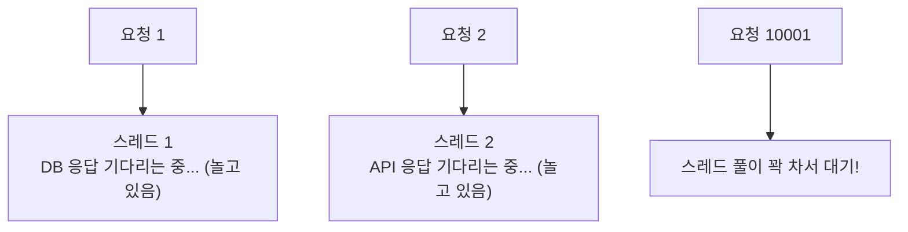
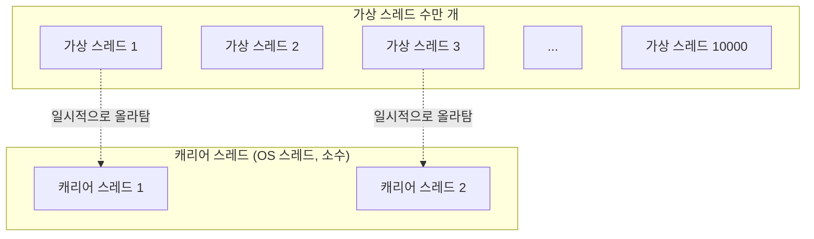
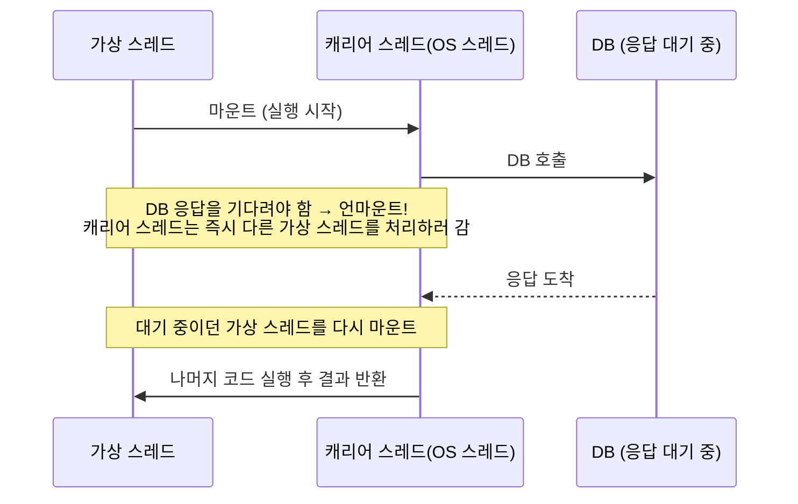

#CS #Java #면접

관련: [[동시성]] · [[Java]] · [[JVM]] · [[../Operating System/프로세스와 스레드|프로세스와 스레드]]

## 목차
- [[#기존 스레드(플랫폼 스레드)의 한계]]
- [[#가상 스레드란? — 훨씬 가벼운 스레드]]
- [[#코드로 보는 가상 스레드]]
- [[#왜 이렇게 가벼울까? — 마운트/언마운트의 원리]]
- [[#언제 써야 할까?]]
- [[#주의할 점 — Pinning]]
- [[#플랫폼 스레드 vs 가상 스레드]]
- [[#한 장 요약]]
- [[#Q&A로 복습하기]]

---

## 기존 스레드(플랫폼 스레드)의 한계

[[동시성]] 문서에서 다룬 `Thread`는 사실 **OS(운영체제)가 관리하는 스레드와 1:1로 연결**돼 있어요. 이런 전통적인 스레드를 (가상 스레드와 구분해서) **플랫폼 스레드(Platform Thread)** 라고 불러요.

문제는 이 OS 스레드가 꽤 "무겁다"는 거예요.

- **메모리**: 스레드 하나당 보통 수백 KB~1MB의 스택 메모리를 차지해요. 스레드 1만 개를 만들면 그것만으로 수 GB가 필요할 수도 있어요.
- **생성/전환 비용**: OS 스레드를 만들고, 스레드끼리 전환(컨텍스트 스위칭)하는 것도 커널 개입이 필요해서 비용이 커요.

그래서 실무에서는 보통 [[동시성]]에서 다룬 **Thread Pool로 스레드 수를 몇백 개 수준으로 제한**해서 써요. 그런데 웹 서버처럼 **"동시에 처리해야 할 요청은 수만 개인데, 그 요청 대부분이 DB 응답이나 외부 API 응답을 그냥 기다리기만 하는(I/O 대기)" 상황**에서는 이 제한이 발목을 잡아요.



> **비유**: 콜센터에 상담원(스레드)이 200명 있어요. 문제는 상담원 한 명이 전화를 걸어놓고 상대방이 응답할 때까지 **아무 일도 안 하고 수화기만 붙잡고 멍하니 기다린다**는 거예요. 상담원 수는 한정돼 있으니, 201번째 전화는 "상담원이 통화를 안 하고 있어도" 그냥 대기해야 해요.

이 문제를 해결하려고 Java 21에 정식 도입된 게 (Project Loom의 결과물인) **가상 스레드(Virtual Thread)** 예요.

---

## 가상 스레드란? — 훨씬 가벼운 스레드

**가상 스레드는 OS가 아니라 JVM이 직접 관리하는, 아주 가벼운 스레드**예요. 개수를 수백만 개까지 만들어도 부담이 없을 정도로 가벼워요.

핵심 아이디어는 이거예요 — **"진짜 OS 스레드(플랫폼 스레드)는 소수만 유지하고, 그 위에서 수많은 가상 스레드가 번갈아가며 잠깐씩 빌려 쓴다."** 이때 가상 스레드에게 실행 시간을 빌려주는 진짜 OS 스레드를 **캐리어 스레드(Carrier Thread)** 라고 불러요.



> **비유**: 콜센터에 진짜 상담원(캐리어 스레드)은 8명뿐이지만, 걸려오는 전화(가상 스레드)는 수만 통이에요. 상담원은 전화를 받고 질문을 전달한 뒤 **상대가 답할 때까지 기다리지 않고, 그 수화기는 잠깐 내려놓고 다른 전화를 받으러 가요.** 답이 오면 그때 다시 (같은 상담원이든 다른 상담원이든) 누군가 그 수화기를 집어 들고 대화를 이어가요. 그래서 실제 상담원 수는 적어도 동시에 수만 통의 전화를 "처리 중"인 것처럼 보일 수 있어요.

---

## 코드로 보는 가상 스레드

사용법은 놀랍도록 기존 `Thread` API와 거의 똑같아요 — 이게 가상 스레드 설계의 핵심 목표 중 하나예요(기존 코드/개념을 최대한 재사용).

```java
// 가상 스레드 하나 직접 생성
Thread.ofVirtual().start(() -> {
    System.out.println("가상 스레드에서 실행: " + Thread.currentThread());
});

// 실무에서 흔히 쓰는 방식: 요청마다 가상 스레드 하나씩 할당
try (ExecutorService executor = Executors.newVirtualThreadPerTaskExecutor()) {
    for (int i = 0; i < 10_000; i++) {
        executor.submit(() -> {
            // DB 호출, 외부 API 호출 등 I/O 대기가 있는 작업
            callSlowApi();
            return null;
        });
    }
} // ExecutorService가 AutoCloseable이라 자동으로 shutdown + 완료 대기
```

`Executors.newFixedThreadPool(200)`처럼 스레드 수를 제한하지 않고, **`newVirtualThreadPerTaskExecutor()`는 매 작업마다 새 가상 스레드를 만들어요.** 가상 스레드가 워낙 가벼워서 "풀에 모아 재사용"할 필요가 없기 때문이에요.

---

## 왜 이렇게 가벼울까? — 마운트/언마운트의 원리

핵심은 **I/O 때문에 대기해야 할 때, 가상 스레드가 캐리어 스레드를 붙잡고 있지 않고 즉시 반납한다**는 거예요.



- **마운트(Mount)**: 가상 스레드가 캐리어 스레드 위에 올라타서 실제로 실행되는 것.
- **언마운트(Unmount)**: `DB 호출`, `Thread.sleep()`처럼 **블로킹(대기)이 필요한 지점**에서, 가상 스레드가 캐리어 스레드에서 스스로 내려오는 것. 이때 캐리어 스레드는 놀지 않고 곧바로 **다른 가상 스레드를 마운트해서 처리**해요.

이 덕분에 "I/O를 기다리느라 아무 일도 안 하면서 자리만 차지하는" 스레드가 사라져요. 소수의 캐리어 스레드만으로도 수만 개의 "기다리는 중" 작업을 효율적으로 돌릴 수 있는 거예요.

---

## 언제 써야 할까?

가상 스레드는 만능이 아니에요. **I/O 바운드(I/O-bound) 작업**, 즉 DB 조회, 외부 API 호출, 파일 읽기처럼 **"기다리는 시간"이 많은 작업**에서 진가를 발휘해요.

반대로 **CPU 바운드(CPU-bound) 작업**(복잡한 계산, 이미지 인코딩처럼 CPU를 계속 쓰는 작업)에는 딱히 이점이 없어요. 애초에 CPU 코어 개수 이상으로 동시에 계산을 돌릴 수는 없으니, 스레드가 가볍다고 해서 계산이 더 빨라지진 않거든요.

| 작업 종류 | 예시 | 가상 스레드 효과 |
|---|---|---|
| I/O 바운드 | DB 쿼리, 외부 API 호출, 파일 I/O | ⭐ 큰 효과 (동시 처리량 대폭 증가) |
| CPU 바운드 | 이미지 처리, 암호화 연산, 복잡한 계산 | 효과 미미 (플랫폼 스레드와 큰 차이 없음) |

---

## 주의할 점 — Pinning

가상 스레드가 언마운트되지 **못하고 캐리어 스레드에 계속 눌러붙어버리는** 경우가 있는데, 이걸 **Pinning(고정)** 이라고 해요. 대표적인 원인이 `synchronized` 블록/메서드 안에서 블로킹 I/O를 호출하는 경우예요.

```java
synchronized (lock) {
    callSlowApi(); // synchronized 블록 안에서 I/O 대기 → 언마운트 안 되고 캐리어 스레드를 계속 붙잡음!
}
```

이러면 가상 스레드를 쓰는 의미가 없어져요 — 캐리어 스레드가 계속 묶여있으니 다른 가상 스레드를 처리 못 하거든요. 이런 경우엔 `synchronized` 대신 [[동시성]]에서 다룬 `ReentrantLock`을 쓰는 걸 권장해요 (`ReentrantLock`은 Pinning을 유발하지 않아요).

---

## 플랫폼 스레드 vs 가상 스레드

| 구분 | 플랫폼 스레드 (Platform Thread) | 가상 스레드 (Virtual Thread) |
|---|---|---|
| 관리 주체 | OS (커널) | JVM |
| OS 스레드와의 관계 | 1:1 | 다수의 가상 스레드가 소수의 캐리어 스레드를 공유 (M:N) |
| 메모리 비용 | 스레드당 수백 KB~1MB | 훨씬 가벼움 (스택도 필요할 때만 힙에 할당) |
| 적정 개수 | 보통 수백~수천 개 (Thread Pool로 제한) | 수백만 개까지도 가능 |
| 적합한 작업 | CPU 바운드 작업 | I/O 바운드 작업 (블로킹 호출이 잦은 경우) |
| 도입 시점 | Java 초기부터 | Java 21 (정식, Project Loom 결과물) |

---

## 한 장 요약

| 질문 | 답 |
|---|---|
| 플랫폼 스레드의 한계는? | OS 스레드와 1:1이라 무겁고, I/O 대기 중에도 자리를 계속 차지함 |
| 가상 스레드의 핵심 아이디어는? | 소수의 캐리어 스레드를 수많은 가상 스레드가 번갈아 빌려 씀 |
| 언마운트는 언제 일어나나? | 가상 스레드가 블로킹 I/O로 대기해야 할 때, 캐리어 스레드를 반납하며 발생 |
| 가상 스레드가 유리한 작업은? | I/O 바운드 작업 (DB/API 호출 등 대기 시간이 많은 작업) |
| 가상 스레드가 안 유리한 작업은? | CPU 바운드 작업 (계산량 자체는 줄지 않으므로) |
| Pinning이 발생하는 대표 원인은? | synchronized 블록 안에서 블로킹 I/O를 호출할 때 |

---

## Q&A로 복습하기

### Q. 가상 스레드가 필요해진 배경은?
A. 전통적인 플랫폼 스레드는 OS 스레드와 1:1로 연결돼 무겁기 때문에 Thread Pool로 개수를 수백~수천 개로 제한할 수밖에 없는데, I/O 대기가 많은 상황(예: 웹 서버)에서는 이 제한이 동시 처리량의 병목이 되기 때문이다.

### Q. 캐리어 스레드란 무엇인가?
A. 가상 스레드가 실제로 실행될 때 잠깐 올라타는 진짜 OS 스레드다. 소수의 캐리어 스레드를 수많은 가상 스레드가 번갈아 공유해서 쓴다.

### Q. 가상 스레드가 가벼운 핵심 원리는?
A. 가상 스레드가 DB 호출 같은 블로킹 I/O로 대기해야 할 때, 캐리어 스레드에서 스스로 내려오는(언마운트) 방식으로 동작한다. 이 덕분에 캐리어 스레드는 그 시간 동안 다른 가상 스레드를 처리할 수 있어, 소수의 OS 스레드로도 수많은 대기 작업을 효율적으로 처리할 수 있다.

### Q. 가상 스레드가 CPU 바운드 작업에는 왜 큰 효과가 없나?
A. CPU 바운드 작업은 애초에 기다리는 시간 없이 CPU를 계속 쓰는 작업이라, 언마운트할 기회 자체가 없다. 동시에 처리할 수 있는 양은 결국 CPU 코어 개수로 제한되므로 스레드가 가볍다고 해서 더 빨라지지 않는다.

### Q. Pinning은 왜 문제이고, 어떻게 피할 수 있나?
A. synchronized 블록 안에서 블로킹 I/O를 호출하면 가상 스레드가 언마운트되지 못하고 캐리어 스레드를 계속 붙잡아, 가상 스레드를 쓰는 의미가 사라진다. synchronized 대신 ReentrantLock을 쓰면 이 문제를 피할 수 있다.
