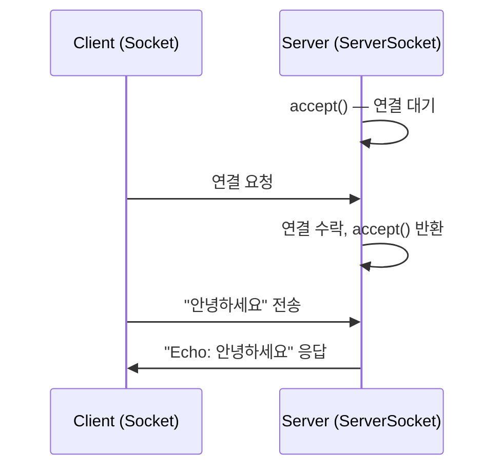
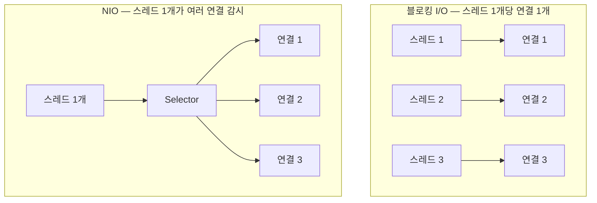

#CS #Java #면접

관련: [[Java]] · [[동시성]] · [[가상 스레드]] · [[../Infrastructure/RESTful API|RESTful API]]

## 목차
- [[#소켓이란? — 통신의 양쪽 끝]]
- [[#TCP 소켓 프로그래밍 — Socket과 ServerSocket]]
- [[#블로킹 I/O의 한계 — 스레드 하나에 커넥션 하나]]
- [[#NIO — 논블로킹과 멀티플렉싱]]
- [[#Selector로 여러 커넥션을 스레드 하나가 처리하기]]
- [[#UDP — 연결 없이 그냥 보내기]]
- [[#HttpClient — Java 표준 HTTP 클라이언트]]
- [[#가상 스레드가 이 모든 걸 다시 단순하게 만든 이유]]
- [[#한 장 요약]]
- [[#Q&A로 복습하기]]

---

## 소켓이란? — 통신의 양쪽 끝

두 프로그램이 네트워크로 데이터를 주고받으려면, 각자 **"통신의 문"** 을 하나씩 열어둬야 해요. 이 문이 바로 **소켓(Socket)** 이에요 — **IP 주소와 포트 번호로 식별되는, 네트워크 통신의 종착점(Endpoint)** 이에요.

> **비유**: 전화 통화를 생각해보면, 소켓은 "전화기"예요. 전화를 걸려면(클라이언트) 상대방의 전화번호(IP+포트)를 알아야 하고, 전화를 받으려면(서버) 누군가 걸어올 때까지 수화기를 들고 대기(리스닝)해야 해요.

Java는 `java.net` 패키지에서 소켓 프로그래밍을 위한 기본 도구를 제공해요.

---

## TCP 소켓 프로그래밍 — Socket과 ServerSocket

**서버 쪽**: 특정 포트에서 연결을 기다려요.

```java
try (ServerSocket serverSocket = new ServerSocket(8080)) { // 8080 포트에서 대기
    while (true) {
        Socket clientSocket = serverSocket.accept(); // 클라이언트 연결이 올 때까지 블로킹(대기)

        BufferedReader in = new BufferedReader(new InputStreamReader(clientSocket.getInputStream()));
        PrintWriter out = new PrintWriter(clientSocket.getOutputStream(), true);

        String message = in.readLine(); // 클라이언트가 보낸 데이터 읽기
        out.println("Echo: " + message); // 그대로 되돌려주기
        clientSocket.close();
    }
}
```

**클라이언트 쪽**: 서버에 연결해서 데이터를 주고받아요.

```java
try (Socket socket = new Socket("localhost", 8080)) { // 서버에 연결 시도
    PrintWriter out = new PrintWriter(socket.getOutputStream(), true);
    BufferedReader in = new BufferedReader(new InputStreamReader(socket.getInputStream()));

    out.println("안녕하세요"); // 서버로 전송
    String response = in.readLine(); // 서버 응답 읽기
    System.out.println(response); // "Echo: 안녕하세요"
}
```



---

## 블로킹 I/O의 한계 — 스레드 하나에 커넥션 하나

위 예시는 `accept()` 이후 클라이언트 하나를 처리하는 동안 **서버가 다른 연결을 못 받아요.** 그래서 실무에서는 보통 연결마다 [[동시성]]에서 다룬 **스레드**를 하나씩 할당해요.

```java
while (true) {
    Socket clientSocket = serverSocket.accept();
    new Thread(() -> handleClient(clientSocket)).start(); // 연결마다 스레드 하나
}
```

문제는 [[가상 스레드]]에서 다룬 것과 정확히 같은 문제예요 — **동시 접속자가 수만 명이면 스레드도 수만 개**가 필요해지고, 전통적인 플랫폼 스레드는 하나당 수백 KB~1MB를 차지해서 감당이 안 돼요. 이 문제를 해결하려고 나온 게 **NIO**예요.

---

## NIO — 논블로킹과 멀티플렉싱

**NIO(New I/O, `java.nio` 패키지)** 는 **하나의 스레드가 여러 개의 연결을 동시에 처리**할 수 있게 해줘요. 핵심 개념 세 가지예요.

- **Channel**: 데이터가 오가는 통로. 기존 `Socket`의 스트림과 달리, **읽기와 쓰기 모두 가능**해요.
- **Buffer**: Channel과 데이터를 주고받을 때 쓰는 임시 저장 공간.
- **Selector**: **여러 Channel 중 "지금 당장 처리할 준비가 된 것"만 골라주는** 감시자예요.



> **비유**: 블로킹 I/O는 "테이블마다 웨이터 한 명씩 붙여두고, 손님이 주문할 때까지 그 앞에 서서 기다리는" 방식이에요. NIO는 "웨이터 한 명이 모든 테이블을 순회하면서, **주문할 준비가 된 테이블만** 응대하는" 방식이에요 — 훨씬 적은 인원으로 많은 테이블을 커버할 수 있죠.

---

## Selector로 여러 커넥션을 스레드 하나가 처리하기

```java
Selector selector = Selector.open();
ServerSocketChannel serverChannel = ServerSocketChannel.open();
serverChannel.bind(new InetSocketAddress(8080));
serverChannel.configureBlocking(false); // 논블로킹 모드로 설정
serverChannel.register(selector, SelectionKey.OP_ACCEPT); // "연결 요청이 오면 알려줘"

while (true) {
    selector.select(); // 준비된 이벤트가 생길 때까지 대기 (여기서만 블로킹)
    Set<SelectionKey> keys = selector.selectedKeys();

    for (SelectionKey key : keys) {
        if (key.isAcceptable()) {
            // 새 연결 수락 처리
        } else if (key.isReadable()) {
            // 읽을 데이터가 준비된 채널만 처리 — 스레드 하나가 계속 순회
        }
    }
    keys.clear();
}
```

`selector.select()` 호출 한 번으로 **등록된 채널들 중 "지금 이벤트가 발생한" 것들만 걸러서** 알려줘요. 스레드는 **준비 안 된 채널을 기다리느라 낭비되는 시간 없이**, 계속 준비된 것들만 처리하며 돌아갈 수 있어요.

> 실무에서는 이런 저수준 NIO API를 직접 다루기보다, 이걸 훨씬 편하게 감싼 **Netty** 같은 프레임워크를 써요. [[../Java/Redis 클라이언트|Redis 클라이언트]]에서 다룬 Lettuce도 내부적으로 Netty를 기반으로 만들어졌어요.

---

## UDP — 연결 없이 그냥 보내기

TCP가 "전화 통화"(연결을 맺고, 순서 보장, 신뢰성 있게 주고받음)라면, **UDP**는 "엽서 보내기"에 가까워요 — **연결 없이, 순서·도착 보장 없이 그냥 보내는** 방식이에요.

```java
// UDP 송신
DatagramSocket socket = new DatagramSocket();
byte[] data = "hello".getBytes();
DatagramPacket packet = new DatagramPacket(data, data.length, InetAddress.getByName("localhost"), 9000);
socket.send(packet); // 상대가 받든 안 받든 일단 보냄
```

| 구분 | TCP | UDP |
|---|---|---|
| 연결 | 연결 지향 (핸드셰이크 필요) | 비연결 (그냥 전송) |
| 신뢰성 | 순서 보장, 손실 시 재전송 | 보장 없음 (빠른 대신 유실 가능) |
| 대표 용도 | 웹(HTTP), 파일 전송 — 정확성이 중요할 때 | 실시간 스트리밍, 온라인 게임 — 속도가 중요할 때 |

---

## HttpClient — Java 표준 HTTP 클라이언트

지금까지 본 건 저수준 소켓 통신이었는데, 실무에서 **REST API를 호출**할 땐 이렇게 낮은 레벨을 직접 다루지 않아요. Java 11부터는 표준 라이브러리에 **`HttpClient`** 가 포함돼서, [[../Infrastructure/RESTful API|RESTful API]] 호출을 훨씬 간단하게 할 수 있어요.

```java
HttpClient client = HttpClient.newHttpClient();
HttpRequest request = HttpRequest.newBuilder()
    .uri(URI.create("https://api.example.com/users/1"))
    .GET()
    .build();

// 동기 호출
HttpResponse<String> response = client.send(request, HttpResponse.BodyHandlers.ofString());
System.out.println(response.statusCode()); // 200

// 비동기 호출 — 스레드를 막지 않고 결과가 오면 처리
client.sendAsync(request, HttpResponse.BodyHandlers.ofString())
    .thenApply(HttpResponse::body)
    .thenAccept(System.out::println);
```

`HttpClient`는 내부적으로 이미 NIO를 활용해서, **적은 스레드로도 많은 요청을 효율적으로 처리**할 수 있게 설계돼 있어요.

---

## 가상 스레드가 이 모든 걸 다시 단순하게 만든 이유

NIO는 강력하지만, `Selector`/`Channel`/콜백 위주의 코드는 **작성하고 디버깅하기 어렵다**는 평이 많았어요. [[가상 스레드]]는 이 복잡함을 다른 방향에서 해결해요.

```java
// 가상 스레드 + 블로킹 스타일 코드 — NIO의 복잡한 콜백 없이도 대량 연결 처리 가능
try (ExecutorService executor = Executors.newVirtualThreadPerTaskExecutor()) {
    while (true) {
        Socket clientSocket = serverSocket.accept();
        executor.submit(() -> handleClient(clientSocket)); // 평범한 블로킹 코드처럼 작성
    }
}
```

가상 스레드는 **개발자가 예전처럼 단순한 블로킹 스타일 코드**(`accept()`, `readLine()` 같은)를 그대로 짜도, JVM이 내부적으로 "I/O 대기 중엔 캐리어 스레드를 반납"하는 방식으로 **NIO 수준의 효율을 스레드 코드 복잡도 없이** 얻을 수 있게 해줘요. 자세한 원리는 [[가상 스레드]]에서 다룬 마운트/언마운트 개념을 참고하세요.

---

## 한 장 요약

| 질문 | 답 |
|---|---|
| 소켓이란? | IP 주소와 포트로 식별되는 네트워크 통신의 종착점 |
| 블로킹 I/O의 한계는? | 연결마다 스레드가 필요해 동시 접속자가 많으면 감당 어려움 |
| NIO의 핵심은? | Selector로 스레드 하나가 여러 채널 중 준비된 것만 골라 처리(멀티플렉싱) |
| TCP vs UDP | TCP는 연결지향+신뢰성, UDP는 비연결+빠름(순서/도착 보장 없음) |
| HttpClient란? | Java 11+ 표준 HTTP 클라이언트, 동기/비동기 모두 지원 |
| 가상 스레드가 네트워크 프로그래밍을 단순화한 방법은? | 블로킹 스타일 코드를 그대로 써도 JVM이 내부적으로 NIO 수준 효율을 제공 |

---

## Q&A로 복습하기

### Q. 블로킹 I/O 방식으로 서버를 만들면 왜 동시 접속자가 많을 때 문제가 되나?
A. 연결마다 스레드를 하나씩 할당해야 하는데, 플랫폼 스레드는 하나당 수백 KB~1MB의 메모리를 차지하기 때문에 동시 접속자가 수만 명이면 그만큼의 스레드를 감당하기 어려워진다.

### Q. NIO의 Selector는 어떤 역할을 하나?
A. 여러 채널(연결)을 감시하다가, 그중 실제로 읽기/쓰기 등 처리할 준비가 된 채널만 골라서 알려준다. 덕분에 스레드 하나가 여러 연결을 순회하며 효율적으로 처리할 수 있다(멀티플렉싱).

### Q. TCP와 UDP의 가장 근본적인 차이는?
A. TCP는 연결을 맺고 순서와 전달을 보장하는 신뢰성 있는 통신이고, UDP는 연결 없이 그냥 데이터를 보내는 방식으로 속도는 빠르지만 순서나 도착을 보장하지 않는다.

### Q. 가상 스레드가 NIO의 대안이 될 수 있는 이유는?
A. 개발자는 예전처럼 단순한 블로킹 스타일 코드를 그대로 작성해도, 가상 스레드가 I/O 대기 시점마다 캐리어 스레드를 반납하는 방식으로 동작해 NIO의 콜백 기반 복잡한 코드 없이도 비슷한 수준의 동시 처리 효율을 얻을 수 있기 때문이다.
