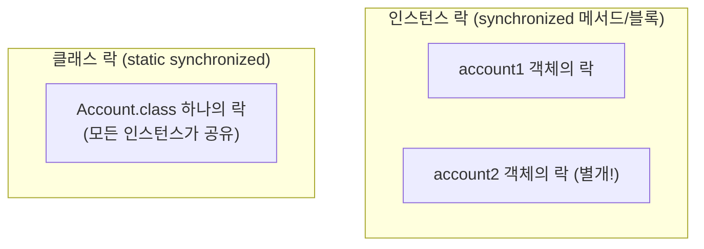
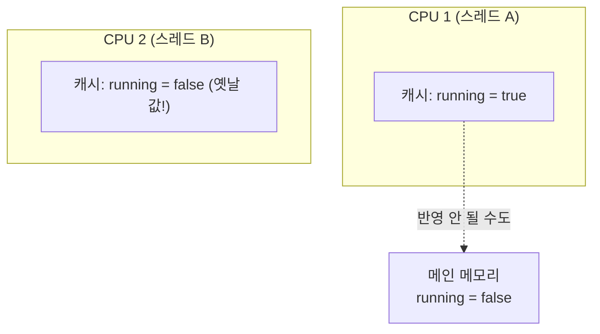
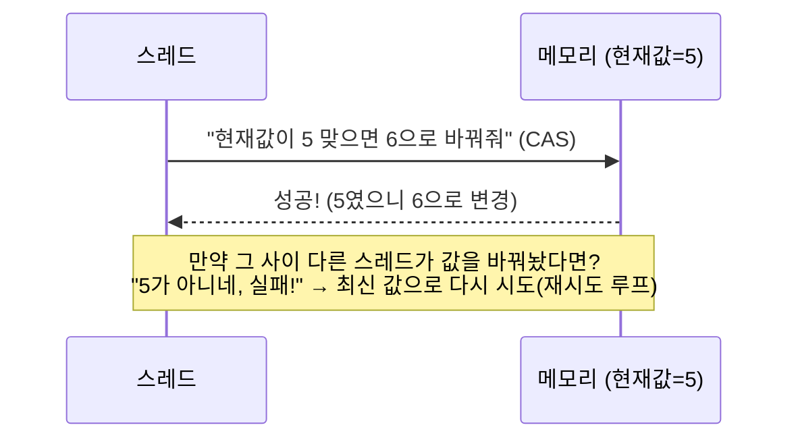

#CS #Java #면접

관련: [[동시성]] · [[가상 스레드]]

[[동시성]]에서 다룬 Race Condition을 막는 구체적인 도구들 — `synchronized`, `Lock`, `volatile`, `Atomic` — 을 깊게 다루는 문서예요.

## 목차
- [[#동기화란? — 임계 영역에 순서를 매기는 것]]
- [[#synchronized 자세히 보기 — 모니터 락]]
- [[#wait·notify·notifyAll — 스레드끼리 신호 주고받기]]
- [[#Lock 인터페이스 — synchronized보다 세밀한 제어]]
- [[#ReadWriteLock — 읽기는 동시에, 쓰기는 혼자서]]
- [[#volatile 자세히 보기 — 가시성 문제]]
- [[#뮤텍스와 세마포어 — 익숙한 이름으로 다시 보기]]
- [[#Atomic과 CAS — 락 없이 안전하게]]
- [[#그 외 동기화 유틸리티]]
- [[#synchronized vs Lock 총정리]]
- [[#한 장 요약]]
- [[#Q&A로 복습하기]]

---

## 동기화란? — 임계 영역에 순서를 매기는 것

**동기화(Synchronization)** 는 [[동시성]]에서 다룬 **임계 영역(Critical Section)** — 여러 스레드가 동시에 건드리면 안 되는 코드 구간 — 에 **"한 번에 한 스레드만 들어가도록 순서를 매기는 것"** 이에요. 이번 문서는 자바가 제공하는 동기화 도구들을 하나씩 깊게 살펴봐요.

---

## synchronized 자세히 보기 — 모니터 락

자바의 **모든 객체는 눈에 보이지 않는 락을 하나씩 가지고 있어요.** 이걸 **모니터 락(Monitor Lock)** 이라고 불러요. `synchronized`는 이 락을 활용해요.

**① 메서드 동기화**: 메서드 전체를 잠가요. 이때 잠기는 락은 **`this`(호출한 인스턴스) 객체의 락**이에요.

```java
class Account {
    synchronized void deposit() { // this의 락을 잡음
        balance++;
    }
}
```

**② 블록 동기화**: 메서드 전체가 아니라 **필요한 부분만** 잠글 수 있어요. 락으로 쓸 객체를 직접 지정해요.

```java
class Account {
    private final Object lock = new Object(); // 락 전용 객체 (관례적으로 따로 둠)

    void deposit() {
        // 임계 영역이 아닌 코드는 락 없이 실행 (성능 이점)
        System.out.println("입금 처리 시작");

        synchronized (lock) { // lock 객체의 락을 잡음
            balance++;
        }
    }
}
```

메서드 전체를 잠그는 것보다 **꼭 필요한 구간만 최소한으로 잠그는 게** 다른 스레드를 덜 기다리게 해서 성능에 유리해요.

**③ `static synchronized`**: static 메서드에 붙이면, 인스턴스 락이 아니라 **클래스 자체의 락(Class 객체의 락)** 을 잡아요. 그래서 인스턴스를 아무리 많이 만들어도, `static synchronized` 메서드는 **전체 애플리케이션에서 한 번에 하나만** 실행돼요.



---

## wait·notify·notifyAll — 스레드끼리 신호 주고받기

`synchronized`가 "들어오지 못하게 막는" 역할이라면, `wait()`/`notify()`는 **스레드끼리 "아직 준비 안 됐으니 기다려", "이제 준비됐어!"라고 신호를 주고받는** 용도예요. 생산자-소비자 패턴이 대표적인 예시예요.

```java
class Box {
    private final Queue<Integer> items = new LinkedList<>();
    private final int CAPACITY = 5;

    synchronized void put(int value) throws InterruptedException {
        while (items.size() == CAPACITY) {
            wait(); // 꽉 찼으면 락을 반납하고 대기 (notify를 받을 때까지)
        }
        items.offer(value);
        notifyAll(); // "자리 생겼어!" 라고 대기 중인 소비자에게 신호
    }

    synchronized int take() throws InterruptedException {
        while (items.isEmpty()) {
            wait(); // 비었으면 대기
        }
        int value = items.poll();
        notifyAll(); // "물건 생겼어!" 라고 대기 중인 생산자에게 신호
        return value;
    }
}
```

`wait()`는 `synchronized` 블록 안에서만 호출할 수 있어요 — 호출하는 순간 **모니터 락을 반납하고 잠들면서, 다른 스레드가 그 락을 잡고 작업할 수 있게 양보**해요. 나중에 누군가 `notify()`/`notifyAll()`을 호출하면 다시 깨어나 락을 다시 얻으려고 시도해요.

> 실무에서는 이 `wait/notify`를 직접 다루기보다, 뒤에 나올 `BlockingQueue`처럼 이미 잘 만들어진 도구를 쓰는 경우가 훨씬 많아요.

---

## Lock 인터페이스 — synchronized보다 세밀한 제어

[[동시성]]에서 살짝 언급한 `ReentrantLock`을 자세히 볼게요. `synchronized`는 편하지만 **JVM이 알아서 락을 관리**해서 개발자가 세밀하게 제어할 여지가 적어요. `Lock` 인터페이스는 이 부분을 보완해요.

```java
private final ReentrantLock lock = new ReentrantLock();

void deposit() {
    lock.lock();
    try {
        balance++;
    } finally {
        lock.unlock(); // 반드시 finally에서! 안 그러면 예외 발생 시 영원히 잠김
    }
}
```

`ReentrantLock`이 `synchronized`보다 나은 점들이에요.

- **`tryLock()`**: 락을 못 잡으면 무한정 기다리지 않고, **바로 포기하고 다른 일을 할 수 있어요.**
  ```java
  if (lock.tryLock()) {
      try { /* 처리 */ } finally { lock.unlock(); }
  } else {
      System.out.println("락을 못 잡았으니 다른 작업 진행");
  }
  ```
- **`lockInterruptibly()`**: 락을 기다리는 도중에도 **인터럽트로 대기를 중단**시킬 수 있어요. `synchronized`로 기다리는 스레드는 이렇게 중간에 못 끊어요.
- **공정성(Fairness)**: `new ReentrantLock(true)`로 만들면, **먼저 기다린 스레드가 먼저 락을 얻도록** 순서를 보장해요. (`synchronized`는 이런 순서를 보장하지 않아요.)

---

## ReadWriteLock — 읽기는 동시에, 쓰기는 혼자서

"조회는 자주 일어나지만 수정은 가끔만 일어나는" 데이터를 다룰 때, 조회끼리도 서로 막아버리는 건 낭비예요. **`ReentrantReadWriteLock`은 읽기 락과 쓰기 락을 분리**해서, **여러 스레드가 동시에 읽는 건 허용**하고 **쓰기만 배타적으로 막아요.**

```java
private final ReadWriteLock rwLock = new ReentrantReadWriteLock();

int read() {
    rwLock.readLock().lock();
    try {
        return data; // 여러 스레드가 동시에 읽기 가능
    } finally {
        rwLock.readLock().unlock();
    }
}

void write(int value) {
    rwLock.writeLock().lock();
    try {
        data = value; // 쓰기 중엔 다른 읽기/쓰기 모두 대기
    } finally {
        rwLock.writeLock().unlock();
    }
}
```


일반 `ReentrantLock`을 쓰면 읽기끼리도 서로 기다려야 하지만, `ReadWriteLock`은 **"읽기는 여러 명이 동시에 봐도 안전하다"** 는 특성을 살려서 훨씬 높은 동시성을 낼 수 있어요.

---

## volatile 자세히 보기 — 가시성 문제

[[동시성]]에서 살짝 짚은 것처럼, 각 CPU 코어는 성능을 위해 변수를 **자기 캐시에 복사**해두고 써요. 문제는 한 스레드가 값을 바꿔도, 그 변경이 **다른 스레드의 캐시에는 바로 반영되지 않을 수 있다**는 거예요.



```java
class Worker {
    private boolean running = true; // volatile 없음

    void stop() { running = false; } // 스레드 A가 호출

    void run() {
        while (running) { // 스레드 B가 계속 확인 — 캐시에 남은 옛날 값만 보면 영원히 멈추지 않을 수 있음!
            // 작업
        }
    }
}
```

`volatile`을 붙이면 **"이 변수는 캐시 말고 항상 메인 메모리에서 직접 읽고 써라"** 고 강제해서, 한 스레드의 변경을 다른 스레드가 **즉시 볼 수 있게(가시성, Visibility)** 보장해요.

```java
private volatile boolean running = true; // 이제 stop()의 변경이 run()에 즉시 반영됨
```

> **주의**: `volatile`은 **가시성만** 보장하지, `count++`처럼 "읽고 계산하고 쓰는" 복합 연산의 **원자성**은 보장하지 않아요. 이런 경우엔 여전히 Race Condition이 생길 수 있어요 — 이럴 땐 다음에 볼 `Atomic` 클래스나 `synchronized`가 필요해요.

---

## 뮤텍스와 세마포어 — 익숙한 이름으로 다시 보기

앞서 본 `synchronized`/`ReentrantLock`은 사실 **뮤텍스(Mutex)** 예요 — 한 번에 한 스레드만 허용하고, **잠근 스레드 본인만 풀 수 있는(소유권 있음)** 배타적 락이거든요. 반면 **세마포어(Semaphore)** 는 한 번에 N개까지 허용하고 소유권이 없는 카운팅 방식의 도구예요.

```java
// Semaphore: DB 커넥션을 동시에 3개까지만 허용
Semaphore semaphore = new Semaphore(3);
semaphore.acquire(); // 허가증 획득 (없으면 대기)
try {
    // 작업
} finally {
    semaphore.release(); // 다른 스레드가 획득했어도, 아무 스레드나 반납 가능
}
```

뮤텍스와 세마포어의 정확한 정의, 소유권 차이, 생산자-소비자 문제에서 세마포어를 실제로 어떻게 쓰는지 등 **OS 레벨의 일반론**은 [[../Operating System/뮤텍스와 세마포어|뮤텍스와 세마포어]]에서 자세히 다뤘어요.

---

## Atomic과 CAS — 락 없이 안전하게

`synchronized`나 `Lock`은 확실하지만, **락을 걸고 기다리는 것 자체에 비용**이 들어요. 단순한 숫자 증감 같은 작업엔 더 가벼운 방법이 있어요 — **CAS(Compare-And-Swap)** 예요.

```java
AtomicInteger counter = new AtomicInteger(0);
counter.incrementAndGet(); // 락 없이 안전하게 +1
```

**CAS의 동작 원리**: "메모리의 현재 값이 내가 예상한 값과 같으면, 새 값으로 바꿔라. 다르면 실패니까 다시 시도해라"를 **CPU가 하드웨어 레벨에서 원자적으로 처리**해줘요.



락으로 다른 스레드를 **아예 기다리게** 만드는 대신, **일단 시도해보고 실패하면 재시도**하는 **낙관적인 방식(lock-free)** 이라 대부분의 경우 훨씬 빨라요. [[../Database/동시성 이슈와 락|동시성 이슈와 락]]에서 다룬 **낙관적 락(Optimistic Lock)** 과 원리가 똑같아요 — "충돌은 드물 것"이라 가정하고, 충돌났을 때만 다시 시도하는 방식이에요.

> **참고 — ABA 문제**: CAS는 "값이 그대로인지"만 확인하는데, 그 사이에 값이 `A → B → A`로 바뀌었다가 원래대로 돌아오면 "안 바뀐 것"으로 착각할 수 있어요. 이걸 **ABA 문제**라고 부르고, `AtomicStampedReference`처럼 버전 정보를 함께 비교하는 도구로 해결해요.

---

## 그 외 동기화 유틸리티

`java.util.concurrent`에는 특정 상황에 특화된 동기화 도구들도 있어요.

| 도구 | 역할 |
|---|---|
| `CountDownLatch` | "N개의 작업이 다 끝날 때까지 기다려라" — 카운트가 0이 될 때까지 대기, 한 번 쓰고 재사용 불가 |
| `CyclicBarrier` | "모든 스레드가 이 지점에 도착할 때까지 서로 기다려라" — 다 모이면 동시에 출발, 재사용 가능 |
| `Semaphore` | "동시에 N개까지만 접근 허용" — 허가증(permit)을 발급/반납하는 방식 |
| `BlockingQueue` | 꽉 차면 자동으로 대기, 비면 자동으로 대기하는 큐 — `wait/notify`를 직접 안 써도 생산자-소비자 패턴 구현 가능 |

```java
Semaphore semaphore = new Semaphore(3); // 동시에 3개까지만 허용 (예: DB 커넥션 3개로 제한)
semaphore.acquire(); // 허가증 하나 획득 (없으면 대기)
try {
    // 작업
} finally {
    semaphore.release(); // 허가증 반납
}
```

---

## synchronized vs Lock 총정리

| 구분 | `synchronized` | `ReentrantLock` |
|---|---|---|
| 락 해제 | 블록을 벗어나면 자동 | `unlock()`을 직접 호출해야 함 (보통 `finally`에서) |
| 대기 포기 | 불가능 (무한정 대기) | `tryLock()`으로 즉시 포기 가능 |
| 인터럽트 | 대기 중 인터럽트 불가 | `lockInterruptibly()`로 가능 |
| 공정성 | 보장 안 함 | 생성자 옵션으로 공정성 선택 가능 |
| 사용 편의성 | 간단함 (자동 관리) | 코드가 더 김 (직접 관리) |
| 언제 쓰나 | 대부분의 단순한 상황 | 세밀한 제어(타임아웃, 인터럽트, 공정성)가 필요할 때 |

---

## 한 장 요약

| 질문 | 답 |
|---|---|
| 모니터 락이란? | 자바의 모든 객체가 갖고 있는, `synchronized`가 활용하는 내장 락 |
| static synchronized는 무엇을 잠그나? | 인스턴스 락이 아니라 클래스(Class 객체) 자체의 락 |
| wait/notify의 역할은? | 스레드끼리 "아직 준비 안 됨"/"이제 준비됨"을 신호로 주고받음 |
| ReentrantLock이 synchronized보다 나은 점은? | tryLock(즉시 포기), lockInterruptibly(중단 가능), 공정성 옵션 |
| ReadWriteLock의 장점은? | 읽기는 동시 허용, 쓰기만 배타적으로 막아 동시성을 높임 |
| synchronized/Lock, Semaphore는 각각 뭐에 대응하나? | 뮤텍스(소유권 있음), 세마포어(소유권 없음) — 자세한 이론은 [[../Operating System/뮤텍스와 세마포어\|뮤텍스와 세마포어]] |
| CAS란? | 예상 값과 같으면 교체, 다르면 재시도하는 락 없는(lock-free) 원자적 연산 |

---

## Q&A로 복습하기

### Q. static synchronized 메서드는 어떤 락을 사용하나?
A. 인스턴스별 락이 아니라 클래스(Class 객체) 자체의 락을 사용한다. 그래서 인스턴스가 여러 개여도 static synchronized 메서드는 애플리케이션 전체에서 한 번에 하나만 실행된다.

### Q. wait()를 호출하면 어떤 일이 일어나나?
A. 호출한 스레드가 갖고 있던 모니터 락을 반납하고 대기 상태로 들어간다. 다른 스레드가 그 락을 잡고 작업을 진행할 수 있게 되고, 이후 notify()/notifyAll()이 호출되면 다시 깨어나 락을 재획득하려 시도한다.

### Q. ReentrantLock이 synchronized보다 유리한 상황은?
A. 락을 못 얻었을 때 무한정 기다리지 않고 바로 포기하고 싶을 때(tryLock), 대기 중에도 인터럽트로 중단하고 싶을 때(lockInterruptibly), 또는 먼저 기다린 스레드가 먼저 락을 얻는 공정성이 필요할 때 유리하다.

### Q. ReadWriteLock은 왜 일반 Lock보다 동시성이 높은가?
A. 읽기 작업끼리는 서로 배타적일 필요가 없다는 특성을 살려, 여러 스레드가 동시에 읽기 락을 획득할 수 있게 하고 쓰기 락만 배타적으로 제한하기 때문이다.

### Q. CAS(Compare-And-Swap)의 동작 원리는?
A. 메모리의 현재 값이 예상한 값과 같으면 새 값으로 교체하고, 다르면(다른 스레드가 먼저 바꿨다면) 실패로 처리해 최신 값으로 다시 시도한다. 락으로 기다리게 하는 대신 낙관적으로 시도 후 재시도하는 방식이라 대체로 더 빠르다.

### Q. synchronized/ReentrantLock과 Semaphore는 각각 OS의 어떤 개념에 대응하나?
A. synchronized/ReentrantLock은 뮤텍스(소유권이 있는 배타적 락)에, Semaphore는 세마포어(소유권 없는 카운팅 방식 도구)에 대응한다. 자세한 이론적 차이는 [[../Operating System/뮤텍스와 세마포어|뮤텍스와 세마포어]]에서 다룬다.
