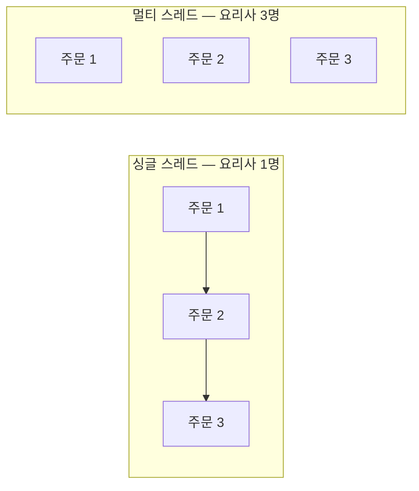
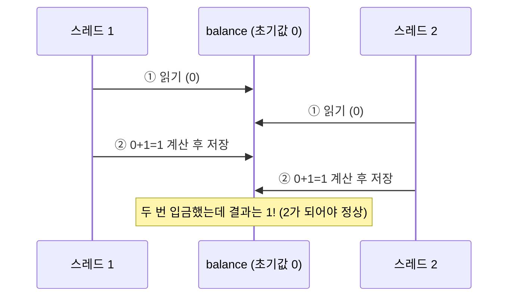
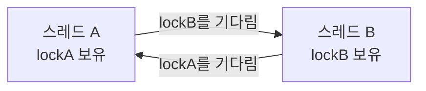
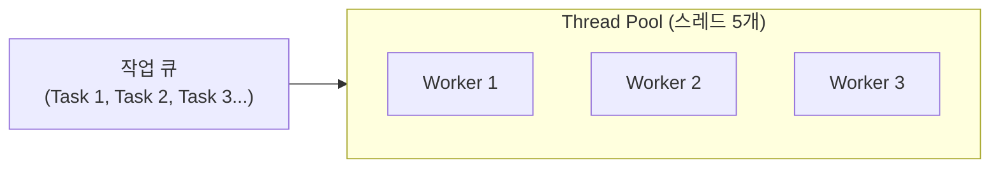

#CS #Java #면접

관련: [[Java]] · [[동기화]] · [[가상 스레드]] · [[JVM]] · [[../Operating System/프로세스와 스레드|프로세스와 스레드]] · [[../Database/동시성 이슈와 락|동시성 이슈와 락]]

## 목차
- [[#동시성은 왜 필요할까? — 스레드의 등장]]
- [[#Race Condition — 여러 스레드가 같은 자원을 건드릴 때]]
- [[#synchronized와 Lock — 한 번에 한 명만 들어가는 방]]
- [[#Deadlock — 서로가 서로를 기다리는 교착 상태]]
- [[#Thread Pool과 ExecutorService — 스레드를 매번 새로 만들지 않기]]
- [[#volatile과 Atomic — synchronized보다 가벼운 대안]]
- [[#java.util.concurrent 한눈에 보기]]
- [[#한 장 요약]]
- [[#Q&A로 복습하기]]

---

## 동시성은 왜 필요할까? — 스레드의 등장

식당에 요리사가 한 명뿐이라면, 주문이 아무리 밀려도 한 번에 한 요리씩밖에 못 만들어요. 손님이 100명이면 99명은 하염없이 기다려야 하죠. **요리사를 여러 명 두면(멀티스레딩)** 동시에 여러 요리를 만들 수 있어서 훨씬 빨라져요.

프로그램에서 이 "요리사"에 해당하는 게 **스레드(Thread)** 예요.

```java
// 방법 1: Thread 상속
class MyThread extends Thread {
    public void run() { System.out.println("작업 실행"); }
}
new MyThread().start();

// 방법 2: Runnable 구현 (더 흔히 씀 — 상속을 안 쓰니 다른 클래스도 상속 가능)
Runnable task = () -> System.out.println("작업 실행");
new Thread(task).start();
```



한 프로세스(하나의 실행 중인 프로그램) 안에 여러 스레드가 있으면, 이 스레드들은 **힙(Heap)과 메서드 영역(Method Area)을 공유**하고, **스택(Stack)만 각자 따로** 가져요([[JVM]] 참고). 바로 이 "공유"가 동시성 문제의 근원이에요 — 여러 요리사가 **같은 재료(공유 자원)** 를 동시에 만지면 사고가 나거든요. (프로그램·프로세스·스레드의 기본 개념 차이는 [[../Operating System/프로세스와 스레드|프로세스와 스레드]] 참고)

---

## Race Condition — 여러 스레드가 같은 자원을 건드릴 때

계좌 잔액을 늘리는 아주 단순한 코드예요.

```java
class Account {
    private int balance = 0;
    void deposit() {
        balance++; // 사실은 "읽기 → 더하기 → 쓰기" 3단계로 나뉘어 실행됨
    }
}
```

`balance++`는 한 줄이지만 실제로는 **① balance 읽기 → ② 1 더하기 → ③ 다시 저장** 이라는 3단계로 쪼개져요. 두 스레드가 동시에 이 3단계를 밟으면 이런 사고가 나요.



이렇게 **여러 스레드의 실행 순서(타이밍)에 따라 결과가 달라지는 버그**를 **경쟁 상태(Race Condition)** 라고 해요. 재현이 어렵고("가끔씩만" 터짐) 디버깅하기 까다로운 대표적인 버그 유형이에요.

> **비유**: 두 사람이 동시에 같은 메모장을 보고 "현재 재고 10개"를 확인한 뒤, 각자 1개씩 팔았다고 재고를 9개로 고쳐 써요. 실제로는 2개가 팔렸으니 8개여야 하는데, 나중에 쓴 사람의 "9개"가 먼저 쓴 사람의 기록을 덮어써버린 거예요.

---

## synchronized와 Lock — 한 번에 한 명만 들어가는 방

Race Condition을 막으려면 "한 스레드가 공유 자원을 다루는 동안은, 다른 스레드가 못 끼어들게" 막아야 해요. 이 구간을 **임계 영역(Critical Section)** 이라고 부르고, Java에서는 `synchronized`로 잠가요.

```java
class Account {
    private int balance = 0;
    synchronized void deposit() { // 한 번에 한 스레드만 진입 가능
        balance++;
    }
}
```

> **비유**: `synchronized`는 화장실 문에 달린 자물쇠예요. 한 사람이 들어가서 문을 잠그면, 다음 사람은 문 앞에서 기다려야 해요. 앞 사람이 나오고 문을 열어줘야 다음 사람이 들어갈 수 있어요.

더 세밀한 제어가 필요하면 `ReentrantLock` 같은 `Lock` 인터페이스를 써요. `synchronized`의 내부 동작(모니터 락), 블록/static 단위 동기화, `wait/notify`, `ReentrantLock`의 `tryLock`/공정성, `ReadWriteLock`까지 자세한 내용은 [[동기화]]에서 다뤄요.

---

## Deadlock — 서로가 서로를 기다리는 교착 상태

락을 잘못 쓰면 더 심각한 문제가 생겨요. 두 스레드가 **서로가 가진 락을 서로 기다리며 영원히 멈춰버리는** 상황, **데드락(Deadlock, 교착 상태)** 이에요.

```java
// 스레드 A: lockA를 잡고 → lockB를 원함
synchronized (lockA) {
    synchronized (lockB) { /* ... */ }
}
// 스레드 B: lockB를 잡고 → lockA를 원함 (동시에 실행되면?)
synchronized (lockB) {
    synchronized (lockA) { /* ... */ }
}
```



> **비유**: 좁은 다리에서 두 사람이 마주 오다가 딱 멈춰 섰어요. 서로 "네가 비켜야 내가 지나가지"라며 상대가 물러나길 기다리기만 해요. 둘 다 절대 안 물러나면 영원히 그 자리에 멈춰있게 되죠.

**막는 방법**: 여러 락이 필요할 땐 **모든 스레드가 항상 같은 순서로** 락을 획득하도록 강제해요. (위 예시라면 A, B 둘 다 항상 `lockA → lockB` 순서로 잡게 만들면 데드락이 안 생겨요.)

---

## Thread Pool과 ExecutorService — 스레드를 매번 새로 만들지 않기

요청이 들어올 때마다 `new Thread()`로 새 스레드를 만드는 건 비용이 커요. 스레드 하나 생성에는 OS 자원(기본 수백 KB~1MB의 스택 메모리)이 들고, 너무 많이 만들면 오히려 컨텍스트 스위칭 비용 때문에 성능이 떨어져요.

**Thread Pool**은 미리 스레드 여러 개를 만들어두고, 작업이 들어올 때마다 **놀고 있는 스레드에게 맡기고, 끝나면 다시 반납**받아 재사용하는 방식이에요.



```java
ExecutorService executor = Executors.newFixedThreadPool(5); // 스레드 5개짜리 풀

for (int i = 0; i < 100; i++) {
    executor.submit(() -> {
        // 작업 내용
    });
}
executor.shutdown(); // 더 이상 작업을 안 받고, 남은 작업 끝나면 종료
```

100개의 작업이 있어도 스레드는 5개만 쓰고, 노는 스레드가 생기는 즉시 다음 작업을 맡아요. 스레드를 계속 새로 만들고 버리는 비용을 아낄 수 있어요.

---

## volatile과 Atomic — synchronized보다 가벼운 대안

- **`volatile`**: 각 CPU 코어는 변수를 자기 캐시에 복사해두고 쓰는데, 이러면 한 스레드가 값을 바꿔도 다른 스레드의 캐시에는 옛날 값이 남아있을 수 있어요. `volatile`은 "캐시 말고 항상 메인 메모리에서 읽고 쓰라"고 강제해서 **가시성(Visibility)** 문제만 해결해줘요. 다만 `balance++`처럼 "읽기+쓰기가 합쳐진 연산"의 원자성까지 보장하진 않아요 — Race Condition은 여전히 발생할 수 있어요.
- **`Atomic` 클래스**(`AtomicInteger`, `AtomicLong` 등): `synchronized` 없이도 "읽고-더하고-쓰기"를 **원자적(중간에 끼어들 수 없게)** 으로 처리해줘요. 내부적으로 CPU의 CAS(Compare-And-Swap) 명령어를 이용해서, 락을 걸지 않고도 안전하게 값을 바꿔요.

```java
AtomicInteger balance = new AtomicInteger(0);
balance.incrementAndGet(); // synchronized 없이도 안전하게 +1
```

| 방법 | 가시성 보장 | 원자성 보장 | 특징 |
|---|---|---|---|
| `volatile` | ✅ | ❌ (단순 연산만) | 가장 가벼움, 단일 변수 읽기/쓰기용 |
| `synchronized` | ✅ | ✅ | 무겁지만 확실함, 복잡한 임계 영역에 적합 |
| `Atomic` 클래스 | ✅ | ✅ (단일 변수 한정) | 락 없이(lock-free) 빠름, 단순 카운터 등에 적합 |

CAS가 정확히 어떻게 동작하는지, ABA 문제, `Semaphore`/`CountDownLatch` 같은 그 외 동기화 유틸리티는 [[동기화]]에서 더 자세히 다뤄요.

---

## java.util.concurrent 한눈에 보기

Java는 동시성 프로그래밍을 돕는 도구를 `java.util.concurrent` 패키지에 모아뒀어요.

| 도구 | 역할 |
|---|---|
| `ExecutorService` | 스레드 풀 관리, 작업 제출/실행 |
| `ConcurrentHashMap` | 스레드 안전한 Map (부분 락으로 빠름) — 자세한 내용은 [[Java]] 참고 |
| `CountDownLatch` | "N개의 작업이 다 끝날 때까지 대기"를 구현 |
| `Future` / `CompletableFuture` | 비동기 작업의 결과를 나중에 받아오기 |
| `BlockingQueue` | 생산자-소비자 패턴에 쓰는, 꽉 차면/비면 자동으로 대기하는 큐 |

이렇게 스레드를 직접 다루는 방식(**플랫폼 스레드, Platform Thread**)은 강력하지만, 스레드 하나하나가 무겁다는 근본적인 한계가 있어요. 이 한계를 해결하려고 나온 게 [[가상 스레드]]예요.

> 여기서 다룬 `synchronized`, `Lock` 같은 동기화 기법은 **하나의 JVM(서버 한 대) 안에서만** 유효해요. 서버가 여러 대인 실무 환경에서 DB처럼 여러 서버가 공유하는 자원을 지키는 방법(비관적/낙관적 락, 분산 락 등)은 [[../Database/동시성 이슈와 락|동시성 이슈와 락]]에서 재고 차감을 예로 다뤄요. 분산 락을 실제로 구현할 때 쓰는 Redis 클라이언트 라이브러리(Jedis/Lettuce/Redisson) 비교는 [[Redis 클라이언트]] 참고.

---

## 한 장 요약

| 질문 | 답 |
|---|---|
| 동시성 문제가 생기는 근본 원인은? | 여러 스레드가 힙/메서드 영역 같은 공유 자원을 동시에 건드리기 때문 |
| Race Condition이란? | 실행 순서(타이밍)에 따라 결과가 달라지는 버그 |
| synchronized의 역할은? | 임계 영역에 한 번에 한 스레드만 들어가도록 잠금 |
| Deadlock이 생기는 조건은? | 두 스레드가 서로 상대방이 가진 락을 기다리며 영원히 대기 |
| Thread Pool을 쓰는 이유는? | 스레드 생성/소멸 비용을 아끼고, 스레드 수를 제한해 자원을 관리 |
| volatile과 Atomic의 차이는? | volatile은 가시성만, Atomic은 가시성+원자성(단일 변수)까지 보장 |

---

## Q&A로 복습하기

### Q. Race Condition은 왜 생기나?
A. `balance++` 같은 연산이 실제로는 "읽기-계산-쓰기"의 여러 단계로 나뉘어 실행되는데, 두 스레드가 이 단계들을 겹쳐서 실행하면 한쪽의 결과가 다른 쪽에 덮어써지면서 예상과 다른 결과가 나오기 때문이다.

### Q. synchronized는 어떤 문제를 해결하나?
A. 임계 영역(공유 자원을 다루는 코드 구간)에 한 번에 한 스레드만 들어가도록 막아서, Race Condition을 방지한다.

### Q. 데드락이 발생하는 조건과 막는 방법은?
A. 두 스레드가 서로 상대방이 가진 락을 기다리며 영원히 멈추는 상황에서 발생한다. 모든 스레드가 항상 같은 순서로 락을 획득하도록 강제하면 막을 수 있다.

### Q. Thread Pool을 쓰는 이유는?
A. 요청마다 스레드를 새로 만들면 생성 비용이 크고 스레드가 너무 많아지면 오히려 성능이 떨어지기 때문에, 미리 만들어둔 스레드를 재사용해 이 비용을 줄이기 위해서다.

### Q. volatile만으로 Race Condition을 막을 수 있나?
A. 아니다. volatile은 여러 스레드가 항상 최신 값을 보게 하는 가시성만 보장할 뿐, `balance++`처럼 읽기+쓰기가 합쳐진 연산의 원자성까지는 보장하지 않는다. 이런 경우엔 synchronized나 Atomic 클래스가 필요하다.
