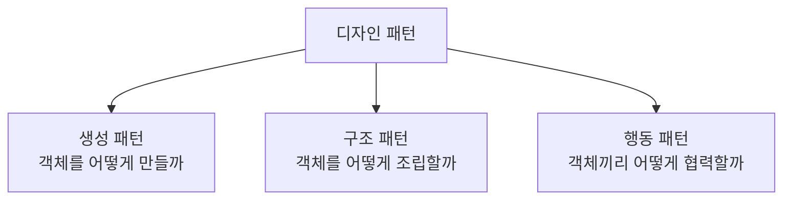

#CS #Java #면접

관련: [[OOP]] · [[SOLID]] · [[MVC]]

## 목차
- [[#디자인 패턴이란? — 선배들이 남긴 검증된 답안지]]
- [[#생성 패턴 — 객체를 어떻게 만들까]]
- [[#구조 패턴 — 객체를 어떻게 조립할까]]
- [[#행동 패턴 — 객체끼리 어떻게 협력할까]]
- [[#한 장 요약]]
- [[#Q&A로 복습하기]]

---

## 디자인 패턴이란? — 선배들이 남긴 검증된 답안지

수십 년간 수많은 개발자들이 "새 기능을 추가할 때마다 코드가 점점 지저분해진다", "객체를 하나만 만들고 싶은데 실수로 여러 개 생긴다" 같은 **비슷한 문제를 반복해서 마주쳤어요.** **디자인 패턴(Design Pattern)** 은 그런 반복되는 문제에 대해 선배 개발자들이 찾아낸 **검증된 해결 템플릿**이에요. ("GoF(Gang of Four) 디자인 패턴"이라는 책이 이런 패턴 23가지를 정리하면서 유명해졌어요.)

[[SOLID]]가 "좋은 설계가 지켜야 할 원칙"이라면, 디자인 패턴은 **그 원칙을 실제로 구현하는 구체적인 방법**이에요. 크게 세 갈래로 나눠서 볼게요.



---

## 생성 패턴 — 객체를 어떻게 만들까

### Singleton — 애플리케이션에 딱 하나만

특정 클래스의 인스턴스가 **애플리케이션 전체에서 딱 하나만 존재해야 하는** 경우가 있어요 (설정 정보, 로그 관리자 등).

```java
class Settings {
    private static final Settings INSTANCE = new Settings(); // 클래스 로딩 시 딱 한 번 생성
    private Settings() {} // 생성자를 private으로 막아 외부에서 new 금지
    static Settings getInstance() { return INSTANCE; }
}
```

> Spring을 쓴다면 이걸 직접 구현할 일이 거의 없어요 — Spring의 Bean 기본 스코프가 이미 싱글톤을 컨테이너가 대신 관리해주기 때문이에요. 순수 자바 싱글톤과 스프링 방식의 차이는 [[../Spring/스프링 컨테이너|스프링 컨테이너]]의 "싱글톤 레지스트리" 섹션에서 자세히 다뤘어요.

### Factory Method — 객체 생성을 캡슐화하기

**나쁜 예**: 필요할 때마다 `new`로 구체적인 클래스를 직접 생성해요.

```java
Shape shape;
if (type.equals("circle")) shape = new Circle();
else if (type.equals("square")) shape = new Square();
// 새 도형이 추가될 때마다 이 if문을 계속 고쳐야 함 (OCP 위반)
```

**좋은 예**: "객체를 만드는 일" 자체를 별도의 팩토리에게 위임해요.

```java
interface ShapeFactory {
    Shape create();
}
class CircleFactory implements ShapeFactory {
    public Shape create() { return new Circle(); }
}
// 새 도형이 필요하면 팩토리 클래스만 추가하면 됨 — 기존 코드는 안 건드림
```

[[SOLID]]의 **OCP(개방-폐쇄 원칙)** 를 생성 로직에 적용한 패턴이라고 볼 수 있어요.

### Builder — 파라미터가 많은 객체를 깔끔하게 만들기

생성자 파라미터가 많아지면 어떤 값이 뭘 의미하는지 알아보기 힘들어져요.

```java
// 나쁜 예 — 어떤 파라미터가 뭔지 코드만 봐선 알기 어려움
Pizza pizza = new Pizza("L", true, false, true, 2);
```

```java
// Builder — 어떤 값을 설정하는지 이름으로 명확하게 드러남
Pizza pizza = Pizza.builder()
    .size("L")
    .cheese(true)
    .pepperoni(false)
    .extraSauce(true)
    .build();
```

> 실무에서는 이 Builder를 직접 구현하는 대신 **Lombok의 `@Builder` 애노테이션**으로 자동 생성하는 경우가 많아요.

---

## 구조 패턴 — 객체를 어떻게 조립할까

### Proxy — 진짜 객체 대신 대리자를 거치기

**Proxy(대리자)** 는 실제 객체에 대한 접근을 대신 제어해주는 객체예요 — 진짜 객체를 호출하기 전/후에 **로깅, 권한 체크, 지연 로딩** 같은 부가 작업을 끼워 넣을 수 있어요.

```java
interface Service { void doWork(); }

class RealService implements Service {
    public void doWork() { System.out.println("실제 작업 수행"); }
}

class LoggingProxy implements Service {
    private final RealService real = new RealService();
    public void doWork() {
        System.out.println("작업 시작 로그"); // 진짜 객체 호출 전
        real.doWork();
        System.out.println("작업 종료 로그"); // 진짜 객체 호출 후
    }
}
```

> 이게 바로 [[../Spring/Spring|Spring]]의 **AOP**가 내부적으로 동작하는 방식이에요 — `@Transactional`이나 로깅 Aspect가 실제로는 이런 프록시 객체를 만들어서 끼워 넣는 거예요. Spring이 이 프록시를 어떤 방식으로 만드는지는 [[../Spring/AOP와 빈 순환참조|AOP와 빈 순환참조]]에서 자세히 다뤄요.

### Decorator — 기능을 필요할 때마다 덧씌우기

상속으로 기능을 하나씩 추가하면 조합이 늘어날 때마다 클래스가 기하급수적으로 늘어나요. **Decorator(데코레이터)** 는 상속 대신 **객체를 겹겹이 감싸서** 기능을 동적으로 추가해요.

```java
Reader reader = new BufferedReader(new FileReader("data.txt"));
// FileReader(기본 읽기 기능)를 BufferedReader(버퍼링 기능)로 감쌈
```

자바 표준 라이브러리의 `InputStream`/`Reader` 계열이 대표적인 Decorator 패턴 사례예요. `new GZIPInputStream(new BufferedInputStream(new FileInputStream(...)))`처럼, **필요한 기능만 그때그때 겹겹이 씌워서 조합**할 수 있어요.

---

## 행동 패턴 — 객체끼리 어떻게 협력할까

### Strategy — 알고리즘을 갈아 끼우기

**Strategy(전략)** 패턴은 **"어떻게 할지(알고리즘)"를 클래스 밖으로 빼내서, 언제든 바꿔 끼울 수 있게** 만드는 패턴이에요.

```java
interface DiscountStrategy {
    int discount(int price);
}
class NoDiscount implements DiscountStrategy {
    public int discount(int price) { return price; }
}
class TenPercentOff implements DiscountStrategy {
    public int discount(int price) { return price * 9 / 10; }
}

class Order {
    private DiscountStrategy strategy; // 어떤 할인 전략이든 갈아 끼울 수 있음
    int getFinalPrice(int price) { return strategy.discount(price); }
}
```

> 사실 [[컬렉션]]에서 다룬 `Comparator`가 정확히 이 Strategy 패턴이에요 — "정렬 기준(알고리즘)"을 외부에서 갈아 끼울 수 있게 만든 거였죠.

### Observer — 상태 변화를 구독자들에게 알리기

한 객체의 상태가 바뀔 때, **그걸 지켜보고 있는 여러 객체에게 자동으로 알려주는** 패턴이에요.

```java
interface Observer { void onUpdate(String event); }

class EventPublisher {
    private final List<Observer> observers = new ArrayList<>();
    void subscribe(Observer o) { observers.add(o); }
    void publish(String event) {
        for (Observer o : observers) o.onUpdate(event); // 구독자 전원에게 알림
    }
}
```

> Spring의 `ApplicationEventPublisher`/`@EventListener`가 이 Observer 패턴을 프레임워크 레벨로 구현해둔 거예요.

### Template Method — 큰 틀은 고정, 세부는 자유롭게

**전체적인 진행 순서(틀)는 고정**해두고, **각 단계의 구체적인 구현은 서브클래스에게 맡기는** 패턴이에요.

```java
abstract class DataProcessor {
    final void process() { // 전체 순서는 고정 (final로 막아 재정의 불가)
        readData();
        transform();
        saveData();
    }
    abstract void readData();
    abstract void transform(); // 각 단계 구현은 서브클래스마다 다를 수 있음
    void saveData() { System.out.println("공통 저장 로직"); } // 공통 부분은 기본 구현 제공
}
```

[[../Spring/서블릿|서블릿]]에서 다룬 `HttpServlet`의 `service()` 메서드가 대표적인 사례예요 — 전체 흐름(`doGet`/`doPost`로 분기하는 순서)은 이미 정해져 있고, 개발자는 `doGet()`, `doPost()`의 **구체적인 내용만** 채우면 되죠.

---

## 한 장 요약

| 패턴 | 핵심 아이디어 |
|---|---|
| Singleton | 인스턴스를 애플리케이션 전체에서 하나만 유지 |
| Factory Method | 객체 생성 로직을 별도 팩토리로 캡슐화 |
| Builder | 파라미터가 많은 객체를 이름 붙여가며 명확하게 생성 |
| Proxy | 실제 객체 앞에 대리자를 두어 접근을 제어 (로깅, 트랜잭션 등) |
| Decorator | 상속 대신 겹겹이 감싸서 기능을 동적으로 추가 |
| Strategy | 알고리즘을 외부에서 갈아 끼울 수 있게 분리 |
| Observer | 상태 변화를 구독자들에게 자동으로 알림 |
| Template Method | 전체 흐름은 고정, 세부 단계만 서브클래스가 구현 |

---

## Q&A로 복습하기

### Q. Factory Method 패턴이 SOLID의 어떤 원칙과 연결되나?
A. OCP(개방-폐쇄 원칙)와 연결된다. 새로운 타입이 추가될 때 기존의 객체 생성 코드(if-else 분기 등)를 수정하지 않고, 새 팩토리 클래스만 추가하면 되기 때문이다.

### Q. Proxy 패턴이 Spring AOP와 어떤 관계가 있나?
A. Spring의 AOP(@Transactional, 로깅 등)는 실제 객체를 감싸는 프록시 객체를 만들어, 실제 메서드 호출 전후에 부가 로직을 끼워 넣는 방식으로 동작한다. 이것이 바로 Proxy 패턴을 프레임워크 레벨에서 구현한 것이다.

### Q. Decorator 패턴을 상속 대신 쓰는 이유는?
A. 상속으로 기능을 조합하면 조합 개수만큼 클래스가 기하급수적으로 늘어날 수 있는데, Decorator는 객체를 겹겹이 감싸는 방식으로 필요한 기능만 그때그때 동적으로 조합할 수 있어 훨씬 유연하다.

### Q. Java 컬렉션의 Comparator는 어떤 디자인 패턴에 해당하나?
A. Strategy 패턴이다. 정렬 기준(알고리즘)을 클래스 내부에 고정하지 않고 외부에서 자유롭게 갈아 끼울 수 있게 만든 것이 Strategy 패턴의 핵심이기 때문이다.

### Q. Template Method 패턴에서 전체 흐름을 담당하는 메서드를 보통 final로 선언하는 이유는?
A. 서브클래스가 전체 진행 순서 자체를 실수로 재정의해서 깨뜨리는 것을 막고, 정해진 각 단계(추상 메서드)의 세부 구현만 자유롭게 채우도록 강제하기 위해서다.
