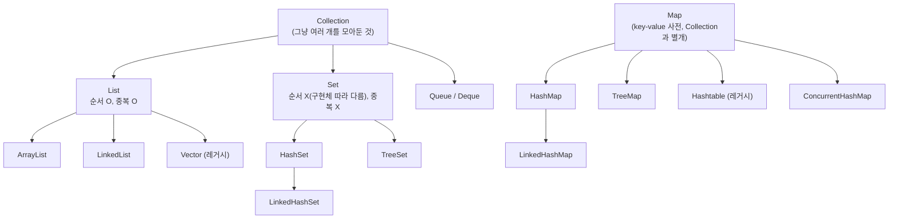
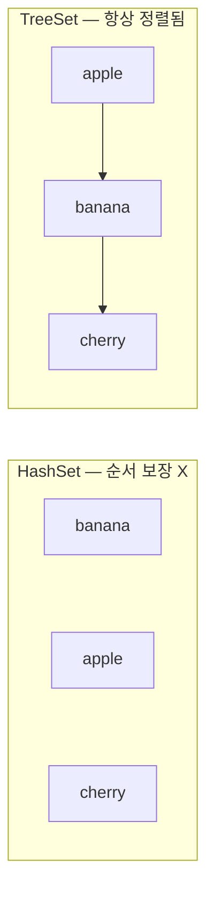

#CS #Java #면접

관련: [[Java]] · [[OOP]] · [[../Data Structures/스택과 큐|스택과 큐]] · [[../Data Structures/힙과 우선순위 큐|힙과 우선순위 큐]]

## 목차
- [[#컬렉션 프레임워크 전체 구조]]
- [[#List — 순서가 있고 중복을 허용하는 목록]]
- [[#Set — 중복을 허용하지 않는 집합]]
- [[#Map — key-value로 저장하는 사전]]
- [[#Queue와 Deque — 줄 서는 순서를 다루는 컬렉션]]
- [[#Iterator와 fail-fast — 순회 중에 컬렉션을 건드리면?]]
- [[#Comparable vs Comparator — 정렬 기준을 정하는 두 가지 방법]]
- [[#Collections 유틸리티 클래스]]
- [[#한 장 요약]]
- [[#Q&A로 복습하기]]

---

## 컬렉션 프레임워크 전체 구조

자바의 컬렉션은 크게 **"여러 개를 그냥 모아두는 것"(Collection)** 과 **"key로 찾는 사전"(Map)** 두 갈래로 나뉘어요. `Map`은 `Collection` 인터페이스를 상속하지 않는 완전히 별개의 계층이에요.



> **비유**: `List`가 "번호표 뽑고 줄 서는 대기줄"이라면, `Set`은 "이미 들어온 사람은 다시 못 들어오는 클럽 입구", `Map`은 "이름표를 보고 사물함을 찾아주는 보관소"예요.

---

## List — 순서가 있고 중복을 허용하는 목록

**ArrayList와 LinkedList**의 차이는 [[Java]]에서 다룬 것처럼 **배열 기반이냐, 노드 연결 기반이냐**로 갈려요 — 조회는 ArrayList가, 삽입/삭제는 LinkedList가 유리해요.

```java
List<String> arrayList = new ArrayList<>(); // 인덱스로 즉시 접근 (O(1))
List<String> linkedList = new LinkedList<>(); // 중간 삽입/삭제가 빠름 (O(1), 탐색 제외)
```

여기에 하나 더 알아둘 게 **`Vector`** 예요. `ArrayList`와 내부 구조는 거의 같은데, **모든 메서드가 `synchronized`로 동기화돼 있어요.** [[Java]]에서 다룬 `Hashtable`과 같은 문제를 가지고 있어요 — 멀티스레드 환경이 아니어도 항상 락 비용을 치르기 때문에 요즘은 거의 안 써요.

| 구분 | ArrayList | LinkedList | Vector |
|---|---|---|---|
| 구조 | 배열 | 이중 연결 리스트 | 배열 (ArrayList와 유사) |
| 스레드 안전 | ❌ | ❌ | ✅ (전체 동기화, 느림) |
| 실무 선택 | ✅ 기본 선택 | 삽입/삭제가 잦을 때 | 거의 안 씀 (레거시) |

---

## Set — 중복을 허용하지 않는 집합

`Set`은 "같은 값을 두 번 넣을 수 없다"는 규칙만 공통이고, 구현체마다 **내부 저장 방식과 순서 보장 여부**가 달라요.

```java
Set<String> hashSet = new HashSet<>();       // 순서 보장 X, 가장 빠름
Set<String> linkedHashSet = new LinkedHashSet<>(); // 넣은 순서 유지
Set<String> treeSet = new TreeSet<>();        // 정렬된 순서 유지
```

```java
Set<String> fruits = new HashSet<>();
fruits.add("banana");
fruits.add("apple");
fruits.add("banana"); // 중복 — 무시됨, 크기는 그대로 2
System.out.println(fruits.size()); // 2
```

- **`HashSet`**: 내부적으로 `HashMap`을 그대로 활용해서 만들어져요 (값을 key로, 더미 값을 value로 저장). 그래서 **순서를 전혀 보장하지 않지만 가장 빠른** 기본 선택지예요.
- **`LinkedHashSet`**: `HashSet`에 **연결 리스트로 삽입 순서 정보**를 추가로 유지해요. "중복은 없어야 하는데, 넣은 순서는 기억하고 싶다"는 요구에 딱 맞아요.
- **`TreeSet`**: 내부적으로 **레드-블랙 트리**를 써서, 항상 **정렬된 순서**로 값을 유지해요. 대신 삽입/삭제/조회가 `HashSet`의 O(1)이 아니라 **O(log n)** 이에요.



---

## Map — key-value로 저장하는 사전

`HashMap`이 해시 버킷으로 평균 O(1) 조회를 해내는 원리는 [[Java]]에서 자세히 다뤘어요. 여기서는 그 옆에 있는 형제들을 정리할게요.

| 구분 | HashMap | LinkedHashMap | TreeMap |
|---|---|---|---|
| 순서 | 보장 안 함 | **삽입 순서** 유지 | **key 기준 정렬** 유지 |
| 내부 구조 | 해시 버킷 배열 | 해시 버킷 + 연결 리스트 | 레드-블랙 트리 |
| 조회 속도 | O(1) | O(1) | O(log n) |
| 언제 쓰나 | 순서 상관없을 때 (기본) | LRU 캐시처럼 순서가 의미 있을 때 | key로 범위 검색·정렬된 순회가 필요할 때 |

```java
Map<String, Integer> lru = new LinkedHashMap<>(16, 0.75f, true); // accessOrder=true
// 마지막 파라미터를 true로 주면, "넣은 순서"가 아니라 "최근 접근한 순서"로 유지됨
// → removeEldestEntry()를 오버라이딩하면 손쉽게 LRU 캐시를 구현할 수 있음
```

```java
Map<String, Integer> scores = new TreeMap<>();
scores.put("banana", 80);
scores.put("apple", 90);
scores.put("cherry", 70);
System.out.println(scores); // {apple=90, banana=80, cherry=70} — key 알파벳 순으로 자동 정렬
```

**HashMap vs Hashtable vs ConcurrentHashMap**의 스레드 안전성 차이도 [[Java]]에서 다뤘어요 — 화장실 하나짜리 건물(Hashtable) vs 층마다 화장실(ConcurrentHashMap) 비유를 기억해두면 돼요.

---

## Queue와 Deque — 줄 서는 순서를 다루는 컬렉션

`Queue`는 **먼저 넣은 게 먼저 나오는(FIFO)** 컬렉션이에요. `List`처럼 인덱스로 아무 위치나 접근하는 게 아니라, **한쪽으로 넣고 반대쪽으로 꺼내는** 용도에 특화돼 있어요.

```java
Queue<String> queue = new ArrayDeque<>(); // Queue는 보통 ArrayDeque로 구현
queue.offer("A"); // 뒤에 추가
queue.offer("B");
queue.poll();      // "A" — 먼저 넣은 게 먼저 나옴
queue.peek();      // "B" — 꺼내지 않고 확인만
```

`Deque`(Double-Ended Queue)는 한 걸음 더 나가서, **앞뒤 양쪽 모두**에서 추가/제거가 가능해요. 그래서 `Deque` 하나로 큐(FIFO)와 스택(LIFO)을 둘 다 흉내 낼 수 있어요.

```java
Deque<String> deque = new ArrayDeque<>();
deque.addFirst("A"); // 앞에 추가
deque.addLast("B");  // 뒤에 추가
deque.pollFirst();    // 앞에서 꺼냄 → 큐처럼
deque.pollLast();     // 뒤에서 꺼냄 → 스택처럼
```

| 구분 | 특징 | 구현체 |
|---|---|---|
| `Queue` | FIFO, 한쪽으로 넣고 반대쪽으로 꺼냄 | `ArrayDeque` (권장) |
| `Deque` | 양쪽 끝 모두 삽입/삭제 가능, 스택으로도 큐로도 사용 가능 | `ArrayDeque` (권장) |
| `PriorityQueue` | 넣은 순서가 아니라 **우선순위**가 높은/낮은 게 먼저 나옴 | 내부적으로 힙(Heap) 구조 |

> `Stack`이라는 레거시 클래스도 있지만, `Vector`를 상속해서 불필요하게 느려요 — 지금은 `Deque`(`ArrayDeque`)를 스택처럼 쓰는 게 표준이에요. FIFO/LIFO의 원리 자체, `PriorityQueue`가 힙으로 어떻게 O(log n) 삽입/삭제를 해내는지처럼 더 깊은 원리는 [[../Data Structures/스택과 큐|스택과 큐]], [[../Data Structures/힙과 우선순위 큐|힙과 우선순위 큐]]에서 다뤘어요.

---

## Iterator와 fail-fast — 순회 중에 컬렉션을 건드리면?

컬렉션을 `for-each`로 순회하는 중에 그 컬렉션 자체를 수정하면 어떻게 될까요?

```java
List<String> list = new ArrayList<>(List.of("a", "b", "c"));
for (String s : list) {
    if (s.equals("b")) {
        list.remove(s); // ⚠️ 순회 중 컬렉션을 직접 수정!
    }
}
// ConcurrentModificationException 발생!
```

자바의 컬렉션은 내부적으로 **"수정 횟수(modCount)"** 를 추적해요. `Iterator`가 순회를 시작할 때 이 값을 기억해뒀다가, 다음 요소를 꺼낼 때마다 값이 그대로인지 확인해요. **순회 도중에 컬렉션이 바뀌면 값이 달라져서 즉시 예외를 던지는** 방식인데, 이걸 **fail-fast**라고 해요.

> **비유**: 인원 점검하며 줄을 세고 있는데, 누가 중간에 줄을 몰래 빠져나가면 "어? 방금까지 5번째였던 사람이 없어졌네" 하고 바로 알아채는 것과 비슷해요. 조용히 잘못된 결과를 내는 대신, **문제를 바로 알려주는(fail-fast) 안전장치**예요.

**올바르게 제거하려면** `Iterator`가 제공하는 `remove()`를 써야 해요.

```java
Iterator<String> it = list.iterator();
while (it.hasNext()) {
    String s = it.next();
    if (s.equals("b")) {
        it.remove(); // Iterator를 통한 제거는 modCount를 함께 갱신해줘서 안전함
    }
}
```

---

## Comparable vs Comparator — 정렬 기준을 정하는 두 가지 방법

객체를 정렬하려면 "무엇을 기준으로 크고 작은지"를 알려줘야 해요. 자바는 이걸 위해 두 가지 방법을 제공해요.

**① `Comparable`**: 클래스 자신에게 **"기본 정렬 기준"** 을 하나 정해주는 방법이에요.

```java
class Person implements Comparable<Person> {
    String name;
    int age;

    @Override
    public int compareTo(Person other) {
        return this.age - other.age; // 나이순으로 정렬한다는 "기본 규칙"
    }
}

List<Person> people = new ArrayList<>(...);
Collections.sort(people); // Comparable에 정의된 기준(나이순)으로 정렬
```

**② `Comparator`**: 클래스를 건드리지 않고, **"이번만 이 기준으로 정렬해줘"** 라고 외부에서 정렬 기준을 넘겨주는 방법이에요.

```java
people.sort(Comparator.comparing(p -> p.name)); // 이번엔 이름순으로
people.sort(Comparator.comparingInt((Person p) -> p.age).reversed()); // 나이 내림차순
```

| 구분 | Comparable | Comparator |
|---|---|---|
| 정의 위치 | 클래스 내부 (`compareTo`) | 클래스 외부 (별도 객체/람다) |
| 기준 개수 | 하나(기본 정렬 기준) | 여러 개를 자유롭게 만들 수 있음 |
| 언제 쓰나 | "이 클래스의 자연스러운 순서"가 명확할 때 (예: 숫자, 문자열) | 상황에 따라 다른 기준으로 정렬해야 할 때 |

---

## Collections 유틸리티 클래스

`java.util.Collections`는 컬렉션을 다루는 **정적 메서드**들을 모아둔 클래스예요 (이름이 비슷한 `Collection` 인터페이스와 헷갈리지 않게 주의!).

```java
Collections.sort(list);                          // 정렬
Collections.reverse(list);                        // 순서 뒤집기
Collections.max(list); Collections.min(list);      // 최댓값/최솟값
List<String> readOnly = Collections.unmodifiableList(list); // 수정 불가능한 뷰로 감싸기
List<String> syncList = Collections.synchronizedList(list); // 동기화된 뷰로 감싸기 (레거시 방식)
```

`unmodifiableList()`는 "이 리스트는 외부에서 함부로 못 바꾸게 하고 싶다"는 [[OOP]]의 캡슐화 원칙을 컬렉션에도 적용한 것으로 볼 수 있어요. 값을 반환할 때 원본을 직접 노출하지 않고 이렇게 감싸서 반환하면, 호출한 쪽에서 실수로 원본을 수정하는 걸 막을 수 있어요.

---

## 한 장 요약

| 질문 | 답 |
|---|---|
| List 계열의 선택 기준은? | 조회 위주면 ArrayList, 삽입/삭제 위주면 LinkedList, Vector는 레거시라 비권장 |
| Set 3형제의 차이는? | HashSet(순서 X, 가장 빠름), LinkedHashSet(삽입 순서 유지), TreeSet(정렬 유지, O(log n)) |
| Map 3형제의 차이는? | HashMap(순서 X), LinkedHashMap(삽입/접근 순서 유지), TreeMap(key 정렬 유지) |
| fail-fast란? | 순회 중 컬렉션이 수정되면 ConcurrentModificationException을 즉시 던지는 안전장치 |
| Comparable vs Comparator | Comparable은 클래스 내부의 기본 정렬 기준 하나, Comparator는 외부에서 자유롭게 주는 여러 기준 |
| Collections 클래스란? | 컬렉션을 다루는 정적 유틸 메서드 모음 (정렬, 뒤집기, 불변 뷰 생성 등) |

---

## Q&A로 복습하기

### Q. HashSet, LinkedHashSet, TreeSet은 각각 언제 선택해야 하나?
A. 순서가 중요하지 않고 가장 빠른 속도가 필요하면 HashSet, 넣은 순서를 유지하고 싶으면 LinkedHashSet, 항상 정렬된 순서가 필요하면 TreeSet(대신 O(log n))을 선택한다.

### Q. LinkedHashMap으로 LRU 캐시를 구현할 수 있는 이유는?
A. LinkedHashMap의 생성자에 accessOrder를 true로 주면 삽입 순서 대신 최근 접근한 순서를 유지해주기 때문에, 가장 오래 안 쓰인 항목을 쉽게 찾아 제거할 수 있다.

### Q. fail-fast는 왜 필요한가?
A. 컬렉션을 순회하는 도중 그 컬렉션이 외부에서 수정되면, 조용히 잘못된 결과를 내는 대신 ConcurrentModificationException을 즉시 던져 문제를 바로 알아차릴 수 있게 해준다.

### Q. 순회 중 요소를 제거하려면 어떻게 해야 안전한가?
A. for-each 문에서 리스트의 remove()를 직접 호출하면 안 되고, Iterator의 remove() 메서드를 사용해야 한다. Iterator를 통한 제거는 내부 수정 횟수(modCount)를 함께 갱신해 fail-fast 예외를 피할 수 있다.

### Q. Comparable과 Comparator의 차이는?
A. Comparable은 클래스 내부에 compareTo()로 정의하는 하나의 기본 정렬 기준이고, Comparator는 클래스를 건드리지 않고 외부에서 상황에 맞는 정렬 기준을 여러 개 자유롭게 만들어 적용할 수 있다.
