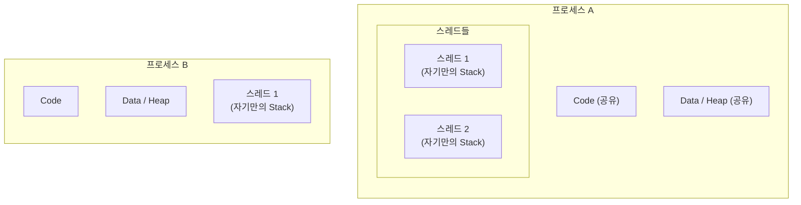
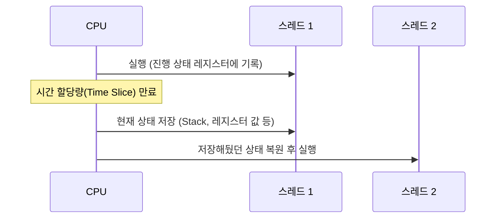
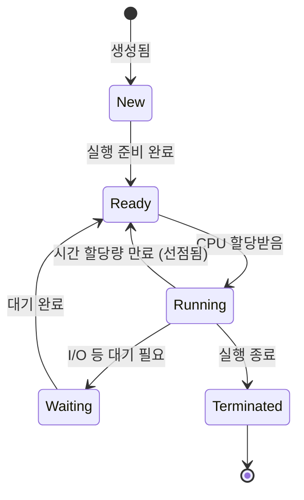

#CS #OperatingSystem #면접

관련: [[../Java/동시성|동시성]] · [[../Java/가상 스레드|가상 스레드]] · [[뮤텍스와 세마포어]]

## 목차
- [[#프로그램, 프로세스, 스레드 — 뭐가 다를까?]]
- [[#프로세스 — 실행 중인 프로그램과 그 자원]]
- [[#스레드 — 프로세스 안의 실행 흐름]]
- [[#프로세스 vs 스레드 — 메모리 구조로 보기]]
- [[#멀티프로세스 vs 멀티스레드]]
- [[#컨텍스트 스위칭 — 전환에도 비용이 든다]]
- [[#프로세스의 생명주기]]
- [[#한 장 요약]]
- [[#Q&A로 복습하기]]

---

## 프로그램, 프로세스, 스레드 — 뭐가 다를까?

이 셋은 자주 섞어 쓰지만 엄연히 다른 개념이에요.

> **비유**: **프로그램**은 종이에 적힌 "요리 레시피"예요. 냉장고에 붙여만 놔도 아무 일도 안 일어나죠. 누군가 그 레시피를 들고 주방에서 **실제로 요리를 시작하면**, 그게 **프로세스**예요 — 레시피(코드)에 필요한 재료와 도구(메모리, CPU 등 자원)가 실제로 할당된 상태죠. 그리고 그 요리사가 "손으로는 볶고, 눈으로는 오븐을 지켜보는" 것처럼 **동시에 진행하는 각각의 작업 흐름**이 **스레드**예요.

- **프로그램(Program)**: 디스크에 저장된, **아직 실행되지 않은** 정적인 코드 덩어리예요. `.exe`, `.jar` 파일 같은 거예요.
- **프로세스(Process)**: 프로그램이 **실행되어 메모리에 올라간 상태**예요. 이때 OS는 이 프로세스에게 메모리, 파일 핸들 같은 **독립적인 자원**을 할당해줘요.
- **스레드(Thread)**: 프로세스 안에서 실제로 **명령어를 하나씩 실행해나가는 흐름**이에요. 하나의 프로세스는 최소 하나의 스레드(메인 스레드)를 반드시 가지고, 필요하면 여러 개를 더 만들 수 있어요.

---

## 프로세스 — 실행 중인 프로그램과 그 자원

크롬 브라우저를 실행하면, OS는 이 프로그램을 위한 독립된 메모리 공간을 마련해요. 이게 프로세스예요. 크롬에서 새 탭을 하나 더 열면, 사실 크롬은 그 탭을 위한 **별도의 프로세스**를 하나 더 만들어요 (그래서 작업 관리자를 열어보면 "Chrome"이 여러 개 떠 있는 걸 볼 수 있어요).

**프로세스마다 자기만의 독립적인 메모리 공간(Code, Data, Heap, Stack)** 을 가져요. 그래서 프로세스 A가 프로세스 B의 메모리를 함부로 들여다보거나 망가뜨릴 수 없어요 — OS가 프로세스 사이를 격리해주기 때문이에요. 이 덕분에 탭 하나가 죽어도(크래시) 다른 탭은 멀쩡하게 살아있을 수 있어요.

---

## 스레드 — 프로세스 안의 실행 흐름

하나의 프로세스 안에서 여러 작업을 동시에 하고 싶을 때, 프로세스를 여러 개 만드는 대신 **스레드**를 여러 개 만들어요. 스레드는 프로세스보다 훨씬 가벼워요.

**왜 가벼울까요?** 같은 프로세스에 속한 스레드들은 **Code, Data, Heap 영역을 서로 공유**하기 때문이에요. 각자 독립적으로 갖는 건 **Stack(함수 호출 정보를 담는 공간)** 뿐이에요. Java에서 이 스레드를 어떻게 만들고 다루는지는 [[../Java/동시성|동시성]]에서 자세히 다뤘어요.

> **비유**: 프로세스가 "각자 독채를 쓰는 가족"이라면, 스레드는 "한 집(프로세스)에서 방(Stack)은 따로 쓰지만 거실·주방(Code/Data/Heap)은 같이 쓰는 룸메이트들"이에요. 룸메이트끼리는 물건(데이터)을 공유하기 쉽지만, 그만큼 한 명이 거실을 어지르면 다른 룸메이트도 영향을 받아요. ([[../Java/동시성|동시성]]에서 다룬 Race Condition이 바로 이 "공유" 때문에 생기는 문제예요.)

---

## 프로세스 vs 스레드 — 메모리 구조로 보기

| 구분 | 프로세스 | 스레드 |
|---|---|---|
| 메모리 공간 | 독립적 (다른 프로세스와 분리) | 같은 프로세스 내 스레드끼리 Code/Data/Heap 공유, Stack만 독립 |
| 생성 비용 | 큼 (OS가 새 자원을 통째로 할당) | 상대적으로 작음 (Stack만 새로 할당) |
| 통신 방법 | IPC(프로세스 간 통신)가 필요 — 소켓, 파이프 등 복잡한 방법 | 같은 메모리를 그냥 공유해서 접근 가능 (대신 동기화 필요) |
| 안정성 | 하나가 죽어도 다른 프로세스는 영향 없음 | 스레드 하나가 프로세스 전체 메모리를 망가뜨리면 같은 프로세스의 다른 스레드도 영향받음 |

---

## 멀티프로세스 vs 멀티스레드

"동시에 여러 작업을 처리한다"는 목표는 같지만, 프로세스를 여러 개 쓸지 스레드를 여러 개 쓸지는 트레이드오프가 있어요.

- **멀티프로세스** (예: 크롬의 탭별 프로세스): 서로 격리돼 있어서 **안정성**이 높아요 — 탭 하나가 뻗어도 브라우저 전체는 안 죽어요. 대신 프로세스 간에 데이터를 주고받으려면 IPC라는 번거로운 절차가 필요하고, 메모리도 더 많이 써요.
- **멀티스레드** (예: 하나의 웹 서버 프로세스가 스레드 여러 개로 요청 처리): 메모리를 공유하니 **가볍고 데이터 공유가 쉬워요**. 대신 [[../Java/동시성|동시성]]에서 다룬 Race Condition, Deadlock 같은 동기화 문제를 신경 써야 하고, 스레드 하나의 오류가 전체 프로세스에 영향을 줄 수 있어요.

---

## 컨텍스트 스위칭 — 전환에도 비용이 든다

CPU 코어 하나는 한 순간에 하나의 스레드만 실행할 수 있어요. 그런데도 여러 프로그램이 "동시에" 돌아가는 것처럼 보이는 이유는, OS가 아주 짧은 시간 단위로 **실행할 스레드를 계속 바꿔가며(스위칭)** 실행하기 때문이에요. 이걸 **컨텍스트 스위칭(Context Switching)** 이라고 해요.

문제는 이 전환 자체가 **공짜가 아니라는** 거예요 — 현재 스레드의 상태(레지스터 값 등)를 저장하고 다음 스레드의 상태를 복원하는 데 시간이 들어요. 스레드(혹은 프로세스)가 너무 많으면 실제 작업보다 이 전환에 쓰는 시간이 더 커져서 오히려 전체 성능이 떨어질 수 있어요 — [[../Java/동시성|동시성]]에서 "Thread Pool로 스레드 수를 제한하는 이유"가 바로 이거예요.

> 참고로 **프로세스 간 전환**은 메모리 공간 자체를 통째로 바꿔야 해서, **같은 프로세스 내 스레드 간 전환**보다 비용이 더 커요. 스레드가 프로세스보다 "가볍다"고 하는 이유 중 하나예요.

---

## 프로세스의 생명주기

프로세스는 생성부터 종료까지 몇 가지 상태를 거쳐요.

- **New**: 프로세스가 막 생성된 상태.
- **Ready**: 실행할 준비는 됐지만, CPU를 아직 할당받지 못해 대기 중인 상태.
- **Running**: 실제로 CPU를 할당받아 실행 중인 상태.
- **Waiting(Blocked)**: I/O 작업(파일 읽기, 네트워크 응답 등)을 기다리느라 실행을 멈춘 상태. (이 개념이 [[../Java/가상 스레드|가상 스레드]]의 "언마운트" 아이디어와 이어져요 — 대기 중인 동안은 다른 작업에게 자원을 양보하는 게 핵심이에요.)
- **Terminated**: 실행이 끝난 상태.

---

## 한 장 요약

| 질문 | 답 |
|---|---|
| 프로그램이란? | 디스크에 저장된, 아직 실행되지 않은 정적인 코드 |
| 프로세스란? | 프로그램이 실행되어 OS로부터 독립적인 자원을 할당받은 상태 |
| 스레드란? | 프로세스 안에서 실제로 명령어를 실행해나가는 흐름 |
| 프로세스와 스레드의 메모리 차이는? | 프로세스는 완전히 독립, 스레드는 Code/Data/Heap 공유·Stack만 독립 |
| 컨텍스트 스위칭이란? | 실행할 스레드/프로세스를 바꾸는 것. 상태 저장/복원 비용이 들어감 |
| 프로세스 상태 흐름은? | New → Ready → Running → (Waiting) → Terminated |

---

## Q&A로 복습하기

### Q. 프로그램과 프로세스의 차이는?
A. 프로그램은 디스크에 저장된 실행되지 않은 정적인 코드이고, 프로세스는 그 프로그램이 실행되어 OS로부터 메모리 등 독립적인 자원을 할당받은 상태다.

### Q. 스레드가 프로세스보다 생성 비용이 작은 이유는?
A. 같은 프로세스에 속한 스레드들은 Code, Data, Heap 영역을 서로 공유하고 Stack만 각자 독립적으로 가지기 때문에, 매번 자원을 통째로 새로 할당해야 하는 프로세스보다 가볍다.

### Q. 멀티프로세스와 멀티스레드의 트레이드오프는?
A. 멀티프로세스는 서로 격리돼 있어 안정성이 높지만 통신에 IPC가 필요하고 메모리를 더 쓴다. 멀티스레드는 메모리를 공유해 가볍고 데이터 공유가 쉽지만, Race Condition 같은 동기화 문제를 신경 써야 하고 스레드 하나의 오류가 프로세스 전체에 영향을 줄 수 있다.

### Q. 컨텍스트 스위칭이 왜 비용이 드나?
A. 현재 실행 중인 스레드/프로세스의 상태(레지스터 값 등)를 저장하고, 다음에 실행할 스레드/프로세스의 저장된 상태를 복원해야 하기 때문이다. 이 비용 때문에 스레드/프로세스가 너무 많으면 오히려 전체 성능이 떨어질 수 있다.

### Q. 프로세스가 Ready 상태와 Running 상태를 오가는 이유는?
A. CPU 코어 하나는 한 순간에 하나의 실행 흐름만 처리할 수 있어서, OS가 짧은 시간 단위로 실행할 프로세스/스레드를 계속 바꿔가며(컨텍스트 스위칭) 실행하기 때문이다. 시간 할당량이 끝나면 Running에서 다시 Ready로 돌아간다.
