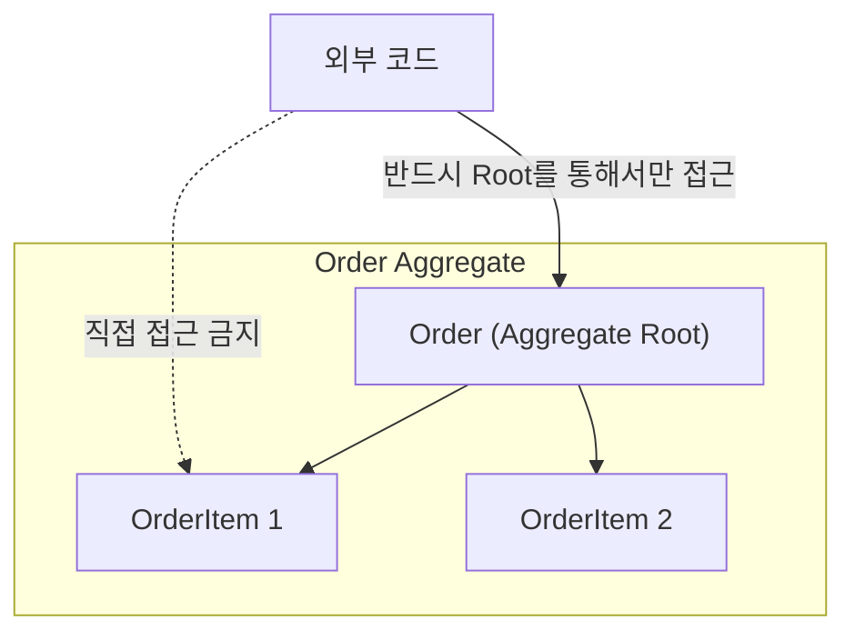
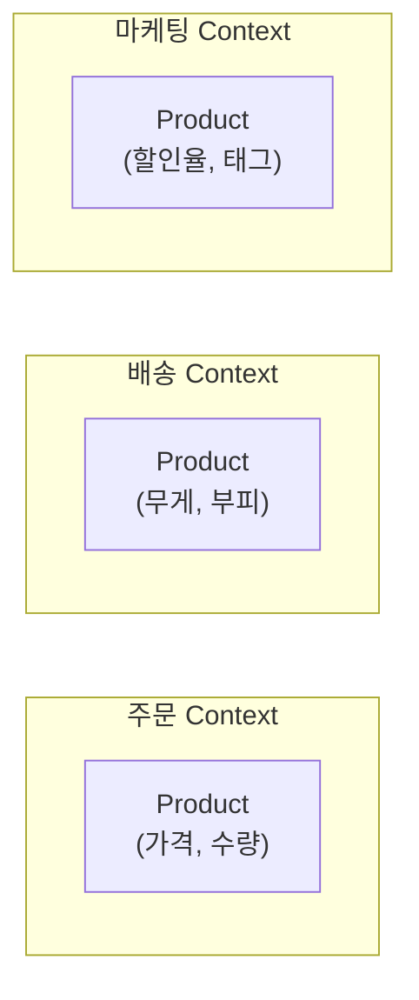
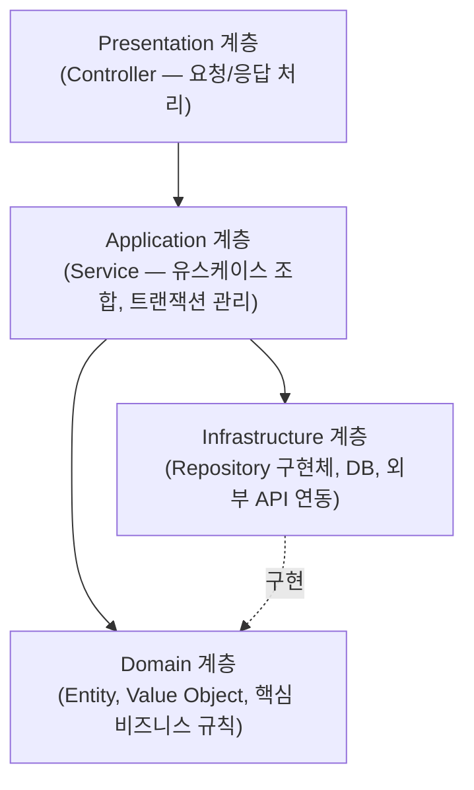

#CS #SoftwareEngineering #면접

관련: [[TDD]] · [[../Java/OOP|OOP]] · [[../Java/MVC|MVC]]

## 목차
- [[#DDD란? — 코드를 비즈니스 언어로 짜기]]
- [[#왜 필요할까? — 빈약한 도메인 모델의 문제]]
- [[#핵심 개념 — Entity, Value Object, Aggregate]]
- [[#유비쿼터스 언어 — 개발자와 도메인 전문가가 같은 말을 쓰기]]
- [[#Bounded Context — 같은 단어, 다른 의미]]
- [[#DDD의 계층 구조]]
- [[#한 장 요약]]
- [[#Q&A로 복습하기]]

---

## DDD란? — 코드를 비즈니스 언어로 짜기

쇼핑몰의 "주문 취소" 로직을 짠다고 해봐요. 이건 사실 개발자만의 문제가 아니라, **기획자·MD·CS팀도 "주문 취소가 어떤 조건에서 가능한지"에 대한 나름의 규칙**을 갖고 있어요. 문제는 이 규칙이 코드에는 반영 안 되고, 사람들 머릿속에만 흩어져 있는 경우가 많다는 거예요.

**DDD(Domain-Driven Design, 도메인 주도 설계)** 는 **소프트웨어가 풀어야 할 진짜 문제(도메인, 예: "주문", "결제", "배송" 같은 비즈니스 영역)를 코드 구조의 중심에 두자**는 설계 철학이에요. 기술적인 편의보다, **비즈니스 규칙과 용어를 코드에 최대한 그대로 반영**하는 걸 목표로 해요.

> **비유**: 통역사 없이 의사소통하는 것과 같아요. 도메인 전문가(기획자)가 "주문은 배송 시작 전까지만 취소할 수 있어요"라고 말하면, 개발자의 코드에도 `Order.cancel()` 메서드 안에 **그 규칙이 그대로** 드러나 있어야 해요. 코드와 비즈니스 설명 사이에 "번역"이 필요 없어야 하는 거죠.

---

## 왜 필요할까? — 빈약한 도메인 모델의 문제

DDD 없이 짜면 보통 이런 모양이 나와요. 데이터만 담는 껍데기 클래스(**빈약한 도메인 모델, Anemic Domain Model**)와, 모든 로직이 Service에 몰린 구조예요.

```java
// 빈약한 도메인 모델 — 그냥 데이터 창고일 뿐, 규칙이 없음
class Order {
    private String status;
    // getter/setter만 있음
}

class OrderService {
    void cancel(Order order) {
        // "배송 시작 전까지만 취소 가능"이라는 규칙이 Service 여기저기 흩어짐
        if (order.getStatus().equals("SHIPPED")) {
            throw new IllegalStateException("이미 배송 시작됨");
        }
        order.setStatus("CANCELLED");
    }
}
```

문제는 `Order`가 아무 규칙도 갖고 있지 않다는 거예요. 누군가 다른 곳에서 `order.setStatus("CANCELLED")`를 직접 호출해버리면, **정해둔 규칙을 완전히 무시하고 상태가 바뀔 수 있어요.** 비즈니스 규칙이 코드 전체에 흩어지면서, 같은 규칙이 여러 곳에서 중복되거나 어긋나기 쉬워져요.

DDD는 이 규칙을 **도메인 객체 안으로 옮겨요(풍부한 도메인 모델, Rich Domain Model).**

```java
class Order {
    private OrderStatus status;

    void cancel() { // 규칙이 Order 안에 캡슐화됨 — Order 스스로가 자기 상태를 지킴
        if (status == OrderStatus.SHIPPED) {
            throw new IllegalStateException("이미 배송 시작됨");
        }
        this.status = OrderStatus.CANCELLED;
    }
}
```

이제 `Order`를 다루는 코드가 어디에 있든, `order.cancel()`만 호출하면 규칙이 항상 지켜져요. [[../Java/OOP|OOP]]에서 다룬 **캡슐화**를 도메인 로직에 제대로 적용한 모습이라고 볼 수 있어요.

---

## 핵심 개념 — Entity, Value Object, Aggregate

DDD는 도메인을 표현할 때 쓰는 몇 가지 표준 개념을 정의해요.

- **Entity(엔티티)**: **고유한 식별자(ID)** 로 구분되는 객체예요. 속성이 다 똑같아도 ID가 다르면 다른 객체예요. (예: 주문번호가 다른 두 `Order`는 내용이 같아도 별개의 주문)
- **Value Object(값 객체)**: **식별자 없이, 속성 값 자체로 동등성을 판단**하는 객체예요. (예: `Money(1000, "KRW")` 두 개는 값만 같으면 완전히 같은 것으로 취급) 불변으로 설계하는 게 원칙이에요.

```java
class Money { // Value Object — id 없이, 값 자체가 정체성
    private final int amount;
    private final String currency;

    Money(int amount, String currency) {
        this.amount = amount;
        this.currency = currency;
    }
    // equals()/hashCode()를 값 기준으로 오버라이딩 (OOP 문서 참고)
}
```

- **Aggregate(애그리거트)**: **여러 Entity/Value Object를 하나의 묶음으로 관리**하는 단위예요. 묶음 안에는 대표로 접근하는 **Aggregate Root**가 하나 있고, 외부에서는 반드시 이 루트를 통해서만 내부 객체에 접근해요.



예를 들어 `Order`(Root)와 그 안의 `OrderItem`들을 묶어 하나의 Aggregate로 관리하면, **외부 코드가 `OrderItem`을 직접 건드려서 `Order`의 총액과 어긋나게 만드는 사고를 막을 수 있어요.** 항상 `Order`를 거쳐야 하니, `Order`가 자기 내부의 일관성을 지킬 수 있는 거예요.

---

## 유비쿼터스 언어 — 개발자와 도메인 전문가가 같은 말을 쓰기

**유비쿼터스 언어(Ubiquitous Language)** 는 DDD의 핵심 실천 방법이에요 — **개발자와 도메인 전문가(기획자, 사업 담당자 등)가 대화할 때도, 코드를 짤 때도 똑같은 용어를 쓰자**는 원칙이에요.

기획자가 "주문을 취소한다"라고 말하면, 코드에도 `cancelOrder()`가 아니라 그냥 `Order.cancel()`처럼 **그 표현이 그대로** 드러나야 해요. 개발자들끼리만 쓰는 기술 용어(`updateStatusFlag()` 같은)로 번역해버리면, 시간이 지날수록 코드와 실제 비즈니스 사이의 괴리가 커져요.

---

## Bounded Context — 같은 단어, 다른 의미

큰 시스템일수록 **같은 단어라도 팀/영역마다 의미가 다를 수 있어요.** 예를 들어 "상품(Product)"이라는 단어는:

- **주문 팀**에게는 "가격, 수량, 주문에 담긴 항목"이 중요해요.
- **배송 팀**에게는 "무게, 부피, 포장 정보"가 중요해요.
- **마케팅 팀**에게는 "할인율, 프로모션 태그"가 중요해요.

이걸 하나의 거대한 `Product` 클래스에 다 우겨넣으면 누구도 감당 못 할 만큼 복잡해져요. **Bounded Context(경계 컨텍스트)** 는 **"이 용어가 어떤 범위(경계) 안에서 어떤 의미로 쓰이는지"를 명확히 나누자**는 개념이에요.



각 컨텍스트 안에서는 자기 관점에 맞는 **별도의 `Product` 모델**을 갖고, 컨텍스트 간에는 필요한 정보만 명시적으로 주고받아요. 이렇게 하면 하나의 거대하고 복잡한 모델 대신, **각자 관리하기 쉬운 여러 개의 작은 모델**로 나눌 수 있어요. (실무에서는 이 Bounded Context가 마이크로서비스를 나누는 기준이 되기도 해요.)

---

## DDD의 계층 구조

DDD를 적용한 애플리케이션은 보통 이런 계층으로 나뉘어요. [[../Java/MVC|MVC]]에서 다룬 구조와 겹치는 부분이 있지만, DDD는 **도메인 계층을 명확히 독립시키는 것**을 강조해요.



핵심은 **Domain 계층이 다른 계층에 의존하지 않는다**는 거예요. `Order`, `Money` 같은 도메인 객체는 DB가 뭔지, 화면이 어떻게 생겼는지 전혀 몰라요 — 순수하게 비즈니스 규칙만 담고 있어요. 이 덕분에 도메인 로직을 프레임워크나 DB 종류와 무관하게 독립적으로 테스트할 수 있어요. ([[TDD]]와 잘 맞물리는 이유이기도 해요.)

---

## 한 장 요약

| 질문 | 답 |
|---|---|
| DDD란? | 비즈니스 도메인의 규칙과 용어를 코드 구조의 중심에 두는 설계 철학 |
| 빈약한 모델 vs 풍부한 모델 | 빈약한 모델은 데이터만 담고 로직은 Service에 흩어짐, 풍부한 모델은 규칙을 도메인 객체 안에 캡슐화 |
| Entity vs Value Object | Entity는 ID로 구분, Value Object는 값 자체로 동등성 판단(불변) |
| Aggregate란? | 여러 객체를 묶고, Aggregate Root를 통해서만 접근하게 해 일관성을 지키는 단위 |
| 유비쿼터스 언어란? | 개발자와 도메인 전문가가 코드와 대화에서 같은 용어를 쓰는 것 |
| Bounded Context란? | 같은 용어라도 팀/영역마다 다른 의미를 가질 수 있어, 그 범위를 명확히 나누는 것 |

---

## Q&A로 복습하기

### Q. 빈약한 도메인 모델(Anemic Domain Model)의 문제점은?
A. 도메인 객체가 데이터만 담고 규칙이 없어서, 비즈니스 규칙이 여러 Service 코드에 흩어져 중복되거나 어긋나기 쉽고, 외부에서 규칙을 무시한 채 객체 상태를 임의로 바꿀 수 있다는 문제가 있다.

### Q. Entity와 Value Object의 차이는?
A. Entity는 고유한 식별자(ID)로 구분되어 속성이 같아도 ID가 다르면 다른 객체로 취급되고, Value Object는 식별자 없이 속성 값 자체로 동등성을 판단하며 보통 불변으로 설계한다.

### Q. Aggregate Root를 통해서만 내부 객체에 접근하게 하는 이유는?
A. 외부 코드가 Aggregate 내부의 객체를 직접 건드려 전체 일관성이 깨지는 것을 막기 위해서다. Aggregate Root가 내부 규칙을 지키는 관문 역할을 한다.

### Q. Bounded Context가 필요한 이유는?
A. 큰 시스템에서는 같은 용어(예: "상품")라도 팀/영역마다 의미와 필요한 속성이 다를 수 있는데, 이를 하나의 모델에 다 담으면 지나치게 복잡해지기 때문에 범위를 나눠 각자에 맞는 모델을 따로 관리하기 위해서다.

### Q. DDD의 계층 구조에서 Domain 계층이 다른 계층에 의존하지 않는 것이 왜 중요한가?
A. Domain 계층이 DB나 화면 구조를 몰라야, 프레임워크나 인프라와 무관하게 비즈니스 규칙만 독립적으로 테스트하고 재사용할 수 있기 때문이다.
