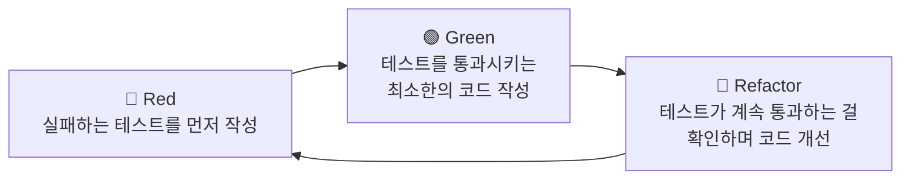

#CS #SoftwareEngineering #면접

관련: [[DDD]] · [[../Java/SOLID|SOLID]]

## 목차
- [[#TDD란? — 목적지를 먼저 정하고 길을 찾기]]
- [[#Red-Green-Refactor 사이클]]
- [[#코드로 보는 TDD — 계산기 만들기]]
- [[#TDD가 주는 실질적인 이점]]
- [[#TDD의 한계와 현실적인 고려사항]]
- [[#한 장 요약]]
- [[#Q&A로 복습하기]]

---

## TDD란? — 목적지를 먼저 정하고 길을 찾기

보통 개발은 "기능을 구현한다 → 잘 되는지 테스트해본다" 순서로 하죠. **TDD(Test-Driven Development, 테스트 주도 개발)** 는 이 순서를 **거꾸로 뒤집어요.**

> **비유**: 여행을 떠날 때, 무작정 차를 몰고 나선 뒤 "어디로 가지?"를 고민하는 대신, **목적지를 내비게이션에 먼저 찍고 나서 출발**하는 것과 비슷해요. TDD는 "이 기능이 이렇게 동작해야 한다"는 **목적지(테스트)** 를 코드보다 먼저 정해두고, 그 목적지에 도달하도록 코드를 짜나가요.

즉 **"동작하는 코드를 먼저 짜고 테스트로 검증"** 하는 게 아니라, **"원하는 동작을 테스트로 먼저 정의하고, 그걸 통과시키는 코드를 나중에 작성"** 하는 게 TDD예요.

---

## Red-Green-Refactor 사이클

TDD는 아주 짧은 사이클을 계속 반복해요. 이 세 단계의 앞글자를 따서 **"Red-Green-Refactor"** 라고 불러요.



- **🔴 Red**: 아직 구현이 없으니 당연히 **실패하는 테스트**를 먼저 짜요. (테스트 결과가 보통 빨간색으로 표시돼서 Red라고 불러요.)
- **🟢 Green**: 그 테스트를 통과시키기 위한 **최소한의 코드**만 작성해요. 완벽하게 짤 필요 없이, 일단 테스트만 통과하면 돼요.
- **🔵 Refactor**: 테스트가 계속 통과하는 걸 안전망 삼아, 코드를 **더 깔끔하게 다듬어요.** 이 단계에서 동작은 그대로 유지하면서 구조만 개선해요.

이 사이클을 기능 하나하나에 대해 **아주 짧게, 계속 반복**하는 게 TDD예요.

---

## 코드로 보는 TDD — 계산기 만들기

"두 수를 더하는 기능"을 TDD로 만들어볼게요.

**① Red — 실패하는 테스트부터 작성**

```java
@Test
void add_두수를_더한다() {
    Calculator calculator = new Calculator();
    assertEquals(5, calculator.add(2, 3)); // Calculator 클래스가 아직 없어서 컴파일도 안 됨 → 실패
}
```

**② Green — 테스트를 통과시키는 최소한의 코드**

```java
class Calculator {
    int add(int a, int b) {
        return a + b; // 딱 테스트를 통과할 만큼만 구현
    }
}
```

**③ Refactor — 테스트가 계속 통과하는 걸 확인하며 개선**

지금은 코드가 너무 단순해서 리팩터링할 게 없지만, 기능이 복잡해질수록 이 단계에서 중복을 없애거나 메서드를 분리하는 등의 개선을 해요. **테스트가 안전망 역할**을 해줘서, 코드를 바꾸다가 실수로 기능을 망가뜨리면 즉시 알아챌 수 있어요.

여기서 다시 "음수를 더하면?" 같은 새로운 요구사항이 생기면, **또 Red(새 실패 테스트)부터 시작**해서 사이클을 반복해요.

---

## TDD가 주는 실질적인 이점

- **요구사항이 명확해짐**: 테스트를 먼저 쓰려면 "이 기능이 정확히 어떻게 동작해야 하는지"를 미리 구체적으로 생각해야 해요. 애매한 상태로 코드부터 짜는 걸 방지해줘요.
- **회귀(Regression) 방지**: 나중에 다른 기능을 고치다가 실수로 이 기능을 망가뜨리면, 테스트가 바로 알려줘요.
- **좋은 설계로 자연스럽게 유도**: 테스트하기 쉬운 코드를 짜려면 자연히 **의존성이 느슨하게 결합된 코드**를 짜게 돼요. (예: 클래스 안에서 `new`로 직접 의존성을 만들면 테스트하기 어려우니, 자연스럽게 [[../Java/SOLID|SOLID]]의 DIP처럼 외부에서 주입받는 구조로 설계하게 돼요.)
- **문서 역할**: 테스트 코드 자체가 "이 코드가 어떻게 쓰여야 하는지"를 보여주는 살아있는 문서가 돼요.

---

## TDD의 한계와 현실적인 고려사항

TDD가 만능은 아니에요.

- **초기 속도가 느려 보일 수 있음**: 테스트 코드까지 같이 짜야 하니, 당장은 "그냥 코드만 짜는 것"보다 시간이 더 걸리는 것처럼 느껴질 수 있어요. (다만 장기적으로는 버그 수정/유지보수 비용을 줄여준다는 게 TDD 지지자들의 논거예요.)
- **모든 영역에 똑같이 적용하기 어려움**: UI처럼 "정확한 동작"을 테스트로 표현하기 애매한 영역은 TDD를 그대로 적용하기 까다로워요.
- **테스트 자체의 품질이 중요**: 테스트를 대충 짜면("일단 통과만 시키자") TDD의 이점이 크게 줄어들어요. 테스트도 코드만큼 신경 써서 작성해야 해요.

---

## 한 장 요약

| 질문 | 답 |
|---|---|
| TDD란? | 코드보다 테스트를 먼저 작성하고, 그 테스트를 통과시키는 방향으로 개발하는 방식 |
| Red-Green-Refactor는? | 실패하는 테스트 작성 → 통과시키는 최소 코드 작성 → 테스트 유지하며 코드 개선 |
| TDD의 핵심 이점은? | 요구사항 명확화, 회귀 방지, 느슨한 결합으로 자연스럽게 유도되는 설계 |
| TDD의 한계는? | 초기엔 느려 보일 수 있고, UI 등 일부 영역엔 적용이 까다로움 |

---

## Q&A로 복습하기

### Q. TDD의 핵심 원칙은?
A. 코드를 먼저 작성하고 나중에 테스트하는 게 아니라, 원하는 동작을 정의하는 테스트를 먼저 작성하고 그것을 통과시키는 코드를 나중에 작성하는 것이다.

### Q. Red-Green-Refactor 사이클의 각 단계는?
A. Red는 아직 구현이 없어 실패하는 테스트를 작성하는 단계, Green은 그 테스트를 통과시키는 최소한의 코드를 작성하는 단계, Refactor는 테스트가 계속 통과하는 것을 확인하며 코드 구조를 개선하는 단계다.

### Q. TDD가 좋은 설계를 유도한다는 것은 어떤 의미인가?
A. 테스트하기 쉬운 코드를 짜려면 의존성을 외부에서 주입받는 등 느슨하게 결합된 구조로 자연스럽게 설계하게 되기 때문에, TDD를 따르는 과정 자체가 SOLID의 DIP 같은 좋은 설계 원칙으로 이어지는 경우가 많다.

### Q. TDD를 모든 상황에 똑같이 적용하기 어려운 이유는?
A. UI처럼 정확한 동작을 테스트 코드로 명확히 표현하기 애매한 영역이 있고, 테스트 코드 작성 자체에 추가 시간이 들어 초기에는 개발 속도가 느려 보일 수 있기 때문이다.
