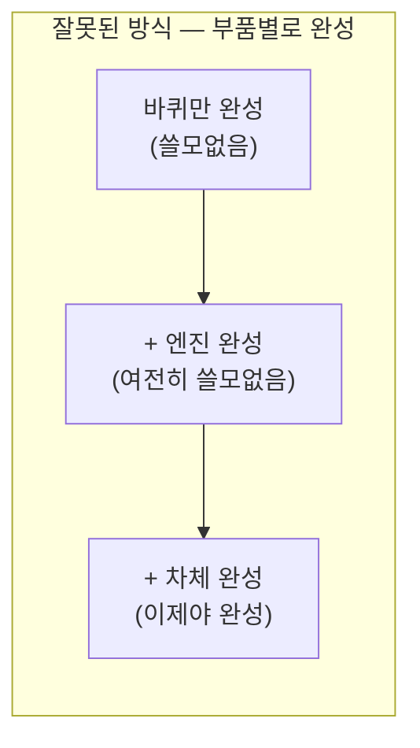
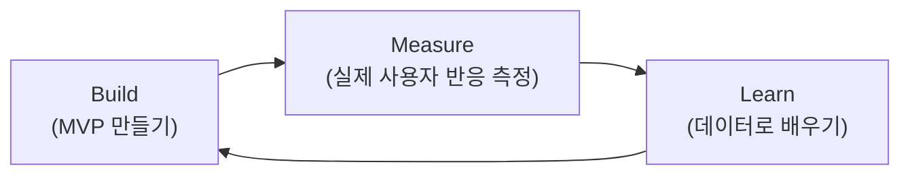
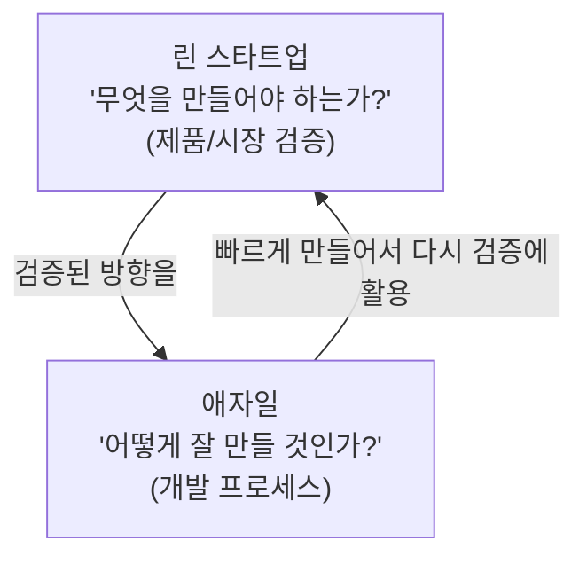

#CS #SoftwareEngineering #면접

관련: [[애자일]]

## 목차
- [[#린 스타트업이란? — "어떻게 만들까"보다 "무엇을 만들까"]]
- [[#MVP(Minimum Viable Product) — 완벽한 자동차 대신 스케이트보드부터]]
- [[#Build-Measure-Learn 루프]]
- [[#검증된 학습과 피벗]]
- [[#린 스타트업과 애자일의 관계]]
- [[#한 장 요약]]
- [[#Q&A로 복습하기]]

---

## 린 스타트업이란? — "어떻게 만들까"보다 "무엇을 만들까"

[[애자일]]은 "이미 만들기로 정해진 것을, 어떻게 하면 효율적으로 잘 만들까"를 다루는 방법론이에요. 그런데 스타트업이 마주하는 진짜 어려운 질문은 그 이전 단계예요 — **"우리가 만들려는 이게, 애초에 사람들이 원하는 게 맞나?"**

**린 스타트업(Lean Startup)** 은 에릭 리스(Eric Ries)가 제시한 개념으로, **"완벽한 제품을 오래 준비해서 내놓는 대신, 최소한의 것을 빠르게 만들어보고 시장의 반응으로 검증하며 나아가자"** 는 방법론이에요.

> **비유**: 처음 보는 도시를 여행할 때, 완벽한 여행 계획을 세우고 그대로 따르기보다 **일단 근처 골목을 조금 걸어보고, 반응(재밌으면 더 가고 아니면 방향을 바꾸는)을 보며 탐험 경로를 계속 조정**하는 것과 비슷해요. 몇 달간 지도만 파고드는 것보다, 작게 시도해보고 배우는 게 더 빨라요.

---

## MVP(Minimum Viable Product) — 완벽한 자동차 대신 스케이트보드부터

"자동차를 만들어달라"는 요청을 받았을 때, 잘못된 접근은 **"자동차의 부품을 하나씩 완성해나가는 것"** 이에요 — 바퀴만 완성된 상태, 엔진만 완성된 상태는 아무도 쓸 수 없어요. 프로젝트 끝나기 직전까지 "쓸 수 있는 것"이 하나도 없죠.

**MVP(Minimum Viable Product, 최소 기능 제품)** 는 반대로 접근해요 — **처음부터 "이동한다"는 핵심 가치를 담은, 비록 작아도 그 자체로 쓸모 있는 것**부터 만들어요.

각 단계가 다 **불완전한 자동차가 아니라, 그 자체로 완결된 "이동 수단"** 이라는 게 핵심이에요. 매 단계마다 실제 사용자의 반응을 얻을 수 있고, 그 피드백으로 다음 단계를 조정할 수 있어요.

---

## Build-Measure-Learn 루프

린 스타트업의 핵심 실행 방식이 이 세 단계를 계속 반복하는 루프예요.

- **Build**: 가설을 검증할 수 있는 최소한의 것(MVP)을 만들어요.
- **Measure**: 실제 사용자에게 내놓고, 클릭률·재방문·구매 여부 같은 **실제 데이터**를 측정해요. (추측이나 의견이 아니라 실제 행동 데이터가 중요해요.)
- **Learn**: 그 데이터를 보고 "우리 가설이 맞았나, 틀렸나"를 판단하고, 다음에 뭘 시도할지 결정해요.

이 루프를 **최대한 빠르게 여러 번 돌리는 것**이 목표예요. 한 바퀴 도는 데 몇 달씩 걸리면 그만큼 배우는 속도도 느려져요.

---

## 검증된 학습과 피벗

- **검증된 학습(Validated Learning)**: "우리 생각엔 이게 잘 될 것 같다"는 **추측이 아니라, 실제 데이터로 확인된 배움**을 말해요. 예를 들어 "사용자들이 이 기능을 원할 것"이라는 가정을 세웠다면, 실제로 MVP를 내놓고 사용자들이 정말 그 기능을 쓰는지 데이터로 확인하는 거예요.
- **피벗(Pivot)**: Build-Measure-Learn을 돌리다가 **가설이 틀렸다는 게 확인되면, 방향을 완전히 전환**하는 거예요. 처음 아이디어에 집착하지 않고, 배운 것을 바탕으로 다른 방향으로 과감히 틀어요. (유명한 사례로, 사진 공유 앱으로 시작했다가 완전히 다른 서비스로 피벗해서 성공한 스타트업들이 있어요.)

---

## 린 스타트업과 애자일의 관계

둘은 경쟁 관계가 아니라, **서로 다른 질문에 답하는 상호보완적인 방법론**이에요.

실무에서는 흔히 **린 스타트업으로 "이걸 만들 가치가 있는지" 방향을 잡고, 그 방향을 애자일의 스프린트 방식으로 빠르게 구현하며 검증**하는 식으로 함께 쓰여요.

---

## 한 장 요약

| 질문 | 답 |
|---|---|
| 린 스타트업이란? | 완벽한 제품을 오래 준비하는 대신, 최소한의 것을 빠르게 만들어 시장 반응으로 검증하는 방법론 |
| MVP란? | 그 자체로 쓸모 있는, 핵심 가치를 담은 최소 기능 제품 (부품이 아니라 완결된 작은 제품) |
| Build-Measure-Learn이란? | 만들고(Build) → 실제 데이터로 측정하고(Measure) → 배우는(Learn) 루프를 빠르게 반복 |
| 검증된 학습이란? | 추측이 아니라 실제 데이터로 확인된 배움 |
| 피벗이란? | 가설이 틀렸다고 확인되면 방향을 전환하는 것 |
| 애자일과의 관계는? | 린 스타트업은 "무엇을 만들지", 애자일은 "어떻게 만들지"를 다루며 함께 쓰임 |

---

## Q&A로 복습하기

### Q. 린 스타트업이 던지는 핵심 질문은 애자일과 어떻게 다른가?
A. 애자일은 이미 만들기로 정해진 것을 어떻게 효율적으로 잘 만들지를 다루는 반면, 린 스타트업은 그보다 앞선 질문인 "이걸 만드는 게 애초에 가치가 있는가"를 검증하는 데 초점을 둔다.

### Q. MVP가 "미완성 부품"이 아니라는 것은 무슨 의미인가?
A. MVP는 자동차의 바퀴나 엔진처럼 그 자체로는 쓸모없는 부분 완성품이 아니라, 스케이트보드처럼 기능은 작아도 핵심 가치(이동)를 그 자체로 완결되게 제공하는 제품이어야 한다는 뜻이다.

### Q. Build-Measure-Learn 루프에서 Measure 단계가 중요한 이유는?
A. 팀의 추측이나 의견이 아니라 실제 사용자의 행동 데이터를 근거로 가설을 검증해야, Learn 단계에서 얻는 배움이 신뢰할 수 있는(검증된) 것이 되기 때문이다.

### Q. 피벗은 언제, 왜 하는 것인가?
A. Build-Measure-Learn을 반복하다가 세운 가설이 데이터로 틀렸다고 확인되었을 때, 기존 아이디어에 집착하지 않고 배운 것을 바탕으로 방향을 전환하기 위해 한다.
