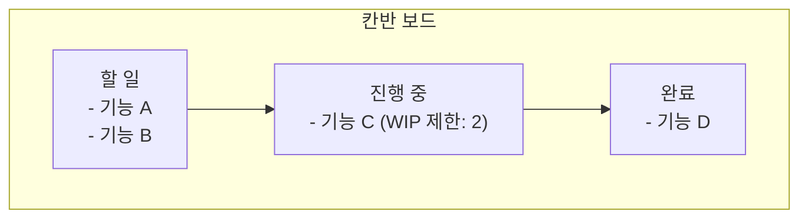

#CS #SoftwareEngineering #면접

관련: [[TDD]] · [[DDD]] · [[린 스타트업]]

## 목차
- [[#애자일이란? — 계획을 한 번에 다 세우지 않기]]
- [[#왜 필요할까? — 워터폴 방식의 한계]]
- [[#스프린트 — 짧은 주기로 반복하기]]
- [[#Scrum — 가장 널리 쓰이는 애자일 프레임워크]]
- [[#Kanban — 흐르는 작업을 시각화하기]]
- [[#Scrum vs Kanban]]
- [[#워터폴 vs 애자일]]
- [[#한 장 요약]]
- [[#Q&A로 복습하기]]

---

## 애자일이란? — 계획을 한 번에 다 세우지 않기

내비게이션 없이 지도만 보고 장거리 운전 계획을 세운다고 해봐요. 출발 전에 "몇 시 몇 분에 어느 지점을 지난다"까지 완벽하게 계획해도, 막상 출발하면 공사 구간이나 사고 때문에 계획이 다 어긋나요. 요즘 내비게이션은 그 대신 **"일단 가면서, 상황이 바뀔 때마다 경로를 다시 계산"** 하죠.

**애자일(Agile)** 은 소프트웨어 개발에서 이 방식을 택해요. **"처음에 완벽한 계획을 세우고 그대로 밀어붙이기"** 대신, **"짧은 주기로 조금씩 만들고, 그때그때 피드백을 받아 계획을 계속 수정"** 하는 개발 방식이에요.

> **애자일 선언문(Agile Manifesto)의 핵심 가치** 중 몇 가지를 요약하면: "포괄적인 문서보다 **작동하는 소프트웨어**를", "계약 협상보다 **고객과의 협력**을", "계획을 따르기보다 **변화에 대응**하는 것"을 더 중요하게 여겨요.

---

## 왜 필요할까? — 워터폴 방식의 한계

애자일 이전에 흔했던 방식이 **워터폴(Waterfall, 폭포수 모델)** 이에요. 이름 그대로 **요구사항 분석 → 설계 → 구현 → 테스트 → 배포**를 폭포처럼 한 방향으로, 한 단계씩 순서대로 끝내고 넘어가요.

문제는 **"처음에 정한 요구사항이 끝까지 안 바뀐다"는 전제가 현실에서는 잘 안 맞는다**는 거예요. 몇 달간 설계와 구현을 다 끝낸 뒤에야 처음으로 실제 동작하는 걸 보여주면, 그제서야 "어, 이게 아닌데"라는 피드백을 받게 돼요. 이미 너무 늦은 시점이라 수정 비용이 커요.

---

## 스프린트 — 짧은 주기로 반복하기

애자일은 이 문제를, 몇 달짜리 큰 계획 대신 **1~4주 정도의 짧은 주기(스프린트, Sprint)** 로 쪼개서 풀어요. 매 스프린트마다 **"일부라도 실제로 동작하는 결과물"** 을 만들고, 그걸 보고 피드백을 받아 다음 스프린트 계획에 반영해요.

워터폴처럼 "설계 → 구현 → 테스트"를 프로젝트 전체에 걸쳐 한 번씩만 거치는 게 아니라, **이 작은 사이클 안에서 설계-구현-테스트를 매번 반복**해요. 그래서 문제가 생겨도 몇 달 뒤가 아니라 **몇 주 안에 발견하고 고칠 수 있어요.**

---

## Scrum — 가장 널리 쓰이는 애자일 프레임워크

**Scrum(스크럼)** 은 애자일의 가치를 실제로 실행하기 위한 가장 널리 쓰이는 구체적인 방법론이에요. 정해진 **역할**과 **이벤트(회의)** 로 구성돼요.

| 역할 | 하는 일 |
|---|---|
| **Product Owner (PO)** | "무엇을 만들지" 우선순위를 정하는 사람. 백로그(할 일 목록)를 관리 |
| **Scrum Master** | 팀이 Scrum 프로세스를 잘 따르도록 돕고, 방해 요소를 제거하는 사람 |
| **Development Team** | 실제로 만드는 사람들(개발자, 디자이너 등) |

| 이벤트 | 목적 |
|---|---|
| **스프린트 플래닝** | 이번 스프린트에서 뭘 만들지 계획 |
| **데일리 스탠드업** | 매일 짧게 모여 "어제 한 일 / 오늘 할 일 / 막힌 것"을 공유 |
| **스프린트 리뷰** | 스프린트가 끝나면 만든 결과물을 보여주고 피드백 받기 |
| **회고(Retrospective)** | "우리 팀은 무엇을 잘했고, 무엇을 개선해야 할까"를 돌아봄 |

---

## Kanban — 흐르는 작업을 시각화하기

**Kanban(칸반)** 은 Scrum처럼 정해진 주기(스프린트) 없이, **작업을 "할 일 → 진행 중 → 완료" 같은 보드에 시각화**해서 흐름 자체를 관리하는 방식이에요.

핵심은 **WIP(Work In Progress) 제한**이에요 — "진행 중" 칸에 동시에 들어갈 수 있는 작업 개수를 일부러 제한해요. 이렇게 하면 여러 작업을 동시에 벌여놓고 다 못 끝내는 대신, **한 번에 적은 수의 작업에 집중해서 빠르게 끝내는** 흐름을 만들 수 있어요.

---

## Scrum vs Kanban

| 구분 | Scrum | Kanban |
|---|---|---|
| 작업 단위 | 정해진 기간(스프린트)마다 일괄 계획 | 정해진 주기 없이, 작업이 끝나는 대로 계속 새 작업 투입 |
| 역할 | PO, Scrum Master 등 명확한 역할 정의 | 특별히 정해진 역할 없음 |
| 변경 유연성 | 스프린트 도중엔 계획 변경을 지양 | 언제든 우선순위 조정 가능 |
| 적합한 상황 | 어느 정도 계획 가능한 기능 개발 | 운영/유지보수처럼 예측 불가능한 요청이 잦은 업무 |

---

## 워터폴 vs 애자일

| 구분 | 워터폴 | 애자일 |
|---|---|---|
| 계획 방식 | 처음에 전체를 한 번에 계획 | 짧은 주기로 계속 계획을 조정 |
| 피드백 시점 | 프로젝트 끝 무렵 | 매 스프린트마다 |
| 변화 대응 | 어려움 (계획 변경 비용이 큼) | 변화를 전제로 설계됨 |
| 적합한 상황 | 요구사항이 명확하고 안 바뀌는 프로젝트 | 요구사항이 자주 바뀌거나 불확실한 프로젝트 |

---

## 한 장 요약

| 질문 | 답 |
|---|---|
| 애자일이란? | 짧은 주기로 반복하며 피드백을 계속 반영하는 개발 방식 |
| 워터폴의 한계는? | 요구사항이 안 바뀐다는 전제가 비현실적이고, 피드백이 프로젝트 끝에야 옴 |
| 스프린트란? | 1~4주 정도의 짧은 반복 개발 주기 |
| Scrum의 핵심 구성은? | PO/Scrum Master/개발팀 역할 + 플래닝/데일리/리뷰/회고 이벤트 |
| Kanban의 핵심은? | 작업 흐름을 보드로 시각화하고, WIP 제한으로 동시 작업 수를 통제 |

---

## Q&A로 복습하기

### Q. 워터폴 방식의 가장 큰 문제는?
A. 요구사항이 프로젝트 끝까지 바뀌지 않는다는 비현실적인 전제를 깔고 있고, 실제 동작하는 결과물에 대한 피드백을 프로젝트 후반부에야 받게 되어 문제를 발견해도 수정 비용이 크다.

### Q. 애자일이 이 문제를 해결하는 방식은?
A. 프로젝트 전체를 한 번에 계획하는 대신 1~4주 정도의 짧은 스프린트로 나눠, 매 스프린트마다 실제 동작하는 결과물을 만들고 피드백을 받아 다음 계획에 반영한다.

### Q. Scrum의 세 가지 역할은?
A. 무엇을 만들지 우선순위를 정하는 Product Owner, 팀이 프로세스를 잘 따르도록 돕는 Scrum Master, 실제로 만드는 Development Team이다.

### Q. Kanban에서 WIP 제한이 필요한 이유는?
A. 여러 작업을 동시에 벌여놓고 다 못 끝내는 것을 막고, 적은 수의 작업에 집중해 빠르게 완료하는 흐름을 만들기 위해서다.

### Q. Scrum과 Kanban 중 예측 불가능한 운영/유지보수 업무에 더 적합한 것은?
A. Kanban이다. 정해진 주기 없이 언제든 우선순위를 조정하고 작업을 투입할 수 있어, 계획 도중 변경을 지양하는 Scrum보다 유연하게 대응할 수 있다.
