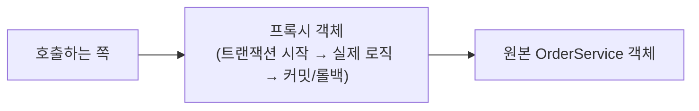
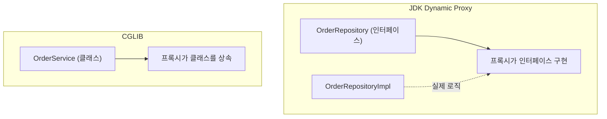
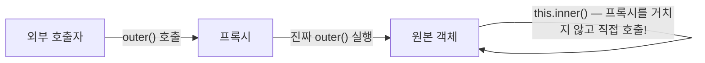
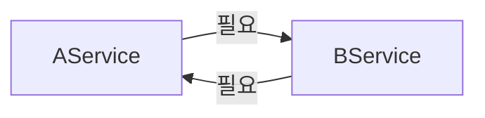
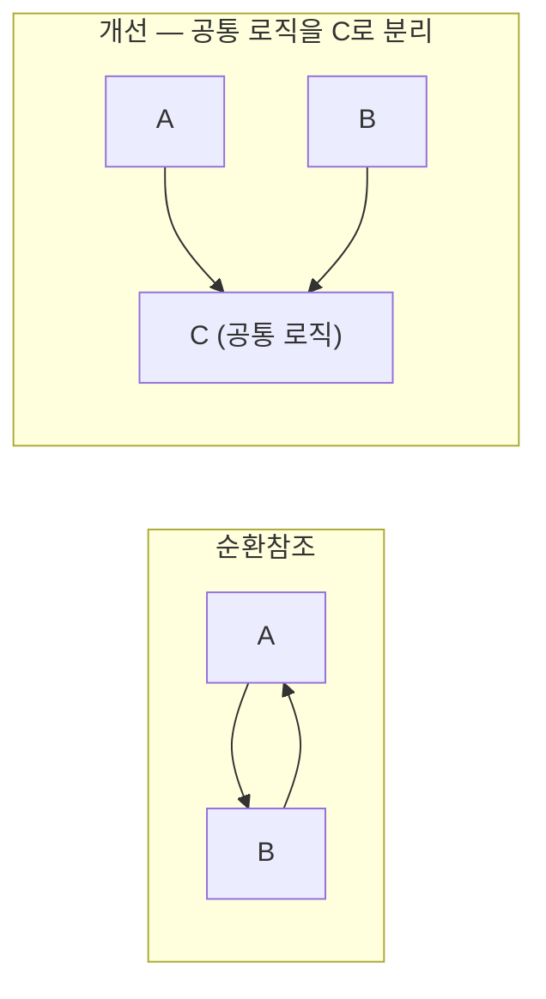

#CS #Spring #면접

관련: [[Spring]] · [[스프링 컨테이너]] · [[../Java/디자인 패턴|디자인 패턴]]

## 목차
- [[#AOP는 실제로 어떻게 동작할까? — 프록시]]
- [[#JDK Dynamic Proxy vs CGLIB]]
- [[#Self-Invocation 함정 — 자기 자신을 호출하면 AOP가 안 먹는다]]
- [[#Bean 순환참조란?]]
- [[#필드 주입은 왜 순환참조를 숨길까? — 3단계 캐시]]
- [[#순환참조, 어떻게 해결할까?]]
- [[#한 장 요약]]
- [[#Q&A로 복습하기]]

---

## AOP는 실제로 어떻게 동작할까? — 프록시

[[Spring]]에서 다룬 AOP(`@Transactional`, 로깅 Aspect 등)는 마법처럼 보이지만, 사실은 [[../Java/디자인 패턴|디자인 패턴]]에서 다룬 **Proxy 패턴**을 그대로 활용한 거예요. Spring은 `@Transactional`이 붙은 Bean을 등록할 때, **원본 객체를 감싸는 프록시 객체를 대신 만들어서 컨테이너에 등록**해요.



그래서 `orderService.order()`를 호출하면, 실제로는 **프록시가 먼저 호출을 가로채서** "트랜잭션을 시작하고, 진짜 `order()`를 실행하고, 성공하면 커밋·실패하면 롤백"하는 로직을 앞뒤로 끼워 넣어요.

---

## JDK Dynamic Proxy vs CGLIB

Spring은 이 프록시를 만드는 데 **두 가지 방식**을 써요.

- **JDK Dynamic Proxy**: 대상 클래스가 **인터페이스를 구현하고 있을 때** 사용해요. 그 인터페이스를 기반으로 프록시를 만들어요.
- **CGLIB**: 대상 클래스에 **인터페이스가 없어도** 사용할 수 있어요. 원본 클래스를 **상속**해서 프록시 클래스를 만들어요.



| 구분 | JDK Dynamic Proxy | CGLIB |
|---|---|---|
| 전제 조건 | 인터페이스 필요 | 인터페이스 없어도 가능 (클래스 상속) |
| 방식 | 인터페이스 구현 | 클래스 상속 |
| 제약 | 인터페이스에 정의된 메서드만 프록시 가능 | `final` 클래스/메서드는 상속할 수 없어서 프록시 불가 |

> **Spring Boot는 기본적으로 CGLIB을 사용**해요. 인터페이스가 있든 없든 일관되게 동작하게 하려는 이유예요. 그래서 실무에서는 **AOP 대상 클래스나 메서드를 `final`로 선언하면 안 돼요** — CGLIB이 상속해서 프록시를 만들 수 없어서 AOP 자체가 적용이 안 돼요.

---

## Self-Invocation 함정 — 자기 자신을 호출하면 AOP가 안 먹는다

프록시가 "호출을 가로채는" 방식이라는 걸 이해하면, 아주 유명한 함정 하나를 알 수 있어요.

```java
@Service
class OrderService {
    @Transactional
    void outer() {
        inner(); // ⚠️ 같은 클래스 안의 메서드를 직접 호출!
    }

    @Transactional
    void inner() {
        // 이 메서드의 @Transactional이 적용 안 됨!
    }
}
```



**외부에서 `outer()`를 호출하면 프록시를 거쳐요.** 하지만 `outer()` 내부에서 `inner()`를 호출하는 건 **`this.inner()`, 즉 프록시가 아니라 원본 객체를 통해 직접 호출**하는 거예요. 프록시를 거치지 않으니 `inner()`에 붙은 `@Transactional`이 **적용되지 않아요.** 이걸 **Self-Invocation(자기 호출) 문제**라고 해요.

**해결 방법**:
- 가장 좋은 건 **`inner()`를 별도의 Bean(클래스)으로 분리**해서, 외부에서 프록시를 거쳐 호출하게 만드는 거예요.
- 어쩔 수 없다면 `ApplicationContext`에서 **자기 자신의 프록시를 다시 조회**해서 그걸 통해 호출하는 방법도 있지만, 코드가 지저분해져서 권장되지 않아요.

---

## Bean 순환참조란?

Bean A가 Bean B를 필요로 하고, 동시에 Bean B도 Bean A를 필요로 하는 상황이에요.

```java
@Service
class AService {
    private final BService bService;
    AService(BService bService) { this.bService = bService; } // A는 B가 필요
}

@Service
class BService {
    private final AService aService;
    BService(AService aService) { this.aService = aService; } // B는 A가 필요
}
```



이렇게 **생성자 주입**으로 순환참조를 만들면, Spring은 애플리케이션을 **시작조차 하지 못하고 즉시 에러를 던져요** (`BeanCurrentlyInCreationException`). A를 만들려면 B가 먼저 준비돼야 하는데, B를 만들려면 A가 먼저 준비돼야 하니 **끝없는 순환**에 빠지기 때문이에요.

> 이 에러가 나쁜 게 아니에요 — **오히려 설계에 문제가 있다는 걸 애플리케이션 시작 시점에 바로 알려주는, 반가운 신호**예요.

---

## 필드 주입은 왜 순환참조를 숨길까? — 3단계 캐시

같은 순환참조를 **필드 주입(`@Autowired`)** 이나 **세터 주입**으로 바꾸면, 신기하게도 **에러 없이 애플리케이션이 뜨는 경우**가 있어요.

```java
@Service
class AService {
    @Autowired
    private BService bService; // 필드 주입 — 순환참조가 있어도 일단 시작은 됨
}
```

이유는 Spring이 **3단계 캐시(Three-level Cache)** 라는 메커니즘을 쓰기 때문이에요. 아주 단순화하면: **아직 의존성 주입이 다 안 끝난 "덜 완성된" 객체(프록시일 수도 있는 참조)를 미리 캐시에 등록**해두고, 순환 참조가 필요할 때 이 미완성 참조를 먼저 빌려주는 방식이에요. **생성자 주입**은 "생성자 호출 시점에 그 인자가 이미 완전히 준비돼 있어야" 하니 이 트릭을 쓸 수 없지만, **필드/세터 주입은 객체를 일단 만들어놓고 나중에 필드만 채워 넣는 방식**이라 이 캐시 트릭이 통해요.

> ⚠️ 그렇다고 필드 주입이 좋은 게 아니에요! **순환참조는 애초에 설계가 잘못됐다는 신호인데, 필드 주입은 그 신호를 숨겨서 문제를 뒤늦게(런타임 중 어딘가에서) 발견하게 만들어요.** 그래서 실무에서는 순환참조를 발견 즉시 알려주는 **생성자 주입이 권장**돼요.

---

## 순환참조, 어떻게 해결할까?

1. **가장 좋은 방법 — 설계를 바꾸기**: 애초에 A와 B가 서로 필요하다는 것 자체가 책임이 잘못 나뉘어 있다는 신호예요. **공통 로직을 C라는 새 클래스로 뽑아내서**, A와 B가 서로가 아니라 C에 의존하도록 바꿔요.



2. **`@Lazy` 사용**: 둘 중 한쪽의 의존성 주입을 지연시켜서, 실제로 그 Bean이 필요해지는 시점에야 초기화되게 만들어요. (근본적인 해결책은 아니고, 임시방편에 가까워요.)

3. **필드/세터 주입으로 우회**: 위에서 봤듯 가능은 하지만, 설계 문제를 숨기는 것뿐이라 **권장되지 않아요.**

---

## 한 장 요약

| 질문 | 답 |
|---|---|
| Spring AOP는 실제로 어떻게 동작하나? | 원본 객체를 감싸는 프록시를 만들어, 메서드 호출 전후에 부가 로직을 끼워 넣음 |
| JDK Dynamic Proxy vs CGLIB | 전자는 인터페이스 기반, 후자는 클래스 상속 기반. Spring Boot 기본은 CGLIB |
| Self-Invocation 문제란? | 같은 클래스 내부 메서드 호출은 프록시를 거치지 않아 AOP(@Transactional 등)가 적용 안 됨 |
| 생성자 주입 순환참조는 왜 즉시 에러가 나나? | 서로가 먼저 완성되길 기다리는 무한 순환이라 시작 자체가 불가능하기 때문 |
| 필드 주입이 순환참조를 숨기는 이유는? | 3단계 캐시로 미완성 참조를 먼저 빌려줄 수 있어 일단 실행은 되기 때문 |
| 순환참조의 근본적인 해결책은? | 공통 로직을 별도 클래스로 분리해 설계 자체를 바꾸는 것 |

---

## Q&A로 복습하기

### Q. Spring AOP가 실제로 동작하는 원리는?
A. @Transactional 같은 애노테이션이 붙은 Bean을 등록할 때, Spring이 원본 객체를 감싸는 프록시 객체를 대신 만들어 등록한다. 이 프록시가 실제 메서드 호출을 가로채 전후에 부가 로직(트랜잭션 시작/커밋 등)을 끼워 넣는다.

### Q. JDK Dynamic Proxy와 CGLIB의 차이는?
A. JDK Dynamic Proxy는 대상 클래스가 구현한 인터페이스를 기반으로 프록시를 만들고, CGLIB은 인터페이스 없이도 원본 클래스를 상속해서 프록시를 만든다. Spring Boot는 기본적으로 CGLIB을 사용한다.

### Q. Self-Invocation 문제는 왜 발생하나?
A. 같은 클래스 내부에서 다른 메서드를 호출하면 this를 통한 직접 호출이 되어 프록시를 거치지 않는다. AOP는 프록시가 호출을 가로챌 때만 적용되므로, 이렇게 프록시를 거치지 않는 호출에는 @Transactional 같은 AOP가 적용되지 않는다.

### Q. 생성자 주입으로 순환참조를 만들면 왜 즉시 에러가 나는가?
A. A를 생성하려면 B가 먼저 완전히 준비되어야 하는데 B를 생성하려면 A가 먼저 준비되어야 하는 무한 순환에 빠지기 때문에, Spring은 애플리케이션 시작 시점에 이 문제를 감지해 즉시 예외를 던진다.

### Q. 순환참조를 발견했을 때 가장 바람직한 해결 방법은?
A. @Lazy나 필드 주입으로 우회하는 것은 문제를 숨길 뿐이므로, 근본적으로는 A와 B가 공통으로 필요로 하는 로직을 별도의 클래스로 분리해 서로 직접 의존하지 않도록 설계를 바꾸는 것이 바람직하다.
