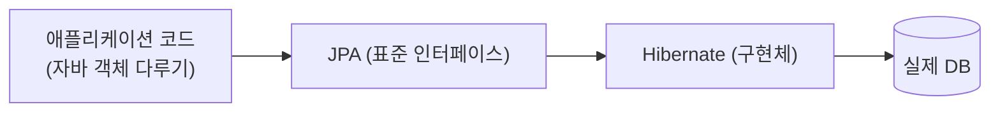
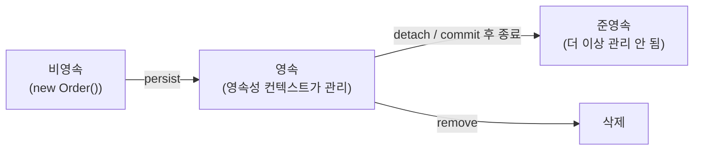
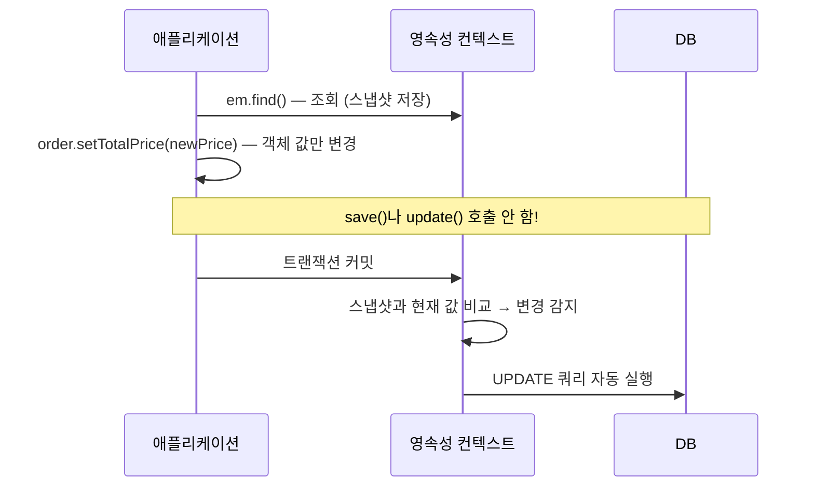
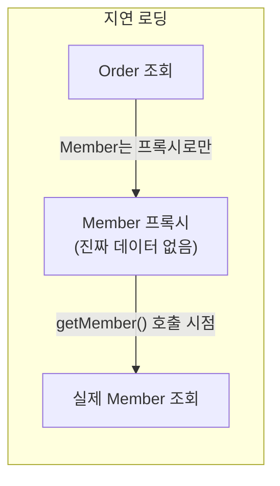

#CS #Spring #면접

관련: [[Spring]] · [[../Database/트랜잭션|트랜잭션]] · [[../Database/인덱스|인덱스]]

## 목차
- [[#ORM과 JPA — SQL을 직접 안 짜고 객체로 다루기]]
- [[#Entity 매핑 — 클래스를 테이블에 연결하기]]
- [[#영속성 컨텍스트 — 엔티티를 관리하는 1차 창고]]
- [[#1차 캐시 — 같은 트랜잭션 안에서는 다시 조회 안 함]]
- [[#더티 체킹 — UPDATE 문을 안 써도 자동으로 반영되는 이유]]
- [[#지연 로딩 vs 즉시 로딩]]
- [[#N+1 문제 — JPA에서 가장 유명한 함정]]
- [[#한 장 요약]]
- [[#Q&A로 복습하기]]

---

## ORM과 JPA — SQL을 직접 안 짜고 객체로 다루기

SQL을 직접 짜서 DB를 다루면, 자바 객체(`Order`)와 테이블(`ORDER`)을 왔다 갔다 변환하는 반복 코드가 계속 생겨요. **ORM(Object-Relational Mapping)** 은 이 변환을 자동화해서, **개발자가 SQL 대신 객체를 다루는 것만으로 DB 작업을 할 수 있게** 해줘요.

**JPA(Java Persistence API)** 는 자바의 ORM **표준 명세(인터페이스)** 이고, **Hibernate**가 그 명세를 실제로 구현한 라이브러리예요. Spring Boot에서는 이걸 `spring-boot-starter-data-jpa`로 편하게 가져다 써요.



---

## Entity 매핑 — 클래스를 테이블에 연결하기

```java
@Entity
class Order {
    @Id @GeneratedValue
    private Long id;

    private int totalPrice;

    @ManyToOne
    @JoinColumn(name = "member_id")
    private Member member; // 다른 Entity와의 관계도 객체 참조로 표현
}
```

`@Entity`가 붙은 클래스는 **테이블과 매핑되는 관리 대상**이 돼요. 이제부터 이 `Order` 객체를 다루는 방식이 순수 자바 객체와는 조금 다른 특별한 생명주기를 가지게 돼요 — 그게 바로 **영속성 컨텍스트**예요.

---

## 영속성 컨텍스트 — 엔티티를 관리하는 1차 창고

**영속성 컨텍스트(Persistence Context)** 는 **엔티티를 저장하고 관리하는 논리적인 공간**이에요. `EntityManager`가 엔티티를 조회하거나 저장할 때마다, 이 영속성 컨텍스트를 거쳐요.

엔티티는 이 안에서 몇 가지 상태를 오가요.



- **비영속(New/Transient)**: 그냥 `new`로 만들었을 뿐, 아직 JPA와 아무 관계없는 순수 객체 상태.
- **영속(Managed)**: `persist()`로 저장하거나 DB에서 조회해온 상태 — **영속성 컨텍스트가 이 객체를 추적/관리**해요.
- **준영속(Detached)**: 한때 영속 상태였지만, 영속성 컨텍스트에서 분리돼 더 이상 관리 안 되는 상태.
- **삭제(Removed)**: 삭제하기로 표시된 상태.

**"영속 상태로 관리된다"** 는 게 뒤에 나올 1차 캐시, 더티 체킹 같은 신기한 동작들의 핵심 전제예요.

---

## 1차 캐시 — 같은 트랜잭션 안에서는 다시 조회 안 함

```java
Order order1 = em.find(Order.class, 1L); // SQL 실행 → DB 조회
Order order2 = em.find(Order.class, 1L); // SQL 실행 안 됨! 1차 캐시에서 바로 꺼냄
```

영속성 컨텍스트는 내부에 **"엔티티 ID → 엔티티 객체"** 형태의 캐시(맵)를 가지고 있어요. 이걸 **1차 캐시**라고 해요. **같은 트랜잭션 안에서 같은 ID를 다시 조회하면, DB까지 안 가고 캐시에서 바로 꺼내줘요.** (참고로 여러 트랜잭션·요청에 걸쳐 공유되는 "2차 캐시"는 별도 설정이 필요한 선택적 기능이에요.)

---

## 더티 체킹 — UPDATE 문을 안 써도 자동으로 반영되는 이유

```java
@Transactional
void updatePrice(Long orderId, int newPrice) {
    Order order = em.find(Order.class, orderId); // 영속 상태로 조회
    order.setTotalPrice(newPrice); // 그냥 자바 객체 값만 바꿨을 뿐인데...
    // UPDATE 문을 직접 실행 안 했는데도, 트랜잭션 커밋 시 자동으로 UPDATE가 나감!
}
```

영속성 컨텍스트는 엔티티를 처음 조회한 시점의 **원본 스냅샷**을 기억해둬요. 그리고 트랜잭션이 끝날 때(커밋 시점), **현재 엔티티 값과 스냅샷을 비교해서 달라진 필드가 있으면 자동으로 UPDATE 쿼리를 만들어 실행**해요. 이걸 **더티 체킹(Dirty Checking)** 이라고 해요.



이 덕분에 개발자는 "이 필드가 바뀌었으니 저장해야지"라는 코드를 따로 안 짜도 돼요 — **영속 상태의 객체는 그냥 값을 바꾸기만 하면 알아서 DB에 반영**돼요.

---

## 지연 로딩 vs 즉시 로딩

`Order`가 `Member`를 참조하고 있을 때, `Order`를 조회하면 연관된 `Member`도 같이 가져와야 할까요? 두 가지 전략이 있어요.

```java
@ManyToOne(fetch = FetchType.LAZY)  // 지연 로딩 (기본 권장)
private Member member;

@ManyToOne(fetch = FetchType.EAGER) // 즉시 로딩
private Member member;
```

- **즉시 로딩(EAGER)**: `Order`를 조회하는 순간, **연관된 `Member`까지 바로 함께 조회**해요.
- **지연 로딩(LAZY)**: `Order`를 조회할 때는 `Member` 자리에 **가짜 대리자(프록시 객체)** 만 넣어두고, **실제로 `order.getMember()`를 호출하는 순간에야** DB에서 조회해요.



> **왜 지연 로딩이 기본 권장일까요?** 즉시 로딩은 "혹시 몰라서" 항상 연관 데이터를 다 끌어오는데, 그게 필요 없을 때가 더 많아요. 지연 로딩으로 **필요한 시점에만 가져오는 게 더 효율적**이에요. (단, 다음에 볼 N+1 문제는 오히려 지연 로딩에서 흔히 생겨요.)

---

## N+1 문제 — JPA에서 가장 유명한 함정

주문 목록(`Order` 10건)을 조회하고, 각 주문의 회원 이름도 출력한다고 해봐요.

```java
List<Order> orders = orderRepository.findAll(); // ① 쿼리 1번 — 주문 10건 조회
for (Order order : orders) {
    System.out.println(order.getMember().getName()); // ② Member는 지연 로딩 → 매번 추가 쿼리!
}
```

```
SELECT * FROM orders;                         -- 1번 (①)
SELECT * FROM member WHERE id = 1;             -- +1
SELECT * FROM member WHERE id = 2;             -- +1
...                                             -- 주문 개수(N)만큼 반복!
```

**처음 목록 조회에 1번, 그 뒤로 연관 엔티티를 하나하나 조회하느라 N번** — 합쳐서 **N+1번의 쿼리**가 나가버려요. 주문이 1000건이면 쿼리가 1001번 나가는 심각한 성능 문제예요.

**해결책 ① — Fetch Join**: 처음 조회할 때부터 연관 엔티티를 SQL JOIN으로 한 번에 가져와요.

```java
@Query("SELECT o FROM Order o JOIN FETCH o.member") // JOIN FETCH로 한 번에 조회
List<Order> findAllWithMember();
```

**해결책 ② — `@EntityGraph`**: JPQL을 직접 안 써도, 애노테이션만으로 함께 조회할 연관 관계를 지정할 수 있어요.

```java
@EntityGraph(attributePaths = {"member"})
List<Order> findAll();
```

**해결책 ③ — Batch Size 설정**: N번의 개별 쿼리 대신, `IN` 절로 여러 개를 한 번에 묶어서 조회하도록 설정해요.

```yaml
spring:
  jpa:
    properties:
      hibernate:
        default_batch_fetch_size: 100 # member를 최대 100개씩 IN절로 묶어서 조회
```

---

## 한 장 요약

| 질문 | 답 |
|---|---|
| JPA와 Hibernate의 관계는? | JPA는 표준 인터페이스, Hibernate는 그 구현체 |
| 영속성 컨텍스트란? | 엔티티를 저장·관리하는 논리적 공간, EntityManager가 사용 |
| 1차 캐시란? | 같은 트랜잭션 안에서 같은 ID 재조회 시 DB 대신 캐시에서 반환 |
| 더티 체킹이란? | 커밋 시점에 스냅샷과 현재 값을 비교해 변경분을 자동으로 UPDATE |
| 지연 로딩 vs 즉시 로딩 | 지연은 실제 사용 시점에 조회(프록시), 즉시는 바로 함께 조회 |
| N+1 문제란? | 목록 조회 1번 + 각 항목의 연관 엔티티 조회 N번으로 쿼리가 폭증 |
| N+1 해결법은? | Fetch Join, @EntityGraph, Batch Size 설정 |

---

## Q&A로 복습하기

### Q. 영속 상태의 엔티티 값만 바꿨는데 DB에 자동으로 반영되는 이유는?
A. 영속성 컨텍스트가 엔티티를 처음 조회한 시점의 스냅샷을 기억해두고, 트랜잭션 커밋 시점에 현재 값과 비교해 변경된 필드가 있으면 자동으로 UPDATE 쿼리를 생성해 실행하는 더티 체킹 덕분이다.

### Q. 1차 캐시는 왜 필요한가?
A. 같은 트랜잭션 안에서 같은 엔티티를 여러 번 조회할 때마다 매번 DB에 쿼리를 날리는 대신, 영속성 컨텍스트가 이미 관리 중인 객체를 그대로 재사용해 불필요한 DB 접근을 줄이기 위해서다.

### Q. 지연 로딩(LAZY)이 기본으로 권장되는 이유는?
A. 즉시 로딩은 필요 여부와 상관없이 항상 연관 엔티티를 함께 조회해 낭비가 생길 수 있는 반면, 지연 로딩은 실제로 그 값을 사용하는 시점에만 조회해 불필요한 조회를 줄일 수 있기 때문이다.

### Q. N+1 문제는 왜 발생하나?
A. 목록을 조회하는 쿼리 1번에 더해, 지연 로딩으로 설정된 연관 엔티티를 각 항목마다 접근할 때 개별 쿼리가 추가로 발생하기 때문에, 목록의 개수(N)만큼 쿼리가 추가로 나가 총 N+1번의 쿼리가 실행된다.

### Q. N+1 문제를 해결하는 대표적인 방법은?
A. JPQL의 JOIN FETCH로 연관 엔티티를 처음부터 함께 조회하거나, @EntityGraph로 함께 조회할 연관 관계를 지정하거나, batch size 설정으로 개별 쿼리를 IN절로 묶어 실행하는 방법이 있다.
