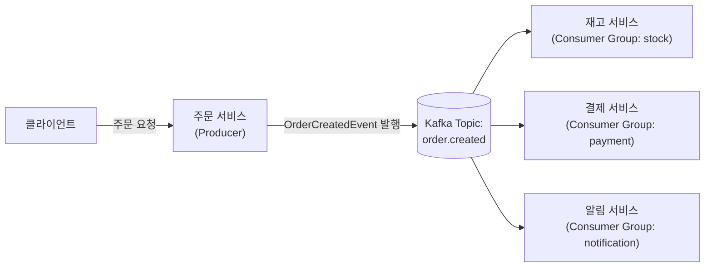
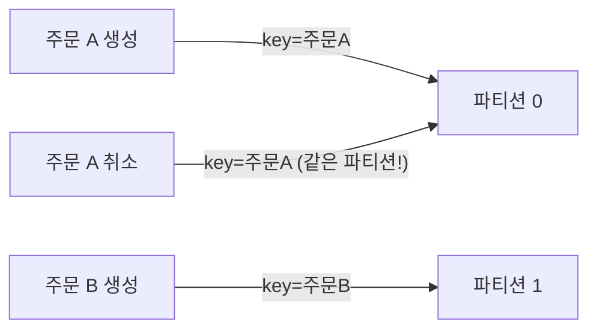
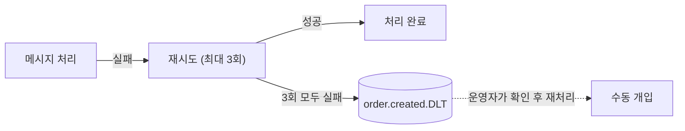
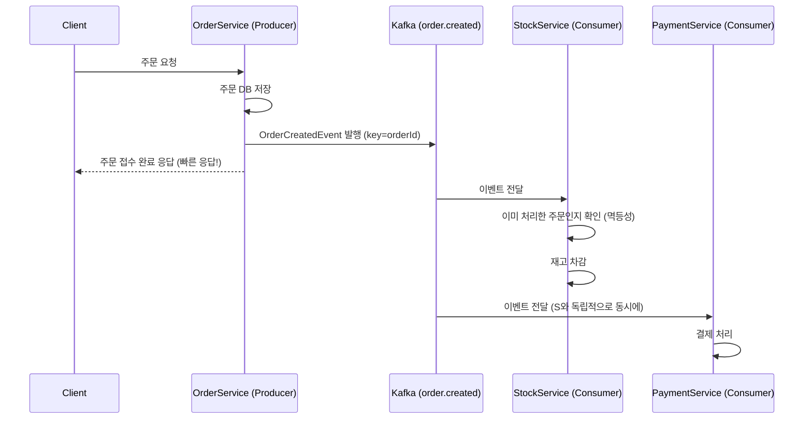

#CS #Spring #면접

관련: [[Spring]] · [[../Infrastructure/메시지 큐|메시지 큐]] · [[../Infrastructure/메시지 큐 비교|메시지 큐 비교]] · [[../Database/동시성 이슈와 락|동시성 이슈와 락]]

[[../Infrastructure/메시지 큐|메시지 큐]]와 [[../Infrastructure/메시지 큐 비교|메시지 큐 비교]]에서 다룬 개념을 바탕으로, **"주문 접수 → 재고/결제/알림 처리"** 시나리오를 Spring Boot + Kafka로 실제 구현해보는 문서예요.

## 목차
- [[#전체 시나리오와 아키텍처]]
- [[#프로젝트 설정]]
- [[#Topic 설계 — 이름, 파티션, 파티션 키]]
- [[#Producer — 주문 접수 시 이벤트 발행]]
- [[#Consumer — 재고/결제/알림을 각자 처리]]
- [[#멱등성 처리 — 중복 메시지에 대비하기]]
- [[#실패 처리 — 재시도와 Dead Letter Topic]]
- [[#전체 흐름 한눈에 보기]]
- [[#한 장 요약]]
- [[#Q&A로 복습하기]]

---

## 전체 시나리오와 아키텍처

주문이 접수되면 **재고 차감, 결제 처리, 알림 발송**이라는 서로 다른 작업이 동시에 필요해요. [[../Infrastructure/메시지 큐|메시지 큐]]에서 다룬 것처럼, 주문 서비스가 이 모든 걸 직접 호출하는 대신 **Kafka에 "주문 생성" 이벤트만 발행**하고, 나머지는 각자의 Consumer가 알아서 처리하도록 설계할게요.



각 서비스는 **서로 다른 Consumer Group**에 속해서, [[../Infrastructure/메시지 큐 비교|메시지 큐 비교]]에서 다룬 것처럼 **같은 메시지를 각자 독립적으로 받아요**(Consumer Group이 다르면 Pub/Sub처럼 동작). 재고 서비스가 느려도 결제/알림 서비스는 영향받지 않아요.

---

## 프로젝트 설정

Spring Boot에서는 `spring-kafka` 의존성 하나로 Producer/Consumer를 모두 구현할 수 있어요.

```gradle
implementation 'org.springframework.kafka:spring-kafka'
```

```yaml
# application.yml
spring:
  kafka:
    bootstrap-servers: localhost:9092
    producer:
      key-serializer: org.apache.kafka.common.serialization.StringSerializer
      value-serializer: org.springframework.kafka.support.serializer.JsonSerializer
      acks: all # 모든 replica가 저장을 확인한 뒤 성공 응답 (신뢰성 우선)
    consumer:
      group-id: stock-service # Consumer Group ID (서비스마다 다르게 설정)
      key-deserializer: org.apache.kafka.common.serialization.StringDeserializer
      value-deserializer: org.springframework.kafka.support.serializer.JsonDeserializer
      properties:
        spring.json.trusted.packages: "com.example.order.event"
      auto-offset-reset: earliest # Consumer가 처음 시작할 때 어디서부터 읽을지
```

- **`acks: all`**: Producer가 메시지를 보낸 뒤, 모든 복제본에 저장됐다는 확인을 받고서야 성공으로 처리해요. 속도보다 **신뢰성**을 우선한 설정이에요.
- **`group-id`**: 같은 `group-id`를 쓰는 Consumer 인스턴스들은 [[../Infrastructure/메시지 큐|메시지 큐]]의 **Point-to-Point**처럼 파티션을 나눠 가지고, `group-id`가 다르면 서로 독립적으로 전체 메시지를 다 받아요.

---

## Topic 설계 — 이름, 파티션, 파티션 키

**Topic 이름**은 `도메인.이벤트` 형태로 짓는 게 흔한 컨벤션이에요 — 여기선 `order.created`.

**파티션 수**는 "이 Topic을 몇 개의 Consumer가 동시에 나눠 처리하게 할 것인가"를 결정해요. 재고 서비스가 인스턴스 3개로 뜬다면, 파티션도 3개(또는 그 배수)로 둬서 각 인스턴스가 파티션 하나씩 맡게 하는 게 일반적이에요.

```bash
kafka-topics.sh --create --topic order.created --partitions 3 --replication-factor 3 --bootstrap-servers localhost:9092
```

**파티션 키(Key)** 는 아주 중요해요. [[../Infrastructure/메시지 큐 비교|메시지 큐 비교]]에서 다뤘듯 **Kafka는 같은 파티션 안에서만 순서를 보장**해요. 같은 주문에 대한 이벤트(생성 → 취소 등)가 서로 다른 파티션에 흩어지면 순서가 꼬일 수 있어요. 그래서 **주문 ID를 Key로 사용**해서, 같은 주문의 이벤트는 항상 같은 파티션으로 가도록 만들어요.



---

## Producer — 주문 접수 시 이벤트 발행

```java
public record OrderCreatedEvent(
    String orderId,
    String productId,
    int quantity,
    String userId
) {}
```

```java
@Service
@RequiredArgsConstructor
class OrderService {
    private final OrderRepository orderRepository;
    private final KafkaTemplate<String, OrderCreatedEvent> kafkaTemplate;

    @Transactional
    public void createOrder(OrderRequest request) {
        Order order = orderRepository.save(new Order(request)); // ① 주문 저장

        OrderCreatedEvent event = new OrderCreatedEvent(
            order.getId(), order.getProductId(), order.getQuantity(), order.getUserId()
        );

        // ② key로 orderId를 지정 — 같은 주문 관련 이벤트는 항상 같은 파티션으로
        kafkaTemplate.send("order.created", order.getId(), event);
    }
}
```

> **더 안전하게 하려면**: 위 코드는 ①(DB 저장)은 성공했는데 ②(Kafka 발행)이 실패하면 이벤트가 유실될 수 있어요. 이 문제를 근본적으로 막으려면 **Transactional Outbox 패턴**(DB 트랜잭션 안에서 "발행할 이벤트"도 같은 트랜잭션으로 저장해두고, 별도 프로세스가 이걸 읽어 Kafka로 발행)을 쓰기도 해요. 여기서는 개념만 짚고 넘어갈게요.

---

## Consumer — 재고/결제/알림을 각자 처리

각 서비스는 `@KafkaListener`로 같은 Topic을 구독하되, **서로 다른 `group-id`** 를 가져요.

```java
// 재고 서비스
@Component
@RequiredArgsConstructor
class StockEventListener {
    private final StockService stockService;

    @KafkaListener(topics = "order.created", groupId = "stock-service")
    void handle(OrderCreatedEvent event) {
        stockService.decreaseStock(event.productId(), event.quantity());
        // 실제 구현에서는 [[../Database/동시성 이슈와 락|동시성 이슈와 락]]에서 다룬
        // 원자적 UPDATE(stock = stock - N WHERE stock >= N)로 재고를 안전하게 차감
    }
}
```

```java
// 결제 서비스
@Component
@RequiredArgsConstructor
class PaymentEventListener {
    private final PaymentService paymentService;

    @KafkaListener(topics = "order.created", groupId = "payment-service")
    void handle(OrderCreatedEvent event) {
        paymentService.charge(event.userId(), event.orderId());
    }
}
```

```java
// 알림 서비스
@Component
@RequiredArgsConstructor
class NotificationEventListener {
    private final NotificationService notificationService;

    @KafkaListener(topics = "order.created", groupId = "notification-service")
    void handle(OrderCreatedEvent event) {
        notificationService.sendOrderConfirmation(event.userId(), event.orderId());
    }
}
```

세 리스너 모두 **같은 `order.created` Topic**을 구독하지만, `group-id`가 다르기 때문에 **셋 다 각자 독립적으로 모든 메시지를 받아요.** 재고 서비스에 장애가 나도 결제/알림 서비스는 정상적으로 자기 몫을 계속 처리해요.

---

## 멱등성 처리 — 중복 메시지에 대비하기

[[../Infrastructure/메시지 큐|메시지 큐]]에서 다뤘듯, 실무에서는 보통 **At least once**(최소 한 번 전달, 중복 가능) 방식을 써요. 그래서 Consumer는 **같은 이벤트를 두 번 받아도 결과가 달라지지 않도록(멱등성)** 짜야 해요.

```java
@KafkaListener(topics = "order.created", groupId = "stock-service")
void handle(OrderCreatedEvent event) {
    if (processedOrderRepository.existsById(event.orderId())) {
        return; // 이미 처리한 주문이면 그냥 무시
    }
    stockService.decreaseStock(event.productId(), event.quantity());
    processedOrderRepository.save(new ProcessedOrder(event.orderId())); // 처리 완료 기록
}
```

**"이미 처리한 이벤트인지"를 DB에 기록해두고 확인**하는 방식이 가장 단순하고 확실해요. 재고 차감 자체를 원자적 연산으로 짜는 것과 별개로, **이벤트 레벨에서 중복 처리를 막는 안전장치**를 하나 더 두는 셈이에요.

---

## 실패 처리 — 재시도와 Dead Letter Topic

Consumer 로직에서 예외가 발생하면 어떻게 될까요? 무작정 재시도만 하면 **계속 실패하는 메시지 하나 때문에 뒤에 있는 정상 메시지들까지 처리가 막혀버릴 수 있어요.** 그래서 보통 **재시도 → 그래도 실패하면 별도 Topic(Dead Letter Topic, DLT)로 보내기** 전략을 써요.

```java
@Configuration
class KafkaErrorHandlingConfig {

    @Bean
    DefaultErrorHandler errorHandler(KafkaTemplate<String, Object> template) {
        // 실패 시 원본 Topic 이름 + ".DLT"로 보내는 Recoverer
        var recoverer = new DeadLetterPublishingRecoverer(template);

        // 1초 간격으로 최대 3번 재시도, 그래도 실패하면 DLT로 전송
        return new DefaultErrorHandler(recoverer, new FixedBackOff(1000L, 3));
    }
}
```



이렇게 하면 **문제 있는 메시지 하나가 전체 파티션의 처리를 막는 것(Head-of-Line Blocking)을 방지**하고, 나중에 DLT에 쌓인 메시지들을 따로 확인해서 원인을 분석하거나 재처리할 수 있어요.

---

## 전체 흐름 한눈에 보기



클라이언트는 재고/결제 처리가 끝날 때까지 기다리지 않고, **주문 저장 + 이벤트 발행만 끝나면 바로 응답**을 받아요. 나머지는 뒤에서 비동기로 처리돼요.

---

## 한 장 요약

| 질문 | 답 |
|---|---|
| 왜 Kafka로 주문 이벤트를 처리하나? | 재고/결제/알림 서비스를 느슨하게 결합하고, 하나가 느려도 나머지에 영향을 안 주기 위해 |
| Consumer Group을 다르게 두는 이유는? | 같은 메시지를 여러 서비스가 각자 독립적으로(Pub/Sub처럼) 받게 하기 위해 |
| 파티션 키로 주문 ID를 쓰는 이유는? | 같은 주문에 대한 이벤트가 항상 같은 파티션에 들어가 순서가 보장되도록 하기 위해 |
| Consumer가 멱등성을 챙겨야 하는 이유는? | At least once 전달 방식이라 같은 이벤트가 중복 도착할 수 있기 때문 |
| Dead Letter Topic이 필요한 이유는? | 계속 실패하는 메시지가 뒤의 정상 메시지 처리까지 막는 것을 방지하기 위해 |

---

## Q&A로 복습하기

### Q. 재고/결제/알림 서비스가 같은 Topic을 구독하면서도 서로 영향받지 않는 이유는?
A. 각 서비스가 서로 다른 Consumer Group에 속해있어서, 같은 메시지를 각자 독립적으로 전달받기 때문이다. 한 서비스에 장애가 나도 다른 서비스의 메시지 수신에는 영향이 없다.

### Q. Kafka에서 파티션 키로 주문 ID를 쓰는 이유는?
A. Kafka는 같은 파티션 안에서만 메시지 순서를 보장하기 때문에, 같은 주문과 관련된 이벤트들이 서로 다른 파티션에 흩어지면 순서가 꼬일 수 있다. 주문 ID를 키로 쓰면 같은 주문의 이벤트가 항상 같은 파티션으로 가도록 보장할 수 있다.

### Q. Consumer 코드에서 멱등성 처리를 하지 않으면 어떤 문제가 생기나?
A. At least once 전달 방식에서는 같은 메시지가 중복으로 도착할 수 있는데, 멱등성 처리가 없으면 재고가 중복으로 차감되거나 결제가 중복으로 이뤄지는 등 실제 비즈니스 사고로 이어질 수 있다.

### Q. Dead Letter Topic(DLT)은 왜 필요한가?
A. 특정 메시지가 계속 실패해 무한정 재시도만 하면, 그 메시지가 파티션 뒤쪽의 정상적인 메시지 처리까지 막아버릴 수 있다. 일정 횟수 재시도 후에도 실패하면 DLT로 보내 별도로 확인/재처리하게 함으로써 이 문제를 막는다.
