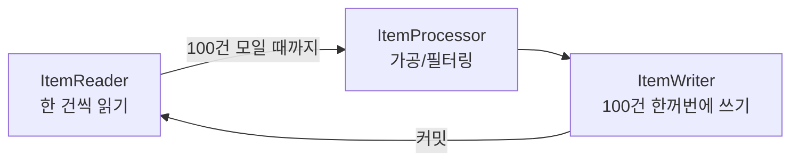
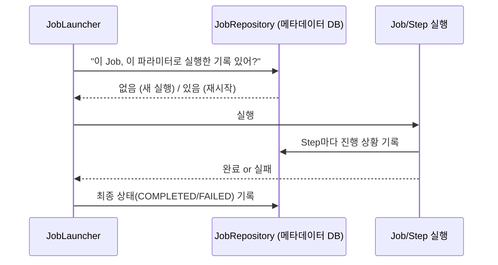
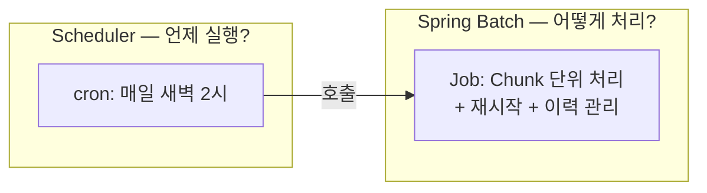

#CS #Spring #면접

관련: [[Spring]] · [[../Database/트랜잭션|트랜잭션]]

## 목차
- [[#Spring Batch는 왜 쓸까?]]
- [[#Job과 Step — 배치 작업의 뼈대]]
- [[#Chunk 지향 처리 — ItemReader, ItemProcessor, ItemWriter]]
- [[#JobRepository — 배치의 실행 이력을 기억하는 장부]]
- [[#Job 실행하기 — JobLauncher와 스케줄러]]
- [[#Spring Batch vs Scheduler — 서로 다른 층위의 개념]]
- [[#한 장 요약]]
- [[#Q&A로 복습하기]]

---

## Spring Batch는 왜 쓸까?

매일 새벽, 수백만 건의 주문 데이터를 읽어서 정산하고, 통계를 내고, 결과를 다른 테이블에 저장해야 한다고 해봐요. 단순하게 짜면 이런 코드가 나올 거예요.

```java
List<Order> orders = orderRepository.findAll(); // 수백만 건을 한 번에 메모리로!
for (Order order : orders) {
    settle(order); // 하나 처리하다 중간에 실패하면?
}
```

이 코드는 문제가 많아요.

- **메모리**: 수백만 건을 한 번에 `List`로 들고 있으면 `OutOfMemoryError`가 날 수 있어요.
- **중단 시 재시작**: 100만 번째 건에서 서버가 죽으면, 처음부터 다시 돌려야 해요. 앞의 99만 9999건은 이미 처리했는데도요.
- **이력 관리**: "어제 배치가 몇 시에 시작해서 몇 건 처리하고 언제 끝났는지"를 알 방법이 없어요.

**Spring Batch**는 이렇게 **대량의 데이터를 안정적으로, 나눠서, 이력을 남기며 처리**하기 위해 만들어진 프레임워크예요.

> **비유**: 웹 개발이 "손님 한 명 한 명 즉시 응대하는 카페 알바"라면, 배치는 "공장의 컨베이어 벨트"예요. 원자재(데이터)가 벨트를 타고 들어오면, 일정 단위(Chunk)로 끊어서 가공하고, 어디까지 처리했는지 항상 기록해두죠. 벨트가 멈추면(장애) 처음부터가 아니라 **멈춘 지점부터 다시** 돌릴 수 있어요.

---

## Job과 Step — 배치 작업의 뼈대

Spring Batch는 배치 작업을 **Job**과 **Step**이라는 두 단위로 쪼개서 구조화해요.

- **Job**: 배치 작업 전체 하나. "일 배치 정산 작업" 같은 단위예요.
- **Step**: Job을 구성하는 독립적인 처리 단계. 하나의 Job은 여러 개의 Step으로 이어져요.


> **비유**: Job은 "이사"라는 큰 프로젝트, Step은 "짐 싸기 → 트럭에 싣기 → 새 집에 내리기"처럼 그 프로젝트를 이루는 단계예요. 각 단계는 순서대로 실행되고, 각 단계가 끝난 시점마다 "여기까지는 완료됐다"는 기록이 남아요.

```java
@Bean
public Job dailySettlementJob(JobRepository jobRepository, Step readOrdersStep, Step aggregateStep) {
    return new JobBuilder("dailySettlementJob", jobRepository)
            .start(readOrdersStep)
            .next(aggregateStep)
            .build();
}
```

---

## Chunk 지향 처리 — ItemReader, ItemProcessor, ItemWriter

Step 하나의 실제 작업은 보통 **Chunk(덩어리) 지향 처리** 방식으로 이뤄져요. 수백만 건을 한 번에 처리하지 않고, "일정 개수(예: 100건)씩 묶어서 읽고 → 가공하고 → 쓰기"를 반복하는 방식이에요.



- **ItemReader**: 데이터 소스(DB, 파일, API 등)에서 한 건씩 읽어와요.
- **ItemProcessor**: 읽은 데이터를 가공하거나, 조건에 안 맞으면 걸러내요(`null` 반환 시 제외).
- **ItemWriter**: Chunk 크기만큼 모이면 한꺼번에 저장/출력해요.

```java
@Bean
public Step readOrdersStep(JobRepository jobRepository, PlatformTransactionManager tm,
                            ItemReader<Order> reader, ItemProcessor<Order, Settlement> processor,
                            ItemWriter<Settlement> writer) {
    return new StepBuilder("readOrdersStep", jobRepository)
            .<Order, Settlement>chunk(100, tm) // 100건 단위로 커밋
            .reader(reader)
            .processor(processor)
            .writer(writer)
            .build();
}
```

**왜 이렇게 나눠서 처리할까?**

- **메모리 절약**: 전체 데이터를 한 번에 들고 있지 않고, Chunk 단위(예: 100건)만 메모리에 올려요.
- **부분 커밋**: Chunk 하나가 끝날 때마다 트랜잭션을 커밋해요. 그래서 100만 건 중 50만 번째에서 실패해도, **이미 커밋된 앞부분은 그대로 유지**되고 실패 지점부터 재시작할 수 있어요. ([[../Database/트랜잭션|트랜잭션]] 참고)

---

## JobRepository — 배치의 실행 이력을 기억하는 장부

Spring Batch는 Job이 실행될 때마다 **"언제 시작했고, 어떤 파라미터로 실행됐고, 어느 Step까지 성공했고, 몇 건을 처리했는지"** 를 전부 DB의 메타데이터 테이블(`BATCH_JOB_INSTANCE`, `BATCH_STEP_EXECUTION` 등)에 기록해요. 이걸 관리하는 컴포넌트가 **JobRepository**예요.



이 덕분에 **재시작(Restart)** 이 가능해요. 어제 배치가 Step 2에서 실패했다면, 오늘 같은 Job을 같은 파라미터로 다시 실행했을 때 Spring Batch가 "Step 1은 이미 성공했으니 건너뛰고 Step 2부터 다시 하자"고 스스로 판단해줘요.

---

## Job 실행하기 — JobLauncher와 스케줄러

Job은 **JobLauncher**를 통해 실행돼요. 실무에서는 보통 이걸 **스케줄러**와 엮어서 "매일 새벽 2시에 자동 실행" 같은 방식으로 써요.

```java
@Component
class SettlementScheduler {
    private final JobLauncher jobLauncher;
    private final Job dailySettlementJob;

    @Scheduled(cron = "0 0 2 * * *") // 매일 새벽 2시
    void runDailyBatch() throws Exception {
        JobParameters params = new JobParametersBuilder()
                .addLocalDate("date", LocalDate.now()) // 파라미터가 다르면 "새로운 실행"으로 인식
                .toJobParameters();
        jobLauncher.run(dailySettlementJob, params);
    }
}
```

Spring Batch는 **같은 Job + 같은 JobParameters** 조합은 원칙적으로 재실행할 수 없어요(`JobInstanceAlreadyCompleteException`). 그래서 "오늘 날짜"처럼 실행마다 달라지는 값을 파라미터로 넣어서, 매번 새로운 실행으로 구분하는 게 일반적인 패턴이에요.

---

## Spring Batch vs Scheduler — 서로 다른 층위의 개념

위 예시 코드에 `@Scheduled`가 등장해서 헷갈릴 수 있는데, **Spring Batch와 Scheduler는 아예 다른 층위의 개념**이에요. 서로 대체 관계가 아니라 **협력 관계**예요.

- **Scheduler**(`@Scheduled`, Quartz 등): "**언제**" 실행할지를 결정하는 트리거일 뿐이에요. "이 메서드를 매일 새벽 2시에 불러줘" 정도의 역할만 하고, 그 메서드 안에서 뭘 하든 관심이 없어요. 이메일 한 통 보내는 간단한 메서드도 스케줄러로 돌릴 수 있어요.
- **Spring Batch**: "**대량의 데이터를 어떻게** 안정적으로 처리할지"에 대한 프레임워크예요. Chunk 단위 처리, 실패 지점 재시작, 실행 이력 관리(JobRepository) 같은 기능을 제공해요. Batch 자체는 "언제 실행할지"에 대해서는 아무 것도 모르고, 그냥 누가 호출해주길 기다릴 뿐이에요.



> **비유**: Scheduler는 "알람 시계"고, Spring Batch는 "알람이 울리면 시작하는, 재시작·이력 관리 기능이 딸린 대형 작업 매뉴얼"이에요. 알람 시계(Scheduler)는 그저 정해진 시각에 벨을 울릴 뿐, 그 뒤에 무슨 작업을 하는지는 몰라요. 반대로 이 작업 매뉴얼(Batch)은 알람 없이도 누가 손으로 펼쳐서(수동 실행, API 호출) 바로 시작할 수도 있어요.

**정리하면:**

| 구분 | Scheduler | Spring Batch |
|---|---|---|
| 관심사 | **언제** 실행할지(시간/주기) | **대량 데이터를 어떻게** 안정적으로 처리할지 |
| 대상 | 어떤 메서드든 (배치가 아니어도 됨) | 대량 데이터 처리 작업 |
| 재시작/이력 관리 | 없음 (그냥 다시 호출할 뿐) | JobRepository가 지원 |
| 단독 사용 가능? | 가능 (단순 메서드 반복 호출용으로도 씀) | 가능 (스케줄러 없이 API 호출이나 수동 실행으로도 트리거 가능) |
| 관계 | Batch Job을 **호출하는 트리거** 중 하나 | Scheduler에 의해 **호출당하는 실행 대상** 중 하나 |

즉 "배치 = 스케줄러로 도는 것"이라고 오해하기 쉽지만, **스케줄러 없이 API 요청으로 Batch Job을 즉시 실행**할 수도 있고, 반대로 **Batch가 아닌 평범한 메서드를 스케줄러로 주기 실행**할 수도 있어요. 둘은 독립적인 개념이고, 실무에서 자주 같이 쓰일 뿐이에요.

---

## 한 장 요약

| 질문 | 답 |
|---|---|
| Spring Batch를 쓰는 이유는? | 대량 데이터를 메모리 걱정 없이, 실패 시 재시작 가능하게, 이력을 남기며 처리하기 위해 |
| Job과 Step의 관계는? | Job은 배치 작업 전체, Step은 Job을 구성하는 독립적인 처리 단계 |
| Chunk 지향 처리란? | 데이터를 일정 개수 단위로 묶어 읽고(Reader)-가공하고(Processor)-쓰는(Writer) 방식 |
| Chunk 단위로 처리하는 이유는? | 메모리 절약 + Chunk마다 부분 커밋해서 실패 지점부터 재시작 가능 |
| JobRepository의 역할은? | Job/Step의 실행 이력과 진행 상황을 메타데이터 DB에 기록 |
| 같은 Job을 다시 실행하려면? | JobParameters를 다르게 줘서 "새로운 실행"으로 인식시켜야 함 |
| Spring Batch와 Scheduler의 관계는? | 대체 관계가 아니라 협력 관계 — Scheduler는 "언제" 실행할지, Batch는 "어떻게" 안정적으로 처리할지를 담당 |

---

## Q&A로 복습하기

### Q. Job과 Step의 차이는?
A. Job은 배치 작업 전체를 나타내는 단위이고, Step은 그 Job을 구성하는 독립적인 처리 단계다. 하나의 Job은 여러 Step이 순서대로 이어져 실행된다.

### Q. Chunk 지향 처리에서 ItemReader, ItemProcessor, ItemWriter는 각각 무슨 역할을 하나?
A. ItemReader는 데이터를 한 건씩 읽고, ItemProcessor는 읽은 데이터를 가공하거나 필터링하며, ItemWriter는 Chunk 크기만큼 모인 데이터를 한꺼번에 저장/출력한다.

### Q. 대량 데이터를 Chunk 단위로 나눠 처리하면 좋은 점은?
A. 전체 데이터를 한 번에 메모리에 올리지 않아 메모리를 절약할 수 있고, Chunk마다 트랜잭션을 부분 커밋하기 때문에 중간에 실패해도 이미 처리된 부분은 유지되어 실패 지점부터 재시작할 수 있다.

### Q. JobRepository는 무슨 역할을 하나?
A. Job과 Step이 실행될 때마다 언제 시작했는지, 어떤 파라미터로 실행됐는지, 몇 건을 처리했는지 등의 실행 이력을 DB에 기록해, 배치의 재시작과 이력 조회를 가능하게 한다.

### Q. 같은 Job을 같은 파라미터로 다시 실행하면 어떻게 되나?
A. Spring Batch는 이미 완료된 Job+파라미터 조합의 재실행을 막기 때문에 예외가 발생한다. 그래서 실행 시점의 날짜처럼 매번 달라지는 값을 파라미터로 넘겨 새로운 실행으로 구분하는 것이 일반적이다.

### Q. Spring Batch와 Scheduler는 같은 개념인가?
A. 아니다. Scheduler(`@Scheduled` 등)는 "언제" 실행할지를 정하는 트리거일 뿐이고, Spring Batch는 대량 데이터를 "어떻게" 안정적으로 처리할지(Chunk 처리, 재시작, 이력 관리)를 담당하는 프레임워크다. 서로 다른 층위의 개념이며, Scheduler 없이 API 호출로 Batch Job을 실행할 수도 있고 Batch가 아닌 메서드를 Scheduler로 돌릴 수도 있다.
