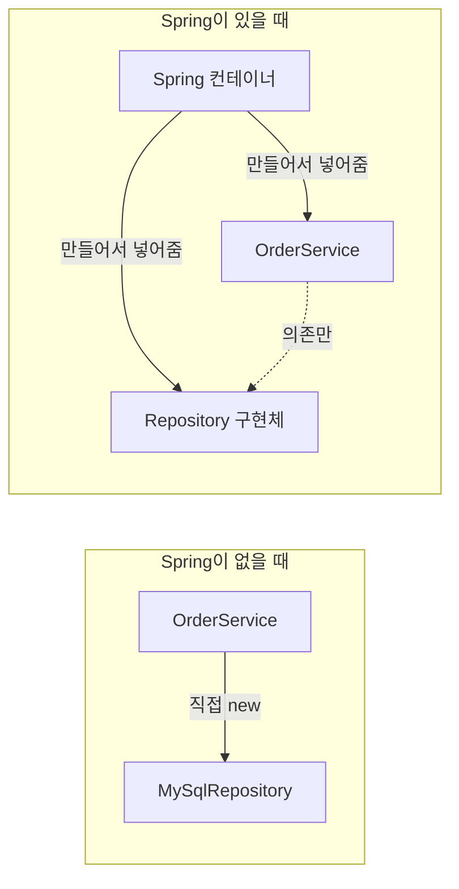
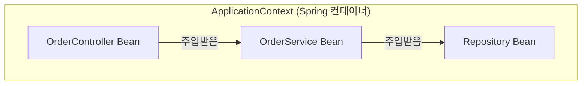
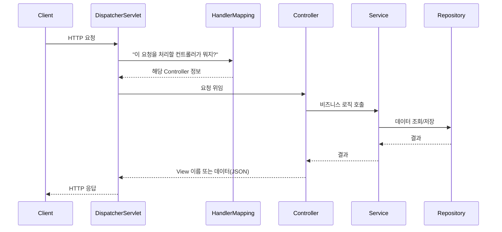

#CS #Spring #면접

관련: [[스프링 컨테이너]] · [[서블릿]] · [[필터와 인터셉터]] · [[Spring Batch]] · [[AOP와 빈 순환참조]] · [[JPA와 영속성 컨텍스트]] · [[전역 예외 처리]] · [[../Infrastructure/RESTful API|RESTful API]] · [[../Java/SOLID|SOLID]] · [[../Java/MVC|MVC]] · [[../Database/트랜잭션|트랜잭션]]

## 목차
- [[#Spring은 왜 쓸까?]]
- [[#IoC와 DI — Spring의 핵심 아이디어]]
- [[#Bean과 ApplicationContext]]
- [[#AOP — "여기저기 반복되는 코드"를 분리하기]]
- [[#Spring vs Spring Boot]]
- [[#Spring MVC 요청 처리 흐름]]
- [[#한 장 요약]]
- [[#Q&A로 복습하기]]

---

## Spring은 왜 쓸까?

Spring이 없던 시절, 자바 객체들은 서로를 이렇게 직접 붙잡고 있었어요.

```java
class OrderService {
    private MySqlRepository repository = new MySqlRepository(); // 직접 생성, 직접 결합
}
```

이렇게 짜면 `OrderService`는 `MySqlRepository`라는 **구체적인 구현체**를 코드 안에 못 박아둔 셈이에요. DB를 바꾸거나, 테스트할 때 가짜 구현체로 바꾸고 싶어도 `OrderService` 코드를 직접 고쳐야 해요. ([[../Java/SOLID|SOLID]]의 DIP에서 다룬 문제 그대로예요.)

**Spring의 핵심은 이 "객체를 만들고 연결하는 책임"을 개발자가 아니라 Spring이 대신 떠맡아주는 것**이에요.



---

## IoC와 DI — Spring의 핵심 아이디어

- **IoC (Inversion of Control, 제어의 역전)**: 원래는 개발자가 `new`로 객체를 직접 만들고 제어했는데, 이 "제어권"을 프레임워크(Spring)에게 넘기는 것. "누가 객체를 만들고 생명주기를 관리하느냐"의 주도권이 뒤집힌다는 뜻이에요.
- **DI (Dependency Injection, 의존성 주입)**: IoC를 구현하는 대표적인 방법. 객체가 필요로 하는 다른 객체(의존성)를 직접 만들지 않고, **외부(Spring 컨테이너)에서 만들어서 넣어주는 것**.

> 비유: 레스토랑 주방장(`OrderService`)이 재료(`Repository`)를 직접 텃밭 가서 재배해오는 게 아니라(`new`), **식자재 유통업체(Spring 컨테이너)가 알아서 좋은 재료를 갖다주는 것**이 DI예요. 주방장은 "어떤 재료가 오든" 요리만 잘하면 돼요.

```java
@Service
class OrderService {
    private final Repository repository;

    @Autowired // Spring이 알아서 적절한 Repository 구현체를 찾아서 주입해줌
    OrderService(Repository repository) {
        this.repository = repository;
    }
}
```

`OrderService`는 이제 `Repository`가 MySQL이든 MongoDB든, 심지어 테스트용 가짜 객체든 전혀 신경 쓰지 않아요. Spring이 실행 시점에 알맞은 구현체를 "주입"해줄 뿐이에요.

---

## Bean과 ApplicationContext

- **Bean**: Spring 컨테이너가 관리하는 객체. `@Component`, `@Service`, `@Repository`, `@Controller` 같은 애노테이션을 붙이면 Spring이 "이건 내가 관리할게" 하고 인식해서 객체를 만들고 등록해요.
- **ApplicationContext**: 이 Bean들을 담아두고 관리하는 컨테이너(창고) 그 자체. 애플리케이션이 시작될 때 필요한 Bean들을 미리 만들어두고, 필요한 곳에 연결(주입)해줘요.



기본적으로 Bean은 **싱글톤(singleton)** 으로 관리돼요 — 애플리케이션 전체에서 딱 하나의 인스턴스만 만들어두고 계속 재사용해요. 그래서 요청마다 매번 새 객체를 만드는 비용을 아낄 수 있어요. (BeanFactory vs ApplicationContext, Bean 등록 방법, 생명주기, 스코프 등 컨테이너 자체를 더 깊게 다룬 내용은 [[스프링 컨테이너]] 참고)

---

## AOP — "여기저기 반복되는 코드"를 분리하기

로깅, 트랜잭션 처리, 권한 체크 같은 코드는 보통 **여러 메서드에 공통적으로 필요**해요.

```java
class OrderService {
    void order() {
        log.info("시작"); // 반복
        // 실제 로직
        log.info("끝");   // 반복
    }
}
class UserService {
    void signUp() {
        log.info("시작"); // 또 반복...
        // 실제 로직
        log.info("끝");   // 또 반복...
    }
}
```

이렇게 핵심 로직과 상관없지만 여기저기 흩어져서 반복되는 코드를 **횡단 관심사(Cross-Cutting Concern)** 라고 불러요. **AOP(Aspect-Oriented Programming, 관점 지향 프로그래밍)** 는 이런 코드를 한 곳에 모아두고, 필요한 메서드 실행 전후에 자동으로 "끼워 넣는" 방식이에요.

```java
@Aspect
@Component
class LoggingAspect {
    @Around("execution(* com.example.service.*.*(..))") // service 패키지의 모든 메서드에 적용
    Object log(ProceedingJoinPoint joinPoint) throws Throwable {
        log.info("시작");
        Object result = joinPoint.proceed(); // 실제 메서드 실행
        log.info("끝");
        return result;
    }
}
```

이제 `OrderService`, `UserService`는 로깅 코드를 신경 쓸 필요가 전혀 없어요. Spring이 내부적으로 **프록시(Proxy) 객체**를 만들어서, 실제 메서드 호출 앞뒤에 이 로직을 자동으로 끼워 넣어줘요. `@Transactional`([[../Database/트랜잭션|트랜잭션]] 참고)도 바로 이 AOP 방식으로 동작해요 — 메서드 실행 전 트랜잭션을 시작하고, 끝나면 커밋/롤백하는 걸 자동으로 처리해줍니다. 이 프록시가 정확히 어떻게 만들어지는지(JDK Dynamic Proxy vs CGLIB), 그리고 같은 클래스 내부 호출에서는 왜 AOP가 안 먹는지(Self-Invocation)는 [[AOP와 빈 순환참조]]에서 자세히 다뤄요.

---

## Spring vs Spring Boot

| 구분 | Spring (Framework) | Spring Boot |
|---|---|---|
| 정체 | DI, AOP 등 핵심 기능을 제공하는 프레임워크 | Spring을 "빠르게 시작"할 수 있게 도와주는 도구 |
| 설정 | XML/Java Config로 직접 세세하게 설정 | **자동 설정(Auto Configuration)** 으로 기본값을 알아서 잡아줌 |
| 서버 | 별도로 톰캣(WAS) 설치 필요 | **내장 톰캣** 포함, `jar` 하나로 바로 실행 |
| 비유 | 자동차 부품들의 집합 | 부품이 이미 조립되어 바로 탈 수 있는 완성차 |

요즘 실무에서 "Spring으로 개발한다"고 하면 대부분 **Spring Boot**를 의미해요.

---

## Spring MVC 요청 처리 흐름

웹 요청이 들어와서 응답이 나가기까지의 큰 그림이에요. (MVC 패턴 자체의 일반적인 개념과 Model/View/Controller 각각의 역할은 [[../Java/MVC|MVC]]에서, 더 세밀한 필터/인터셉터 위치는 [[필터와 인터셉터]]에서 자세히 다뤄요.)



- **DispatcherServlet**: Spring MVC의 모든 요청을 가장 먼저 받는 "관문". 어떤 컨트롤러가 이 요청을 처리해야 할지 찾아서 위임해줘요. (이름 그대로 사실 이것도 서블릿의 한 종류예요 — 자세한 원리는 [[서블릿]] 참고)
- **Controller**: 요청을 받아서 실제 처리를 Service에게 위임하고, 결과를 응답으로 돌려줘요.
- **Service**: 비즈니스 로직 담당.
- **Repository**: DB 접근 담당.

---

## 한 장 요약

| 질문 | 답 |
|---|---|
| Spring의 핵심 목표는? | 객체 생성/연결 책임을 개발자가 아니라 프레임워크가 대신 처리(IoC) |
| DI란? | 필요한 의존 객체를 외부(컨테이너)에서 주입받는 것 |
| Bean이란? | Spring 컨테이너가 관리하는 객체 |
| AOP가 해결하는 문제는? | 로깅, 트랜잭션 등 여러 곳에 반복되는 코드를 한 곳으로 분리 |
| Spring vs Spring Boot | Boot는 자동 설정 + 내장 톰캣으로 빠른 시작을 도와주는 도구 |
| 요청을 가장 먼저 받는 컴포넌트는? | DispatcherServlet |

---

## Q&A로 복습하기

### Q. IoC와 DI의 관계는?
A. IoC는 객체 생성/관리의 주도권을 개발자가 아닌 프레임워크에게 넘기는 개념이고, DI는 그 IoC를 구현하는 대표적인 방법(필요한 객체를 외부에서 주입받는 것)이다.

### Q. Spring Bean의 기본 스코프는?
A. 싱글톤이다. 애플리케이션 전체에서 딱 하나의 인스턴스만 만들어 재사용한다.

### Q. AOP가 해결하는 문제는?
A. 로깅, 트랜잭션 처리처럼 여러 메서드에 공통적으로 필요한 코드(횡단 관심사)를 한 곳에 모아두고, 필요한 메서드 실행 전후에 자동으로 끼워 넣어 중복을 없앤다.

### Q. Spring과 Spring Boot의 차이는?
A. Spring은 DI, AOP 등 핵심 기능을 제공하는 프레임워크이고, Spring Boot는 자동 설정과 내장 톰캣으로 Spring을 빠르게 시작할 수 있게 도와주는 도구다.

### Q. 웹 요청을 가장 먼저 받는 컴포넌트는?
A. DispatcherServlet이다. 어떤 컨트롤러가 이 요청을 처리할지 찾아서 위임해준다.
