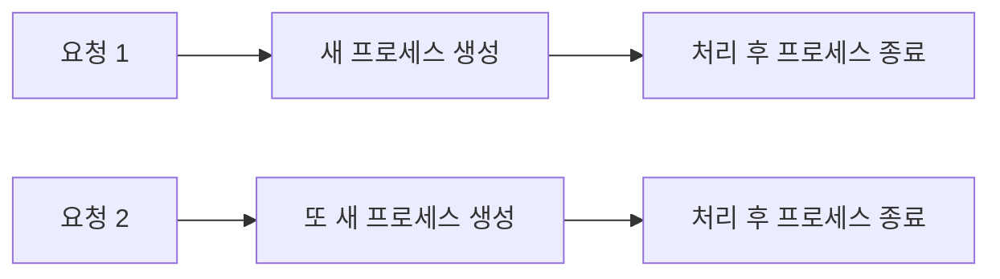
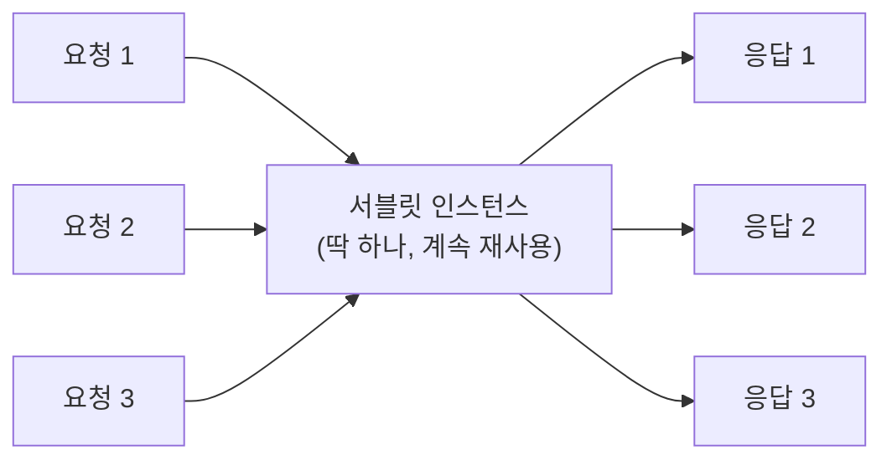
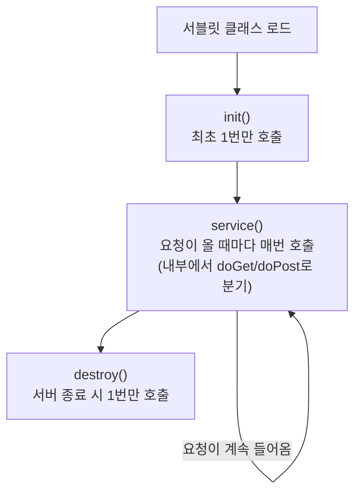
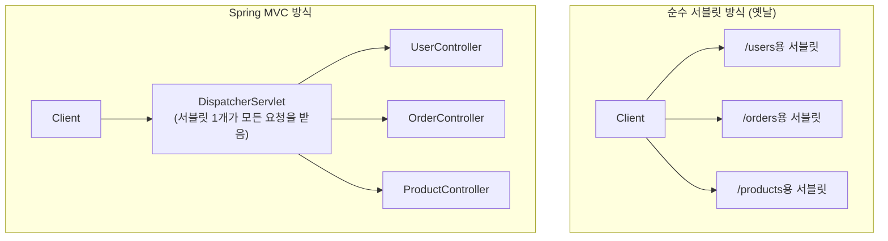

#CS #Spring #Servlet #면접

관련: [[필터와 인터셉터]] · [[Spring]] · [[../Infrastructure/웹 서버와 WAS|웹 서버와 WAS]]

## 목차
- [[#서블릿 이전엔 어떻게 했을까? — CGI 방식의 한계]]
- [[#서블릿이란?]]
- [[#서블릿 컨테이너(WAS) — 서블릿의 매니저]]
- [[#서블릿 생명주기]]
- [[#코드로 보는 서블릿]]
- [[#서블릿은 왜 스레드 안전(Thread-Safe)에 신경 써야 할까?]]
- [[#Spring MVC와 서블릿의 관계 — DispatcherServlet도 결국 서블릿이다]]
- [[#한 장 요약]]
- [[#Q&A로 복습하기]]

---

## 서블릿 이전엔 어떻게 했을까? — CGI 방식의 한계

웹 초창기엔 사용자 요청마다 동적으로 페이지를 만들어주기 위해 **CGI(Common Gateway Interface)** 라는 방식을 썼어요. 요청이 들어올 때마다 서버가 **완전히 새로운 프로세스를 하나씩 띄워서** 처리하는 방식이었죠.

> 비유: 손님이 한 명 올 때마다 새로운 요리사를 통째로 고용해서 주방에 들여보내고, 요리가 끝나면 바로 해고하는 식당이 있다고 생각해보세요. 손님 한 명당 요리사 한 명을 처음부터 새로 뽑고 훈련시키는 셈이니, 손님이 몰리면 감당이 안 되겠죠.



요청마다 프로세스를 새로 만들고 없애는 건 비용(메모리, CPU)이 커서, 동시 사용자가 많아지면 서버가 금방 버거워졌어요. **자바 서블릿(Servlet)** 은 바로 이 문제를 해결하기 위해 나온 기술이에요.

---

## 서블릿이란?

**서블릿(Servlet)** 은 클라이언트의 요청을 받아 동적으로 처리하고 응답을 만들어주는, **자바로 작성된 서버 사이드 프로그램**이에요. Java EE(현재는 Jakarta EE)라는 표준 스펙의 일부고요.

핵심 차이는 이거예요: CGI처럼 요청마다 프로세스를 새로 만드는 게 아니라, **서블릿 하나는 딱 한 번만 메모리에 올려두고(인스턴스 하나), 요청이 올 때마다 그 인스턴스가 스레드로 계속 재사용돼요.**

> 비유: 요리사 한 명을 정직원으로 채용해서 주방에 상주시키는 거예요. 손님이 여러 명 와도 같은 요리사가 (여러 명을 순서대로, 혹은 여러 명이 나눠서) 계속 요리를 해줘요. 매번 새로 뽑지 않으니 훨씬 효율적이죠.



---

## 서블릿 컨테이너(WAS) — 서블릿의 매니저

서블릿은 혼자서는 동작하지 못해요. **서블릿 컨테이너(Servlet Container)** 라는 관리자가 있어야 하는데, 우리가 흔히 아는 **톰캣(Tomcat)** 이 바로 이 서블릿 컨테이너예요. (WAS, Web Application Server라고도 불러요. Nginx 같은 웹 서버와 WAS가 정확히 뭐가 다른지는 [[../Infrastructure/웹 서버와 WAS|웹 서버와 WAS]] 참고.)

서블릿 컨테이너가 대신 해주는 일:

- **서블릿의 생명주기 관리**: 언제 서블릿 객체를 만들고, 언제 없앨지 관리 (뒤에서 자세히)
- **요청/응답 객체 생성**: 클라이언트가 보낸 날것의 HTTP 요청(텍스트)을 파싱해서, 개발자가 다루기 쉬운 `HttpServletRequest`, `HttpServletResponse` 객체로 만들어줌
- **URL 매핑**: 어떤 URL로 들어온 요청을 어떤 서블릿에게 넘겨줄지 결정
- **멀티스레딩 관리**: 동시에 들어온 여러 요청을 각각 스레드에 할당해서 처리


개발자는 "복잡한 HTTP 프로토콜 파싱, 소켓 통신, 스레드 관리" 같은 저수준 작업은 전혀 신경 쓰지 않고, **"이 요청이 오면 이런 로직을 실행해라"** 는 서블릿 코드만 작성하면 돼요. 나머지는 전부 컨테이너가 대신해줍니다.

---

## 서블릿 생명주기

서블릿 컨테이너는 서블릿 객체를 다음 3단계로 관리해요.



- **`init()`**: 서블릿이 **최초로 요청을 받을 때 딱 한 번만** 호출돼요. DB 커넥션 풀 초기화처럼 "한 번만 준비해두면 되는" 작업을 여기서 해요.
- **`service()`**: 요청이 들어올 때마다 매번 호출돼요. 내부적으로 HTTP 메서드(GET, POST 등)를 보고 `doGet()`, `doPost()` 같은 메서드로 나눠서 실행해줘요.
- **`destroy()`**: 서버가 종료되거나 서블릿이 컨테이너에서 내려갈 때 딱 한 번 호출돼요. 자원 정리(연결 종료 등)를 여기서 해요.

> 이 흐름, 어디서 많이 본 것 같지 않나요? [[Spring]] 문서에서 다룬 Spring Bean의 생명주기(생성 → 초기화 → 소멸)와 비슷한 패턴이에요. Spring도 결국 이 서블릿 컨테이너 위에서 동작하기 때문에, "필요한 걸 한 번만 준비해두고 계속 재사용한다"는 철학이 여러 층위에서 반복돼요.

---

## 코드로 보는 서블릿

```java
@WebServlet("/hello") // "/hello" 경로로 요청이 오면 이 서블릿이 처리
public class HelloServlet extends HttpServlet {

    @Override
    public void init() {
        System.out.println("서블릿 초기화 (딱 한 번만 실행)");
    }

    @Override
    protected void doGet(HttpServletRequest request, HttpServletResponse response)
            throws IOException {
        String name = request.getParameter("name"); // 요청에서 파라미터 꺼내기

        response.setContentType("text/plain; charset=UTF-8");
        response.getWriter().write("안녕하세요, " + name + "님!"); // 응답 작성
    }
}
```

브라우저에서 `/hello?name=철수`로 요청을 보내면, 서블릿 컨테이너가 이 요청을 `HttpServletRequest` 객체로 만들어서 `doGet()`에 넘겨주고, 개발자는 `request`에서 필요한 값을 꺼내고 `response`에 결과를 써주기만 하면 돼요.

---

## 서블릿은 왜 스레드 안전(Thread-Safe)에 신경 써야 할까?

앞서 말했듯 서블릿은 **인스턴스가 딱 하나만 만들어지고, 여러 요청이 동시에 그 하나의 인스턴스를 공유**해요. 이 말은, 서블릿 안에 **인스턴스 변수(필드)** 를 함부로 두면 위험하다는 뜻이에요.

```java
public class CounterServlet extends HttpServlet {
    private int count = 0; // ⚠️ 위험! 모든 요청이 이 필드를 공유함

    protected void doGet(HttpServletRequest req, HttpServletResponse res) throws IOException {
        count++; // 여러 스레드(요청)가 동시에 건드리면 값이 꼬일 수 있음 (Race Condition)
        res.getWriter().write("count = " + count);
    }
}
```

사용자 A와 사용자 B의 요청이 동시에 들어오면, 이 `count` 필드를 두 스레드가 동시에 건드리면서 예상치 못한 값이 나올 수 있어요. 그래서 **요청마다 새로 생기는 지역 변수(메서드 안의 변수)는 안전하지만, 서블릿 클래스의 필드는 여러 요청이 공유하는 값이라 조심해야 해요.**

---

## Spring MVC와 서블릿의 관계 — DispatcherServlet도 결국 서블릿이다

[[Spring]] 문서에서 모든 요청을 가장 먼저 받는다고 했던 **`DispatcherServlet`**, 이름에 이미 답이 있어요 — **`DispatcherServlet`도 결국 `HttpServlet`을 상속한, 서블릿 그 자체**예요.



옛날 방식은 URL마다 서블릿을 따로따로 만들어야 했어요 (`/users`용 서블릿, `/orders`용 서블릿 …). Spring MVC는 **`DispatcherServlet`이라는 서블릿 딱 하나만 만들어서 모든 요청의 입구를 통일**하고, 그 안에서 어떤 컨트롤러로 보낼지 다시 나눠주는 방식을 써요. 이걸 **프론트 컨트롤러 패턴(Front Controller Pattern)** 이라고 불러요.

즉, Spring MVC를 쓴다는 건 "서블릿을 안 쓴다"는 게 아니라, **"서블릿을 직접 여러 개 만드는 대신, `DispatcherServlet`이라는 잘 만들어진 서블릿 하나에게 맡기고 그 위에서 개발한다"** 는 뜻이에요. [[필터와 인터셉터]] 문서에서 Filter가 `DispatcherServlet` 바깥(서블릿 컨테이너 레벨)에서 동작한다고 했던 것도, 결국 Filter와 DispatcherServlet 둘 다 "서블릿 컨테이너가 관리하는 대상"이기 때문이에요.

---

## 한 장 요약

| 질문 | 답 |
|---|---|
| 서블릿이란? | 클라이언트 요청을 처리하는, 자바로 작성된 서버 사이드 프로그램 (Java EE 표준) |
| 왜 CGI보다 효율적인가? | 요청마다 프로세스를 새로 만들지 않고, 서블릿 인스턴스 하나를 재사용하며 스레드로 요청을 처리 |
| 서블릿을 관리하는 주체는? | 서블릿 컨테이너(WAS), 대표적으로 톰캣(Tomcat) |
| 생명주기 메서드 3가지 | `init()`(최초 1회) → `service()`(요청마다) → `destroy()`(종료 시 1회) |
| 서블릿에서 인스턴스 필드를 조심해야 하는 이유 | 모든 요청이 하나의 인스턴스를 공유해서, 필드를 여러 스레드가 동시에 건드릴 수 있음 |
| DispatcherServlet은 서블릿인가? | 그렇다. `HttpServlet`을 상속한 서블릿이며, 모든 요청을 받아 컨트롤러로 나눠주는 프론트 컨트롤러 역할 |

---

## Q&A로 복습하기

### Q. 서블릿이 CGI 방식보다 효율적인 이유는?
A. CGI는 요청마다 새 프로세스를 만들고 없애지만, 서블릿은 인스턴스 하나를 계속 재사용하면서 요청마다 스레드로 처리하기 때문에 자원 소모가 훨씬 적다.

### Q. 서블릿 컨테이너(WAS)가 대신 해주는 일은?
A. 서블릿의 생명주기 관리, HTTP 요청/응답을 객체로 변환, URL과 서블릿 매핑, 요청마다 스레드를 할당하는 멀티스레딩 관리 등이다.

### Q. 서블릿의 생명주기 메서드 3가지와 각각 호출 시점은?
A. `init()`은 최초 요청 시 한 번, `service()`는 요청이 올 때마다 매번, `destroy()`는 서버 종료 시 한 번 호출된다.

### Q. 서블릿에서 인스턴스 필드에 상태를 저장하면 왜 위험한가?
A. 서블릿은 인스턴스가 하나만 생성되어 모든 요청이 공유하는데, 인스턴스 필드도 함께 공유되기 때문에 여러 요청(스레드)이 동시에 값을 바꾸면 값이 꼬이는 경쟁 상태가 생길 수 있다.

### Q. DispatcherServlet과 서블릿의 관계는?
A. DispatcherServlet도 HttpServlet을 상속한 서블릿이다. 모든 요청을 하나의 서블릿이 먼저 받아 적절한 컨트롤러로 나눠주는 프론트 컨트롤러 역할을 한다.
