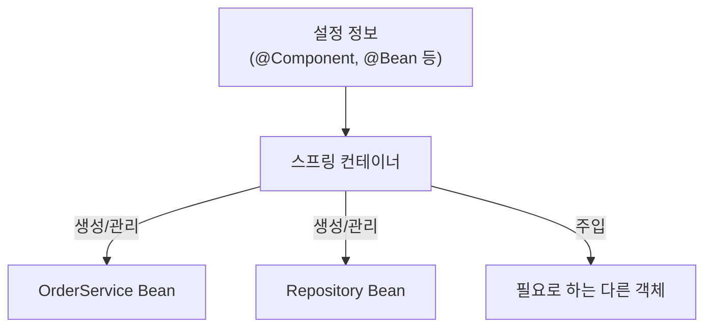
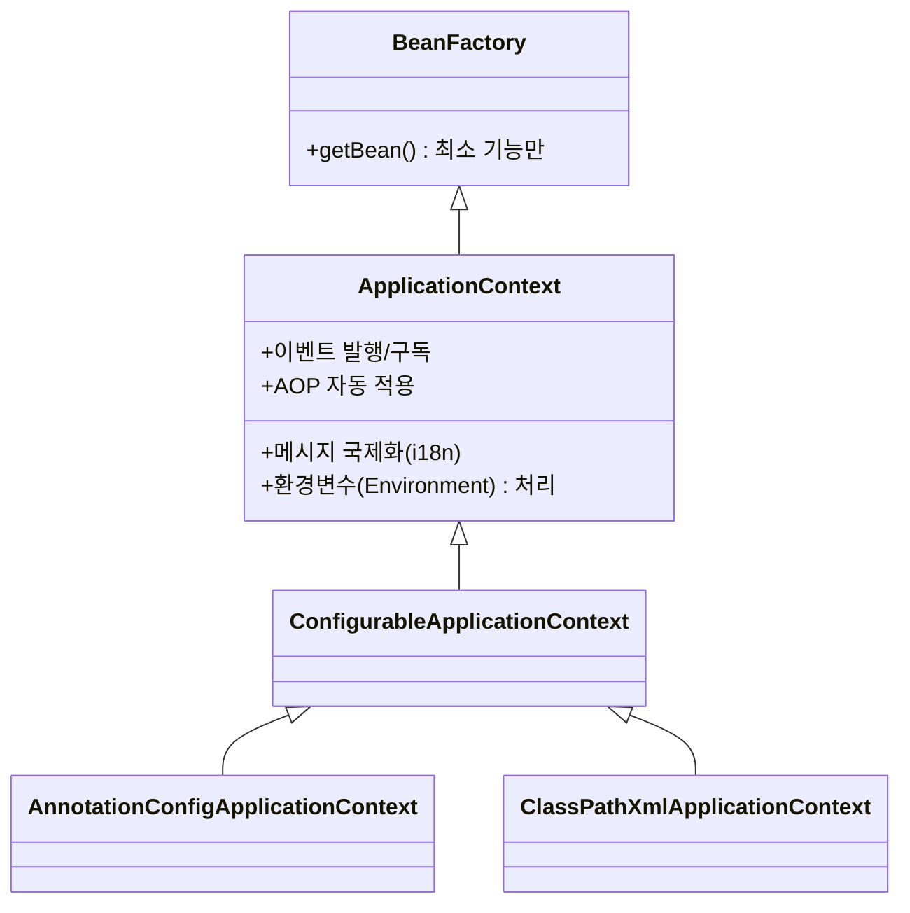
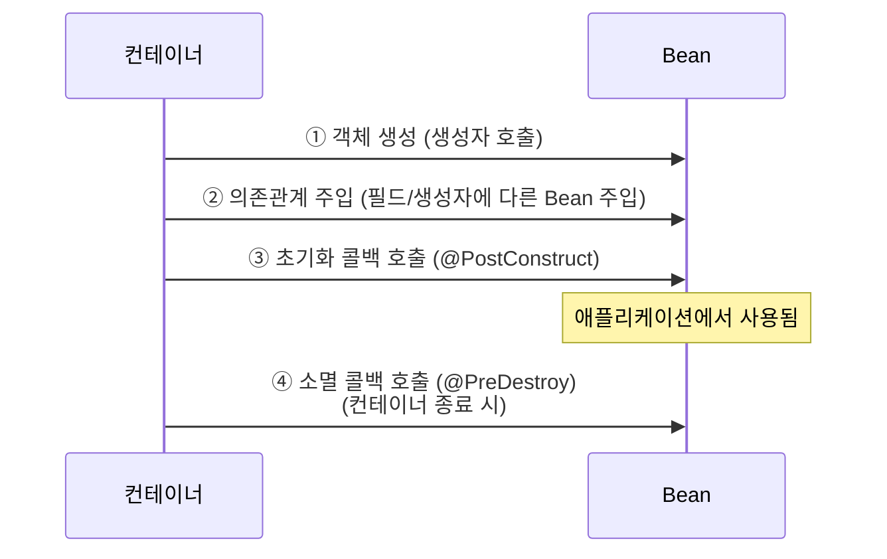
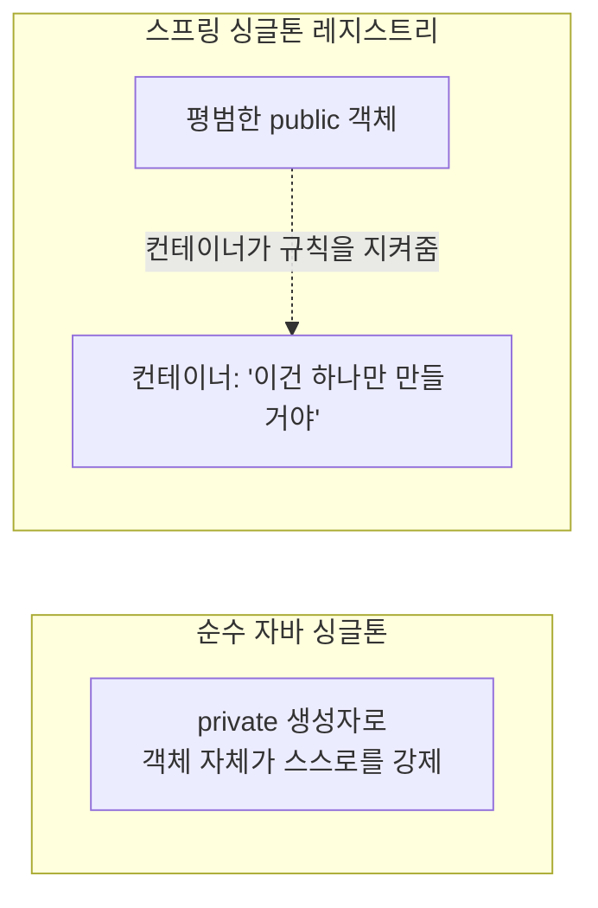

#CS #Spring #면접

관련: [[Spring]] · [[../Java/OOP|OOP]] · [[AOP와 빈 순환참조]]

## 목차
- [[#스프링 컨테이너란? — Bean을 관리하는 창고지기]]
- [[#BeanFactory vs ApplicationContext]]
- [[#Bean을 컨테이너에 등록하는 3가지 방법]]
- [[#Bean의 생명주기]]
- [[#Bean 스코프(Scope) — 몇 개나 만들어질까?]]
- [[#싱글톤 레지스트리 — 순수 자바 싱글톤과 뭐가 다를까?]]
- [[#한 장 요약]]
- [[#Q&A로 복습하기]]

---

## 스프링 컨테이너란? — Bean을 관리하는 창고지기

[[Spring]] 문서에서 "Spring의 핵심은 객체를 만들고 연결하는 책임을 개발자 대신 떠맡아주는 것(IoC/DI)"이라고 했는데, **그 일을 실제로 수행하는 주체가 바로 스프링 컨테이너**예요.

> **비유**: 스프링 컨테이너는 대형 물류창고의 **창고지기**예요. 어떤 물건(Bean)을 얼마나 만들어서 채워둘지 미리 정해진 목록(설정)을 보고, 필요한 물건들을 만들어서 창고에 채워 넣어요. 누군가 "이 물건 주세요"라고 요청하면(의존성 필요), 창고지기가 알맞은 물건을 찾아 건네줘요. 개발자는 물건을 어디서 어떻게 만드는지 신경 쓸 필요 없이, 그냥 필요할 때 요청만 하면 돼요.



컨테이너는 애플리케이션이 시작될 때 설정을 읽고, 그 설정에 따라 **Bean을 생성하고, 서로 연결(의존성 주입)하고, 생명주기를 관리**해요.

---

## BeanFactory vs ApplicationContext

스프링 컨테이너는 사실 하나의 구체적인 클래스가 아니라 **인터페이스 계층**으로 되어 있어요. 가장 기본이 되는 게 `BeanFactory`이고, 우리가 실무에서 실제로 쓰는 건 이를 확장한 `ApplicationContext`예요.



| 구분 | BeanFactory | ApplicationContext |
|---|---|---|
| 역할 | Bean을 등록하고 꺼내주는 **최소 기능**만 제공 | BeanFactory를 상속하면서 부가 기능을 잔뜩 추가 |
| Bean 생성 시점 | 요청이 들어올 때(지연 로딩) | 기본적으로 컨테이너가 뜰 때 미리 다 생성(즉시 로딩) |
| 부가 기능 | 없음 | 메시지 국제화, 이벤트 발행/구독, 환경 변수 처리 등 |
| 실무 사용 | 거의 안 씀 | ✅ 사실상 이걸 "스프링 컨테이너"라고 부름 |

`@SpringBootApplication`이 붙은 클래스를 실행하면, 내부적으로 `ApplicationContext` 구현체(정확히는 `AnnotationConfigServletWebServerApplicationContext` 같은 것)가 만들어져서 컨테이너 역할을 해요.

---

## Bean을 컨테이너에 등록하는 3가지 방법

**① Component Scan** — 가장 흔히 쓰는 방식. `@Component`(및 그걸 특수화한 `@Service`, `@Repository`, `@Controller`)를 붙이면, 컨테이너가 지정된 패키지를 스캔하면서 자동으로 찾아서 등록해줘요.

```java
@Service
class OrderService {
    // 컨테이너가 패키지를 스캔하다가 이 클래스를 발견하면 자동으로 Bean 등록
}
```

**② 자바 설정(Java Config)** — `@Configuration` 클래스 안에서 `@Bean` 메서드로 직접 등록하는 방식. 외부 라이브러리 클래스처럼 `@Component`를 붙일 수 없는 경우에 주로 써요.

```java
@Configuration
class AppConfig {
    @Bean
    ObjectMapper objectMapper() { // 반환하는 객체가 Bean으로 등록됨
        return new ObjectMapper();
    }
}
```

**③ XML 설정** — 스프링 초창기 방식. `<bean>` 태그로 등록. 지금은 레거시 프로젝트에서나 볼 수 있고, 실무에서 새로 쓰는 경우는 거의 없어요.

```xml
<bean id="orderService" class="com.example.OrderService" />
```

> 실무에서는 **①(Component Scan)을 기본으로 쓰고, 외부 라이브러리 객체처럼 애노테이션을 붙일 수 없는 것만 ②(Java Config)로 등록**하는 게 일반적인 패턴이에요.

---

## Bean의 생명주기

컨테이너는 Bean을 그냥 만들고 끝나는 게 아니라, 정해진 순서에 따라 **생성 → 의존관계 주입 → 초기화 → 사용 → 소멸**의 전체 생명주기를 관리해요.



```java
@Component
class DatabaseConnector {
    @PostConstruct // 의존관계 주입까지 끝난 뒤, 딱 한 번 자동 호출됨
    void connect() {
        System.out.println("DB 연결 시작");
    }

    @PreDestroy // 컨테이너가 종료되기 직전, 딱 한 번 자동 호출됨
    void disconnect() {
        System.out.println("DB 연결 종료 (자원 정리)");
    }
}
```

**왜 초기화/소멸 콜백이 필요할까?** 생성자는 "의존성 주입이 끝나기 전"에 호출돼서, 아직 다른 Bean이 다 준비 안 된 상태일 수 있어요. `@PostConstruct`는 **모든 의존성 주입이 끝난 뒤** 호출되는 게 보장되니, "필요한 재료가 다 갖춰진 다음에 해야 할 초기화 작업"(예: 커넥션 풀 초기화)을 안전하게 넣을 수 있어요. `@PreDestroy`는 반대로 서버가 종료될 때 DB 연결 해제 같은 **자원 정리**를 놓치지 않고 처리하게 해줘요.

---

## Bean 스코프(Scope) — 몇 개나 만들어질까?

컨테이너가 Bean을 "몇 개나 만들어서 어떻게 공유할지"를 정하는 게 **스코프**예요.

| 스코프 | 설명 | 언제 쓰나 |
|---|---|---|
| `singleton` (기본값) | 컨테이너 전체에서 **딱 하나**의 인스턴스만 만들어 공유 | 대부분의 경우 (Service, Repository 등 상태 없는 객체) |
| `prototype` | `getBean()`을 호출할 때마다 **매번 새 인스턴스**를 생성 | 요청마다 상태를 독립적으로 가져야 하는 경우 |
| `request` | HTTP 요청 하나당 인스턴스 하나 (웹 환경 전용) | 요청별 데이터를 담는 객체 |
| `session` | HTTP 세션 하나당 인스턴스 하나 (웹 환경 전용) | 로그인 사용자별 세션 데이터 |

```java
@Component
@Scope("prototype")
class ReportGenerator { /* 호출할 때마다 새 인스턴스 */ }
```

기본값인 `singleton`을 쓰는 이유는 대부분의 Service/Repository가 **자기만의 상태(필드 값)를 안 가지고, 그냥 로직만 담고 있기 때문**이에요. 상태가 없으면 여러 요청이 같은 인스턴스를 동시에 써도 아무 문제가 없거든요.

---

## 싱글톤 레지스트리 — 순수 자바 싱글톤과 뭐가 다를까?

자바에서 싱글톤 패턴을 직접 구현하려면 보통 이렇게 짜요.

```java
class Settings {
    private static final Settings INSTANCE = new Settings();
    private Settings() {} // 생성자를 private으로 막아서 외부에서 new 못 하게 함
    static Settings getInstance() { return INSTANCE; }
}
```

이 방식은 문제가 좀 있어요 — **생성자가 private**이라 상속이 안 되고, **테스트할 때 가짜 객체로 바꿔치기하기 어렵고**, 멀티스레드 환경에서 초기화 시점을 안전하게 다루려면 코드가 복잡해져요.

**스프링 컨테이너는 이 문제를 우회해요.** 컨테이너가 **"싱글톤 레지스트리(Singleton Registry)"** 역할을 해서, Bean은 평범한 `public` 생성자를 가진 **그냥 평범한 자바 객체(POJO)** 로 두고, "이 객체는 컨테이너 안에서 하나만 만들어서 재사용하자"는 규칙을 **컨테이너가 대신 지켜줘요.**



덕분에 **테스트할 때는 얼마든지 `new`로 새 인스턴스를 만들어 독립적으로 테스트**할 수 있고(순수 자바 싱글톤이었다면 불가능), 운영 환경에서는 컨테이너가 "이 클래스는 하나만 만들자"는 규칙을 지켜줘서 싱글톤의 이점(메모리 절약, 상태 공유)도 그대로 누려요.

---

## 한 장 요약

| 질문 | 답 |
|---|---|
| 스프링 컨테이너의 역할은? | 설정을 읽고 Bean을 생성·연결(DI)·관리 |
| BeanFactory vs ApplicationContext | ApplicationContext가 BeanFactory를 상속하며 국제화/이벤트 등 부가 기능 추가, 실무에선 후자를 씀 |
| Bean 등록 방법 3가지는? | Component Scan(주 사용), Java Config(@Bean), XML(레거시) |
| Bean 생명주기 순서는? | 생성 → 의존관계 주입 → 초기화(@PostConstruct) → 사용 → 소멸(@PreDestroy) |
| 기본 Bean 스코프는? | singleton — 컨테이너 전체에서 인스턴스 하나만 공유 |
| 순수 자바 싱글톤과의 차이는? | private 생성자로 객체 스스로 강제 vs 평범한 객체를 컨테이너가 "하나만 만들자"고 관리(싱글톤 레지스트리) |

---

## Q&A로 복습하기

### Q. BeanFactory와 ApplicationContext의 차이는?
A. BeanFactory는 Bean을 등록하고 꺼내주는 최소 기능만 제공하는 반면, ApplicationContext는 이를 상속하면서 메시지 국제화, 이벤트 발행/구독, 환경 변수 처리 같은 부가 기능을 더한 것이다. 실무에서는 사실상 ApplicationContext를 스프링 컨테이너로 사용한다.

### Q. Bean을 컨테이너에 등록하는 방법 3가지는?
A. `@Component` 계열 애노테이션을 패키지 스캔으로 자동 등록하는 Component Scan, `@Configuration` 클래스 안에서 `@Bean` 메서드로 직접 등록하는 Java Config, 그리고 레거시 방식인 XML 설정이 있다.

### Q. @PostConstruct가 필요한 이유는?
A. 생성자는 의존관계 주입이 끝나기 전에 호출되어 아직 다른 Bean이 준비되지 않았을 수 있다. @PostConstruct는 의존관계 주입이 모두 끝난 뒤 호출되는 것이 보장되므로, 필요한 의존성이 다 갖춰진 다음에 해야 할 초기화 작업을 안전하게 처리할 수 있다.

### Q. Bean의 기본 스코프가 singleton인 이유는?
A. 대부분의 Service, Repository는 자기만의 상태(필드 값)를 가지지 않고 로직만 담고 있어서, 여러 요청이 같은 인스턴스를 동시에 사용해도 문제가 없기 때문이다.

### Q. 스프링의 싱글톤 관리 방식이 순수 자바 싱글톤 패턴보다 나은 점은?
A. 순수 자바 싱글톤은 생성자를 private으로 막아 객체 스스로 유일함을 강제하는데, 이러면 테스트할 때 새 인스턴스로 바꿔치기하기 어렵다. 스프링은 Bean을 평범한 public 객체로 두고 컨테이너가 "하나만 만들자"는 규칙을 대신 지켜주는 싱글톤 레지스트리 방식이라, 테스트 시에는 자유롭게 새 인스턴스를 만들면서도 운영 환경에서는 싱글톤의 이점을 누릴 수 있다.
